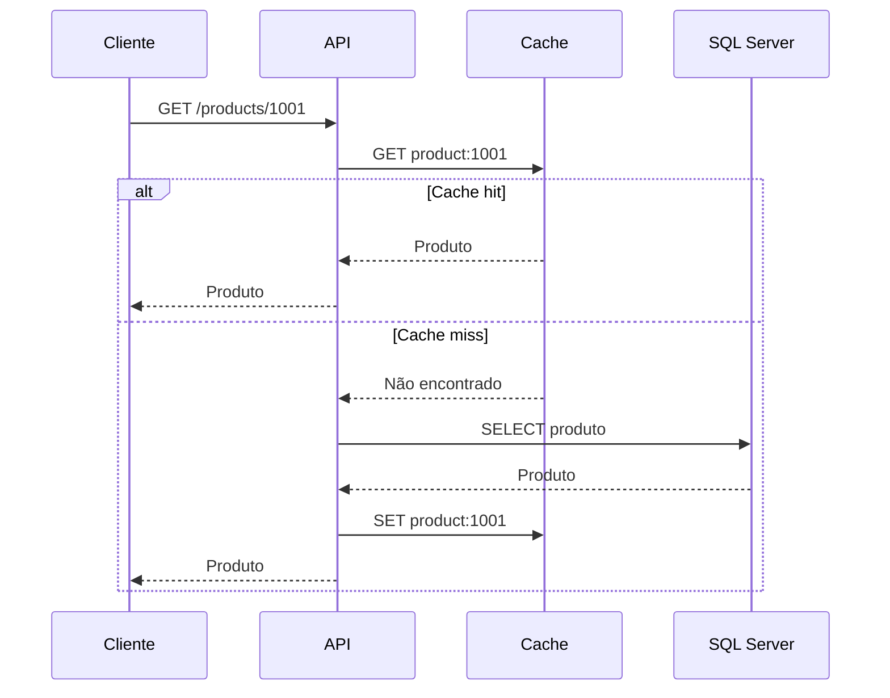
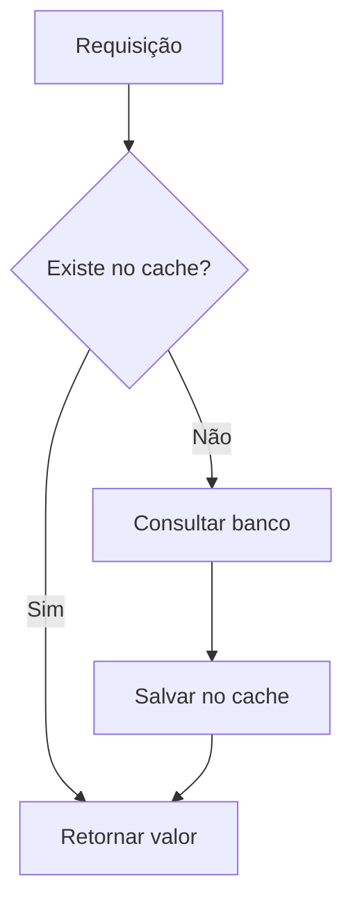
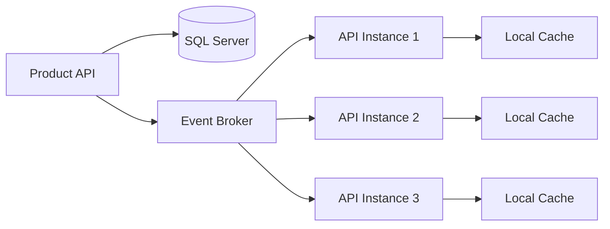
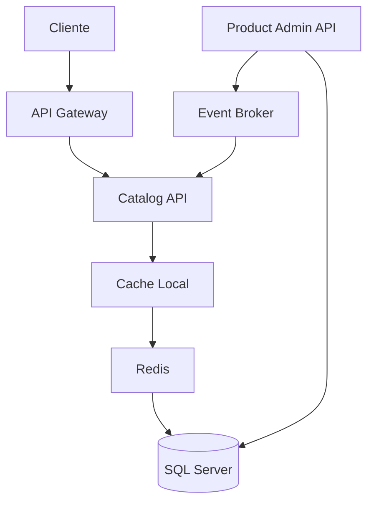
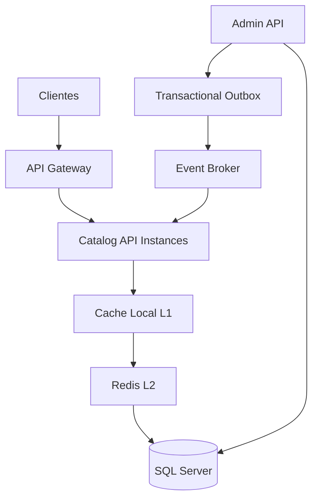

# Módulo 10 — Cache

Cache é uma das técnicas mais importantes para reduzir latência, diminuir carga sobre bancos de dados e aumentar a capacidade de um sistema.

Porém, cache também introduz novos desafios:

* Dados desatualizados.
* Invalidação.
* Consistência.
* Consumo de memória.
* Cache stampede.
* Hot keys.
* Falhas do cache.
* Complexidade operacional.

Neste módulo, estudaremos:

* O que é cache.
* Como funciona.
* Quando usar.
* Quando evitar.
* Diferença de velocidade entre memória e disco.
* Cache local e distribuído.
* Redis.
* Memcached.
* In-memory cache.
* Aplicações stateful e stateless.
* Estratégias de leitura e escrita.
* Invalidação.
* Escalabilidade.
* Exemplos em C# e SQL Server.

---

## Sumário

* [1. O que é cache](#1-o-que-é-cache)
* [2. Por que cache existe](#2-por-que-cache-existe)
* [3. Como o cache funciona](#3-como-o-cache-funciona)
* [4. Cache hit e cache miss](#4-cache-hit-e-cache-miss)
* [5. Hit ratio](#5-hit-ratio)
* [6. Latência: memória, disco e rede](#6-latência-memória-disco-e-rede)
* [7. Cache versus banco de dados](#7-cache-versus-banco-de-dados)
* [8. Quando usar cache](#8-quando-usar-cache)
* [9. Quando não usar cache](#9-quando-não-usar-cache)
* [10. Tipos de cache](#10-tipos-de-cache)
* [11. Cache in-memory](#11-cache-in-memory)
* [12. Cache distribuído](#12-cache-distribuído)
* [13. Stateful versus stateless](#13-stateful-versus-stateless)
* [14. Cache-aside](#14-cache-aside)
* [15. Read-through](#15-read-through)
* [16. Write-through](#16-write-through)
* [17. Write-behind](#17-write-behind)
* [18. Write-around](#18-write-around)
* [19. Invalidação de cache](#19-invalidação-de-cache)
* [20. TTL](#20-ttl)
* [21. Expiração absoluta e deslizante](#21-expiração-absoluta-e-deslizante)
* [22. Eviction policies](#22-eviction-policies)
* [23. LRU, LFU e FIFO](#23-lru-lfu-e-fifo)
* [24. Cache stampede](#24-cache-stampede)
* [25. Cache penetration](#25-cache-penetration)
* [26. Cache avalanche](#26-cache-avalanche)
* [27. Hot keys](#27-hot-keys)
* [28. Cache warming](#28-cache-warming)
* [29. Negative caching](#29-negative-caching)
* [30. Redis](#30-redis)
* [31. Memcached](#31-memcached)
* [32. Cache in-memory no .NET](#32-cache-in-memory-no-net)
* [33. Comparação entre Redis, Memcached e in-memory](#33-comparação-entre-redis-memcached-e-in-memory)
* [34. Exemplo com IMemoryCache](#34-exemplo-com-imemorycache)
* [35. Exemplo com Redis e C#](#35-exemplo-com-redis-e-c)
* [36. Cache-aside com SQL Server](#36-cache-aside-com-sql-server)
* [37. Invalidação após escrita](#37-invalidação-após-escrita)
* [38. Concorrência e consistência](#38-concorrência-e-consistência)
* [39. Locks distribuídos](#39-locks-distribuídos)
* [40. Versionamento de chaves](#40-versionamento-de-chaves)
* [41. Serialização](#41-serialização)
* [42. Tamanho dos objetos](#42-tamanho-dos-objetos)
* [43. Multi-level cache](#43-multi-level-cache)
* [44. Cache e mensageria](#44-cache-e-mensageria)
* [45. Cache em múltiplas regiões](#45-cache-em-múltiplas-regiões)
* [46. Alta disponibilidade](#46-alta-disponibilidade)
* [47. Escalabilidade](#47-escalabilidade)
* [48. Observabilidade](#48-observabilidade)
* [49. Segurança](#49-segurança)
* [50. Custos](#50-custos)
* [51. Trade-offs](#51-trade-offs)
* [52. Arquitetura de exemplo](#52-arquitetura-de-exemplo)
* [53. Checklist de produção](#53-checklist-de-produção)
* [54. Regras práticas](#54-regras-práticas)
* [55. Questões de entrevista](#55-questões-de-entrevista)
* [56. Exercício prático](#56-exercício-prático)
* [57. Resumo do módulo](#57-resumo-do-módulo)

---

# 1. O que é cache

Cache é uma camada de armazenamento rápido usada para guardar temporariamente dados que seriam mais caros ou lentos de buscar novamente.

**Vídeo recomendado:** [Cache - Conceitos e Funcionamento (YouTube)](https://www.youtube.com/watch?v=r-tiD2MYnWE&pp=ygUUY2FjaGUgYXVndXN0byBnYWxlZ28%3D)

Exemplo:

```text
Cliente
   |
   v
API
   |
   v
Cache
   |
   v
SQL Server
```

Em vez de consultar o SQL Server em todas as requisições, a aplicação tenta buscar o dado no cache.

```text
Se existe no cache:
retorna rapidamente

Se não existe:
consulta o banco
salva no cache
retorna
```

## Exemplo real

Uma página de produto precisa exibir:

* Nome.
* Preço.
* Descrição.
* Categoria.
* Avaliação.
* Estoque aproximado.

Sem cache:

```text
Cada acesso
   |
   v
Consulta SQL Server
```

Com cache:

```text
Primeiro acesso
   |
   v
SQL Server
   |
   v
Cache

Próximos acessos
   |
   v
Cache
```

---

# 2. Por que cache existe

Cache é utilizado principalmente para:

* Reduzir latência.
* Reduzir carga no banco.
* Aumentar throughput.
* Diminuir chamadas externas.
* Absorver picos.
* Reduzir custos.
* Melhorar experiência do usuário.
* Evitar recomputação.

## Exemplo

Sem cache:

```text
10.000 requisições por segundo
        |
        v
10.000 consultas por segundo no banco
```

Com 90% de cache hit:

```text
10.000 requisições por segundo
        |
        +--> 9.000 atendidas pelo cache
        |
        +--> 1.000 chegam ao banco
```

O cache não torna o banco mais rápido.

Ele reduz a quantidade de vezes que o banco precisa ser consultado.

---

# 3. Como o cache funciona

Fluxo clássico:

```text
1. Aplicação gera uma chave.
2. Aplicação consulta o cache.
3. Se encontrar, retorna o valor.
4. Se não encontrar, consulta a fonte original.
5. Aplicação salva o valor no cache.
6. Retorna a resposta.
```

## Exemplo de chave

```text
product:1001
```

Valor:

```json
{
  "id": 1001,
  "name": "Notebook",
  "price": 4500.00
}
```

## Diagrama



---

# 4. Cache hit e cache miss

## Cache hit

O dado existe no cache.

```text
GET product:1001
      |
      v
Encontrado
```

## Cache miss

O dado não existe no cache.

```text
GET product:1001
      |
      v
Não encontrado
      |
      v
Consultar banco
```

## Por que cache miss acontece

* Primeiro acesso.
* Chave expirou.
* Chave foi removida.
* Cache reiniciou.
* Memória ficou cheia.
* Invalidação manual.
* Chave foi gerada incorretamente.
* Dado nunca foi cacheado.

---

# 5. Hit ratio

Hit ratio representa a porcentagem de consultas atendidas pelo cache.

Fórmula:

```text
Hit Ratio =
Cache Hits / Total de Consultas
```

Exemplo:

```text
9.000 hits
1.000 misses
10.000 consultas
```

```text
Hit Ratio =
9.000 / 10.000
=
90%
```

## Interpretação

Hit ratio alto normalmente significa:

* Menos carga no banco.
* Menor latência média.
* Melhor uso do cache.

Porém, um hit ratio alto não garante automaticamente uma boa arquitetura.

Exemplo:

```text
99% de hit ratio
+
dados errados ou desatualizados
=
cache inútil
```

Também é necessário monitorar:

* Latência.
* Consistência.
* Tamanho.
* Evictions.
* Erros.
* Hot keys.
* Uso de memória.

---

# 6. Latência: memória, disco e rede

A memória é muito mais rápida que o armazenamento persistente.

Ordem aproximada de velocidade:

```text
Registrador de CPU
      |
      v
Cache da CPU
      |
      v
Memória RAM
      |
      v
SSD local
      |
      v
Disco magnético
      |
      v
Rede e serviços remotos
```

## Modelo mental

Valores exatos variam por hardware, rede, carga e operação, mas a ordem de grandeza costuma ser:

| Operação                   |                               Latência aproximada |
| -------------------------- | ------------------------------------------------: |
| Acesso à memória RAM local |               dezenas a centenas de nanossegundos |
| Redis na mesma rede        | centenas de microssegundos a poucos milissegundos |
| SSD local                  |              dezenas a centenas de microssegundos |
| Banco remoto simples       |                              alguns milissegundos |
| API externa                |               dezenas a centenas de milissegundos |

## Comparação conceitual

Se uma leitura da memória levasse um segundo:

```text
Leitura em RAM:
1 segundo
```

Uma operação remota poderia equivaler a:

```text
segundos, minutos ou mais
```

A analogia serve apenas para mostrar a diferença de ordem de grandeza.

## Cache local versus cache distribuído

```text
Cache local:
sem chamada de rede

Cache distribuído:
exige rede
```

Cache local normalmente é mais rápido.

Cache distribuído normalmente oferece melhor consistência entre instâncias.

---

# 7. Cache versus banco de dados

Cache e banco possuem objetivos diferentes.

| Cache               | Banco de dados          |
| ------------------- | ----------------------- |
| Velocidade          | Durabilidade            |
| Dados temporários   | Fonte oficial           |
| Capacidade limitada | Maior persistência      |
| Pode perder dados   | Deve preservar dados    |
| Consultas simples   | Consultas complexas     |
| Baixa latência      | Maior consistência      |
| Eviction            | Persistência controlada |
| TTL comum           | Retenção de negócio     |

## Regra fundamental

> O cache normalmente não deve ser a única fonte de verdade.

Se o cache desaparecer, a aplicação deve conseguir reconstruí-lo a partir de:

* Banco.
* Serviço de origem.
* Arquivos.
* Eventos.
* Reprocessamento.

---

# 8. Quando usar cache

Use cache quando:

## Dados são lidos com frequência

```text
Catálogo de produtos
Configurações
Perfis públicos
Permissões
Features
```

## Dados mudam com pouca frequência

```text
Categorias
Países
Moedas
Regras estáticas
```

## Consulta é cara

```text
JOIN complexo
Agregação
Relatório
Consulta em múltiplos serviços
```

## Resultado pode ser reutilizado

```text
Dashboard
Ranking
Recomendações
Resumo de pedido
```

## Existe alto volume de leitura

```text
Milhões de acessos
Poucas atualizações
```

## Dependência externa é lenta

```text
API de terceiros
Serviço remoto
Consulta de endereço
Cotação
```

## Computação é cara

```text
Renderização
Compressão
Cálculo
Machine learning
Geração de relatório
```

---

# 9. Quando não usar cache

Cache pode ser inadequado quando:

* O dado muda constantemente.
* A consistência precisa ser imediata.
* O custo da consulta original já é baixo.
* O volume é pequeno.
* A complexidade não se justifica.
* O dado é altamente sensível.
* O valor não será reutilizado.
* A invalidação é praticamente impossível.

## Exemplo

Saldo bancário imediatamente após uma transferência:

```text
Usuário transfere
      |
      v
Consulta saldo
```

Se o cache estiver desatualizado, o usuário pode visualizar um saldo incorreto.

Nesse caso, a leitura pode precisar ir ao banco principal.

## Regra prática

> Não use cache automaticamente. Use quando houver um problema mensurável de latência, carga ou custo.

---

# 10. Tipos de cache

Principais tipos:

* Cache local.
* Cache distribuído.
* Cache do navegador.
* CDN.
* Cache de banco.
* Cache de aplicação.
* Cache de query.
* Cache de objeto.
* Cache de sessão.

Neste módulo, o foco principal será:

```text
In-memory local
Redis
Memcached
```

---

# 11. Cache in-memory

Cache in-memory armazena dados na memória do próprio processo.

```text
API Instance 1
   |
   +--> memória local
```

No .NET:

```text
IMemoryCache
```

## Vantagens

* Muito rápido.
* Sem chamada de rede.
* Simples.
* Baixa latência.
* Bom para dados pequenos.

## Desvantagens

* Cada instância possui seu próprio cache.
* Dados não são compartilhados.
* Cache é perdido no restart.
* Consome memória da aplicação.
* Pode causar inconsistência entre instâncias.

## Exemplo

```text
API 1:
product:1001 = preço 100

API 2:
product:1001 = preço 120
```

Se os caches não forem invalidados ao mesmo tempo, usuários podem receber valores diferentes.

---

# 12. Cache distribuído

Cache distribuído é executado fora do processo da aplicação e pode ser compartilhado entre múltiplas instâncias.

```text
API 1
API 2
API 3
   |
   v
Redis
```

## Vantagens

* Dados compartilhados.
* Melhor consistência entre instâncias.
* Escala independente.
* Persistência opcional.
* Alta disponibilidade.
* Centralização de sessões.

## Desvantagens

* Chamada de rede.
* Mais latência que cache local.
* Novo componente operacional.
* Pode virar gargalo.
* Pode falhar.
* Custo adicional.

---

# 13. Stateful versus stateless

## Aplicação stateful

Mantém estado local entre requisições.

```text
Usuário A
   |
   v
API 1
   |
   +--> sessão local
   +--> cache local
```

Se a próxima requisição for para API 2:

```text
API 2 não possui o estado
```

Isso pode exigir:

* Sticky sessions.
* Afinidade.
* Replicação.
* Estado compartilhado.

## Aplicação stateless

Não depende de estado local entre requisições.

```text
Request 1 --> API 1
Request 2 --> API 3
Request 3 --> API 2
```

Todas funcionam corretamente.

O estado fica em:

* Redis.
* SQL Server.
* Blob Store.
* Token.
* Outro storage compartilhado.

## Cache local e stateless

Uma aplicação pode usar cache local e ainda ser considerada stateless se o cache for apenas uma otimização.

Condição:

```text
Se o cache desaparecer,
a aplicação continua funcionando.
```

O cache não pode conter estado indispensável e exclusivo.

## Regra prática

```text
Estado essencial:
storage compartilhado

Otimização:
cache local
```

---

# 14. Cache-aside

Cache-aside é uma das estratégias mais comuns.

A aplicação controla a leitura do cache e do banco.

```text
1. Ler cache.
2. Se não existir, ler banco.
3. Salvar no cache.
4. Retornar.
```

## Fluxo



## Vantagens

* Simples.
* Cache contém apenas dados usados.
* Aplicação controla TTL.
* Fácil de implementar.

## Desvantagens

* Primeiro acesso é lento.
* Código repetido.
* Pode ocorrer cache stampede.
* Dados podem ficar desatualizados.
* Invalidação é responsabilidade da aplicação.

---

# 15. Read-through

No read-through, a aplicação consulta o cache como se ele fosse a fonte.

```text
Aplicação --> Cache
```

Se o dado não existir, a própria camada de cache carrega da fonte.

```text
Cache miss
   |
   v
Cache consulta banco
```

## Vantagens

* Aplicação mais simples.
* Lógica de carregamento centralizada.
* Menos duplicação.

## Desvantagens

* Cache precisa conhecer a fonte.
* Maior acoplamento da infraestrutura.
* Nem todos os produtos oferecem isso nativamente.
* Pode dificultar lógica específica.

---

# 16. Write-through

No write-through, a escrita passa pelo cache e é gravada também na fonte persistente.

```text
Aplicação
   |
   v
Cache
   |
   v
Banco
```

A escrita só é considerada concluída após atualizar ambos.

## Vantagens

* Cache permanece atualizado.
* Leituras futuras encontram o valor.
* Menor risco de dados antigos.

## Desvantagens

* Escrita mais lenta.
* Cache pode receber dados nunca lidos.
* Falha entre cache e banco precisa ser tratada.
* Complexidade de coordenação.

---

# 17. Write-behind

No write-behind, a aplicação grava primeiro no cache.

Depois, o cache ou um worker persiste no banco de forma assíncrona.

```text
Aplicação --> Cache --> Fila --> Banco
```

## Vantagens

* Escrita muito rápida.
* Agrupamento de operações.
* Bom throughput.
* Pode reduzir carga no banco.

## Desvantagens

* Risco de perda.
* Consistência eventual.
* Recuperação complexa.
* Cache vira parte da fonte de verdade.
* Exige durabilidade e reprocessamento.

## Quando usar

* Métricas.
* Contadores.
* Telemetria.
* Sistemas em que pequena perda é aceitável.
* Processamento por lote.

## Quando evitar

* Pagamentos.
* Saldos.
* Dados críticos.
* Transações financeiras.

---

# 18. Write-around

No write-around, a aplicação grava diretamente no banco e não atualiza o cache.

```text
Aplicação --> Banco
```

O cache será preenchido em uma leitura futura.

## Vantagens

* Evita colocar no cache dados que talvez não sejam lidos.
* Menor pressão no cache.

## Desvantagens

* Primeira leitura após escrita será um miss.
* Cache antigo precisa ser removido.
* Pode haver inconsistência temporária.

---

# 19. Invalidação de cache

Invalidação significa remover ou atualizar dados que ficaram desatualizados.

Esse é um dos principais desafios de caching.

```text
Banco atualizado
      |
      v
Cache ainda possui valor antigo
```

## Estratégias

* TTL.
* Delete após escrita.
* Atualização explícita.
* Eventos.
* Versionamento de chaves.
* Cache busting.
* Rebuild periódico.

## Exemplo

```text
UPDATE produto
      |
      v
DELETE product:1001
```

Na próxima leitura:

```text
Cache miss
      |
      v
Banco
      |
      v
Novo valor no cache
```

---

# 20. TTL

TTL significa Time To Live.

Define por quanto tempo o item pode permanecer no cache.

Exemplo:

```text
product:1001
TTL = 5 minutos
```

Depois de cinco minutos:

```text
chave expira
```

## TTL curto

### Vantagens

* Menor tempo de inconsistência.
* Dados renovados com frequência.

### Desvantagens

* Mais cache misses.
* Mais carga no banco.
* Menor hit ratio.

## TTL longo

### Vantagens

* Maior hit ratio.
* Menor carga no banco.

### Desvantagens

* Dados podem ficar desatualizados por mais tempo.
* Mais memória ocupada.

## Escolha de TTL

Depende de:

* Frequência de alteração.
* Custo da consulta.
* Tolerância a dados antigos.
* Volume de acessos.
* Capacidade do banco.
* Criticidade.

---

# 21. Expiração absoluta e deslizante

## Expiração absoluta

O item expira em um momento fixo.

```text
Criado às 10:00
TTL de 10 minutos
Expira às 10:10
```

Mesmo que seja acessado continuamente.

## Expiração deslizante

O tempo é renovado a cada acesso.

```text
TTL = 10 minutos

Acesso às 10:05
Nova expiração = 10:15
```

## Risco da expiração deslizante

Uma chave muito acessada pode nunca expirar.

Solução possível:

```text
Sliding expiration
+
Absolute expiration máxima
```

---

# 22. Eviction policies

Quando o cache fica sem memória, ele precisa decidir quais itens remover.

Esse processo é chamado de eviction.

Políticas comuns:

* LRU.
* LFU.
* FIFO.
* Random.
* TTL menor.
* Não remover.

## Problema

```text
Memória disponível:
10 GB

Objetos armazenados:
10 GB

Novo objeto:
100 MB
```

O cache precisa:

* Remover algo.
* Rejeitar a escrita.
* Expandir.
* Persistir.
* Falhar.

---

# 23. LRU, LFU e FIFO

## LRU

Least Recently Used.

Remove o item menos recentemente acessado.

```text
A foi acessado agora
B foi acessado há 1 minuto
C foi acessado há 1 hora
```

Primeiro candidato:

```text
C
```

## LFU

Least Frequently Used.

Remove o item menos utilizado.

```text
A: 10 mil acessos
B: 500 acessos
C: 2 acessos
```

Primeiro candidato:

```text
C
```

## FIFO

First In, First Out.

Remove o item mais antigo.

```text
Primeiro a entrar
=
primeiro a sair
```

## Comparação

| Política | Critério                 |
| -------- | ------------------------ |
| LRU      | Tempo desde o último uso |
| LFU      | Frequência de uso        |
| FIFO     | Ordem de entrada         |
| Random   | Escolha aleatória        |

---

# 24. Cache stampede

Cache stampede ocorre quando muitas requisições tentam reconstruir a mesma chave ao mesmo tempo.

Exemplo:

```text
product:1001 expira
      |
      v
10.000 requisições chegam
      |
      v
10.000 consultas ao banco
```

O cache deveria proteger o banco, mas a expiração causou um pico.

## Soluções

* Lock por chave.
* Single flight.
* Expiração com jitter.
* Refresh antecipado.
* Stale-while-revalidate.
* Background refresh.
* Cache warming.

## Lock por chave

```text
Primeira requisição:
adquire lock
consulta banco
preenche cache

Demais requisições:
aguardam
```

## Jitter

Em vez de todas as chaves expirarem exatamente em 10 minutos:

```text
TTL = 10 minutos + valor aleatório
```

Exemplo:

```text
9m45s
10m12s
10m41s
```

---

# 25. Cache penetration

Cache penetration acontece quando muitas consultas buscam dados que não existem.

```text
GET product:999999999
```

Fluxo:

```text
Cache miss
   |
   v
Banco
   |
   v
Não encontrado
```

Se isso for repetido milhares de vezes, todas as consultas chegam ao banco.

## Soluções

* Negative caching.
* Bloom filter.
* Rate limiting.
* Validação de entrada.
* Bloqueio de padrões maliciosos.

## Negative caching

Armazenar temporariamente:

```text
product:999999999 = NOT_FOUND
```

TTL curto:

```text
30 segundos
```

---

# 26. Cache avalanche

Cache avalanche ocorre quando muitas chaves expiram em um período muito próximo.

```text
10.000 chaves expiram às 12:00
      |
      v
10.000 consultas no banco
```

## Soluções

* Jitter no TTL.
* Cache warming.
* Expiração distribuída.
* Refresh antecipado.
* Limite de concorrência.
* Read replicas.
* Circuit breaker.

---

# 27. Hot keys

Hot key é uma chave acessada com frequência muito maior que as outras.

Exemplo:

```text
homepage:global
```

recebe:

```text
500 mil leituras por segundo
```

Enquanto as demais recebem poucas leituras.

## Problemas

* Um nó pode ficar sobrecarregado.
* Uma partição concentra tráfego.
* Latência aumenta.
* Replicação pode ficar saturada.

## Soluções

* Cache local na aplicação.
* Réplicas de leitura.
* Duplicação da chave.
* Sharding lógico.
* CDN.
* Multi-level cache.
* Rate limiting.
* Batch.

---

# 28. Cache warming

Cache warming pré-carrega dados antes que os usuários precisem deles.

Exemplo:

```text
Deploy
   |
   v
Carregar produtos populares
   |
   v
Receber tráfego
```

## Casos de uso

* Página inicial.
* Catálogo popular.
* Configurações.
* Rankings.
* Dados usados logo após deploy.
* Dados após failover.

## Trade-off

Carregar tudo pode:

* Consumir muita memória.
* Sobrecarregar o banco.
* Cachear dados nunca usados.

Prefira aquecer dados realmente importantes.

---

# 29. Negative caching

Negative caching armazena resultados negativos.

Exemplo:

```text
user:9999 = NOT_FOUND
```

## Benefícios

* Reduz consultas repetidas.
* Protege contra IDs inexistentes.
* Ajuda em falhas transitórias.

## Riscos

Se o recurso for criado logo depois:

```text
Cache ainda diz NOT_FOUND
```

Por isso, use TTL curto.

---

# 30. Redis

Redis é um data store em memória frequentemente usado como cache distribuído.

Pode armazenar estruturas como:

* Strings.
* Hashes.
* Lists.
* Sets.
* Sorted sets.
* Streams.
* Bitmaps.
* HyperLogLog.
* Geospatial data.

## Casos de uso

* Cache.
* Sessões.
* Rate limiting.
* Contadores.
* Rankings.
* Filas leves.
* Locks, com cautela.
* Pub/Sub.
* Deduplicação.
* Idempotência.

## Vantagens

* Estruturas de dados ricas.
* Operações atômicas.
* TTL.
* Alta performance.
* Replicação.
* Clustering.
* Persistência opcional.
* Ecossistema amplo.

## Desvantagens

* Mais complexo que cache local.
* Consome memória.
* Novo componente crítico.
* Configuração de persistência exige cuidado.
* Cluster e failover aumentam a complexidade.
* Operações grandes podem bloquear ou pressionar o sistema.

## Redis como cache versus banco

Redis pode persistir dados, mas isso não significa que deve substituir automaticamente um banco transacional.

Pergunte:

* Preciso de durabilidade forte?
* Preciso de consultas complexas?
* Preciso de histórico?
* Posso reconstruir os dados?
* A perda é aceitável?

---

# 31. Memcached

Memcached é um cache distribuído em memória simples.

Seu modelo principal é:

```text
Key --> Value
```

## Vantagens

* Simples.
* Rápido.
* Baixo overhead.
* Fácil de usar como cache puro.
* Distribuição simples entre nós.

## Desvantagens

* Estruturas de dados limitadas.
* Menos recursos que Redis.
* Sem persistência típica.
* Menos opções para operações complexas.
* Gerenciamento de cluster depende mais do cliente.

## Quando escolher

* Cache simples de chave e valor.
* Dados descartáveis.
* Pouca necessidade de estruturas avançadas.
* Equipe deseja menor complexidade.

---

# 32. Cache in-memory no .NET

No .NET, uma opção comum é:

```text
IMemoryCache
```

O cache existe dentro do processo.

```text
API Instance 1:
cache local

API Instance 2:
outro cache local
```

## Bom para

* Configurações.
* Dados muito acessados.
* Pequenos objetos.
* Cache de curta duração.
* Redução de chamadas ao Redis.
* Dados que podem divergir por poucos segundos.

## Ruim para

* Sessão crítica.
* Locks distribuídos.
* Estado compartilhado.
* Dados que precisam ser iguais em todas as instâncias.
* Grandes volumes.

---

# 33. Comparação entre Redis, Memcached e in-memory

| Característica                 | In-memory            | Redis                        | Memcached             |
| ------------------------------ | -------------------- | ---------------------------- | --------------------- |
| Local ou distribuído           | Local                | Distribuído                  | Distribuído           |
| Latência                       | Menor                | Baixa                        | Baixa                 |
| Rede                           | Não                  | Sim                          | Sim                   |
| Compartilhado entre instâncias | Não                  | Sim                          | Sim                   |
| Estruturas ricas               | Limitadas            | Sim                          | Não                   |
| Persistência                   | Não                  | Opcional                     | Normalmente não       |
| TTL                            | Sim                  | Sim                          | Sim                   |
| Alta disponibilidade           | Depende da aplicação | Sim                          | Limitada pelo desenho |
| Operação                       | Simples              | Mais complexa                | Moderada              |
| Uso ideal                      | Cache local          | Cache e estruturas avançadas | Cache simples         |

## Regra prática

```text
Precisa apenas de cache local muito rápido?
IMemoryCache

Precisa compartilhar entre instâncias?
Redis ou Memcached

Precisa de estruturas avançadas?
Redis
```

---

# 34. Exemplo com IMemoryCache

## Configuração

```csharp
var builder = WebApplication.CreateBuilder(args);

builder.Services.AddMemoryCache();

var app = builder.Build();
```

## Serviço

```csharp
using Microsoft.Extensions.Caching.Memory;

public sealed class ProductService
{
    private readonly IMemoryCache _cache;
    private readonly ProductRepository _repository;

    public ProductService(
        IMemoryCache cache,
        ProductRepository repository)
    {
        _cache = cache;
        _repository = repository;
    }

    public async Task<ProductDto?> GetByIdAsync(
        long productId,
        CancellationToken cancellationToken)
    {
        var cacheKey = $"product:{productId}";

        if (_cache.TryGetValue(
            cacheKey,
            out ProductDto? cachedProduct))
        {
            return cachedProduct;
        }

        var product =
            await _repository.GetByIdAsync(
                productId,
                cancellationToken);

        if (product is null)
        {
            _cache.Set(
                cacheKey,
                ProductDto.NotFound,
                TimeSpan.FromSeconds(30));

            return null;
        }

        _cache.Set(
            cacheKey,
            product,
            new MemoryCacheEntryOptions
            {
                AbsoluteExpirationRelativeToNow =
                    TimeSpan.FromMinutes(5),

                SlidingExpiration =
                    TimeSpan.FromMinutes(1),

                Size = 1
            });

        return product;
    }
}
```

## Limite de tamanho

```csharp
builder.Services.AddMemoryCache(options =>
{
    options.SizeLimit = 10_000;
});
```

Cada entrada deve informar seu tamanho lógico:

```csharp
.SetSize(1)
```

---

# 35. Exemplo com Redis e C#

Uma biblioteca comum no ecossistema .NET é `StackExchange.Redis`.

## Registro

```csharp
using StackExchange.Redis;

var builder = WebApplication.CreateBuilder(args);

builder.Services.AddSingleton<IConnectionMultiplexer>(
    _ =>
    {
        var configuration =
            builder.Configuration.GetConnectionString(
                "Redis");

        return ConnectionMultiplexer.Connect(
            configuration!);
    });
```

## Serviço de cache

```csharp
using System.Text.Json;
using StackExchange.Redis;

public sealed class RedisCacheService
{
    private readonly IDatabase _database;

    public RedisCacheService(
        IConnectionMultiplexer connection)
    {
        _database = connection.GetDatabase();
    }

    public async Task<T?> GetAsync<T>(
        string key)
    {
        var value =
            await _database.StringGetAsync(key);

        if (value.IsNullOrEmpty)
        {
            return default;
        }

        return JsonSerializer.Deserialize<T>(
            value.ToString());
    }

    public async Task SetAsync<T>(
        string key,
        T value,
        TimeSpan ttl)
    {
        var json =
            JsonSerializer.Serialize(value);

        await _database.StringSetAsync(
            key,
            json,
            ttl);
    }

    public Task RemoveAsync(
        string key)
    {
        return _database.KeyDeleteAsync(key);
    }
}
```

---

# 36. Cache-aside com SQL Server

## Tabela

```sql
CREATE TABLE dbo.Products
(
    ProductId BIGINT NOT NULL PRIMARY KEY,
    Name NVARCHAR(200) NOT NULL,
    Description NVARCHAR(2000) NULL,
    Price DECIMAL(18, 2) NOT NULL,
    UpdatedAtUtc DATETIME2 NOT NULL,
    RowVersion ROWVERSION NOT NULL
);
```

## Repositório

```csharp
public sealed class ProductRepository
{
    private readonly string _connectionString;

    public ProductRepository(
        string connectionString)
    {
        _connectionString = connectionString;
    }

    public async Task<ProductDto?> GetByIdAsync(
        long productId,
        CancellationToken cancellationToken)
    {
        const string sql = """
            SELECT
                ProductId,
                Name,
                Description,
                Price,
                UpdatedAtUtc
            FROM dbo.Products
            WHERE ProductId = @ProductId;
            """;

        await using var connection =
            new Microsoft.Data.SqlClient.SqlConnection(
                _connectionString);

        await connection.OpenAsync(
            cancellationToken);

        await using var command =
            new Microsoft.Data.SqlClient.SqlCommand(
                sql,
                connection);

        command.Parameters.AddWithValue(
            "@ProductId",
            productId);

        await using var reader =
            await command.ExecuteReaderAsync(
                cancellationToken);

        if (!await reader.ReadAsync(
            cancellationToken))
        {
            return null;
        }

        return new ProductDto(
            ProductId: reader.GetInt64(0),
            Name: reader.GetString(1),
            Description:
                reader.IsDBNull(2)
                    ? null
                    : reader.GetString(2),
            Price: reader.GetDecimal(3),
            UpdatedAtUtc: reader.GetDateTime(4));
    }
}
```

## Serviço com Redis

```csharp
public sealed class CachedProductService
{
    private readonly RedisCacheService _cache;
    private readonly ProductRepository _repository;

    public CachedProductService(
        RedisCacheService cache,
        ProductRepository repository)
    {
        _cache = cache;
        _repository = repository;
    }

    public async Task<ProductDto?> GetByIdAsync(
        long productId,
        CancellationToken cancellationToken)
    {
        var key = $"product:v1:{productId}";

        var cached =
            await _cache.GetAsync<ProductDto>(key);

        if (cached is not null)
        {
            return cached;
        }

        var product =
            await _repository.GetByIdAsync(
                productId,
                cancellationToken);

        if (product is null)
        {
            await _cache.SetAsync(
                key,
                ProductDto.NotFound,
                TimeSpan.FromSeconds(30));

            return null;
        }

        var jitter =
            TimeSpan.FromSeconds(
                Random.Shared.Next(0, 60));

        await _cache.SetAsync(
            key,
            product,
            TimeSpan.FromMinutes(10) + jitter);

        return product;
    }
}
```

---

# 37. Invalidação após escrita

Considere:

```text
1. Atualizar banco.
2. Remover cache.
```

Exemplo:

```csharp
public sealed class UpdateProductService
{
    private readonly ProductRepository _repository;
    private readonly RedisCacheService _cache;

    public UpdateProductService(
        ProductRepository repository,
        RedisCacheService cache)
    {
        _repository = repository;
        _cache = cache;
    }

    public async Task UpdatePriceAsync(
        long productId,
        decimal newPrice,
        CancellationToken cancellationToken)
    {
        await _repository.UpdatePriceAsync(
            productId,
            newPrice,
            cancellationToken);

        await _cache.RemoveAsync(
            $"product:v1:{productId}");
    }
}
```

## Por que remover em vez de atualizar

Remover costuma ser mais simples.

```text
Banco atualizado
Cache removido
Próxima leitura reconstrói
```

Atualizar cache exige manter a mesma transformação e pode introduzir divergência.

## Problema

```text
1. Banco atualiza.
2. Aplicação cai.
3. Cache não é removido.
```

O cache continua desatualizado até o TTL expirar.

## Mitigações

* TTL.
* Eventos.
* Outbox.
* Consumer de invalidação.
* Versionamento.
* CDC.

---

# 38. Concorrência e consistência

Cache e banco não participam automaticamente da mesma transação.

Considere:

```text
Thread A lê valor antigo do banco.
Thread B atualiza o banco e remove o cache.
Thread A grava valor antigo no cache.
```

Resultado:

```text
Cache volta a ficar desatualizado.
```

## Estratégias

* Versionar valor.
* Comparar timestamps.
* Locks.
* Short TTL.
* Delete duplo.
* Eventos.
* Cache com geração.
* Atualização atômica.

## Double delete

Estratégia conceitual:

```text
1. Remover cache.
2. Atualizar banco.
3. Aguardar pequeno intervalo.
4. Remover cache novamente.
```

Pode reduzir algumas corridas, mas adiciona complexidade e não substitui um desenho consistente.

---

# 39. Locks distribuídos

Um lock distribuído pode impedir que várias instâncias reconstruam a mesma chave.

```text
cache miss
   |
   v
adquirir lock product:1001
```

Apenas uma instância consulta o banco.

## Cuidados

Locks distribuídos são difíceis por causa de:

* Expiração.
* Processos pausados.
* Falhas de rede.
* Renovação.
* Split-brain.
* Locks órfãos.
* Clock skew.

Use lock apenas quando o custo da reconstrução justificar.

Alternativas mais simples:

* Single flight local.
* TTL com jitter.
* Stale-while-revalidate.
* Fila de refresh.
* Cache local em duas camadas.

---

# 40. Versionamento de chaves

Versionamento de chaves permite invalidar grupos sem percorrer todas as entradas.

Exemplo:

```text
product:v1:1001
```

Depois de uma mudança de schema:

```text
product:v2:1001
```

As chaves antigas ficam inacessíveis e expiram naturalmente.

## Outro modelo

```text
catalog-version = 42
```

Chave:

```text
catalog:42:category:10
```

Quando o catálogo muda:

```text
catalog-version = 43
```

A aplicação passa a usar:

```text
catalog:43:category:10
```

---

# 41. Serialização

Objetos precisam ser convertidos para bytes.

Opções:

* JSON.
* MessagePack.
* Protocol Buffers.
* Binário customizado.
* Strings.
* Hashes nativos do Redis.

## JSON

### Vantagens

* Simples.
* Legível.
* Fácil de debugar.
* Compatível entre linguagens.

### Desvantagens

* Maior tamanho.
* Mais CPU.
* Tipagem menos rígida.

## Formatos binários

### Vantagens

* Menores.
* Mais rápidos em alguns cenários.
* Contrato explícito.

### Desvantagens

* Mais complexos.
* Menos legíveis.
* Versionamento exige cuidado.

## Regra prática

Comece com JSON quando volume e latência permitirem.

Migre para formato binário apenas com métricas que justifiquem.

---

# 42. Tamanho dos objetos

Objetos muito grandes podem prejudicar o cache.

Problemas:

* Mais rede.
* Mais memória.
* Mais CPU de serialização.
* Mais latência.
* Evictions maiores.
* Fragmentação.
* Tempo de transferência.

Evite armazenar:

```text
Vídeos
Arquivos grandes
Blobs
Resultados enormes
```

Use Blob Store para arquivos grandes.

No cache, armazene:

* Metadados.
* Referências.
* Objetos pequenos.
* Resultados reutilizáveis.

---

# 43. Multi-level cache

Uma arquitetura pode usar múltiplos níveis.

```text
API
 |
 +--> L1: cache local
 |
 +--> L2: Redis
 |
 +--> SQL Server
```

## Fluxo

```text
1. Consultar memória local.
2. Se miss, consultar Redis.
3. Se miss, consultar SQL Server.
4. Preencher Redis.
5. Preencher memória local.
```

## Benefícios

* Menor latência.
* Menos carga no Redis.
* Melhor para hot keys.
* Maior resiliência temporária.

## Desvantagens

* Mais invalidação.
* Mais risco de dados antigos.
* Mais complexidade.
* Métricas em múltiplas camadas.

## Regra prática

Use cache multinível apenas quando houver necessidade real.

---

# 44. Cache e mensageria

Eventos podem invalidar caches.

```text
ProductUpdated
      |
      v
Event Broker
      |
      +--> API 1 remove cache local
      +--> API 2 remove cache local
      +--> API 3 remove cache local
```

## Fluxo



## Desafios

* Evento pode atrasar.
* Evento pode duplicar.
* Consumer pode ficar indisponível.
* Invalidação pode falhar.
* Ordem pode mudar.

Por isso, TTL continua importante como proteção final.

---

# 45. Cache em múltiplas regiões

Arquitetura:

```text
Região Brasil
   |
   +--> Redis Brasil

Região EUA
   |
   +--> Redis EUA
```

## Opções

### Cache independente por região

Vantagens:

* Menor latência.
* Isolamento.
* Falha regional não afeta todas.

Desvantagens:

* Dados podem divergir.
* Invalidação precisa chegar a todas as regiões.

### Cache global

Vantagens:

* Estado compartilhado.

Desvantagens:

* Maior latência.
* Maior dependência de rede.
* Complexidade de consistência.
* Custo de tráfego.

## Regra prática

Cache deve ficar próximo de quem o consome.

Use eventos para propagar invalidação entre regiões quando necessário.

---

# 46. Alta disponibilidade

Se Redis for crítico:

```text
API
   |
   v
Redis
```

sua falha não deve necessariamente derrubar toda a aplicação.

## Estratégias

* Réplicas.
* Failover.
* Cluster.
* Sentinel.
* Serviço gerenciado.
* Timeout curto.
* Circuit breaker.
* Fallback para o banco.
* Limite de carga no fallback.

## Perigo

Quando o cache cai:

```text
100% das requisições vão ao banco
```

Se o banco suportava apenas 10% do volume, ele pode cair também.

Isso é uma falha em cascata.

## Mitigações

* Rate limiting.
* Load shedding.
* Circuit breaker.
* Cache local temporário.
* Stale data.
* Read replicas.
* Capacidade de fallback planejada.

---

# 47. Escalabilidade

## Escala vertical

Adicionar:

* Memória.
* CPU.
* Rede.

É simples, mas possui limite físico.

## Escala horizontal

Distribuir chaves entre nós.

```text
Key A --> Node 1
Key B --> Node 2
Key C --> Node 3
```

Isso é sharding.

## Redis Cluster

Distribui dados em slots.

```text
Chave
  |
  v
Hash slot
  |
  v
Nó responsável
```

## Problemas de escala

* Rebalanceamento.
* Hot keys.
* Operações multi-key.
* Failover.
* Memória.
* Rede.
* Replicação.
* Latência entre nós.

---

# 48. Observabilidade

Métricas essenciais:

* Cache hits.
* Cache misses.
* Hit ratio.
* Latência.
* Uso de memória.
* Evictions.
* Expired keys.
* Connections.
* Network throughput.
* Errors.
* Timeouts.
* Hot keys.
* CPU.
* Replication lag.
* Fragmentação.
* Chaves por namespace.

## Métrica importante

```text
Cache hit ratio
```

Mas também:

```text
Database load after cache failure
```

Essa métrica revela se o sistema suporta fallback.

## Logs

Evite registrar:

* Valores sensíveis.
* Tokens.
* Sessões completas.
* Dados pessoais.

Registre:

* Cache key prefix.
* Hit ou miss.
* Latência.
* Erro.
* Operação.
* TTL.
* Correlation ID.

---

# 49. Segurança

Cache pode conter dados sensíveis.

Exemplos:

* Sessões.
* Tokens.
* Perfis.
* Permissões.
* Dados pessoais.
* Respostas privadas.

## Proteções

* Rede privada.
* TLS.
* Autenticação.
* ACLs.
* Menor privilégio.
* Rotação de credenciais.
* Criptografia.
* Segregação de ambientes.
* Não expor à internet.
* Não registrar valores.

## Cache poisoning

Um atacante tenta inserir dados incorretos.

Mitigações:

* Autorização.
* Validação.
* Namespaces.
* Assinatura ou checksum.
* Não confiar em valores externos.
* Separar caches públicos e privados.

---

# 50. Custos

Custos incluem:

* Memória.
* Réplicas.
* Tráfego.
* Operação.
* Alta disponibilidade.
* Backup.
* Serviço gerenciado.
* CPU.
* Serialização.
* Transferência entre regiões.

## Memória é cara

Guardar 100 GB em memória normalmente custa mais que 100 GB em disco.

Por isso, cache deve conter:

* Dados quentes.
* Dados reutilizados.
* Dados de alto valor para performance.

Não use cache como depósito de tudo.

---

# 51. Trade-offs

## Cache local versus distribuído

| Cache local              | Cache distribuído          |
| ------------------------ | -------------------------- |
| Mais rápido              | Compartilhado              |
| Sem rede                 | Exige rede                 |
| Simples                  | Mais operação              |
| Diverge entre instâncias | Mais consistente           |
| Perdido no restart       | Pode sobreviver ao restart |
| Consome memória da API   | Escala separadamente       |

## TTL curto versus longo

| TTL curto             | TTL longo                |
| --------------------- | ------------------------ |
| Dados mais atuais     | Maior hit ratio          |
| Mais misses           | Menor carga no banco     |
| Mais consultas        | Mais risco de stale data |
| Menos memória ocupada | Mais memória ocupada     |

## Atualizar versus remover

| Atualizar cache           | Remover cache          |
| ------------------------- | ---------------------- |
| Próxima leitura é hit     | Próxima leitura é miss |
| Mais risco de divergência | Mais simples           |
| Mais trabalho na escrita  | Reconstrução posterior |
| Bom para dados quentes    | Bom padrão geral       |

## Redis versus Memcached

| Redis                 | Memcached             |
| --------------------- | --------------------- |
| Estruturas ricas      | Chave e valor simples |
| Persistência opcional | Normalmente volátil   |
| Mais recursos         | Mais simples          |
| Mais complexidade     | Menor complexidade    |
| Bom para vários casos | Bom para cache puro   |

---

# 52. Arquitetura de exemplo

Considere um e-commerce.



## Fluxo de leitura

```text
1. Catalog API consulta cache local.
2. Se miss, consulta Redis.
3. Se miss, consulta SQL Server.
4. Preenche Redis.
5. Preenche cache local.
6. Retorna produto.
```

## Fluxo de atualização

```text
1. Admin atualiza SQL Server.
2. Publica ProductUpdated.
3. Consumers removem cache local.
4. Redis remove product:{id}.
5. Próxima leitura reconstrói.
```

## Por que usar duas camadas

### L1 local

* Protege Redis.
* Reduz latência.
* Bom para produtos populares.

### L2 Redis

* Compartilha dados.
* Reduz carga no SQL Server.
* Mantém consistência maior entre instâncias.

---

# 53. Checklist de produção

## Estratégia

* [ ] Qual problema o cache resolve?
* [ ] Qual estratégia será usada?
* [ ] Cache-aside, read-through ou write-through?
* [ ] O cache é local ou distribuído?
* [ ] Existe cache multinível?
* [ ] O banco continua sendo a fonte de verdade?

## Chaves

* [ ] Existe padrão de nomes?
* [ ] Existe versão?
* [ ] Existe tenant na chave?
* [ ] A chave possui tamanho razoável?
* [ ] Existe risco de colisão?
* [ ] Dados sensíveis aparecem na chave?

## TTL

* [ ] Qual TTL será usado?
* [ ] Existe jitter?
* [ ] Expiração é absoluta ou deslizante?
* [ ] Existe TTL máximo?
* [ ] Resultados negativos possuem TTL curto?

## Consistência

* [ ] Como o cache é invalidado?
* [ ] O que acontece se a invalidação falhar?
* [ ] Existe evento?
* [ ] Existe Outbox?
* [ ] O TTL funciona como proteção final?
* [ ] A aplicação tolera stale data?

## Escala

* [ ] Qual hit ratio esperado?
* [ ] Qual volume de memória?
* [ ] Qual tamanho médio dos valores?
* [ ] Existem hot keys?
* [ ] Existe sharding?
* [ ] O cache suporta o pico?
* [ ] O banco suporta a falha do cache?

## Resiliência

* [ ] O cache possui timeout?
* [ ] Existe circuit breaker?
* [ ] O fallback está definido?
* [ ] Existe load shedding?
* [ ] Cache stampede foi considerado?
* [ ] Cache avalanche foi considerada?
* [ ] Existe cache warming?

## Segurança

* [ ] Cache está em rede privada?
* [ ] TLS está habilitado?
* [ ] Autenticação está habilitada?
* [ ] Dados sensíveis são evitados?
* [ ] Credenciais são rotacionadas?
* [ ] Valores não aparecem em logs?

## Observabilidade

* [ ] Hit ratio é monitorado?
* [ ] Miss ratio é monitorado?
* [ ] Latência é monitorada?
* [ ] Evictions são monitoradas?
* [ ] Memória é monitorada?
* [ ] Hot keys são monitoradas?
* [ ] Erros e timeouts geram alerta?

---

# 54. Regras práticas

1. Cache é uma otimização, não a fonte de verdade.

2. Cache deve ser reconstruível.

3. Não adicione cache sem medir o problema.

4. Cache local é mais rápido, mas não é compartilhado.

5. Cache distribuído melhora compartilhamento, mas adiciona rede.

6. Aplicações stateless não devem depender de estado exclusivo em memória local.

7. Cache-aside é um bom ponto de partida.

8. Toda entrada deve possuir uma estratégia de expiração.

9. TTL não substitui invalidação, mas serve como proteção.

10. Use jitter para evitar expirações simultâneas.

11. Considere negative caching para recursos inexistentes.

12. Proteja o banco contra cache stampede.

13. Não cacheie arquivos grandes; use Blob Store.

14. Não cacheie dados críticos sem analisar consistência.

15. Remover o cache após escrita costuma ser mais simples que atualizá-lo.

16. Redis não deve ser usado automaticamente como banco principal.

17. Memcached é adequado para cache simples.

18. IMemoryCache é adequado para cache local.

19. Evite valores muito grandes.

20. Monitore hit ratio e latência.

21. Teste o sistema com o cache indisponível.

22. Planeje a capacidade do banco sem o cache.

23. Use namespaces e versões nas chaves.

24. Não exponha Redis ou Memcached diretamente à internet.

25. Invalidação é parte do design, não um detalhe posterior.

---

# 55. Questões de entrevista

## O que é cache?

Cache é uma camada de armazenamento rápido que guarda temporariamente dados reutilizáveis para reduzir latência e carga sobre a fonte original.

## O que é cache hit?

É quando o dado solicitado existe no cache.

## O que é cache miss?

É quando o dado não existe no cache e precisa ser buscado na fonte original.

## O que é hit ratio?

É a proporção de consultas atendidas pelo cache em relação ao total.

## Qual a diferença entre cache local e distribuído?

Cache local fica dentro do processo e é mais rápido, mas não é compartilhado. Cache distribuído é acessado pela rede e pode ser compartilhado entre instâncias.

## O que é cache-aside?

É uma estratégia em que a aplicação consulta primeiro o cache e, em caso de miss, consulta o banco e preenche o cache.

## O que é write-through?

É uma estratégia em que a escrita passa pelo cache e também é persistida na fonte de dados.

## O que é write-behind?

É uma estratégia em que a escrita ocorre primeiro no cache e depois é persistida de forma assíncrona.

## O que é cache stampede?

É quando muitas requisições tentam reconstruir a mesma chave expirada ao mesmo tempo, sobrecarregando a fonte original.

## Como evitar cache stampede?

Com lock por chave, single flight, jitter, refresh antecipado, stale-while-revalidate ou background refresh.

## O que é cache penetration?

É quando muitas consultas buscam chaves inexistentes e atingem continuamente o banco.

## O que é cache avalanche?

É quando muitas chaves expiram aproximadamente ao mesmo tempo, causando grande pico na fonte original.

## Redis ou Memcached?

Redis é mais adequado quando estruturas ricas, operações atômicas ou persistência são úteis. Memcached é adequado para cache simples de chave e valor.

## IMemoryCache funciona em múltiplas instâncias?

Cada instância possui seu próprio cache. Os valores não são compartilhados.

## Uma aplicação com cache local pode ser stateless?

Sim, desde que o cache seja apenas uma otimização e a aplicação continue funcionando se ele for perdido.

## O que acontece se o Redis cair?

A aplicação pode recorrer ao banco, mas isso pode causar uma sobrecarga. É necessário planejar fallback, rate limiting e capacidade.

## Por que TTL com jitter é útil?

Porque evita que muitas chaves expirem simultaneamente.

## Cache deve armazenar dados sensíveis?

Somente quando necessário e com controles de segurança adequados. Tokens, sessões e dados pessoais exigem proteção forte.

---

# 56. Exercício prático

Projete o cache de uma plataforma de e-commerce com os seguintes requisitos:

```text
- 50 mil requisições por segundo.
- Catálogo com 10 milhões de produtos.
- 5% dos produtos recebem 80% dos acessos.
- Preços podem mudar a qualquer momento.
- Estoque muda frequentemente.
- Página inicial possui rankings.
- SQL Server é a fonte de verdade.
- Redis será usado como cache distribuído.
- Existem 100 instâncias da API.
- Falha do Redis não pode derrubar o banco.
```

## Pontos que devem ser definidos

* Quais dados serão cacheados?
* Qual TTL para produto?
* Qual TTL para preço?
* Estoque deve ser cacheado?
* Será usado cache local?
* Como invalidar?
* Como proteger contra hot keys?
* Como evitar cache stampede?
* Como reagir à falha do Redis?
* Como medir hit ratio?
* Como garantir que o banco suporte fallback?
* Haverá negative caching?
* Haverá jitter?
* Como organizar as chaves?

## Estratégia inicial

```text
Produto:
cache local + Redis
TTL de minutos
invalidação por evento

Preço:
Redis
TTL curto
invalidação imediata

Estoque:
leitura direta ou cache muito curto
dependendo da consistência exigida

Ranking:
Redis
refresh assíncrono

Produto inexistente:
negative cache de poucos segundos
```

## Arquitetura



## Fluxo de atualização

```text
1. Admin atualiza o produto.
2. Banco confirma a transação.
3. Outbox publica ProductUpdated.
4. Consumers removem cache local.
5. Consumer remove Redis.
6. Próxima leitura reconstrói.
```

## Proteção contra falha do Redis

```text
Redis indisponível
      |
      v
Circuit breaker
      |
      v
Limitar tráfego ao SQL Server
      |
      +--> Cache local temporário
      +--> Rate limiting
      +--> Load shedding
      +--> Read replicas
```

## Principal desafio

O maior desafio não é salvar um JSON no Redis.

É equilibrar:

* Baixa latência.
* Consistência.
* Invalidação.
* Capacidade do banco.
* Hot keys.
* Falhas.
* Custo de memória.
* Complexidade operacional.

---

# 57. Resumo do módulo

```text
Cache
 |
 +--> reduz latência
 +--> reduz carga no banco
 +--> aumenta throughput
 +--> reduz recomputação
 |
 +--> introduz stale data
 +--> exige invalidação
 +--> consome memória
 +--> pode falhar
```

## Principais opções

```text
IMemoryCache
   |
   +--> local
   +--> muito rápido
   +--> não compartilhado

Redis
   |
   +--> distribuído
   +--> estruturas ricas
   +--> alta disponibilidade
   +--> persistência opcional

Memcached
   |
   +--> distribuído
   +--> chave e valor
   +--> simples
   +--> volátil
```

## Estratégia inicial recomendada

```text
Cache-aside
+
Redis como L2
+
IMemoryCache opcional como L1
+
TTL
+
Jitter
+
Invalidação por eventos
+
SQL Server como fonte de verdade
+
Monitoramento de hit ratio
+
Proteção contra cache stampede
```

A principal ideia é:

> Cache troca memória e complexidade por menor latência e menor carga sobre a fonte original.

Um bom design de cache não responde apenas:

```text
Como armazenar?
```

Ele também responde:

```text
Quando expirar?
Como invalidar?
O que acontece se falhar?
Quanto tempo o dado pode ficar desatualizado?
O banco suporta o sistema sem o cache?
```
