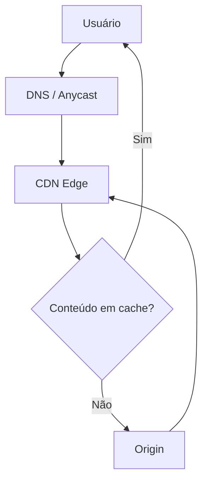
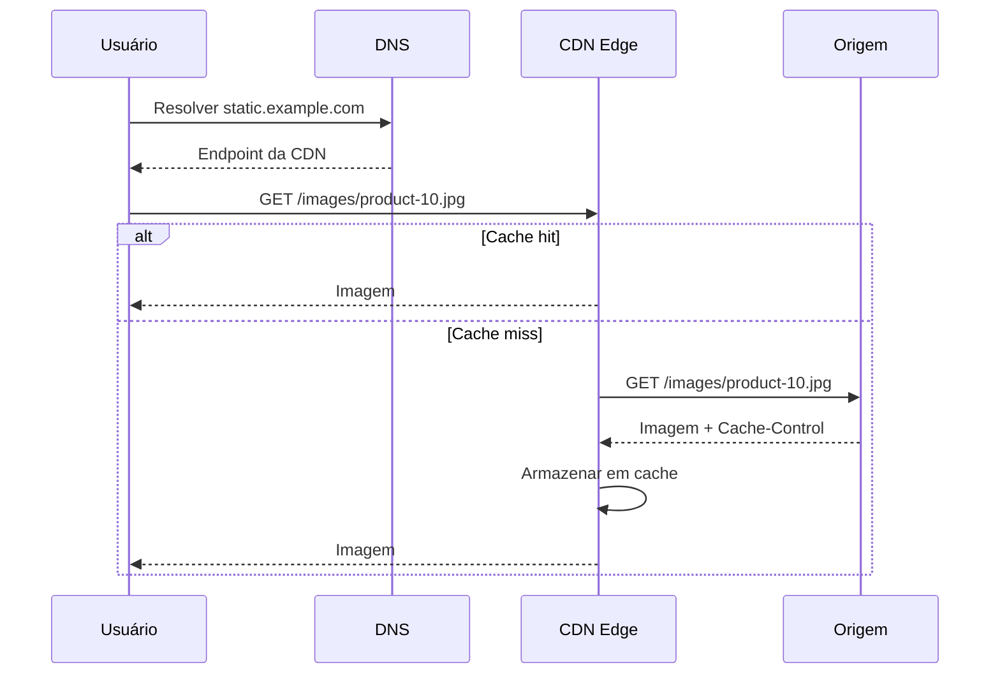
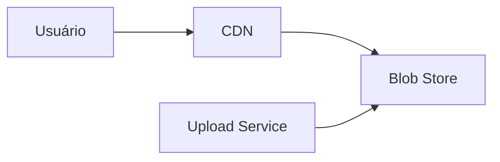
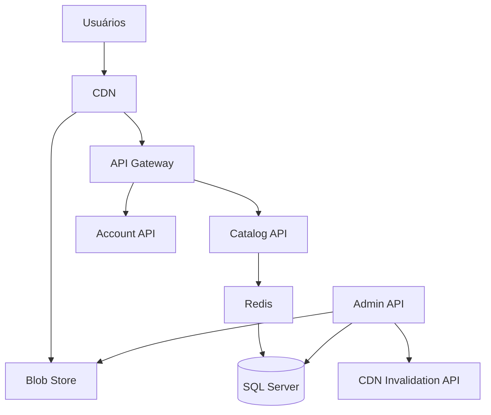
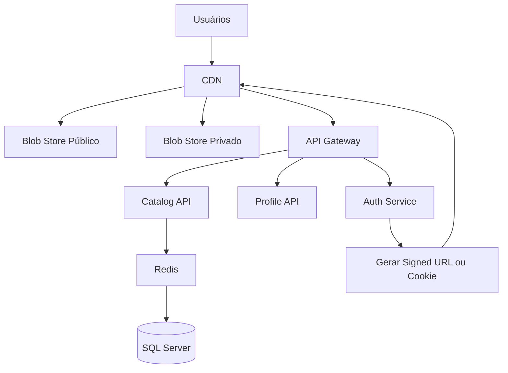

# Módulo 11 — CDN

Uma CDN, ou **Content Delivery Network**, é uma rede distribuída de servidores usada para entregar conteúdo aos usuários a partir de localizações próximas.

Seu principal objetivo é reduzir:

* Latência.
* Carga sobre a aplicação de origem.
* Consumo de banda da infraestrutura principal.
* Impacto de picos de acesso.
* Tempo de carregamento de páginas e arquivos.

Neste módulo, estudaremos:

* O que é uma CDN.
* Como ela funciona.
* Quando usar.
* Quando não usar.
* Como o cache da CDN é preenchido.
* O que são conteúdo stale e revalidação.
* Como invalidar conteúdo.
* Como usar cache headers.
* Integração com Blob Store.
* Riscos de segurança.
* Riscos de inconsistência.
* Exemplos com ASP.NET Core.

---

## Sumário

* [1. O que é uma CDN](#1-o-que-é-uma-cdn)
* [2. Por que uma CDN existe](#2-por-que-uma-cdn-existe)
* [3. Componentes principais](#3-componentes-principais)
* [4. Como uma CDN funciona](#4-como-uma-cdn-funciona)
* [5. Edge locations e Points of Presence](#5-edge-locations-e-points-of-presence)
* [6. Origem](#6-origem)
* [7. Cache hit e cache miss](#7-cache-hit-e-cache-miss)
* [8. Fluxo completo de uma requisição](#8-fluxo-completo-de-uma-requisição)
* [9. Quando usar CDN](#9-quando-usar-cdn)
* [10. Quando não usar CDN](#10-quando-não-usar-cdn)
* [11. Conteúdo estático](#11-conteúdo-estático)
* [12. Conteúdo dinâmico](#12-conteúdo-dinâmico)
* [13. CDN e Blob Store](#13-cdn-e-blob-store)
* [14. Cache-Control](#14-cache-control)
* [15. Diretivas de cache](#15-diretivas-de-cache)
* [16. ETag](#16-etag)
* [17. Last-Modified](#17-last-modified)
* [18. Revalidação](#18-revalidação)
* [19. Stale cache](#19-stale-cache)
* [20. Stale-while-revalidate](#20-stale-while-revalidate)
* [21. Stale-if-error](#21-stale-if-error)
* [22. Invalidação](#22-invalidação)
* [23. Purge](#23-purge)
* [24. Cache busting](#24-cache-busting)
* [25. URLs versionadas](#25-urls-versionadas)
* [26. Cache key](#26-cache-key)
* [27. Query strings](#27-query-strings)
* [28. Headers e cookies](#28-headers-e-cookies)
* [29. Vary](#29-vary)
* [30. Conteúdo privado](#30-conteúdo-privado)
* [31. Signed URLs e signed cookies](#31-signed-urls-e-signed-cookies)
* [32. Riscos de segurança](#32-riscos-de-segurança)
* [33. Cache poisoning](#33-cache-poisoning)
* [34. Cache deception](#34-cache-deception)
* [35. Vazamento de dados privados](#35-vazamento-de-dados-privados)
* [36. Origin exposure](#36-origin-exposure)
* [37. Riscos de inconsistência](#37-riscos-de-inconsistência)
* [38. Riscos operacionais](#38-riscos-operacionais)
* [39. CDN e DDoS](#39-cdn-e-ddos)
* [40. CDN e TLS](#40-cdn-e-tls)
* [41. Compressão](#41-compressão)
* [42. Imagens e transformação](#42-imagens-e-transformação)
* [43. Vídeo e streaming](#43-vídeo-e-streaming)
* [44. Multi-CDN](#44-multi-cdn)
* [45. Observabilidade](#45-observabilidade)
* [46. Custos](#46-custos)
* [47. Exemplo com ASP.NET Core](#47-exemplo-com-aspnet-core)
* [48. Exemplo com Blob Store](#48-exemplo-com-blob-store)
* [49. Arquitetura de exemplo](#49-arquitetura-de-exemplo)
* [50. Trade-offs](#50-trade-offs)
* [51. Checklist de produção](#51-checklist-de-produção)
* [52. Regras práticas](#52-regras-práticas)
* [53. Questões de entrevista](#53-questões-de-entrevista)
* [54. Exercício prático](#54-exercício-prático)
* [55. Resumo do módulo](#55-resumo-do-módulo)

---

# 1. O que é uma CDN

CDN significa **Content Delivery Network**.

É uma rede de servidores distribuídos geograficamente que mantém cópias de conteúdos e os entrega aos usuários a partir de pontos próximos.

Arquitetura simplificada:

```text
Usuário no Brasil
      |
      v
Edge da CDN em São Paulo
      |
      v
Origem nos Estados Unidos
```

Sem CDN:

```text
Usuário no Brasil
      |
      v
Servidor nos Estados Unidos
```

Com CDN:

```text
Usuário no Brasil
      |
      v
Servidor de borda próximo
```

A CDN pode armazenar e entregar:

* Imagens.
* Vídeos.
* CSS.
* JavaScript.
* Fontes.
* PDFs.
* Downloads.
* Respostas HTTP.
* APIs cacheáveis.
* Conteúdo de Blob Stores.
* Streaming.

---

# 2. Por que uma CDN existe

A velocidade da internet não depende apenas da capacidade do servidor.

Também depende de:

* Distância física.
* Número de saltos de rede.
* Qualidade das rotas.
* Congestionamento.
* Peering entre provedores.
* Latência do servidor de origem.

Exemplo:

```text
Usuário
   |
   | 180 ms
   v
Servidor de origem distante
```

Com uma CDN:

```text
Usuário
   |
   | 20 ms
   v
Edge próximo
```

A CDN ajuda a:

* Reduzir latência.
* Melhorar carregamento.
* Absorver tráfego.
* Reduzir chamadas à origem.
* Distribuir grandes arquivos.
* Proteger a infraestrutura.
* Melhorar disponibilidade.
* Reduzir custo de processamento na aplicação.

---

# 3. Componentes principais

Uma CDN possui geralmente:

* Origin.
* Edge server.
* Point of Presence.
* Cache.
* DNS ou Anycast.
* Control plane.
* Logs e métricas.
* Regras de roteamento.
* Políticas de segurança.

## Arquitetura



---

# 4. Como uma CDN funciona

Fluxo básico:

```text
1. Usuário solicita um conteúdo.
2. DNS ou Anycast direciona para um edge próximo.
3. Edge procura o conteúdo em cache.
4. Se encontrar, retorna.
5. Se não encontrar, busca na origem.
6. Armazena uma cópia.
7. Retorna ao usuário.
```

A partir da segunda requisição:

```text
Usuário --> Edge --> conteúdo em cache
```

A origem deixa de receber todas as requisições.

---

# 5. Edge locations e Points of Presence

Um **Point of Presence**, ou PoP, é uma localização física da CDN.

Dentro dele podem existir múltiplos servidores de edge.

```text
PoP São Paulo
  |
  +--> Edge 1
  +--> Edge 2
  +--> Edge 3
```

Outros PoPs:

```text
São Paulo
Miami
Frankfurt
Tokyo
Sydney
```

O usuário geralmente é direcionado para um PoP com base em:

* Proximidade de rede.
* Latência.
* Saúde.
* Capacidade.
* Roteamento Anycast.
* Regras internas do provedor.

---

# 6. Origem

A origem é o sistema de onde a CDN busca o conteúdo original.

Pode ser:

* Aplicação web.
* API.
* Blob Store.
* Servidor HTTP.
* Load balancer.
* Media server.
* Outro CDN.

Exemplo:

```text
CDN
 |
 v
Amazon S3
```

ou:

```text
CDN
 |
 v
ASP.NET Core API
```

A origem é chamada quando:

* O objeto não está em cache.
* O TTL expirou.
* O conteúdo foi invalidado.
* A revalidação é necessária.
* A cache key mudou.
* A política determina bypass.

---

# 7. Cache hit e cache miss

## Cache hit

O edge possui o conteúdo.

```text
Usuário --> CDN Edge --> Resposta
```

Benefícios:

* Baixa latência.
* Origem não é chamada.
* Menor custo de processamento.
* Maior throughput.

## Cache miss

O edge não possui o conteúdo.

```text
Usuário
   |
   v
CDN Edge
   |
   v
Origin
```

A primeira requisição costuma ser mais lenta.

## Cache hit ratio

```text
Hit Ratio =
Cache Hits / Total de Requisições
```

Exemplo:

```text
900 mil hits
100 mil misses
=
90% de hit ratio
```

Quanto maior o hit ratio, menor tende a ser a carga na origem.

---

# 8. Fluxo completo de uma requisição



---

# 9. Quando usar CDN

Use CDN quando:

## Usuários estão distribuídos geograficamente

```text
Brasil
Europa
Estados Unidos
Ásia
```

## Existe muito conteúdo estático

```text
Imagens
CSS
JavaScript
Fontes
Vídeos
PDFs
```

## A origem recebe alto volume

```text
1 milhão de downloads
```

## Arquivos são grandes

```text
Vídeos
Instaladores
Backups públicos
Datasets
```

## Existe tráfego em picos

```text
Lançamentos
Eventos ao vivo
Black Friday
Notícias
```

## Respostas podem ser reutilizadas

```text
Catálogo público
Página institucional
API de configuração
Ranking
```

## É necessário proteger a origem

A CDN pode ocultar e reduzir o acesso direto ao backend.

---

# 10. Quando não usar CDN

CDN pode não oferecer benefício relevante quando:

* Usuários estão próximos da origem.
* O tráfego é muito baixo.
* Conteúdo muda a cada requisição.
* Respostas são altamente personalizadas.
* Dados não podem ser cacheados.
* O custo operacional não se justifica.
* Requisitos de compliance impedem caching fora da região.

Exemplo:

```text
GET /bank-account/current-balance
```

Essa resposta:

* É privada.
* Muda frequentemente.
* Precisa ser atual.
* Não deve ser compartilhada.

Normalmente não deve ser armazenada em cache público.

---

# 11. Conteúdo estático

Conteúdo estático muda pouco.

Exemplos:

```text
styles.css
app.js
logo.svg
font.woff2
product-image.jpg
manual.pdf
```

É o cenário mais simples para CDN.

## Estratégia recomendada

Usar nomes versionados:

```text
app.a872d11.js
styles.4de981.css
```

E TTL longo:

```http
Cache-Control: public, max-age=31536000, immutable
```

Como o nome muda quando o conteúdo muda, não é necessário invalidar o arquivo anterior imediatamente.

---

# 12. Conteúdo dinâmico

Conteúdo dinâmico é gerado em tempo de execução.

Exemplos:

* APIs.
* Páginas personalizadas.
* Rankings.
* Catálogos.
* Notícias.
* Resultados de busca.

Algumas respostas dinâmicas ainda podem ser cacheadas.

Exemplo:

```http
GET /api/catalog/categories
```

Se a resposta for igual para todos:

```http
Cache-Control: public, max-age=60
```

Pode ser cacheada por um minuto.

## Cuidado

Não cacheie como público conteúdo que varia por:

* Usuário.
* Tenant.
* Token.
* Permissão.
* Cookie.
* Idioma.
* Região.

A menos que a cache key considere corretamente essas diferenças.

---

# 13. CDN e Blob Store

Uma arquitetura comum:

```text
Cliente
   |
   v
CDN
   |
   v
Blob Store
```

O Blob Store mantém o conteúdo original.

A CDN mantém cópias próximas aos usuários.

Exemplos:

* Imagens.
* Vídeos.
* Downloads.
* Documentos públicos.
* Assets de frontend.

## Benefícios

* Menos leituras na origem.
* Menor latência.
* Melhor distribuição global.
* Melhor absorção de picos.
* Menor consumo de banda do backend.

## Arquitetura



---

# 14. Cache-Control

`Cache-Control` é um header HTTP usado para controlar comportamento de cache.

Exemplo:

```http
Cache-Control: public, max-age=3600
```

Isso indica:

```text
Conteúdo público
TTL de 1 hora
```

Outro exemplo:

```http
Cache-Control: private, no-store
```

Isso indica:

```text
Não armazenar em caches compartilhados
```

---

# 15. Diretivas de cache

## public

Permite caching em caches compartilhados.

```http
Cache-Control: public
```

Exemplo:

* CDN.
* Proxy.
* Navegador.

## private

Permite cache apenas no cliente final, não em cache compartilhado.

```http
Cache-Control: private
```

## no-cache

Não significa necessariamente “não armazenar”.

Significa:

```text
Pode armazenar,
mas deve revalidar antes de reutilizar.
```

```http
Cache-Control: no-cache
```

## no-store

Não deve armazenar.

```http
Cache-Control: no-store
```

Use para:

* Dados bancários.
* Tokens.
* Informações altamente sensíveis.
* Respostas privadas críticas.

## max-age

Tempo de validade para o cliente.

```http
Cache-Control: max-age=300
```

## s-maxage

Tempo de validade em caches compartilhados.

```http
Cache-Control: public, max-age=60, s-maxage=600
```

Nesse exemplo:

```text
Navegador:
60 segundos

CDN:
600 segundos
```

## immutable

Indica que o conteúdo não mudará durante seu TTL.

```http
Cache-Control: public, max-age=31536000, immutable
```

Ideal para assets versionados.

## must-revalidate

Depois que expirar, o cache deve revalidar antes de usar.

```http
Cache-Control: must-revalidate
```

---

# 16. ETag

ETag é um identificador associado a uma versão do recurso.

Resposta:

```http
ETag: "a89f7d91"
```

Na próxima requisição:

```http
If-None-Match: "a89f7d91"
```

Se o conteúdo não mudou:

```http
HTTP/1.1 304 Not Modified
```

O servidor não precisa reenviar o corpo.

## Benefícios

* Menos banda.
* Revalidação eficiente.
* Detecta alterações.
* Bom para conteúdo versionado.

## ETag forte e fraca

ETag forte:

```http
ETag: "abc123"
```

ETag fraca:

```http
ETag: W/"abc123"
```

Uma ETag fraca indica equivalência sem exigir igualdade byte a byte.

---

# 17. Last-Modified

O servidor pode informar a última modificação:

```http
Last-Modified: Mon, 13 Jul 2026 15:00:00 GMT
```

O cliente envia:

```http
If-Modified-Since: Mon, 13 Jul 2026 15:00:00 GMT
```

Se não mudou:

```http
HTTP/1.1 304 Not Modified
```

## Limitações

* Resolução temporal pode ser insuficiente.
* Relógios podem divergir.
* Pode não representar mudanças exatas.
* ETag costuma oferecer controle mais preciso.

---

# 18. Revalidação

Quando um objeto expira, o edge pode perguntar à origem se mudou.

```text
Cache expirado
    |
    v
CDN envia If-None-Match
    |
    +--> 304: continua usando o objeto
    |
    +--> 200: recebe nova versão
```

## Benefício

Evita baixar novamente o corpo inteiro quando não houve alteração.

---

# 19. Stale cache

Conteúdo stale é um conteúdo armazenado cuja validade expirou.

Exemplo:

```text
TTL:
5 minutos

Idade atual:
7 minutos
```

O objeto está stale.

Normalmente, o cache deveria:

* Revalidar.
* Buscar uma nova versão.
* Remover o objeto.
* Servir stale em situações específicas.

## Por que servir conteúdo stale

Mesmo expirado, um conteúdo antigo pode ser melhor que uma falha total.

Exemplo:

```text
Página de catálogo antiga
```

pode ser melhor que:

```text
HTTP 503
```

Isso depende do domínio.

---

# 20. Stale-while-revalidate

`stale-while-revalidate` permite entregar uma versão antiga enquanto o cache busca a nova versão em background.

Exemplo:

```http
Cache-Control: public, max-age=60, stale-while-revalidate=300
```

Comportamento:

```text
0 a 60 segundos:
conteúdo fresh

61 a 360 segundos:
pode servir stale e atualizar em background

Após 360 segundos:
precisa buscar nova versão
```

## Fluxo

```text
Usuário solicita
      |
      v
Cache expirou
      |
      +--> entrega versão antiga imediatamente
      |
      +--> revalida em background
```

## Benefícios

* Baixa latência.
* Evita bloquear usuário.
* Reduz cache stampede.
* Boa experiência.

## Desvantagens

* Usuário pode ver conteúdo desatualizado.
* Nem todo domínio tolera stale.
* Comportamento pode variar conforme implementação.

---

# 21. Stale-if-error

`stale-if-error` permite usar conteúdo antigo quando a origem falha.

Exemplo:

```http
Cache-Control: public, max-age=60, stale-if-error=600
```

Comportamento:

```text
Objeto expirou
+
Origem retorna erro
=
CDN pode usar versão antiga por até 600 segundos
```

## Bom para

* Catálogos.
* Páginas públicas.
* Conteúdo editorial.
* Configurações não críticas.
* Arquivos.

## Ruim para

* Saldos.
* Pagamentos.
* Estoque estritamente consistente.
* Dados privados sensíveis.
* Operações transacionais.

---

# 22. Invalidação

Invalidar significa fazer a CDN parar de servir uma versão armazenada.

Cenários:

* Conteúdo incorreto.
* Arquivo removido.
* Informação sensível publicada.
* Preço alterado.
* Vulnerabilidade.
* Novo deploy.
* Erro de configuração.

Estratégias:

* Esperar TTL.
* Purge.
* URL versionada.
* Cache busting.
* Revalidação.
* Alteração da cache key.

---

# 23. Purge

Purge remove um objeto dos caches da CDN.

Exemplo:

```text
Purge:
/images/product-1001.jpg
```

Também pode existir purge por:

* URL.
* Prefixo.
* Tag.
* Host.
* Tudo.

## Vantagens

* Remove conteúdo rapidamente.
* Útil para emergências.
* Útil para dados incorretos.

## Desvantagens

* Pode ter custo.
* Pode demorar para propagar.
* Purge amplo causa muitos cache misses.
* Pode sobrecarregar a origem.
* Introduz dependência operacional.

## Purge total

```text
Purge /*
```

É perigoso.

Consequência:

```text
Todos os edges ficam frios
      |
      v
Grande volume chega à origem
```

---

# 24. Cache busting

Cache busting muda a URL para forçar uma nova versão.

Exemplo antigo:

```text
/app.js
```

Novo:

```text
/app.js?v=2
```

Uma opção melhor:

```text
/app.a83f91.js
```

A CDN vê uma nova cache key.

## Benefício

Não depende de purge.

## Desvantagem

Versões antigas permanecem até expirar ou serem removidas.

---

# 25. URLs versionadas

Uma prática recomendada para assets estáticos:

```text
logo.61bf3e.svg
main.8d23c1.js
styles.a913ff.css
```

Quando o conteúdo muda:

```text
main.b728aa.js
```

O HTML passa a referenciar a nova versão.

## Vantagens

* TTL muito longo.
* Sem risco de servir conteúdo antigo pela mesma URL.
* Rollback simples.
* Evita purge frequente.

## Estratégia

```http
Cache-Control: public, max-age=31536000, immutable
```

---

# 26. Cache key

A cache key determina quando duas requisições compartilham o mesmo objeto.

Pode incluir:

* Host.
* Path.
* Query string.
* Headers.
* Cookies.
* Método HTTP.
* Região.
* Idioma.
* Device type.

Exemplo:

```text
Host:
cdn.example.com

Path:
/products/1001.jpg

Query:
width=500
```

Cache key possível:

```text
cdn.example.com/products/1001.jpg?width=500
```

## Risco

Uma cache key incompleta pode misturar respostas de usuários diferentes.

Uma cache key detalhada demais pode reduzir o hit ratio.

---

# 27. Query strings

Duas URLs podem gerar chaves diferentes:

```text
/image.jpg?width=100
/image.jpg?width=500
```

Isso pode ser desejado para transformação de imagens.

Mas query strings irrelevantes podem fragmentar o cache:

```text
/image.jpg?utm_source=a
/image.jpg?utm_source=b
/image.jpg?utm_source=c
```

A CDN pode armazenar três cópias idênticas.

## Estratégia

Definir quais parâmetros fazem parte da cache key.

Exemplo:

```text
Considerar:
width
height
format

Ignorar:
utm_source
tracking_id
```

---

# 28. Headers e cookies

Conteúdo pode variar por header.

Exemplos:

```http
Accept-Language: pt-BR
Accept-Encoding: br
Authorization: Bearer ...
```

Também pode variar por cookie.

Exemplo:

```http
Cookie: theme=dark
```

## Problema

Se a CDN ignorar um header importante, pode servir a resposta errada.

Se considerar todos os headers e cookies, o cache pode se fragmentar.

```text
Cada usuário gera uma variante própria
      |
      v
Hit ratio muito baixo
```

---

# 29. Vary

O header `Vary` informa quais headers alteram a representação.

Exemplo:

```http
Vary: Accept-Encoding
```

Isso permite versões separadas:

```text
gzip
brotli
sem compressão
```

Outro exemplo:

```http
Vary: Accept-Language
```

Pode gerar:

```text
pt-BR
en-US
es-ES
```

## Cuidado

```http
Vary: *
```

praticamente impede reutilização compartilhada.

---

# 30. Conteúdo privado

Conteúdo privado exige cuidado especial.

Exemplos:

* Faturas.
* Contratos.
* Fotos privadas.
* Arquivos de clientes.
* Vídeos pagos.
* Exames médicos.

Opções:

* Não cachear.
* Cache privado.
* Signed URL.
* Signed cookie.
* Token curto.
* Edge authorization.
* CDN com origem privada.

## Regra fundamental

> Nunca permita que uma resposta privada seja armazenada como pública sem que a cache key diferencie corretamente o usuário ou a autorização.

---

# 31. Signed URLs e signed cookies

## Signed URL

Uma URL possui parâmetros assinados.

Exemplo conceitual:

```text
https://cdn.example.com/video.mp4
?expires=1783950000
&signature=abc123
```

A CDN verifica:

* Expiração.
* Assinatura.
* Caminho.
* Parâmetros.

## Signed cookie

A autorização é armazenada em cookie.

Útil quando o usuário precisa acessar vários arquivos.

Exemplo:

```text
Assinatura permite acesso a:
/course/123/*
```

## Casos de uso

* Vídeos pagos.
* Downloads privados.
* Documentos.
* Conteúdo de assinatura.
* Arquivos temporários.

---

# 32. Riscos de segurança

Uma CDN adiciona uma nova camada pública.

Riscos:

* Cache poisoning.
* Cache deception.
* Vazamento de conteúdo privado.
* Exposição da origem.
* Configuração incorreta de TLS.
* Purge não autorizado.
* Domínio mal configurado.
* Bypass de autenticação.
* CORS incorreto.
* Header manipulation.
* Web cache poisoning.

---

# 33. Cache poisoning

Cache poisoning ocorre quando um atacante faz a CDN armazenar uma resposta maliciosa ou incorreta.

Exemplo conceitual:

```text
1. Atacante envia request manipulado.
2. Origem gera resposta influenciada.
3. CDN salva resposta.
4. Outros usuários recebem conteúdo contaminado.
```

Pode envolver:

* Headers não considerados na cache key.
* Host manipulado.
* Query strings.
* X-Forwarded-*.
* Respostas refletidas.
* Redirects.

## Mitigações

* Normalizar headers.
* Validar Host.
* Definir cache key explicitamente.
* Não cachear respostas com entrada não confiável.
* Remover headers inesperados.
* Testar comportamento do edge.
* Restringir métodos cacheáveis.

---

# 34. Cache deception

Cache deception faz a CDN armazenar conteúdo privado como se fosse estático.

Exemplo conceitual:

```text
/account/profile.css
```

A aplicação interpreta como página privada.

A CDN interpreta como arquivo CSS e armazena.

Depois, outra pessoa pode receber a resposta.

## Mitigações

* Não decidir cache apenas pela extensão.
* Definir `Cache-Control` correto.
* Separar domínios de conteúdo público e privado.
* Não cachear respostas autenticadas por padrão.
* Validar rotas.
* Configurar regras explícitas.

---

# 35. Vazamento de dados privados

Exemplo:

```text
Usuário A solicita /profile
CDN armazena resposta
Usuário B solicita /profile
CDN entrega resposta de A
```

Isso pode acontecer se:

* Cache key ignora cookie.
* Cache key ignora authorization.
* Origem envia `public`.
* Regra da CDN força cache.
* Headers são configurados incorretamente.

## Proteções

Para conteúdo privado:

```http
Cache-Control: private, no-store
```

Também:

* Não cachear quando existir `Authorization`.
* Separar domínio público e privado.
* Usar signed URLs para arquivos.
* Validar configuração em produção.

---

# 36. Origin exposure

Mesmo usando CDN, a origem pode continuar publicamente acessível.

Exemplo:

```text
cdn.example.com --> CDN
origin.example.com --> servidor direto
```

Um atacante pode ignorar a CDN:

```text
Atacante --> Origem
```

Isso elimina:

* Proteção DDoS da CDN.
* WAF.
* Rate limiting.
* Cache.
* Regras de segurança.

## Mitigações

* Permitir acesso apenas da CDN.
* Usar rede privada.
* Validar header secreto, com cautela.
* Usar mTLS.
* Restringir firewall.
* Utilizar origem autenticada.
* Ocultar IP público.

---

# 37. Riscos de inconsistência

CDNs introduzem consistência eventual entre edges.

Exemplo:

```text
Edge São Paulo:
versão nova

Edge Frankfurt:
versão antiga
```

Isso pode ocorrer por:

* TTL.
* Revalidação em momentos diferentes.
* Purge ainda em propagação.
* Cache regional.
* Falha de comunicação.
* Regras diferentes.

## Consequência

Usuários em regiões diferentes podem receber versões diferentes.

## Mitigações

* URLs versionadas.
* TTL apropriado.
* Purge controlado.
* Observabilidade regional.
* Testes em múltiplos PoPs.
* Não usar CDN para dados que exigem consistência imediata.

---

# 38. Riscos operacionais

## Configuração errada

Uma regra incorreta pode:

* Cachear páginas privadas.
* Impedir cache de conteúdo público.
* Gerar custos altos.
* Derrubar a origem.
* Invalidar todo o cache.
* Bloquear usuários legítimos.

## Dependência do provedor

Uma falha da CDN pode afetar:

* Site.
* APIs.
* Downloads.
* Login.
* Assets.
* DNS.

## Lock-in

Recursos específicos podem dificultar migração:

* Edge functions.
* Regras proprietárias.
* Imagens transformadas.
* WAF.
* Workers.
* Signed URL format.
* Logs.

---

# 39. CDN e DDoS

Uma CDN ajuda a absorver ataques distribuídos porque possui:

* Grande capacidade.
* Muitos PoPs.
* Anycast.
* Rate limiting.
* WAF.
* Filtragem.
* Cache.

```text
Ataque
   |
   v
Rede da CDN
   |
   v
Origem protegida
```

## Limite

CDN não elimina todos os ataques.

Ataques podem atingir:

* Endpoints não cacheáveis.
* Login.
* Busca.
* Origem exposta.
* Banco.
* APIs caras.
* Uploads.
* Lógica de negócio.

É necessário combinar:

* CDN.
* WAF.
* Rate limiting.
* Autoscaling.
* Circuit breaker.
* Proteção de origem.

---

# 40. CDN e TLS

A CDN normalmente encerra TLS no edge.

```text
Usuário -- HTTPS --> CDN
```

Da CDN para a origem:

```text
CDN -- HTTPS --> Origin
```

Isso é recomendado.

Evite:

```text
CDN -- HTTP --> Origin
```

principalmente quando existem:

* Dados sensíveis.
* Internet pública entre edge e origem.
* Requisitos de compliance.

## Certificados

A CDN pode gerenciar:

* Certificado público.
* Renovação.
* SNI.
* TLS versions.
* Cipher suites.
* HTTP/2.
* HTTP/3.

---

# 41. Compressão

A CDN pode comprimir conteúdo usando:

* Gzip.
* Brotli.

Exemplo:

```http
Accept-Encoding: br, gzip
```

Resposta:

```http
Content-Encoding: br
```

## Bom para

* HTML.
* CSS.
* JavaScript.
* JSON.
* SVG.
* Texto.

## Pouco benefício para

* JPEG.
* PNG.
* MP4.
* ZIP.
* PDF já comprimido.

## Cuidado

A cache key ou `Vary` deve diferenciar representações.

```http
Vary: Accept-Encoding
```

---

# 42. Imagens e transformação

Algumas CDNs conseguem transformar imagens no edge.

Exemplo:

```text
/image/product.jpg?width=400&format=webp
```

Operações:

* Resize.
* Crop.
* Compressão.
* Conversão para WebP.
* Conversão para AVIF.
* Otimização por dispositivo.
* Remoção de metadados.

## Benefícios

* Menor banda.
* Melhor experiência.
* Menos processamento na origem.
* Geração sob demanda.

## Riscos

* Muitas variantes.
* Explosão de cache keys.
* Custos de transformação.
* Query strings maliciosas.
* Imagens gigantes.
* Lock-in.

## Proteções

* Limitar dimensões.
* Permitir presets.
* Assinar URLs.
* Normalizar parâmetros.
* Definir quantidade máxima de variantes.

---

# 43. Vídeo e streaming

CDNs são fundamentais para streaming.

Conteúdo pode ser dividido em segmentos:

```text
video.m3u8
segment-001.ts
segment-002.ts
segment-003.ts
```

ou formatos equivalentes.

Benefícios:

* Distribuição global.
* Cache de segmentos.
* Menor carga na origem.
* Adaptive bitrate.
* Continuidade.
* Escala para muitos usuários.

## Live streaming

Em transmissão ao vivo, o conteúdo possui TTL curto e alta frequência de atualização.

Desafios:

* Latência.
* Segmentos.
* Invalidação.
* Origem.
* Picos.
* Direitos de acesso.
* Signed URLs.

---

# 44. Multi-CDN

Multi-CDN utiliza mais de um provedor.

```text
Usuário
   |
   v
DNS ou Traffic Manager
   |
   +--> CDN A
   +--> CDN B
```

## Benefícios

* Maior disponibilidade.
* Menor dependência de fornecedor.
* Otimização regional.
* Negociação de custos.
* Melhor performance em regiões específicas.

## Desvantagens

* Configuração duplicada.
* Purge em múltiplos provedores.
* Logs fragmentados.
* Segurança precisa ser equivalente.
* Mais complexidade.
* Comportamentos diferentes de cache.

## Quando usar

* Sistemas globais críticos.
* Streaming de grande escala.
* Requisitos de disponibilidade elevados.
* Provedor único é risco relevante.
* Equipe madura de plataforma.

---

# 45. Observabilidade

Métricas importantes:

* Cache hit ratio.
* Cache miss ratio.
* Origin requests.
* Edge latency.
* Origin latency.
* Bytes transferred.
* Egress.
* HTTP status codes.
* Purge requests.
* Stale responses.
* Revalidation count.
* Bandwidth by region.
* Top URLs.
* Error rate.
* WAF blocks.
* DDoS events.

## Headers de diagnóstico

Muitas CDNs adicionam headers conceituais como:

```http
X-Cache: HIT
```

ou:

```http
X-Cache: MISS
```

Também pode haver:

```http
Age: 120
```

Indicando há quanto tempo o objeto está no cache.

## Monitoramento externo

Teste a partir de:

* Brasil.
* Estados Unidos.
* Europa.
* Ásia.

Valide:

* Conteúdo.
* Certificado.
* Latência.
* Cache headers.
* Versão entregue.
* Disponibilidade.

---

# 46. Custos

Custos de CDN podem incluir:

* Dados transferidos.
* Requisições.
* Purges.
* WAF.
* Edge functions.
* Transformação de imagens.
* Logs.
* Armazenamento.
* Transferência da origem.
* Regiões.
* Streaming.

## CDN pode reduzir custos

Ao reduzir chamadas à origem:

```text
100 milhões de requests
90% cache hit
=
10 milhões chegam à origem
```

## CDN também pode aumentar custos

Se:

* Cache hit ratio é baixo.
* Query strings fragmentam cache.
* Arquivos são grandes.
* Purges são frequentes.
* Edge functions executam demais.
* Logs são muito volumosos.

---

# 47. Exemplo com ASP.NET Core

## Endpoint de conteúdo público

```csharp
var builder = WebApplication.CreateBuilder(args);

var app = builder.Build();

app.MapGet(
    "/api/catalog/categories",
    (HttpContext context) =>
    {
        context.Response.Headers.CacheControl =
            "public, max-age=60, s-maxage=600, stale-while-revalidate=300";

        return Results.Ok(
            new[]
            {
                new
                {
                    Id = 1,
                    Name = "Electronics"
                },
                new
                {
                    Id = 2,
                    Name = "Books"
                }
            });
    });

app.Run();
```

Nesse exemplo:

```text
Navegador:
60 segundos

CDN:
600 segundos

Stale durante revalidação:
300 segundos
```

## Endpoint privado

```csharp
app.MapGet(
    "/api/account/profile",
    (HttpContext context) =>
    {
        context.Response.Headers.CacheControl =
            "private, no-store";

        return Results.Ok(
            new
            {
                Name = "Maria",
                Email = "maria@example.com"
            });
    });
```

---

# 48. Exemplo com Blob Store

Arquitetura:

```text
Upload Service
      |
      v
Blob Store
      |
      v
CDN
      |
      v
Usuário
```

## Chave versionada

```text
products/1001/images/7c93a841.jpg
```

Metadados no SQL Server:

```sql
CREATE TABLE dbo.ProductImages
(
    ProductImageId BIGINT NOT NULL PRIMARY KEY,
    ProductId BIGINT NOT NULL,
    ObjectKey NVARCHAR(1000) NOT NULL,
    PublicUrl NVARCHAR(2000) NOT NULL,
    ContentType VARCHAR(100) NOT NULL,
    ContentLength BIGINT NOT NULL,
    CreatedAtUtc DATETIME2 NOT NULL
        CONSTRAINT DF_ProductImages_CreatedAtUtc
        DEFAULT SYSUTCDATETIME()
);
```

## Atualização da imagem

Em vez de sobrescrever:

```text
products/1001/image.jpg
```

crie:

```text
products/1001/images/a831fe20.jpg
```

Atualize no banco a referência para a nova key.

Benefícios:

* CDN usa nova URL.
* Sem purge imediato.
* Rollback simples.
* Arquivo antigo pode ser removido depois.

---

# 49. Arquitetura de exemplo

Considere uma plataforma de e-commerce global.



## Conteúdo estático

```text
CDN --> Blob Store
```

Exemplos:

* Imagens.
* CSS.
* JavaScript.
* PDFs.
* Vídeos.

## Conteúdo público dinâmico

```text
CDN --> API Gateway --> Catalog API
```

Exemplo:

```text
GET /api/catalog/categories
```

TTL curto ou médio.

## Conteúdo privado

```text
Usuário --> API Gateway --> Account API
```

Sem cache compartilhado.

---

# 50. Trade-offs

## TTL curto versus longo

| TTL curto              | TTL longo             |
| ---------------------- | --------------------- |
| Conteúdo mais atual    | Maior hit ratio       |
| Mais requests à origem | Menos carga na origem |
| Mais custo de backend  | Melhor latência       |
| Menos stale            | Mais risco de stale   |

## Purge versus URL versionada

| Purge                 | URL versionada         |
| --------------------- | ---------------------- |
| Remove mesma URL      | Cria nova URL          |
| Pode demorar          | Efeito imediato        |
| Pode gerar cache frio | Mantém versões antigas |
| Útil em emergência    | Melhor para assets     |

## Conteúdo stale versus erro

| Servir stale                  | Retornar erro               |
| ----------------------------- | --------------------------- |
| Melhor disponibilidade        | Maior consistência          |
| Pode exibir dado antigo       | Pode piorar experiência     |
| Bom para conteúdo não crítico | Melhor para dados sensíveis |

## CDN única versus Multi-CDN

| Uma CDN                 | Multi-CDN         |
| ----------------------- | ----------------- |
| Mais simples            | Mais resiliente   |
| Menor custo operacional | Mais complexidade |
| Maior lock-in           | Menor dependência |
| Um painel               | Logs fragmentados |

---

# 51. Checklist de produção

## Origem

* [ ] A origem está protegida?
* [ ] A origem aceita apenas tráfego da CDN?
* [ ] TLS está habilitado entre CDN e origem?
* [ ] Existe timeout?
* [ ] Existe rate limiting?
* [ ] A origem suporta cache miss em massa?

## Cache

* [ ] Quais rotas são cacheáveis?
* [ ] Qual TTL é usado?
* [ ] Existe `s-maxage`?
* [ ] Existe `stale-while-revalidate`?
* [ ] Existe `stale-if-error`?
* [ ] A cache key está documentada?
* [ ] Query strings relevantes foram definidas?
* [ ] Headers relevantes foram definidos?

## Privacidade

* [ ] Conteúdo autenticado está fora do cache público?
* [ ] Respostas privadas usam `private` ou `no-store`?
* [ ] Cookies fazem parte da decisão?
* [ ] Authorization é tratado corretamente?
* [ ] Signed URLs possuem expiração curta?
* [ ] Existe risco de cache deception?

## Invalidação

* [ ] Existe estratégia de purge?
* [ ] Assets usam URL versionada?
* [ ] Purge total é restrito?
* [ ] Purges são auditados?
* [ ] Existe proteção contra purge acidental?
* [ ] A origem suporta o tráfego após purge?

## Segurança

* [ ] Existe WAF?
* [ ] Existe proteção DDoS?
* [ ] Host headers são validados?
* [ ] Headers não confiáveis são removidos?
* [ ] Cache poisoning foi testado?
* [ ] Certificados são renovados automaticamente?
* [ ] A conta da CDN usa MFA?

## Observabilidade

* [ ] Hit ratio é monitorado?
* [ ] Miss ratio é monitorado?
* [ ] Origin latency é monitorada?
* [ ] Edge latency é monitorada?
* [ ] Erros por região são visíveis?
* [ ] Stale responses são monitoradas?
* [ ] Purges são monitorados?
* [ ] Custos de egress são monitorados?

---

# 52. Regras práticas

1. Use CDN para conteúdo distribuído globalmente.

2. Use CDN para reduzir carga na origem.

3. Assets estáticos devem usar nomes versionados.

4. Assets versionados podem ter TTL muito longo.

5. Não cacheie conteúdo privado como público.

6. `no-cache` não significa `no-store`.

7. Use `no-store` para conteúdo altamente sensível.

8. Defina a cache key explicitamente.

9. Ignore query strings que não alteram o conteúdo.

10. Inclua na cache key parâmetros que alteram a resposta.

11. Use `Vary` com cuidado.

12. TTL longo aumenta performance, mas aumenta stale data.

13. Purge é útil, mas não deve ser a estratégia principal para assets.

14. Prefira cache busting para arquivos estáticos.

15. Use `stale-while-revalidate` para conteúdo tolerante a atraso.

16. Use `stale-if-error` para melhorar disponibilidade.

17. Não sirva stale para dados financeiros críticos.

18. Proteja a origem contra acesso direto.

19. Teste cache poisoning e cache deception.

20. Monitore hit ratio e carga da origem.

21. Prepare a origem para eventos de cache frio.

22. Evite purge global sem planejamento.

23. CDN não substitui autorização.

24. CDN não substitui cache de aplicação.

25. CDN não garante consistência imediata entre regiões.

---

# 53. Questões de entrevista

## O que é uma CDN?

É uma rede distribuída de servidores que entrega conteúdo a partir de localizações próximas aos usuários, reduzindo latência e carga na origem.

## O que é um edge server?

É um servidor da CDN próximo aos usuários, responsável por armazenar e entregar conteúdo em cache.

## O que é origin?

É a fonte original do conteúdo, como uma API, um servidor web ou Blob Store.

## O que é cache hit?

É quando a CDN possui o conteúdo solicitado e consegue responder sem consultar a origem.

## O que é cache miss?

É quando a CDN precisa buscar o conteúdo na origem.

## Quando usar CDN?

Para conteúdo estático, arquivos grandes, streaming, aplicações globais, APIs públicas cacheáveis e proteção da origem.

## O que é stale cache?

É um conteúdo armazenado cujo TTL expirou.

## O que é stale-while-revalidate?

É uma estratégia que permite servir conteúdo expirado enquanto uma atualização acontece em background.

## O que é stale-if-error?

É uma estratégia que permite servir conteúdo antigo quando a origem está indisponível.

## O que é purge?

É a remoção explícita de conteúdo dos caches da CDN.

## Purge ou cache busting?

Cache busting é preferível para assets estáticos, pois cria uma nova URL. Purge é útil para emergências ou conteúdos que precisam manter a mesma URL.

## O que é cache poisoning?

É quando um atacante faz a CDN armazenar uma resposta maliciosa ou incorreta.

## O que é cache deception?

É quando conteúdo privado é armazenado como se fosse um arquivo público.

## CDN substitui Load Balancer?

Não. A CDN atua principalmente na borda, no cache e na distribuição global. O load balancer distribui tráfego entre backends.

## CDN substitui Redis?

Não. CDN é adequada para respostas HTTP e conteúdo de borda. Redis é cache de aplicação e estruturas de dados.

## Como evitar conteúdo antigo após deploy?

Use nomes de arquivos baseados em hash ou versão.

## Por que a origem precisa ser protegida?

Porque um atacante pode ignorar a CDN e acessar diretamente o backend, evitando WAF, cache e proteção DDoS.

---

# 54. Exercício prático

Projete uma estratégia de CDN para uma plataforma de ensino com os seguintes requisitos:

```text
- Usuários no Brasil, Europa e Estados Unidos.
- Vídeos de aulas.
- PDFs.
- Imagens.
- Aplicação SPA.
- Conteúdo pago.
- Catálogo público.
- Perfil privado.
- Lançamentos com grande pico.
- Vídeos não podem ser acessados sem assinatura.
- Novo frontend precisa ser publicado sem conteúdo antigo.
```

## Pontos que devem ser definidos

* Quais conteúdos serão cacheados?
* Qual origem será utilizada?
* Como proteger vídeos privados?
* Signed URL ou signed cookie?
* Qual TTL para assets?
* Qual TTL para catálogo?
* Perfil deve ser cacheado?
* Como invalidar conteúdo?
* Como evitar cache poisoning?
* Como proteger a origem?
* Como monitorar hit ratio?
* Como lidar com falha da origem?
* Como utilizar stale cache?
* Como publicar nova versão do frontend?

## Estratégia inicial

```text
JavaScript e CSS:
URL baseada em hash
TTL de 1 ano
immutable

Imagens públicas:
CDN + Blob Store
TTL longo

PDFs públicos:
CDN + Blob Store
TTL médio ou longo

Catálogo:
CDN
TTL curto
stale-while-revalidate

Perfil:
private, no-store

Vídeos pagos:
signed cookies ou signed URLs
origem privada
```

## Arquitetura



## Publicação do frontend

Build:

```text
index.html
app.a73b91.js
styles.28d1f4.css
```

Headers:

```text
app.a73b91.js:
Cache-Control: public, max-age=31536000, immutable
```

```text
index.html:
Cache-Control: no-cache
```

O HTML é revalidado frequentemente e passa a referenciar os novos assets.

Os assets antigos continuam disponíveis enquanto houver usuários com a versão anterior.

---

# 55. Resumo do módulo

```text
CDN
 |
 +--> reduz latência
 +--> reduz carga na origem
 +--> distribui conteúdo globalmente
 +--> absorve picos
 +--> ajuda contra DDoS
 |
 +--> introduz cache distribuído
 +--> pode servir conteúdo stale
 +--> exige invalidação
 +--> pode vazar dados se mal configurada
```

## Funcionamento

```text
Usuário
   |
   v
Edge da CDN
   |
   +--> Cache hit: responder
   |
   +--> Cache miss: buscar na origem
```

## Estratégia recomendada

```text
Blob Store como origem
+
CDN na frente
+
URLs versionadas
+
TTL longo para assets
+
TTL curto para conteúdo dinâmico
+
stale-while-revalidate
+
stale-if-error quando permitido
+
conteúdo privado com signed URLs
+
origem protegida
+
observabilidade
```

A principal ideia é:

> Uma CDN troca alguma consistência imediata e complexidade de invalidação por menor latência, maior capacidade e menor carga sobre a origem.

O ponto mais importante não é apenas colocar uma CDN na frente da aplicação.

É definir corretamente:

```text
O que pode ser cacheado?
Por quanto tempo?
Quem pode acessar?
Qual é a cache key?
Como atualizar?
O que acontece se a origem falhar?
```
