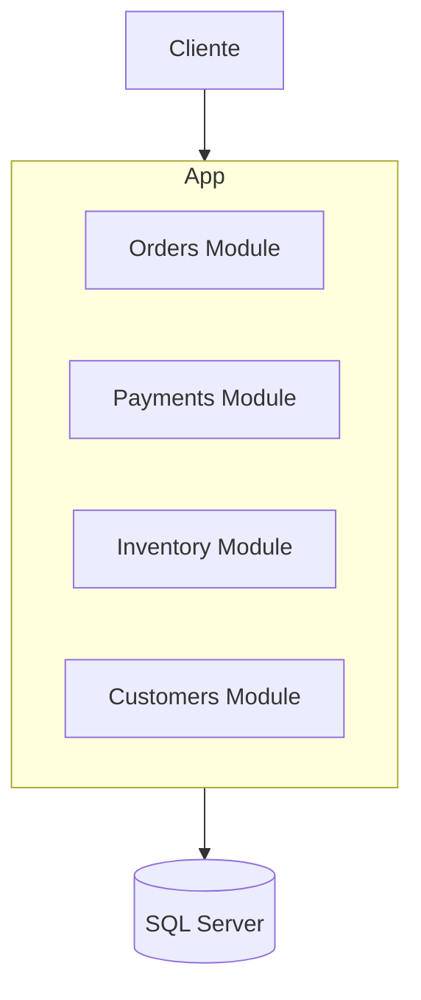
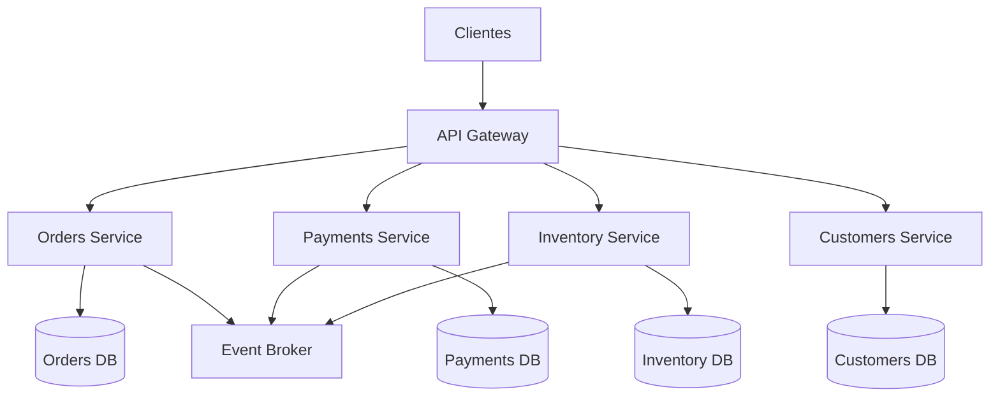
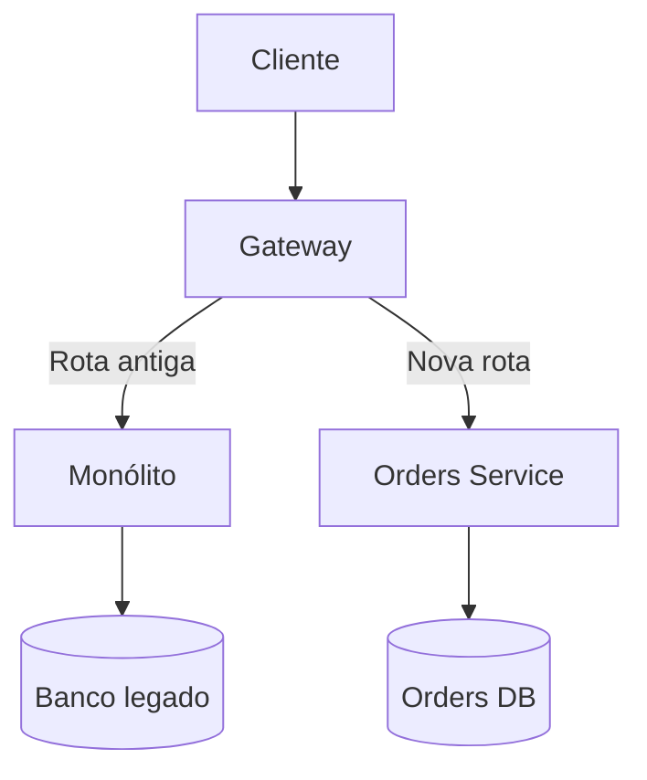
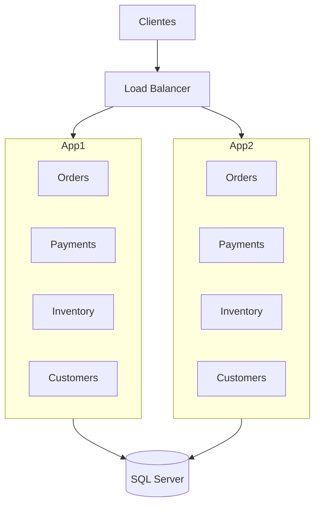
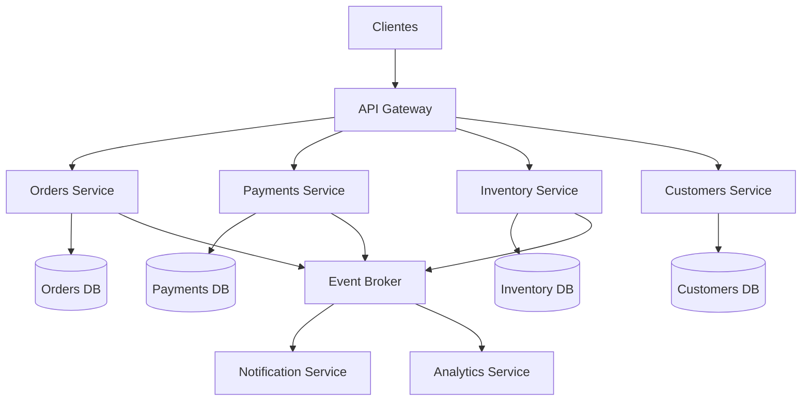
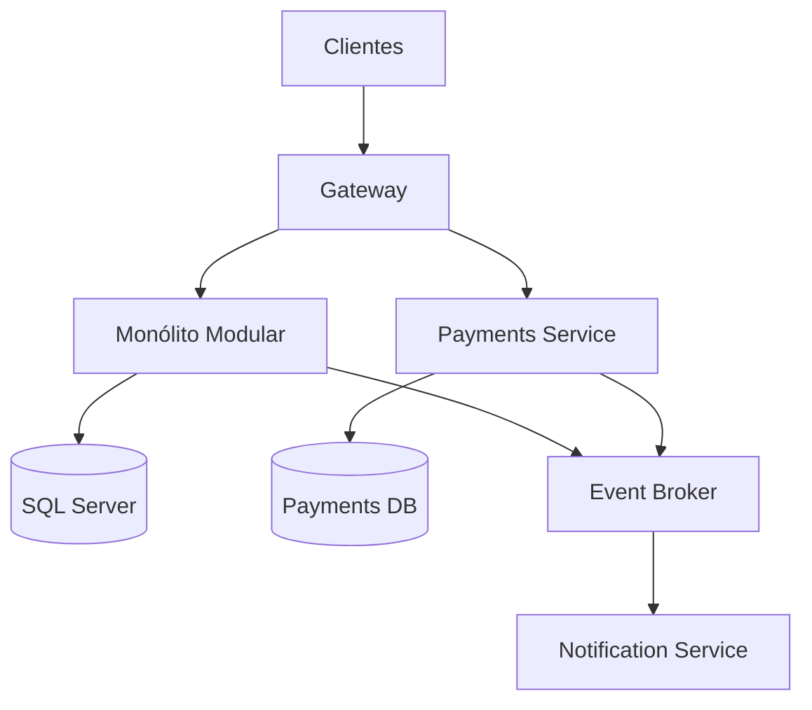

# Módulo 13 — Microserviços e Monólitos

A escolha entre monólito e microserviços é uma das decisões mais discutidas em arquitetura de software.

Essa decisão não deve ser baseada em moda, quantidade de desenvolvedores ou preferência tecnológica.

Ela deve considerar:

* Complexidade do domínio.
* Tamanho e maturidade da organização.
* Necessidade de escala independente.
* Frequência de mudanças.
* Requisitos de disponibilidade.
* Capacidade operacional.
* Autonomia das equipes.
* Custo de coordenação.
* Experiência com sistemas distribuídos.

Um monólito não é necessariamente uma arquitetura ruim.

Microserviços também não representam automaticamente uma arquitetura moderna ou escalável.

A pergunta correta não é:

```text
Monólito ou microserviços?
```

A pergunta correta é:

```text
Qual arquitetura oferece o melhor equilíbrio entre
simplicidade, autonomia, escala e custo para este sistema?
```

---

## Sumário

* [1. Visão geral](#1-visão-geral)
* [2. O que é um monólito](#2-o-que-é-um-monólito)
* [3. Tipos de monólito](#3-tipos-de-monólito)
* [4. Monólito modular](#4-monólito-modular)
* [5. O que são microserviços](#5-o-que-são-microserviços)
* [6. Princípios de microserviços](#6-princípios-de-microserviços)
* [7. Limites de domínio](#7-limites-de-domínio)
* [8. Independência de deployment](#8-independência-de-deployment)
* [9. Propriedade de dados](#9-propriedade-de-dados)
* [10. Comunicação entre serviços](#10-comunicação-entre-serviços)
* [11. Monólito versus microserviços](#11-monólito-versus-microserviços)
* [12. Complexidade funcional](#12-complexidade-funcional)
* [13. Desenvolvimento de features](#13-desenvolvimento-de-features)
* [14. Escalabilidade](#14-escalabilidade)
* [15. Onboarding](#15-onboarding)
* [16. Reutilização](#16-reutilização)
* [17. Observabilidade](#17-observabilidade)
* [18. Disponibilidade e falhas](#18-disponibilidade-e-falhas)
* [19. Consistência e transações](#19-consistência-e-transações)
* [20. Testes](#20-testes)
* [21. Deployments](#21-deployments)
* [22. Segurança](#22-segurança)
* [23. Performance e latência](#23-performance-e-latência)
* [24. Organização de equipes](#24-organização-de-equipes)
* [25. Custos](#25-custos)
* [26. Banco de dados compartilhado](#26-banco-de-dados-compartilhado)
* [27. Distributed Monolith](#27-distributed-monolith)
* [28. Granularidade dos serviços](#28-granularidade-dos-serviços)
* [29. Quando usar monólito](#29-quando-usar-monólito)
* [30. Quando usar microserviços](#30-quando-usar-microserviços)
* [31. Quando evitar microserviços](#31-quando-evitar-microserviços)
* [32. Estratégia de evolução](#32-estratégia-de-evolução)
* [33. Strangler Fig Pattern](#33-strangler-fig-pattern)
* [34. Extração de serviços](#34-extração-de-serviços)
* [35. Arquitetura de exemplo: monólito modular](#35-arquitetura-de-exemplo-monólito-modular)
* [36. Arquitetura de exemplo: microserviços](#36-arquitetura-de-exemplo-microserviços)
* [37. Exemplo em C#](#37-exemplo-em-c)
* [38. Trade-offs](#38-trade-offs)
* [39. Anti-patterns](#39-anti-patterns)
* [40. Checklist de decisão](#40-checklist-de-decisão)
* [41. Regras práticas](#41-regras-práticas)
* [42. Questões de entrevista](#42-questões-de-entrevista)
* [43. Exercício prático](#43-exercício-prático)
* [44. Resumo do módulo](#44-resumo-do-módulo)

---

# 1. Visão geral

Uma arquitetura monolítica concentra várias funcionalidades dentro de uma única aplicação implantável.

```text
Clientes
   |
   v
Monólito
   |
   +--> Usuários
   +--> Pedidos
   +--> Pagamentos
   +--> Estoque
   |
   v
Banco de dados
```

Uma arquitetura de microserviços distribui essas funcionalidades em serviços independentes.

```text
Clientes
   |
   v
API Gateway
   |
   +--> Users Service
   +--> Orders Service
   +--> Payments Service
   +--> Inventory Service
```

A principal diferença não é apenas o número de processos.

É o modelo de independência.

Microserviços buscam independência em:

* Desenvolvimento.
* Deployment.
* Escala.
* Dados.
* Falhas.
* Ciclo de vida.
* Decisão tecnológica.

Essa independência possui um custo.

```text
Mais independência
=
mais distribuição
+
mais coordenação
+
mais operação
```

---

# 2. O que é um monólito

Um monólito é uma aplicação implantada como uma única unidade.

Ela pode conter múltiplos módulos, camadas e domínios, mas normalmente é:

* Compilada em conjunto.
* Testada em conjunto.
* Implantada em conjunto.
* Escalada em conjunto.
* Executada em um único processo por instância.

Exemplo:

```text
ECommerce.Application
   |
   +--> Catalog
   +--> Orders
   +--> Payments
   +--> Customers
   +--> Shipping
```

Deployment:

```text
ecommerce-api:1.8.0
```

Se o módulo de catálogo mudar, uma nova versão da aplicação inteira é publicada.

## Características

* Uma unidade de deployment.
* Comunicação interna em memória.
* Transações locais mais simples.
* Observabilidade centralizada.
* Menor complexidade operacional.
* Escala normalmente conjunta.

---

# 3. Tipos de monólito

Nem todo monólito é igual.

## Monólito desorganizado

Também chamado de Big Ball of Mud.

```text
Controllers
   |
   +--> chamam qualquer service
   +--> acessam qualquer tabela
   +--> compartilham estado
   +--> criam dependências circulares
```

Características:

* Alto acoplamento.
* Pouca modularidade.
* Regras espalhadas.
* Banco usado diretamente por qualquer parte.
* Difícil testar.
* Difícil alterar.

## Monólito em camadas

```text
Presentation
    |
Application
    |
Domain
    |
Infrastructure
```

Possui separação técnica, mas nem sempre separação por domínio.

## Monólito modular

Organizado em módulos de negócio independentes.

```text
Monólito
   |
   +--> Orders Module
   +--> Payments Module
   +--> Inventory Module
   +--> Customers Module
```

Cada módulo possui:

* Regras próprias.
* Interfaces explícitas.
* Dados encapsulados.
* Baixo acoplamento.
* Alta coesão.

---

# 4. Monólito modular

O monólito modular combina a simplicidade operacional de um monólito com limites internos semelhantes aos de microserviços.



## Princípios

* Módulos alinhados ao domínio.
* Comunicação por interfaces.
* Nenhum módulo acessa internamente outro módulo.
* Tabelas podem ser separadas por schema.
* Dependências seguem regras explícitas.
* Eventos internos podem desacoplar módulos.

## Exemplo de schemas

```text
orders.Orders
orders.OrderItems

payments.Payments
payments.Refunds

inventory.Products
inventory.StockMovements
```

## Benefícios

* Deployment simples.
* Transações locais.
* Debugging mais fácil.
* Menor latência interna.
* Caminho claro para extração futura.
* Menor custo operacional.

## Desvantagens

* Escala conjunta.
* Falha do processo pode impactar tudo.
* Limites internos dependem de disciplina.
* Equipes podem criar acoplamento indevido.
* Releases continuam compartilhados.

> Um monólito modular é frequentemente uma boa arquitetura inicial para sistemas novos.

---

# 5. O que são microserviços

Microserviços são serviços pequenos e autônomos, organizados em torno de capacidades de negócio.

```text
Orders Service:
gerencia pedidos

Payments Service:
gerencia pagamentos

Inventory Service:
gerencia estoque
```

Cada serviço normalmente possui:

* Responsabilidade de negócio clara.
* Código próprio.
* Pipeline próprio.
* Deployment independente.
* Dados sob seu controle.
* Métricas e logs.
* Contratos explícitos.

## Arquitetura



---

# 6. Princípios de microserviços

## Organizados por capacidade de negócio

Evite serviços puramente técnicos como:

```text
Validation Service
Database Service
Utility Service
```

Prefira capacidades de negócio:

```text
Orders
Payments
Inventory
Shipping
```

## Deployment independente

Um serviço deve poder ser publicado sem exigir deployment simultâneo dos demais.

## Baixo acoplamento

Mudanças internas de um serviço não devem afetar outros, desde que o contrato seja mantido.

## Alta coesão

Tudo que pertence a uma capacidade deve permanecer próximo.

## Propriedade de dados

O serviço controla seus dados.

## Automação

Microserviços exigem:

* CI/CD.
* Testes.
* Observabilidade.
* Infraestrutura como código.
* Provisionamento.
* Deploy automatizado.

## Design for failure

Chamadas remotas podem falhar.

Todo serviço precisa lidar com:

* Timeout.
* Retry.
* Circuit breaker.
* Duplicação.
* Indisponibilidade.
* Consistência eventual.

---

# 7. Limites de domínio

Definir limites corretos é uma das tarefas mais difíceis.

Um microserviço não deve ser criado apenas com base em tabelas.

Exemplo inadequado:

```text
CustomerTableService
OrderTableService
ProductTableService
```

Prefira limites baseados em comportamentos e invariantes.

## Bounded Context

Em Domain-Driven Design, um bounded context define um limite em que um modelo possui significado consistente.

Exemplo:

```text
Catálogo:
produto representa item comercial

Estoque:
produto representa unidade armazenável

Entrega:
produto representa volume transportado
```

O mesmo conceito pode possuir modelos diferentes em cada contexto.

## Sinais de um bom limite

* Responsabilidade clara.
* Equipe consegue explicar o propósito.
* Poucas chamadas síncronas externas.
* Dados relacionados permanecem juntos.
* Mudanças costumam ocorrer dentro do mesmo serviço.
* Regras críticas não atravessam muitos serviços.

---

# 8. Independência de deployment

Deployment independente é um dos principais benefícios dos microserviços.

```text
Payments Service v4
```

pode ser publicado sem alterar:

```text
Orders Service v12
Inventory Service v8
```

## Para isso funcionar

* Contratos precisam ser compatíveis.
* Banco não deve ser compartilhado de forma acoplada.
* Mudanças de eventos devem ser versionadas.
* Consumers devem tolerar versões antigas e novas.
* Deploy não pode exigir coordenação global.

## Quando não existe independência

```text
Para publicar Orders:
é necessário publicar Payments, Inventory e Shipping
```

Isso indica um distributed monolith.

---

# 9. Propriedade de dados

Um princípio comum é:

> Cada microserviço deve possuir seus dados.

Exemplo:

```text
Orders Service --> Orders Database
Payments Service --> Payments Database
```

O Orders Service não deve executar:

```sql
SELECT *
FROM PaymentsDatabase.dbo.Payments;
```

Ele deve usar:

* API.
* Evento.
* Read model.
* Dados replicados.
* Contrato público.

## Por que evitar banco compartilhado

* Acoplamento de schema.
* Deploy coordenado.
* Mudanças perigosas.
* Segurança ampla.
* Falta de ownership.
* Consultas atravessando domínios.
* Locks entre serviços.

## Trade-off

Bancos separados introduzem:

* Consistência eventual.
* Duplicação de dados.
* Mensageria.
* Reconciliação.
* Sagas.
* Maior custo operacional.

---

# 10. Comunicação entre serviços

## Comunicação síncrona

Exemplos:

* HTTP.
* REST.
* gRPC.

```text
Orders Service
      |
      v
Payments Service
```

### Vantagens

* Resposta imediata.
* Fluxo fácil de compreender.
* Contratos diretos.

### Desvantagens

* Acoplamento temporal.
* Latência acumulada.
* Falhas em cascata.
* Menor disponibilidade composta.

## Comunicação assíncrona

Exemplos:

* Eventos.
* Filas.
* Streams.

```text
OrderCreated
      |
      v
Event Broker
      |
      +--> Inventory
      +--> Payments
      +--> Analytics
```

### Vantagens

* Menor acoplamento temporal.
* Absorção de picos.
* Maior resiliência.
* Processamento independente.

### Desvantagens

* Consistência eventual.
* Duplicação.
* Ordenação.
* Debugging complexo.
* Necessidade de idempotência.

---

# 11. Monólito versus microserviços

| Característica          | Monólito                  | Microserviços              |
| ----------------------- | ------------------------- | -------------------------- |
| Deployment              | Único                     | Independente               |
| Comunicação             | Em memória                | Rede                       |
| Transações              | Locais                    | Distribuídas               |
| Escala                  | Conjunta                  | Por serviço                |
| Observabilidade         | Mais simples              | Mais complexa              |
| Onboarding              | Repositório maior         | Ecossistema maior          |
| Falhas                  | Processo compartilhado    | Falhas distribuídas        |
| Operação                | Mais simples              | Mais complexa              |
| Consistência            | Mais simples              | Frequentemente eventual    |
| Autonomia               | Menor                     | Maior                      |
| Custo inicial           | Menor                     | Maior                      |
| Evolução organizacional | Limitada em grande escala | Favorece equipes autônomas |

---

# 12. Complexidade funcional

A complexidade funcional é a complexidade do problema de negócio.

Ela existe independentemente da arquitetura.

Exemplos:

* Regras de pagamento.
* Precificação.
* Reserva de estoque.
* Cancelamento.
* Tributação.
* Fraude.

Microserviços não removem essa complexidade.

Eles a distribuem.

```text
Complexidade do domínio
+
complexidade da distribuição
```

## Monólito

A complexidade tende a ficar concentrada.

Vantagem:

* Fluxo mais fácil de rastrear.

Risco:

* Código pode se tornar acoplado.

## Microserviços

A complexidade é dividida entre serviços.

Vantagem:

* Contextos menores.

Risco:

* Fluxo de negócio fica distribuído.
* Decisões atravessam rede, filas e bancos.

---

# 13. Desenvolvimento de features

Considere uma feature:

```text
Cliente cancela pedido e recebe reembolso.
```

## Em um monólito

```text
Orders Module
Payments Module
Notifications Module
```

A chamada pode ocorrer dentro do mesmo processo.

Vantagens:

* Debugging único.
* Transação local possível.
* Testes de integração mais simples.
* Menos contratos de rede.

Desvantagens:

* Mudança pode exigir deployment completo.
* Equipes podem conflitar no mesmo repositório.
* Acoplamento pode crescer.

## Em microserviços

```text
Orders Service
      |
      v
Payments Service
      |
      v
Notification Service
```

Vantagens:

* Serviços evoluem separadamente.
* Equipes possuem ownership.
* Cada serviço pode escalar individualmente.

Desvantagens:

* Contratos.
* Falhas parciais.
* Idempotência.
* SAGA.
* Consistência eventual.
* Testes distribuídos.

## Regra importante

Features que atravessam muitos serviços possuem maior custo de coordenação.

```text
Mais serviços envolvidos
=
mais comunicação
+
mais risco
+
mais tempo de entrega
```

---

# 14. Escalabilidade

## Monólito

O monólito normalmente escala como uma unidade.

```text
Load Balancer
   |
   +--> Monólito 1
   +--> Monólito 2
   +--> Monólito 3
```

Se apenas o catálogo exige mais capacidade, ainda assim toda a aplicação é replicada.

### Benefícios

* Escala horizontal simples para aplicações stateless.
* Menos componentes.
* Balanceamento direto.

### Desvantagens

* Escala funcionalidades pouco usadas.
* Maior consumo de recursos.
* Componentes pesados afetam o processo inteiro.

## Microserviços

Cada serviço escala independentemente.

```text
Orders:
5 instâncias

Catalog:
40 instâncias

Payments:
10 instâncias
```

### Benefícios

* Melhor uso de recursos.
* Escala alinhada ao workload.
* Tecnologias especializadas.

### Desvantagens

* Mais infraestrutura.
* Mais clusters, deployments e métricas.
* Planejamento de capacidade por serviço.
* Bancos também precisam escalar separadamente.

## Quando a escala independente importa

* Workloads muito diferentes.
* Um domínio recebe tráfego muito superior.
* Processamento de CPU intensivo.
* Necessidade de isolamento.
* Custos relevantes de infraestrutura.

---

# 15. Onboarding

Onboarding é o processo de integrar novos desenvolvedores.

## Onboarding em monólito

### Vantagens

* Um repositório.
* Uma forma de executar.
* Um pipeline.
* Um ambiente local.
* Fluxo centralizado.

### Desvantagens

* Codebase grande.
* Muitas regras.
* Build demorado.
* Difícil identificar ownership.
* Alteração pode afetar muitas áreas.

## Onboarding em microserviços

### Vantagens

* Serviço menor.
* Contexto mais limitado.
* Equipe possui domínio claro.
* Código local mais simples.

### Desvantagens

O desenvolvedor precisa compreender:

* Service discovery.
* Mensageria.
* Tracing.
* CI/CD.
* Containers.
* Kubernetes.
* Contratos.
* Ambientes distribuídos.
* Observabilidade.
* Segurança entre serviços.

Mesmo que um repositório seja pequeno, o sistema total pode ser muito mais difícil de compreender.

## Paradoxo

```text
Codebase menor
!=
sistema mais simples
```

---

# 16. Reutilização

Reutilização pode ocorrer de diferentes formas.

## Bibliotecas compartilhadas

```text
Company.Logging
Company.Authentication
Company.Observability
```

### Vantagens

* Menos duplicação.
* Padronização.
* Atualização comum.

### Desvantagens

* Acoplamento por versão.
* Atualizações coordenadas.
* Dependência de plataforma.
* Biblioteca pode se tornar muito genérica.

## Reutilização por serviço

```text
Tax Service
Identity Service
Notification Service
```

### Vantagens

* Comportamento centralizado.
* Regras consistentes.
* Evolução independente.

### Desvantagens

* Chamada de rede.
* Dependência de disponibilidade.
* Latência.
* Gargalo.
* Acoplamento temporal.

## Regra prática

Reutilize:

* Capacidades de negócio estáveis.
* Infraestrutura comum.
* Contratos bem definidos.

Evite criar um microserviço apenas para evitar duplicar poucas linhas de código.

> Duplicação pequena pode ser mais barata que um acoplamento distribuído permanente.

---

# 17. Observabilidade

## Monólito

Fluxo:

```text
Request
   |
   v
Um processo
   |
   v
Banco
```

Logs e erros costumam estar concentrados.

### Vantagens

* Stack trace único.
* Menos serviços.
* Correlação mais simples.
* Menos dashboards.

### Desvantagens

* Alto volume de logs no mesmo lugar.
* Pode ser difícil separar módulos.
* Problemas internos podem se misturar.

## Microserviços

Fluxo:

```text
Gateway
   |
   v
Orders
   |
   v
Payments
   |
   v
Broker
   |
   v
Notifications
```

É necessário correlacionar:

* Logs.
* Métricas.
* Traces.
* Eventos.
* Retries.
* Erros.
* IDs de mensagens.

## Tracing distribuído

```text
TraceId: abc-123

Gateway Span
Orders Span
Payments Span
Database Span
```

## Requisitos mínimos

* Correlation ID.
* Trace ID.
* Structured logging.
* Métricas por serviço.
* Distributed tracing.
* Dashboards.
* Alertas.
* Service maps.

> Microserviços sem observabilidade adequada são difíceis de operar.

---

# 18. Disponibilidade e falhas

## Monólito

Uma falha crítica pode afetar o processo inteiro.

Exemplo:

```text
Memory leak no módulo de relatórios
      |
      v
Monólito inteiro reinicia
```

Entretanto, existem menos dependências de rede internas.

## Microserviços

Uma falha pode ser isolada.

```text
Recommendation Service indisponível
      |
      v
Checkout continua funcionando
```

Isso exige graceful degradation.

## Falhas em cascata

```text
Orders chama Payments
Payments chama Fraud
Fraud está lento
```

Consequência:

```text
Fraud lento
  |
  v
Payments lento
  |
  v
Orders lento
  |
  v
Gateway saturado
```

Mitigações:

* Timeout.
* Circuit breaker.
* Bulkhead.
* Retry controlado.
* Fallback.
* Load shedding.
* Processamento assíncrono.

---

# 19. Consistência e transações

## Monólito com banco único

Pode utilizar uma transação local.

```sql
BEGIN TRANSACTION;

INSERT INTO Orders (...);
UPDATE Inventory (...);
INSERT INTO Payments (...);

COMMIT;
```

### Benefícios

* Atomicidade.
* Consistência imediata.
* Rollback.
* Modelo simples.

## Microserviços

Cada serviço possui banco próprio.

```text
Orders DB
Inventory DB
Payments DB
```

Uma operação global exige:

* SAGA.
* Outbox.
* Eventos.
* Compensação.
* Idempotência.
* Reconciliação.

## Exemplo

```text
Pedido criado
      |
      v
Estoque reservado
      |
      v
Pagamento falha
      |
      v
Estoque liberado
      |
      v
Pedido cancelado
```

## Trade-off

```text
Transação local:
mais simples e consistente

Transação distribuída:
mais autonomia e disponibilidade,
mas maior complexidade
```

---

# 20. Testes

## Monólito

### Testes unitários

Testam classes e módulos.

### Testes de integração

Podem executar aplicação e banco juntos.

### Testes end-to-end

Menos componentes distribuídos.

### Benefícios

* Ambiente mais fácil.
* Menos mocks remotos.
* Execução local simples.
* Debugging direto.

## Microserviços

Exigem múltiplos níveis:

* Unit tests.
* Integration tests.
* Contract tests.
* Component tests.
* End-to-end tests.
* Chaos tests.
* Testes de compatibilidade.
* Testes de mensageria.

## Contract testing

Consumer e provider validam contratos.

Exemplo:

```text
Orders espera:
POST /payments

Payments garante:
request e response compatíveis
```

## Problema dos testes end-to-end

Quanto mais serviços:

* Mais ambientes.
* Mais instabilidade.
* Mais dados de teste.
* Mais tempo.
* Mais falso negativo.
* Mais dificuldade de reprodução.

---

# 21. Deployments

## Monólito

```text
Build
  |
  v
Deploy da aplicação inteira
```

### Vantagens

* Um pipeline.
* Uma versão.
* Rollback central.
* Menor coordenação operacional.

### Desvantagens

* Qualquer mudança publica tudo.
* Deploy pode ser maior.
* Falha afeta várias funcionalidades.
* Equipes compartilham janela de release.

## Microserviços

```text
Orders v10
Payments v7
Inventory v22
```

### Vantagens

* Releases independentes.
* Menor blast radius.
* Deploy específico.
* Canary por serviço.

### Desvantagens

* Muitas versões simultâneas.
* Compatibilidade de contratos.
* Pipelines numerosos.
* Ambientes difíceis de reproduzir.
* Rollback distribuído.

## Zero-downtime

Exige:

* Rolling deploy.
* Readiness checks.
* Connection draining.
* Schema compatível.
* Contratos backward-compatible.
* Feature flags.

---

# 22. Segurança

## Monólito

O controle pode ocorrer em um único ponto.

```text
Authentication
Authorization
Application
```

### Benefícios

* Menos comunicação de rede.
* Menos credenciais internas.
* Menor superfície.

### Riscos

* Comprometimento do processo pode expor tudo.
* Permissões internas podem ser amplas.

## Microserviços

Cada comunicação precisa ser protegida.

```text
Service A
   |
   | mTLS + token
   v
Service B
```

Requisitos:

* Service identity.
* mTLS.
* Secrets management.
* Authorization.
* Network policies.
* Rotação de credenciais.
* Auditoria.

## Superfície de ataque

Mais serviços significam:

* Mais endpoints.
* Mais imagens.
* Mais dependências.
* Mais secrets.
* Mais configurações.
* Mais políticas.

---

# 23. Performance e latência

## Monólito

Chamadas internas são realizadas em memória.

```text
Método A chama Método B
```

Latência:

```text
nanosegundos ou microssegundos
```

## Microserviços

Chamadas atravessam rede.

```text
Serialização
+
TLS
+
Load balancer
+
Rede
+
Desserialização
```

Uma chamada pode custar milissegundos.

## Chattiness

Exemplo ruim:

```text
Orders Service chama Inventory 100 vezes,
uma vez para cada item.
```

Melhor:

```text
Uma chamada em lote:
CheckAvailability(productIds)
```

## Latência acumulada

```text
Gateway:   5 ms
Orders:   20 ms
Inventory: 30 ms
Payments: 80 ms
----------------
Total:    135 ms ou mais
```

Chamadas sequenciais acumulam latência.

---

# 24. Organização de equipes

A arquitetura de software tende a refletir a comunicação da organização.

## Monólito

Pode funcionar bem quando:

* Equipe pequena.
* Domínio ainda evoluindo.
* Decisões centralizadas.
* Releases coordenados são aceitáveis.

## Microserviços

Podem funcionar bem quando:

* Existem várias equipes autônomas.
* Cada equipe possui domínio claro.
* Existe ownership de ponta a ponta.
* Há plataforma e automação.
* Deploy independente traz valor.

## Team ownership

Uma equipe deve cuidar de:

* Código.
* Testes.
* Deploy.
* Operação.
* Alertas.
* Banco.
* Segurança.
* Incidentes.

```text
You build it, you run it.
```

## Risco

Criar microserviços sem autonomia de equipe apenas aumenta o número de componentes.

---

# 25. Custos

## Monólito

Custos comuns:

* Menos pipelines.
* Menos clusters.
* Menos observabilidade distribuída.
* Menos ambientes.
* Menor equipe de plataforma.

Pode desperdiçar recursos ao escalar tudo conjuntamente.

## Microserviços

Custos comuns:

* Containers.
* Kubernetes.
* Service mesh.
* Brokers.
* Bancos por serviço.
* Logs.
* Tracing.
* CI/CD.
* Secret managers.
* Network traffic.
* Equipe de plataforma.

## Custo humano

Frequentemente é maior que o custo de infraestrutura.

Exemplos:

* Mais reuniões.
* Mais contratos.
* Mais incidentes.
* Mais coordenação.
* Mais conhecimento necessário.
* Mais tempo de debugging.

---

# 26. Banco de dados compartilhado

Um banco compartilhado por microserviços é uma solução comum durante transições.

```text
Orders Service
Payments Service
Inventory Service
      |
      v
Banco compartilhado
```

## Benefícios

* Menos bancos.
* Transações mais simples.
* Menor custo.
* Migração gradual.

## Riscos

* Serviços acessam tabelas uns dos outros.
* Mudanças exigem coordenação.
* Ownership fica indefinido.
* Locks atravessam domínios.
* Escala permanece acoplada.

## Opção intermediária

Mesmo banco físico, schemas separados.

```text
orders.*
payments.*
inventory.*
```

Regras:

* Cada serviço acessa apenas seu schema.
* Comunicação entre domínios ocorre por contrato.
* Permissões de banco reforçam o limite.
* Migração futura permanece possível.

---

# 27. Distributed Monolith

Distributed monolith é um sistema distribuído que possui os custos de microserviços, mas não possui sua independência.

Sinais:

* Deploy coordenado.
* Banco compartilhado.
* Chamadas síncronas em cadeia.
* Serviços extremamente acoplados.
* Testes exigem todo o ambiente.
* Mudança em um contrato quebra vários serviços.
* Uma feature exige alterar muitos repositórios.

Arquitetura:

```text
Service A
   |
   v
Service B
   |
   v
Service C
   |
   v
Service D
```

Se `Service C` falhar:

```text
todo o fluxo falha
```

## Por que é ruim

Possui:

* Latência de rede.
* Falhas distribuídas.
* Deploy complexo.
* Observabilidade difícil.
* Consistência eventual.

Mas não possui:

* Autonomia.
* Isolamento.
* Deploy independente.
* Evolução separada.

---

# 28. Granularidade dos serviços

Microserviço não significa “serviço minúsculo”.

Um serviço deve ser pequeno o suficiente para ter foco, mas grande o suficiente para possuir uma capacidade significativa.

## Serviço muito grande

```text
Commerce Service
```

contendo:

* Catálogo.
* Pedidos.
* Pagamentos.
* Estoque.
* Entrega.

Pode se tornar um monólito distribuído.

## Serviço pequeno demais

```text
OrderCreation Service
OrderCancellation Service
OrderValidation Service
OrderStatus Service
```

Problemas:

* Muitas chamadas.
* Muitas transações distribuídas.
* Grande custo operacional.
* Feature atravessa vários serviços.

## Heurística

Um serviço deve:

* Possuir regras próprias.
* Possuir dados próprios.
* Possuir ciclo de mudança coerente.
* Ser operável por uma equipe.
* Evitar chamadas excessivas.

---

# 29. Quando usar monólito

Monólito costuma ser uma boa escolha quando:

* Produto está no início.
* Domínio ainda não está claro.
* Equipe é pequena.
* Escala atual é moderada.
* Time-to-market é importante.
* Operação simples é prioridade.
* Transações fortes são frequentes.
* Não existe plataforma madura.
* Deploy conjunto é aceitável.

## Arquitetura recomendada

```text
Monólito modular
+
módulos por domínio
+
interfaces explícitas
+
schemas separados
+
eventos internos
+
boa observabilidade
```

---

# 30. Quando usar microserviços

Microserviços podem ser adequados quando:

* Existem múltiplas equipes.
* Limites do domínio estão claros.
* Serviços precisam escalar de forma diferente.
* Deploy independente gera valor.
* Alguns domínios exigem isolamento.
* Tecnologias diferentes são justificadas.
* Disponibilidade por domínio é importante.
* Organização possui maturidade operacional.
* Automação e observabilidade já existem.

## Exemplo

```text
Video Processing:
alto uso de CPU

Catalog:
alto volume de leitura

Payments:
forte consistência e segurança

Notifications:
processamento assíncrono
```

Esses workloads podem se beneficiar de serviços separados.

---

# 31. Quando evitar microserviços

Evite ou adie microserviços quando:

* Equipe possui poucos desenvolvedores.
* Domínio muda constantemente.
* Não existem limites claros.
* Deploy ainda é manual.
* Não há tracing distribuído.
* Não há monitoramento adequado.
* Testes são frágeis.
* Não existe ownership.
* O principal problema ainda é encontrar product-market fit.
* Escala independente não é necessária.

## Sinal de alerta

```text
Queremos microserviços porque grandes empresas usam.
```

Grandes empresas normalmente usam microserviços para resolver problemas organizacionais e de escala que talvez não existam em uma empresa menor.

---

# 32. Estratégia de evolução

Uma abordagem segura:

```text
1. Começar com monólito modular.
2. Medir gargalos.
3. Identificar limites estáveis.
4. Extrair apenas módulos que precisam.
5. Manter o restante no monólito.
```

## Extração orientada por necessidade

Motivos válidos:

* Escala independente.
* Equipe independente.
* Requisito de segurança.
* Disponibilidade específica.
* Tecnologia especializada.
* Ciclo de mudança diferente.
* Gargalo real.

Motivo fraco:

```text
O módulo possui muitas classes.
```

---

# 33. Strangler Fig Pattern

Strangler Fig é um padrão de migração gradual.

```text
Cliente
   |
   v
Gateway
   |
   +--> Monólito
   +--> Novo Serviço
```

No início:

```text
100% --> Monólito
```

Depois:

```text
/orders --> Orders Service
/restante --> Monólito
```

Gradualmente, novas capacidades substituem partes antigas.

## Fluxo



## Benefícios

* Migração incremental.
* Menor risco.
* Rollback mais simples.
* Valor entregue gradualmente.

## Desafios

* Dados duplicados.
* Sincronização.
* Rotas temporárias.
* Compatibilidade.
* Operação híbrida.

---

# 34. Extração de serviços

Uma sequência possível:

## 1. Identificar módulo

Exemplo:

```text
Notifications
```

## 2. Definir contrato

```text
SendNotification
NotificationSent
NotificationFailed
```

## 3. Encapsular no monólito

Criar uma interface interna antes de extrair.

```csharp
public interface INotificationModule
{
    Task SendAsync(
        NotificationRequest request,
        CancellationToken cancellationToken);
}
```

## 4. Remover acesso direto a dados

Outros módulos passam a utilizar apenas a interface.

## 5. Extrair processo

A implementação muda de chamada local para:

* HTTP.
* gRPC.
* Mensageria.

## 6. Migrar dados

Definir ownership e sincronização.

## 7. Observar

Monitorar:

* Latência.
* Erros.
* Backlog.
* Throughput.
* Custos.

---

# 35. Arquitetura de exemplo: monólito modular



## Características

* Aplicação stateless.
* Escala horizontal.
* Módulos internos.
* Banco compartilhado com schemas separados.
* Transações locais.
* Deployment único.

## Bom para

* Equipe pequena ou média.
* Produto em evolução.
* Domínio com transações fortes.
* Operação simplificada.

---

# 36. Arquitetura de exemplo: microserviços



## Características

* Deploy independente.
* Escala independente.
* Dados por serviço.
* Mensageria.
* Consistência eventual.
* Observabilidade distribuída.
* Maior custo operacional.

---

# 37. Exemplo em C#

## Estrutura de monólito modular

```text
src/
  ECommerce.Api/
  Modules/
    Orders/
      Orders.Application/
      Orders.Domain/
      Orders.Infrastructure/
      Orders.Contracts/
    Payments/
      Payments.Application/
      Payments.Domain/
      Payments.Infrastructure/
      Payments.Contracts/
    Inventory/
      Inventory.Application/
      Inventory.Domain/
      Inventory.Infrastructure/
      Inventory.Contracts/
```

## Contrato entre módulos

```csharp
public sealed record ReserveStockCommand(
    long OrderId,
    IReadOnlyCollection<ReserveStockItem> Items);

public sealed record ReserveStockItem(
    long ProductId,
    int Quantity);

public interface IInventoryModule
{
    Task<ReserveStockResult> ReserveAsync(
        ReserveStockCommand command,
        CancellationToken cancellationToken);
}
```

O módulo de pedidos não acessa diretamente o banco de estoque.

```csharp
public sealed class CreateOrderHandler
{
    private readonly IOrderRepository _orders;
    private readonly IInventoryModule _inventory;

    public CreateOrderHandler(
        IOrderRepository orders,
        IInventoryModule inventory)
    {
        _orders = orders;
        _inventory = inventory;
    }

    public async Task<long> HandleAsync(
        CreateOrderCommand command,
        CancellationToken cancellationToken)
    {
        var order = Order.Create(
            command.CustomerId,
            command.Items);

        var reservation =
            await _inventory.ReserveAsync(
                new ReserveStockCommand(
                    order.Id,
                    command.Items
                        .Select(item =>
                            new ReserveStockItem(
                                item.ProductId,
                                item.Quantity))
                        .ToArray()),
                cancellationToken);

        if (!reservation.Success)
        {
            throw new InvalidOperationException(
                "Stock reservation failed.");
        }

        await _orders.AddAsync(
            order,
            cancellationToken);

        return order.Id;
    }
}
```

## Evolução futura

A implementação de `IInventoryModule` pode inicialmente ser local.

Depois, pode ser substituída por um cliente HTTP ou mensageria.

```text
Antes:
IInventoryModule --> chamada local

Depois:
IInventoryModule --> Inventory Service
```

O contrato reduz o acoplamento da migração.

---

# 38. Trade-offs

## Simplicidade versus autonomia

| Monólito             | Microserviços       |
| -------------------- | ------------------- |
| Mais simples         | Mais autonomia      |
| Menos infraestrutura | Mais componentes    |
| Deploy único         | Deploy independente |
| Menos falhas de rede | Mais isolamento     |

## Consistência versus independência

| Banco único       | Banco por serviço     |
| ----------------- | --------------------- |
| Transações locais | Autonomia             |
| Menor duplicação  | Consistência eventual |
| Joins simples     | APIs e eventos        |
| Schema acoplado   | Ownership claro       |

## Performance versus isolamento

| Monólito            | Microserviços       |
| ------------------- | ------------------- |
| Chamadas em memória | Chamadas de rede    |
| Menor latência      | Isolamento          |
| Menos serialização  | Escala independente |
| Falha compartilhada | Falha localizada    |

## Velocidade inicial versus escala organizacional

| Monólito                        | Microserviços              |
| ------------------------------- | -------------------------- |
| Entrega inicial rápida          | Equipes autônomas          |
| Menor custo                     | Crescimento organizacional |
| Menos contratos                 | Mais ownership             |
| Pode dificultar evolução tardia | Maior custo inicial        |

---

# 39. Anti-patterns

## Microserviço por tabela

```text
UsersTableService
OrdersTableService
ProductsTableService
```

O limite deve ser de negócio, não de persistência.

## Nano-services

Serviços pequenos demais.

```text
ValidateOrderService
CalculateOrderTotalService
SaveOrderService
```

Aumentam:

* Latência.
* Deployments.
* Contratos.
* Incidentes.

## Shared database sem ownership

Todos acessam todas as tabelas.

Resultado:

```text
Acoplamento de monólito
+
complexidade distribuída
```

## Shared library de domínio

Todos os serviços dependem da mesma biblioteca de entidades.

```text
Company.Domain.Models
```

Isso cria deploy coordenado por versão.

## Chatty services

Muitas chamadas pequenas entre serviços.

```text
100 itens
=
100 chamadas de rede
```

## Eventos como RPC assíncrono

Um serviço publica evento esperando resposta imediata e acoplada.

Isso pode apenas esconder uma chamada síncrona.

## Tecnologia diferente por serviço sem necessidade

```text
10 serviços
10 linguagens
10 bancos
```

Poliglotismo aumenta custo.

Use tecnologia diferente quando o benefício justificar.

---

# 40. Checklist de decisão

## Domínio

* [ ] Os limites de domínio estão claros?
* [ ] Existem bounded contexts estáveis?
* [ ] As regras atravessam muitos módulos?
* [ ] Transações fortes são frequentes?

## Equipe

* [ ] Quantas equipes existem?
* [ ] Cada equipe possui ownership?
* [ ] Existe autonomia de deployment?
* [ ] Existe suporte de plataforma?
* [ ] A equipe entende sistemas distribuídos?

## Escala

* [ ] Os módulos possuem workloads diferentes?
* [ ] Escala independente reduz custo?
* [ ] Existe gargalo real?
* [ ] O monólito já escala horizontalmente?

## Operação

* [ ] Existe CI/CD?
* [ ] Existe infraestrutura como código?
* [ ] Existe tracing distribuído?
* [ ] Logs são centralizados?
* [ ] Alertas estão definidos?
* [ ] Existe gestão de secrets?

## Dados

* [ ] Cada serviço pode possuir seus dados?
* [ ] Consistência eventual é aceitável?
* [ ] Existem compensações?
* [ ] Existe estratégia de migração?
* [ ] Outbox e idempotência estão planejados?

## Custo

* [ ] O benefício supera o custo operacional?
* [ ] Mais bancos são aceitáveis?
* [ ] Mais pipelines são aceitáveis?
* [ ] O time consegue operar múltiplos serviços?
* [ ] Existe orçamento para observabilidade?

---

# 41. Regras práticas

1. Não escolha microserviços por moda.

2. Comece pelo domínio, não pela infraestrutura.

3. Um monólito bem modularizado é uma arquitetura válida.

4. Monólito não significa código desorganizado.

5. Microserviço não significa serviço minúsculo.

6. Deployment independente é mais importante que processo separado.

7. Cada serviço deve possuir responsabilidade clara.

8. Cada serviço deve controlar seus dados.

9. Banco compartilhado reduz autonomia.

10. Chamadas remotas sempre podem falhar.

11. Microserviços exigem timeouts e circuit breakers.

12. Operações distribuídas exigem idempotência.

13. Transações entre serviços geralmente exigem SAGA.

14. Observabilidade distribuída é obrigatória.

15. Evite cadeias longas de chamadas síncronas.

16. Use comunicação assíncrona quando o domínio permitir.

17. Não extraia um serviço apenas para reutilizar código.

18. Duplicação pequena pode ser aceitável.

19. Um serviço deve possuir alta coesão e baixo acoplamento.

20. Monólito modular é um bom ponto de partida.

21. Extraia serviços com base em necessidade comprovada.

22. Use Strangler Fig para migração gradual.

23. Evite distributed monolith.

24. Não permita acesso direto ao banco de outro serviço.

25. A arquitetura deve acompanhar a maturidade da organização.

---

# 42. Questões de entrevista

## O que é um monólito?

É uma aplicação implantada como uma única unidade, mesmo que internamente possua diversos módulos.

## O que é um monólito modular?

É um monólito organizado em módulos de negócio com limites, interfaces e ownership de dados bem definidos.

## O que caracteriza um microserviço?

Responsabilidade de negócio clara, deployment independente, dados próprios, contrato explícito e capacidade de evolução autônoma.

## Quais são os principais benefícios dos microserviços?

Escala independente, autonomia de equipes, isolamento de falhas, deployments independentes e evolução tecnológica por domínio.

## Quais são os principais custos?

Comunicação de rede, consistência eventual, observabilidade distribuída, múltiplos deployments, mais infraestrutura e maior complexidade operacional.

## Microserviços são sempre mais escaláveis?

Não. Um monólito stateless pode escalar horizontalmente. Microserviços ajudam quando partes do sistema precisam escalar de forma diferente.

## Quando escolher monólito?

Quando a equipe é pequena, o domínio ainda está evoluindo, o custo operacional deve ser baixo e transações locais são importantes.

## Quando escolher microserviços?

Quando os limites do domínio estão claros, múltiplas equipes precisam de autonomia e existem necessidades reais de escala ou isolamento.

## O que é um distributed monolith?

É um conjunto de serviços distribuídos que dependem fortemente uns dos outros, exigem deploy coordenado e não possuem autonomia real.

## Por que banco compartilhado é problemático?

Porque cria acoplamento de schema, mudanças coordenadas, falta de ownership e dependências ocultas entre serviços.

## Microserviços devem usar bancos diferentes?

Cada serviço deve possuir seus dados. Isso pode significar bancos físicos diferentes ou, temporariamente, schemas isolados com ownership claro.

## O que é Strangler Fig Pattern?

É uma estratégia de substituir gradualmente funcionalidades de um sistema antigo por novos serviços, roteando partes do tráfego para a nova implementação.

## Como microserviços afetam latência?

Chamadas em memória são substituídas por chamadas de rede, adicionando serialização, TLS, roteamento e risco de timeout.

## Como microserviços afetam observabilidade?

Exigem logs estruturados, métricas por serviço, tracing distribuído, correlation IDs e visão ponta a ponta.

## Por que microserviços podem dificultar onboarding?

Porque, embora cada repositório seja menor, o desenvolvedor precisa compreender uma infraestrutura distribuída e vários contratos.

## Como definir o tamanho de um serviço?

Pelo limite de uma capacidade de negócio, coesão, ownership dos dados e ciclo de mudança, não por quantidade de classes ou tabelas.

---

# 43. Exercício prático

Considere uma plataforma de e-commerce com:

```text
- 20 desenvolvedores.
- 3 equipes.
- Catálogo.
- Pedidos.
- Pagamentos.
- Estoque.
- Entregas.
- Notificações.
- 5 mil requisições por segundo.
- Catálogo recebe 80% do tráfego.
- Pagamentos exigem forte segurança.
- Estoque e pedido precisam de coordenação.
- Deploy atual ocorre uma vez por semana.
- Equipe possui pouca experiência com Kubernetes.
```

## Perguntas

* Monólito ou microserviços?
* Quais módulos devem existir?
* Qual módulo poderia ser extraído primeiro?
* Catálogo precisa escalar separadamente?
* Pagamentos devem ficar isolados?
* Banco pode continuar compartilhado?
* Como garantir limites?
* Como organizar as equipes?
* Qual estratégia de migração?
* Quais riscos operacionais existem?

## Estratégia possível

Começar ou permanecer com um monólito modular:

```text
ECommerce Monolith
   |
   +--> Catalog
   +--> Orders
   +--> Inventory
   +--> Payments
   +--> Shipping
   +--> Notifications
```

Usar:

* Interfaces internas.
* Schemas separados.
* Eventos internos.
* Pipelines automatizados.
* Observabilidade.
* Testes por módulo.

## Primeira extração possível

Notifications pode ser um bom candidato porque:

* É naturalmente assíncrono.
* Possui baixo acoplamento transacional.
* Pode consumir eventos.
* Falhas podem ser retentadas.
* Pode escalar separadamente.

```text
Monólito
   |
   v
OrderCreated
   |
   v
Broker
   |
   v
Notification Service
```

## Catálogo

Pode ser extraído quando:

* A escala independente trouxer benefício.
* O modelo estiver estável.
* A equipe possuir maturidade.
* A leitura puder ser desacoplada.

Antes disso, cache e réplicas podem resolver o gargalo.

## Pagamentos

Pode ser extraído por motivos de:

* Segurança.
* Compliance.
* Isolamento.
* Ownership.
* Ciclo de release.

Porém, exige:

* Idempotência.
* Outbox.
* SAGA.
* Auditoria.
* Observabilidade.
* Alta disponibilidade.

## Arquitetura evolutiva



## Principal decisão

O sistema não precisa migrar tudo ao mesmo tempo.

Uma arquitetura híbrida pode manter:

* Domínios simples no monólito.
* Domínios com necessidades específicas em serviços separados.

---

# 44. Resumo do módulo

```text
Monólito
 |
 +--> deployment único
 +--> chamadas em memória
 +--> transações simples
 +--> operação simples
 +--> escala conjunta
```

```text
Microserviços
 |
 +--> deployments independentes
 +--> escala independente
 +--> ownership por domínio
 +--> falhas distribuídas
 +--> consistência eventual
 +--> operação complexa
```

## Comparação central

```text
Monólito:
otimiza simplicidade

Microserviços:
otimizam autonomia
```

## Estratégia recomendada

```text
Começar simples
+
criar limites de domínio
+
medir gargalos
+
automatizar operação
+
extrair apenas quando necessário
```

A principal ideia é:

> Microserviços não eliminam complexidade. Eles trocam complexidade interna por complexidade distribuída.

Antes de escolher microserviços, a organização deve responder:

```text
Precisamos de escala independente?
Precisamos de deployment independente?
Os limites do domínio estão claros?
Temos observabilidade?
Temos automação?
Temos equipes com ownership?
Aceitamos consistência eventual?
Conseguimos operar sistemas distribuídos?
```

Quando essas respostas não são claras, um monólito modular costuma ser uma escolha mais segura.
