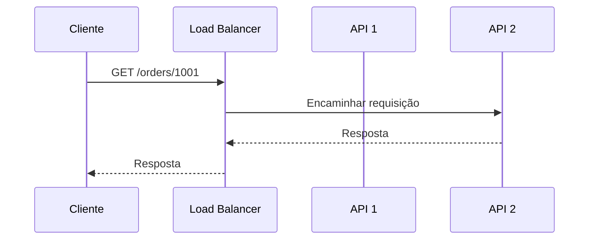
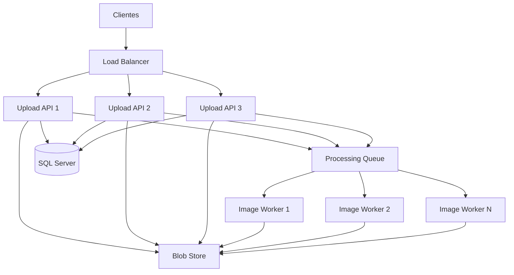
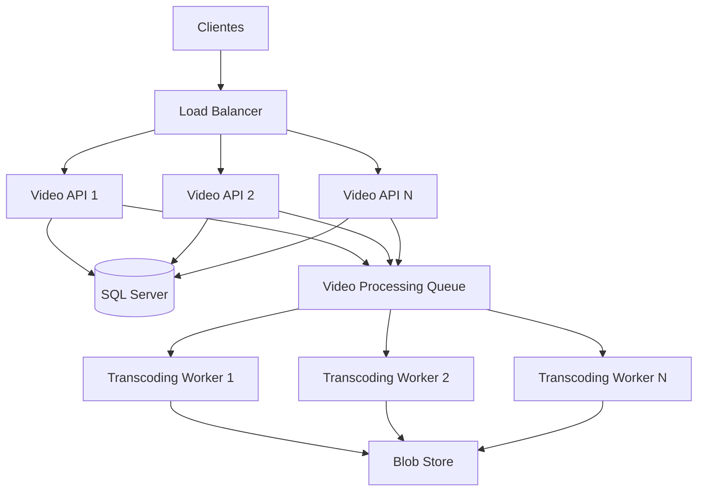

# Módulo 14 — Deploys e Escalabilidade

Deploy e escalabilidade estão diretamente relacionados.

Uma aplicação pode funcionar perfeitamente com poucos usuários, mas apresentar falhas quando:

* O tráfego aumenta.
* O banco fica lento.
* A CPU atinge o limite.
* A memória se esgota.
* O pool de conexões fica saturado.
* A fila acumula mensagens.
* Novas instâncias demoram para iniciar.
* Um servidor fica indisponível.
* Um deployment reduz temporariamente a capacidade.

Por isso, escalar um sistema não significa apenas adicionar servidores.

É necessário entender:

* Qual recurso está saturado.
* Qual componente limita o sistema.
* Como distribuir o tráfego.
* Como novas instâncias são iniciadas.
* Como o sistema se comporta durante deploys.
* Quais métricas devem controlar o autoscaling.
* Como evitar transferir o gargalo para outro componente.

Este módulo apresenta:

* Load balancers.
* Workloads I/O-bound e CPU-bound.
* Containers.
* Cold starts.
* Escalabilidade vertical.
* Escalabilidade horizontal.
* Autoscaling.
* Escala baseada em CPU, memória, I/O, requests e mensagens em fila.
* Deployments sem indisponibilidade.
* Exemplos com ASP.NET Core.

---

## Sumário

* [1. Visão geral](#1-visão-geral)
* [2. O que significa escalar](#2-o-que-significa-escalar)
* [3. Capacidade, throughput e latência](#3-capacidade-throughput-e-latência)
* [4. Identificando o gargalo](#4-identificando-o-gargalo)
* [5. Load balancer](#5-load-balancer)
* [6. Como um load balancer funciona](#6-como-um-load-balancer-funciona)
* [7. Algoritmos de balanceamento](#7-algoritmos-de-balanceamento)
* [8. Round robin](#8-round-robin)
* [9. Weighted round robin](#9-weighted-round-robin)
* [10. Least connections](#10-least-connections)
* [11. Least response time](#11-least-response-time)
* [12. Hash e consistent hashing](#12-hash-e-consistent-hashing)
* [13. Load balancer de camada 4 e camada 7](#13-load-balancer-de-camada-4-e-camada-7)
* [14. Health checks](#14-health-checks)
* [15. Liveness e readiness](#15-liveness-e-readiness)
* [16. Sticky sessions](#16-sticky-sessions)
* [17. Aplicações stateless](#17-aplicações-stateless)
* [18. I/O-bound](#18-io-bound)
* [19. CPU-bound](#19-cpu-bound)
* [20. Comparação entre I/O-bound e CPU-bound](#20-comparação-entre-io-bound-e-cpu-bound)
* [21. Async em workloads I/O-bound](#21-async-em-workloads-io-bound)
* [22. Paralelismo em workloads CPU-bound](#22-paralelismo-em-workloads-cpu-bound)
* [23. Containers](#23-containers)
* [24. Imagem e container](#24-imagem-e-container)
* [25. Container versus máquina virtual](#25-container-versus-máquina-virtual)
* [26. Benefícios de containers](#26-benefícios-de-containers)
* [27. Limitações de containers](#27-limitações-de-containers)
* [28. Cold start](#28-cold-start)
* [29. Causas de cold start](#29-causas-de-cold-start)
* [30. Como reduzir cold start](#30-como-reduzir-cold-start)
* [31. Escalabilidade vertical](#31-escalabilidade-vertical)
* [32. Escalabilidade horizontal](#32-escalabilidade-horizontal)
* [33. Comparação entre escala vertical e horizontal](#33-comparação-entre-escala-vertical-e-horizontal)
* [34. Autoscaling](#34-autoscaling)
* [35. Scaling baseado em CPU](#35-scaling-baseado-em-cpu)
* [36. Scaling baseado em memória](#36-scaling-baseado-em-memória)
* [37. Scaling baseado em I/O](#37-scaling-baseado-em-io)
* [38. Scaling baseado em requests](#38-scaling-baseado-em-requests)
* [39. Scaling baseado em mensagens em fila](#39-scaling-baseado-em-mensagens-em-fila)
* [40. Métricas compostas](#40-métricas-compostas)
* [41. Scale-out e scale-in](#41-scale-out-e-scale-in)
* [42. Cooldown e estabilização](#42-cooldown-e-estabilização)
* [43. Overprovisioning e headroom](#43-overprovisioning-e-headroom)
* [44. Backpressure](#44-backpressure)
* [45. Scaling de APIs](#45-scaling-de-apis)
* [46. Scaling de workers](#46-scaling-de-workers)
* [47. Scaling do banco de dados](#47-scaling-do-banco-de-dados)
* [48. Pool de conexões](#48-pool-de-conexões)
* [49. Deploy e capacidade](#49-deploy-e-capacidade)
* [50. Rolling deployment](#50-rolling-deployment)
* [51. Blue-green deployment](#51-blue-green-deployment)
* [52. Canary deployment](#52-canary-deployment)
* [53. Graceful shutdown](#53-graceful-shutdown)
* [54. Connection draining](#54-connection-draining)
* [55. Zero-downtime deployment](#55-zero-downtime-deployment)
* [56. Exemplo com ASP.NET Core](#56-exemplo-com-aspnet-core)
* [57. Exemplo de worker escalável](#57-exemplo-de-worker-escalável)
* [58. Arquitetura de exemplo](#58-arquitetura-de-exemplo)
* [59. Observabilidade](#59-observabilidade)
* [60. Riscos e falhas comuns](#60-riscos-e-falhas-comuns)
* [61. Trade-offs](#61-trade-offs)
* [62. Checklist de produção](#62-checklist-de-produção)
* [63. Regras práticas](#63-regras-práticas)
* [64. Questões de entrevista](#64-questões-de-entrevista)
* [65. Exercício prático](#65-exercício-prático)
* [66. Resumo do módulo](#66-resumo-do-módulo)

---

# 1. Visão geral

Uma arquitetura escalável distribui trabalho de forma controlada.

```text
Clientes
   |
   v
Load Balancer
   |
   +--> Aplicação 1
   +--> Aplicação 2
   +--> Aplicação 3
           |
           v
        Cache
           |
           v
         Banco
```

Essa arquitetura pode aumentar a quantidade de instâncias conforme a carga.

```text
Baixa carga:
2 instâncias

Alta carga:
20 instâncias
```

Porém, adicionar instâncias de aplicação não resolve todos os problemas.

O gargalo pode estar em:

* Banco de dados.
* Redis.
* Serviço externo.
* Disco.
* Rede.
* CPU.
* Memória.
* Mensageria.
* Lock distribuído.
* Pool de conexões.

> Escalar uma camada pode apenas transferir o gargalo para a camada seguinte.

---

# 2. O que significa escalar

Escalar significa aumentar a capacidade de um sistema para processar mais trabalho.

Esse trabalho pode ser medido em:

* Requisições por segundo.
* Transações por segundo.
* Mensagens por segundo.
* Usuários simultâneos.
* Conexões WebSocket.
* Arquivos processados.
* Bytes transferidos.
* Jobs executados.
* Consultas de banco.

Exemplo:

```text
Capacidade atual:
5 mil requests por segundo

Nova necessidade:
30 mil requests por segundo
```

A arquitetura precisa aumentar a capacidade sem ultrapassar as metas de:

* Latência.
* Disponibilidade.
* Taxa de erro.
* Custo.
* Consistência.

---

# 3. Capacidade, throughput e latência

## Capacidade

Quantidade máxima de trabalho que o sistema consegue suportar dentro das metas.

```text
Capacidade segura:
10 mil RPS
```

## Throughput

Quantidade de trabalho realmente processada por unidade de tempo.

```text
Throughput atual:
7 mil RPS
```

## Latência

Tempo necessário para uma operação.

```text
P95:
180 ms
```

Um sistema pode continuar aceitando mais tráfego, mas com latência crescente.

```text
5 mil RPS:
P95 = 100 ms

8 mil RPS:
P95 = 250 ms

10 mil RPS:
P95 = 2 segundos
```

Por isso, a capacidade não deve ser definida apenas pelo ponto em que o sistema para completamente.

Ela deve considerar o ponto em que deixa de cumprir seu SLO.

---

# 4. Identificando o gargalo

Antes de escalar, identifique o recurso limitante.

Exemplo:

```text
CPU: 35%
Memória: 40%
Banco: 98% de utilização
```

Adicionar mais instâncias da API provavelmente aumentará a carga sobre o banco.

Outro exemplo:

```text
CPU: 95%
Banco: 20%
Memória: 50%
```

Nesse caso, aumentar capacidade computacional pode ajudar.

## Métricas a observar

* CPU.
* Memória.
* Garbage Collection.
* Disk I/O.
* Network I/O.
* Latência.
* RPS.
* Taxa de erros.
* Queue depth.
* Tempo de espera na fila.
* Conexões.
* Pool de threads.
* Pool de conexões.
* Locks.
* Replication lag.

## Método

```text
1. Medir.
2. Localizar saturação.
3. Formular hipótese.
4. Alterar capacidade ou código.
5. Testar novamente.
6. Comparar resultados.
```

---

# 5. Load balancer

Load balancer é um componente que distribui tráfego entre múltiplas instâncias.

```text
Clientes
   |
   v
Load Balancer
   |
   +--> API 1
   +--> API 2
   +--> API 3
```

Ele pode executar:

* Distribuição de conexões.
* Distribuição de requisições.
* Health checks.
* TLS termination.
* Roteamento.
* Sticky sessions.
* Retry.
* Connection draining.
* Rate limiting.
* Observabilidade.

## Por que existe

Sem load balancer, o cliente precisaria escolher uma instância.

```text
Cliente --> API 1
Cliente --> API 2
Cliente --> API 3
```

Isso expõe a topologia e dificulta:

* Failover.
* Scaling.
* Deploy.
* Substituição de instâncias.
* Distribuição equilibrada.

---

# 6. Como um load balancer funciona

Fluxo:

```text
1. Cliente envia requisição.
2. Load balancer recebe.
3. Seleciona uma instância saudável.
4. Encaminha a requisição.
5. Instância processa.
6. Resposta retorna ao cliente.
```



---

# 7. Algoritmos de balanceamento

Algoritmos comuns:

* Round robin.
* Weighted round robin.
* Least connections.
* Least response time.
* Random.
* IP hash.
* Consistent hashing.
* Power of two choices.

A escolha depende do tipo de workload.

---

# 8. Round robin

Distribui requisições em sequência.

```text
Request 1 --> Server A
Request 2 --> Server B
Request 3 --> Server C
Request 4 --> Server A
```

## Vantagens

* Simples.
* Baixo custo.
* Bom quando instâncias são equivalentes.
* Distribuição previsível.

## Desvantagens

Não considera:

* Duração da requisição.
* CPU atual.
* Conexões ativas.
* Capacidade diferente.

Exemplo:

```text
Request A:
10 ms

Request B:
30 segundos
```

Round robin trata ambas da mesma forma.

---

# 9. Weighted round robin

Cada instância recebe um peso.

```text
Server A:
peso 5

Server B:
peso 2
```

A recebe mais tráfego.

## Casos de uso

* Máquinas com capacidades diferentes.
* Canary deployment.
* Migração gradual.
* Redução temporária de tráfego.

## Exemplo

```text
Versão estável:
peso 95

Versão canary:
peso 5
```

---

# 10. Least connections

Seleciona a instância com menos conexões ativas.

```text
Server A:
100 conexões

Server B:
40 conexões

Server C:
80 conexões
```

Próxima conexão:

```text
Server B
```

## Bom para

* Conexões longas.
* WebSockets.
* Uploads.
* Downloads.
* Requisições com duração variável.

## Limitação

Número de conexões não representa necessariamente uso de CPU ou memória.

Uma conexão pode estar ociosa, enquanto outra executa trabalho pesado.

---

# 11. Least response time

Considera:

* Latência observada.
* Conexões ativas.
* Tempo de resposta.

Pode direcionar tráfego para a instância mais responsiva.

## Riscos

Uma instância recém-iniciada pode parecer muito rápida porque ainda possui pouca carga.

O algoritmo precisa evitar enviar tráfego excessivo imediatamente.

---

# 12. Hash e consistent hashing

## IP hash

Usa o IP do cliente para escolher um servidor.

```text
hash(clientIp) --> servidor
```

Pode criar afinidade.

## Problemas

* NAT concentra usuários.
* Mudanças no cluster redistribuem clientes.
* Não funciona bem com IPs variáveis.
* Pode gerar desequilíbrio.

## Consistent hashing

Reduz a quantidade de chaves redistribuídas quando nós entram ou saem.

É útil para:

* Caches.
* Shards.
* Sessões.
* Processamento por chave.
* Particionamento.

```text
hash(userId) --> nó responsável
```

---

# 13. Load balancer de camada 4 e camada 7

## Layer 4

Opera principalmente com:

* TCP.
* UDP.
* Endereço IP.
* Porta.

```text
IP + porta
```

### Vantagens

* Alto desempenho.
* Menor overhead.
* Não precisa interpretar HTTP.

### Limitações

* Menos conhecimento da requisição.
* Roteamento menos sofisticado.

## Layer 7

Opera no nível da aplicação.

Pode interpretar:

* Host.
* Path.
* Headers.
* Cookies.
* Método HTTP.

Exemplo:

```text
/api/orders   --> Orders Service
/api/payments --> Payments Service
```

### Vantagens

* Roteamento avançado.
* Canary.
* Autenticação.
* Reescrita.
* Observabilidade HTTP.

### Desvantagens

* Mais processamento.
* Maior complexidade.
* Pode adicionar latência.

---

# 14. Health checks

O load balancer precisa saber quais instâncias estão saudáveis.

Exemplo:

```http
GET /health/ready
```

Resposta saudável:

```http
HTTP/1.1 200 OK
```

Resposta não saudável:

```http
HTTP/1.1 503 Service Unavailable
```

## Fluxo

```text
1. Load balancer verifica a instância.
2. Falhas consecutivas são detectadas.
3. Instância é removida da rotação.
4. Após recuperação, novos checks são executados.
5. Instância volta a receber tráfego.
```

## Cuidado

Um health check pesado pode:

* Sobrecarregar dependências.
* Derrubar banco.
* Gerar falso negativo.
* Remover todas as instâncias ao mesmo tempo.

---

# 15. Liveness e readiness

## Liveness

Pergunta:

```text
O processo está vivo?
```

Falha de liveness pode causar reinício.

## Readiness

Pergunta:

```text
A aplicação está pronta para receber tráfego?
```

Uma aplicação pode estar viva, mas não pronta.

Exemplo:

```text
Processo iniciado
Migração ainda executando
Cache ainda carregando
```

Nesse momento:

```text
Liveness:
healthy

Readiness:
unhealthy
```

## Regra

Liveness não deve depender de todas as dependências externas.

Caso contrário, uma falha no banco pode reiniciar todas as instâncias e piorar o incidente.

---

# 16. Sticky sessions

Sticky session mantém um cliente na mesma instância.

```text
Usuário A --> API 1
Usuário A --> API 1
Usuário A --> API 1
```

Pode ser implementada por:

* Cookie.
* IP hash.
* Session ID.
* Load balancer.

## Vantagens

* Facilita estado local.
* Útil para sistemas legados.
* Pode melhorar cache local por usuário.

## Desvantagens

* Distribuição desigual.
* Dificulta scale-in.
* Falha da instância perde afinidade.
* Reduz flexibilidade.
* Pode concentrar usuários pesados.

## Preferência

Em aplicações modernas, prefira estado compartilhado ou tokens e mantenha as instâncias stateless.

---

# 17. Aplicações stateless

Uma aplicação stateless não depende de estado exclusivo na memória de uma instância.

```text
Request 1 --> API 1
Request 2 --> API 3
Request 3 --> API 2
```

Todas conseguem processar corretamente.

Estado compartilhado pode ficar em:

* SQL Server.
* Redis.
* Blob Store.
* Broker.
* Token assinado.

## Benefícios

* Escala horizontal.
* Failover.
* Deploy simples.
* Sem sticky session obrigatória.
* Substituição fácil de instâncias.

## Cache local

Cache local ainda pode ser usado se for apenas uma otimização.

```text
Se a instância desaparecer,
nenhum dado essencial é perdido.
```

---

# 18. I/O-bound

Um workload I/O-bound passa grande parte do tempo esperando operações externas.

Exemplos:

* Consulta ao banco.
* Chamada HTTP.
* Leitura de arquivo.
* Acesso ao Redis.
* Upload para Blob Store.
* Mensageria.
* DNS.
* Rede.

```text
CPU executa por 2 ms
Espera banco por 80 ms
CPU executa por 3 ms
```

A maior parte do tempo não é processamento de CPU.

## Características

* Muitas operações concorrentes.
* Baixo uso de CPU pode coexistir com alta latência.
* Async pode melhorar throughput.
* Pool de conexões pode ser o gargalo.
* Dependências externas definem capacidade.

---

# 19. CPU-bound

Um workload CPU-bound passa a maior parte do tempo executando cálculos.

Exemplos:

* Compressão.
* Criptografia.
* Processamento de imagem.
* Transcoding de vídeo.
* Machine learning.
* Cálculos científicos.
* Serialização pesada.
* Geração de PDF.
* Parsing complexo.

```text
CPU executa continuamente por 500 ms
```

## Características

* CPU alta.
* Async não reduz o trabalho computacional.
* Paralelismo pode ajudar.
* Mais núcleos podem aumentar throughput.
* Controle de concorrência é essencial.

---

# 20. Comparação entre I/O-bound e CPU-bound

| Característica      | I/O-bound               | CPU-bound               |
| ------------------- | ----------------------- | ----------------------- |
| Principal espera    | Rede, disco, banco      | Processamento           |
| CPU                 | Pode ficar baixa        | Geralmente alta         |
| Async ajuda         | Sim                     | Não diretamente         |
| Mais threads ajudam | Nem sempre              | Até o limite de núcleos |
| Gargalo comum       | Conexões e dependências | Núcleos e frequência    |
| Escala comum        | Mais concorrência       | Mais CPU ou workers     |
| Exemplo             | Chamada HTTP            | Compressão de vídeo     |

## Workload misto

Muitos sistemas são mistos.

```text
1. Buscar arquivo.
2. Processar imagem.
3. Salvar resultado.
```

Nesse fluxo:

* Busca é I/O-bound.
* Processamento é CPU-bound.
* Salvamento é I/O-bound.

---

# 21. Async em workloads I/O-bound

Em C#:

```csharp
public async Task<OrderDto?> GetOrderAsync(
    long orderId,
    CancellationToken cancellationToken)
{
    return await _repository.GetByIdAsync(
        orderId,
        cancellationToken);
}
```

Durante a espera do banco, a thread pode atender outro trabalho.

## Forma inadequada

```csharp
var result = httpClient
    .GetStringAsync(url)
    .Result;
```

Problemas:

* Bloqueio de thread.
* Menor throughput.
* Risco de deadlock em alguns ambientes.
* Mais pressão no thread pool.

## Regra

Use async de ponta a ponta.

```text
Controller
  |
  v
Service async
  |
  v
Repository async
  |
  v
Driver async
```

---

# 22. Paralelismo em workloads CPU-bound

Exemplo:

```csharp
var options = new ParallelOptions
{
    MaxDegreeOfParallelism =
        Environment.ProcessorCount,
    CancellationToken = cancellationToken
};

await Parallel.ForEachAsync(
    files,
    options,
    async (file, ct) =>
    {
        await ProcessFileAsync(file, ct);
    });
```

## Cuidado

Paralelismo maior que o número de núcleos pode:

* Aumentar context switching.
* Consumir mais memória.
* Piorar latência.
* Reduzir throughput.

## Isolamento

Workloads CPU-bound pesados podem ser enviados para workers separados.

```text
API
 |
 v
Fila
 |
 v
Image Processing Workers
```

Isso evita bloquear threads e CPU da API.

---

# 23. Containers

Container é uma unidade isolada de execução que empacota:

* Aplicação.
* Runtime.
* Bibliotecas.
* Dependências.
* Configuração básica.

```text
Container
  |
  +--> Aplicação
  +--> .NET Runtime
  +--> Bibliotecas
  +--> Sistema de arquivos
```

Containers compartilham o kernel do host, mas possuem isolamento de:

* Processos.
* Rede.
* File system.
* Recursos.
* Namespaces.

---

# 24. Imagem e container

## Imagem

É um artefato imutável usado como base.

```text
orders-api:1.4.0
```

## Container

É uma instância em execução da imagem.

```text
orders-api-1
orders-api-2
orders-api-3
```

Analogia:

```text
Imagem:
classe

Container:
objeto criado a partir da classe
```

## Fluxo

```text
Código
  |
  v
Build
  |
  v
Imagem
  |
  v
Container em execução
```

---

# 25. Container versus máquina virtual

## Máquina virtual

Inclui um sistema operacional convidado completo.

```text
VM
 |
 +--> Guest OS
 +--> Runtime
 +--> Aplicação
```

## Container

Compartilha o kernel do host.

```text
Container
 |
 +--> Runtime
 +--> Aplicação
```

## Comparação

| Container                | Máquina virtual             |
| ------------------------ | --------------------------- |
| Mais leve                | Mais pesada                 |
| Inicia mais rápido       | Inicia mais devagar         |
| Compartilha kernel       | Possui guest OS             |
| Maior densidade          | Maior isolamento            |
| Ideal para microserviços | Ideal para isolamento forte |

---

# 26. Benefícios de containers

* Ambiente consistente.
* Deploy reproduzível.
* Isolamento.
* Escala rápida.
* Versionamento de imagem.
* Rollback.
* Portabilidade.
* Integração com CI/CD.
* Limites de CPU e memória.
* Boa integração com orquestradores.

## Imutabilidade

Em vez de alterar o servidor em produção:

```text
Entrar no servidor
Atualizar arquivos
Reiniciar
```

cria-se uma nova imagem:

```text
orders-api:1.5.0
```

e substituem-se os containers.

---

# 27. Limitações de containers

Containers não resolvem automaticamente:

* Escalabilidade.
* Disponibilidade.
* Banco de dados.
* Segurança.
* Observabilidade.
* Configuração.
* Consistência.
* Deploy seguro.
* State management.

Além disso, adicionam:

* Imagens.
* Registry.
* Orquestração.
* Network overlays.
* Logs distribuídos.
* Segurança de supply chain.
* Gestão de recursos.

---

# 28. Cold start

Cold start é o tempo necessário para uma nova instância ficar pronta para receber tráfego.

```text
Scale-out solicitado
      |
      v
Criar container
      |
      v
Iniciar aplicação
      |
      v
Carregar dependências
      |
      v
Readiness healthy
```

Durante esse período, a instância ainda não aumenta a capacidade real.

## Exemplo

```text
Tráfego aumenta às 10:00:00
Autoscaler detecta às 10:00:30
Container fica pronto às 10:02:00
```

O sistema enfrentou dois minutos de pressão.

---

# 29. Causas de cold start

* Download de imagem.
* Imagem muito grande.
* Inicialização do runtime.
* JIT compilation.
* Injeção de dependências pesada.
* Conexão com banco.
* Cache warming.
* Migrações.
* Carregamento de certificados.
* Descoberta de serviços.
* Montagem de volumes.
* Provisionamento de VM.
* Inicialização de sidecars.
* Readiness mal configurada.

## Cold start em camadas

```text
Node cold start
+
Container cold start
+
Application cold start
```

Se não houver capacidade no cluster, primeiro pode ser necessário criar uma nova máquina.

---

# 30. Como reduzir cold start

* Usar imagens menores.
* Manter nós com capacidade livre.
* Evitar trabalho pesado na inicialização.
* Executar migrations separadamente.
* Fazer lazy loading quando seguro.
* Pré-aquecer instâncias.
* Ajustar readiness.
* Reduzir número de sidecars.
* Usar compilação antecipada quando aplicável.
* Manter quantidade mínima de réplicas.
* Utilizar predictive scaling.
* Otimizar criação de conexões.

## Quantidade mínima

```text
Min replicas:
3
```

Mesmo sem carga, três instâncias permanecem prontas.

Trade-off:

```text
Menor cold start
+
maior custo
```

---

# 31. Escalabilidade vertical

Escala vertical significa aumentar os recursos de uma máquina.

```text
Antes:
4 CPU
8 GB RAM

Depois:
16 CPU
64 GB RAM
```

Também é chamada de scale-up.

## Vantagens

* Simples.
* Poucas mudanças arquiteturais.
* Bom para bancos.
* Menos coordenação distribuída.
* Aplicação continua em um nó.

## Desvantagens

* Limite físico.
* Máquinas grandes são caras.
* Pode exigir restart.
* Ainda existe um único ponto de falha.
* Crescimento não é infinito.
* Downgrade pode ser difícil.

---

# 32. Escalabilidade horizontal

Escala horizontal significa adicionar instâncias.

```text
Antes:
2 servidores

Depois:
20 servidores
```

Também é chamada de scale-out.

## Vantagens

* Capacidade incremental.
* Maior disponibilidade.
* Substituição de instâncias.
* Bom para aplicações stateless.
* Pode suportar grandes volumes.

## Desvantagens

* Complexidade distribuída.
* Load balancer.
* Estado compartilhado.
* Consistência.
* Mais conexões ao banco.
* Observabilidade distribuída.
* Custos de coordenação.

---

# 33. Comparação entre escala vertical e horizontal

| Escala vertical           | Escala horizontal         |
| ------------------------- | ------------------------- |
| Mais recursos por máquina | Mais máquinas             |
| Mais simples              | Mais distribuída          |
| Limite físico             | Crescimento maior         |
| Menos coordenação         | Exige balanceamento       |
| Pode exigir downtime      | Pode ocorrer sem downtime |
| Bom para banco            | Bom para APIs stateless   |
| Falha mais concentrada    | Maior redundância         |

## Estratégia comum

Usar as duas.

```text
Banco:
escala vertical + read replicas

API:
escala horizontal
```

---

# 34. Autoscaling

Autoscaling ajusta automaticamente a quantidade de instâncias.

```text
Carga aumenta
      |
      v
Adicionar instâncias

Carga diminui
      |
      v
Remover instâncias
```

## Benefícios

* Reduz custo.
* Absorve picos.
* Aumenta elasticidade.
* Reduz intervenção manual.

## Riscos

* Reação lenta.
* Oscilação.
* Escala baseada na métrica errada.
* Banco não acompanha.
* Cold start.
* Scale-in durante trabalho.
* Mais conexões do que a dependência suporta.

---

# 35. Scaling baseado em CPU

Exemplo:

```text
Se CPU média > 70%:
adicionar instâncias
```

## Bom para

* Compressão.
* Cálculos.
* Processamento de imagem.
* Workloads CPU-bound.
* APIs cujo consumo acompanha o tráfego.

## Problema em I/O-bound

Uma API pode estar saturada por banco ou conexões com CPU baixa.

```text
CPU:
25%

Latência:
3 segundos

Pool de conexões:
esgotado
```

Autoscaling baseado apenas em CPU não reagirá corretamente.

## CPU throttling

Em containers com limite de CPU:

```text
CPU limit:
1 core
```

A aplicação pode sofrer throttling mesmo que o host tenha recursos livres.

---

# 36. Scaling baseado em memória

Exemplo:

```text
Se memória > 80%:
adicionar instâncias
```

## Bom para

* Cache local.
* Processamento em memória.
* Grandes buffers.
* Workloads com consumo proporcional ao tráfego.

## Limitações

Adicionar instâncias não resolve memory leak.

```text
Cada instância vaza memória
      |
      v
Mais instâncias também vazam
```

Memória pode não diminuir rapidamente após a carga devido a:

* Garbage Collection.
* Heap.
* Cache.
* Fragmentação.
* Buffers.

Por isso, scale-in baseado em memória precisa ser cuidadoso.

---

# 37. Scaling baseado em I/O

Pode considerar:

* Disk IOPS.
* Throughput de disco.
* Network throughput.
* Network connections.
* Latência de storage.
* Operações de leitura e escrita.

## Exemplo

Worker de arquivos:

```text
Rede:
95% da capacidade

CPU:
20%
```

Mais CPU não ajudará.

Pode ser necessário:

* Mais interfaces.
* Mais máquinas.
* Particionar arquivos.
* Aumentar throughput do storage.
* Compactar dados.
* Processar em outra região.

---

# 38. Scaling baseado em requests

Métricas possíveis:

* RPS por instância.
* Requisições concorrentes.
* Latência.
* Requests pendentes.
* Conexões ativas.

Exemplo:

```text
Capacidade segura por instância:
500 RPS

Carga:
5 mil RPS
```

Quantidade mínima:

```text
10 instâncias
```

Com headroom:

```text
13 ou 15 instâncias
```

## Vantagem

Relaciona-se diretamente ao tráfego.

## Limitação

Requests possuem custos diferentes.

```text
GET /health:
1 ms

POST /reports:
20 segundos
```

Contar ambas como uma request pode distorcer o cálculo.

---

# 39. Scaling baseado em mensagens em fila

Workers assíncronos devem escalar com base no backlog.

Métricas:

* Número de mensagens.
* Idade da mensagem mais antiga.
* Taxa de produção.
* Taxa de consumo.
* Tempo médio de processamento.
* Lag por partição.

## Exemplo

```text
Produção:
10 mil mensagens/s

Consumo por worker:
500 mensagens/s
```

Workers necessários:

```text
10.000 / 500
=
20 workers
```

Com headroom:

```text
25 workers
```

## Queue depth

Escalar apenas pela quantidade de mensagens pode ser insuficiente.

```text
1 milhão de mensagens pequenas
```

pode ser diferente de:

```text
1 milhão de jobs de vídeo
```

## Idade da mensagem

Uma métrica frequentemente mais útil:

```text
Mensagem mais antiga:
15 minutos
```

Se o SLO é processar em até dois minutos, é necessário aumentar capacidade.

---

# 40. Métricas compostas

Uma única métrica raramente descreve todo o sistema.

Exemplo de política:

```text
Scale-out quando:

CPU > 70%
OU
RPS por instância > 500
OU
P95 > 300 ms
```

Para workers:

```text
Scale-out quando:

queue age > 60 segundos
OU
backlog por worker > 5 mil
```

## Cuidado

Latência pode aumentar por falha no banco.

Adicionar APIs pode piorar o banco.

Autoscaling deve considerar a saúde das dependências.

---

# 41. Scale-out e scale-in

## Scale-out

Adicionar capacidade.

```text
5 instâncias --> 10 instâncias
```

Normalmente deve reagir rapidamente.

## Scale-in

Remover capacidade.

```text
10 instâncias --> 5 instâncias
```

Deve ser mais conservador.

## Por que

Um pico curto não deve provocar:

```text
Adicionar
Remover
Adicionar
Remover
```

Esse comportamento é chamado de flapping.

---

# 42. Cooldown e estabilização

Cooldown impede novas mudanças imediatamente após uma ação de scaling.

Exemplo:

```text
Após scale-out:
aguardar 2 minutos
```

## Janela de estabilização

Antes de remover instâncias:

```text
Carga deve permanecer baixa por 10 minutos
```

## Estratégia

```text
Scale-out:
rápido

Scale-in:
lento
```

Isso reduz o risco de remover capacidade cedo demais.

---

# 43. Overprovisioning e headroom

Overprovisioning mantém capacidade acima da carga atual.

```text
Carga:
10 mil RPS

Capacidade:
15 mil RPS
```

Headroom:

```text
50%
```

## Por que manter margem

* Cold start.
* Picos rápidos.
* Falha de instância.
* Deploy.
* Autoscaler atrasado.
* Dependência lenta.
* Variação de payload.

## Trade-off

```text
Mais headroom:
maior disponibilidade
maior custo
```

---

# 44. Backpressure

Backpressure impede que o sistema aceite mais trabalho do que consegue processar.

Sem backpressure:

```text
Entrada:
10 mil/s

Processamento:
5 mil/s

Backlog cresce continuamente
```

## Estratégias

* Fila limitada.
* HTTP 429.
* HTTP 503.
* Limite de concorrência.
* Rate limiting.
* Retry-After.
* Load shedding.
* Producer throttling.
* Controle de consumo.

## Exemplo

```text
Fila chegou ao limite
      |
      v
Rejeitar novos jobs não críticos
```

É melhor rejeitar de forma controlada do que permitir falha total.

---

# 45. Scaling de APIs

APIs stateless escalam horizontalmente com relativa facilidade.

```text
Load Balancer
   |
   +--> API 1
   +--> API 2
   +--> API 3
```

## Requisitos

* Estado fora do processo.
* Health checks.
* Graceful shutdown.
* Connection pooling.
* Timeouts.
* Cache compartilhado quando necessário.
* Idempotência.
* Observabilidade.

## Gargalos possíveis

* Banco.
* Redis.
* API externa.
* DNS.
* Broker.
* Pool de threads.
* Pool de conexões.

---

# 46. Scaling de workers

Workers processam tarefas assíncronas.

```text
Fila
 |
 +--> Worker 1
 +--> Worker 2
 +--> Worker 3
```

## Benefícios

* Paralelismo.
* Absorção de picos.
* Isolamento de processamento pesado.
* Retry.
* Escala independente.

## Limites

* Número de partições.
* Locks.
* Banco.
* Rate limit externo.
* Ordem das mensagens.
* Recursos de CPU.
* Memória.

## Exemplo

Mesmo com cem workers, um tópico com quatro partições pode permitir apenas quatro consumers ativos em determinado grupo.

---

# 47. Scaling do banco de dados

Escalar APIs é geralmente mais simples que escalar bancos.

Opções:

* Escala vertical.
* Índices.
* Query optimization.
* Connection pooling.
* Read replicas.
* Cache.
* Partitioning.
* Sharding.
* Arquivamento.
* Batch.
* CQRS.

## Problema

```text
API:
2 --> 100 instâncias

Cada API:
100 conexões

Total potencial:
10 mil conexões
```

O banco pode não suportar.

> O autoscaling da aplicação deve respeitar a capacidade das dependências.

---

# 48. Pool de conexões

Connection pool reutiliza conexões.

Sem pool:

```text
Request
  |
  v
Abrir conexão
Autenticar
Executar query
Fechar conexão
```

Com pool:

```text
Request
  |
  v
Reutilizar conexão existente
```

## Configuração

Pool muito pequeno:

* Requisições aguardam.
* Latência aumenta.

Pool muito grande:

* Banco recebe conexões demais.
* Memória aumenta.
* Contenção aumenta.

## Cálculo

```text
100 instâncias
x pool máximo de 50
=
5 mil conexões potenciais
```

A configuração deve ser coordenada globalmente.

---

# 49. Deploy e capacidade

Durante um deployment, algumas instâncias podem ficar temporariamente indisponíveis.

Exemplo:

```text
10 instâncias
Rolling deploy remove 2 por vez
Capacidade disponível:
8 instâncias
```

Se o sistema já opera próximo do limite, o deploy pode causar saturação.

## Planejamento

Considere:

* Max unavailable.
* Max surge.
* Headroom.
* Readiness.
* Cold start.
* Connection draining.
* Migrações.
* Cache warming.

---

# 50. Rolling deployment

Substitui instâncias gradualmente.

```text
A A A A

B A A A
B B A A
B B B A
B B B B
```

## Vantagens

* Pouco ou nenhum downtime.
* Não exige ambiente duplicado completo.
* Suporte comum em orquestradores.

## Desvantagens

* Versões coexistem.
* Contratos precisam ser compatíveis.
* Rollback pode ser gradual.
* Capacidade pode cair durante o processo.

---

# 51. Blue-green deployment

Mantém dois ambientes.

```text
Blue:
versão atual

Green:
nova versão
```

Troca:

```text
Load Balancer --> Green
```

## Vantagens

* Rollback rápido.
* Validação antes da troca.
* Capacidade completa nos dois ambientes.

## Desvantagens

* Custo maior.
* Migração de banco é difícil.
* Estado compartilhado exige compatibilidade.
* Troca instantânea pode expor todos ao erro.

---

# 52. Canary deployment

Direciona pequena parte do tráfego para a nova versão.

```text
95% --> versão atual
5%  --> canary
```

Depois:

```text
75% --> versão atual
25% --> canary
```

Por fim:

```text
100% --> nova versão
```

## Métricas

* Taxa de erro.
* P95 e P99.
* CPU.
* Memória.
* Conversão.
* Falhas de negócio.
* Saturação.
* Logs.

## Benefício

Reduz o blast radius de uma versão defeituosa.

---

# 53. Graceful shutdown

Graceful shutdown permite concluir trabalho em andamento antes de encerrar a instância.

Fluxo:

```text
1. Parar de aceitar novas requisições.
2. Finalizar requisições existentes.
3. Encerrar consumers.
4. Confirmar mensagens processadas.
5. Fechar conexões.
6. Encerrar processo.
```

## Sem graceful shutdown

* Requests são interrompidas.
* Mensagens podem ser duplicadas.
* Uploads falham.
* Transações são canceladas.
* Usuários recebem erro.

---

# 54. Connection draining

Connection draining remove a instância da rotação antes de encerrá-la.

```text
Load balancer
      |
      v
Não enviar novas requests
      |
      v
Aguardar requests atuais
      |
      v
Encerrar instância
```

## Conexões longas

WebSockets e streaming precisam de estratégia específica.

Pode ser necessário:

* Tempo máximo.
* Reconexão do cliente.
* Aviso de shutdown.
* Grace period maior.
* Migração de sessão.

---

# 55. Zero-downtime deployment

Zero-downtime exige colaboração entre:

* Load balancer.
* Aplicação.
* Banco.
* Orquestrador.
* Health checks.
* Contratos.
* Migrações.

## Requisitos

* Readiness correta.
* Graceful shutdown.
* Connection draining.
* Mais de uma instância.
* Compatibilidade entre versões.
* Expand and contract no banco.
* Rollback.
* Capacidade durante deploy.

## Banco

Uma nova versão não deve remover imediatamente uma coluna usada pela versão anterior.

```text
1. Adicionar nova coluna.
2. Publicar versão compatível.
3. Migrar dados.
4. Remover uso da antiga.
5. Remover coluna posteriormente.
```

---

# 56. Exemplo com ASP.NET Core

## Health checks

```csharp
var builder = WebApplication.CreateBuilder(args);

builder.Services
    .AddHealthChecks()
    .AddCheck(
        "self",
        () => Microsoft.Extensions.Diagnostics.HealthChecks
            .HealthCheckResult.Healthy());

var app = builder.Build();

app.MapHealthChecks("/health/live");

app.MapHealthChecks(
    "/health/ready",
    new Microsoft.AspNetCore.Diagnostics.HealthChecks
        .HealthCheckOptions
    {
        Predicate = _ => true
    });

app.MapGet("/", () => Results.Ok(new
{
    Service = "Orders API",
    Instance = Environment.MachineName,
    CheckedAtUtc = DateTime.UtcNow
}));

app.Run();
```

## Cancellation token

```csharp
app.MapGet(
    "/orders/{orderId:long}",
    async (
        long orderId,
        IOrderService service,
        CancellationToken cancellationToken) =>
    {
        var order =
            await service.GetByIdAsync(
                orderId,
                cancellationToken);

        return order is null
            ? Results.NotFound()
            : Results.Ok(order);
    });
```

O `CancellationToken` permite cancelar trabalho quando:

* Cliente desconecta.
* Timeout ocorre.
* Aplicação está encerrando.

---

# 57. Exemplo de worker escalável

```csharp
public sealed class QueueWorker : BackgroundService
{
    private readonly IMessageConsumer _consumer;
    private readonly ILogger<QueueWorker> _logger;

    public QueueWorker(
        IMessageConsumer consumer,
        ILogger<QueueWorker> logger)
    {
        _consumer = consumer;
        _logger = logger;
    }

    protected override async Task ExecuteAsync(
        CancellationToken stoppingToken)
    {
        while (!stoppingToken.IsCancellationRequested)
        {
            var message =
                await _consumer.ReceiveAsync(
                    stoppingToken);

            if (message is null)
            {
                continue;
            }

            try
            {
                await ProcessAsync(
                    message,
                    stoppingToken);

                await _consumer.AcknowledgeAsync(
                    message,
                    stoppingToken);
            }
            catch (OperationCanceledException)
                when (stoppingToken.IsCancellationRequested)
            {
                break;
            }
            catch (Exception exception)
            {
                _logger.LogError(
                    exception,
                    "Failed to process message {MessageId}",
                    message.Id);

                await _consumer.RejectAsync(
                    message,
                    requeue: true,
                    stoppingToken);
            }
        }
    }

    private static Task ProcessAsync(
        QueueMessage message,
        CancellationToken cancellationToken)
    {
        return Task.Delay(
            TimeSpan.FromMilliseconds(100),
            cancellationToken);
    }
}
```

## Requisitos adicionais

* Idempotência.
* Retry limitado.
* Dead-letter queue.
* Timeout.
* Métricas de backlog.
* Graceful shutdown.
* Limite de concorrência.

---

# 58. Arquitetura de exemplo

Considere uma plataforma de processamento de imagens.



## Upload API

Workload principalmente I/O-bound:

* Recebe metadados.
* Gera URL de upload.
* Consulta banco.
* Publica mensagem.

Scaling possível:

* RPS.
* Latência.
* Conexões.
* CPU como métrica secundária.

## Image Workers

Workload CPU-bound:

* Resize.
* Compressão.
* Conversão.
* Extração de metadados.

Scaling possível:

* CPU.
* Queue depth.
* Queue age.
* Tempo médio de processamento.

---

# 59. Observabilidade

## Aplicações

* RPS.
* P50, P95 e P99.
* Taxa de erro.
* CPU.
* Memória.
* GC.
* Thread pool.
* Requests ativas.
* Timeouts.
* Restarts.

## Load balancer

* Targets saudáveis.
* Targets não saudáveis.
* Conexões.
* Latência.
* HTTP status.
* Requests por target.
* Rejeições.

## Containers

* CPU throttling.
* Memory working set.
* OOM kills.
* Restarts.
* Startup time.
* Readiness failures.
* Image pull time.

## Filas

* Queue depth.
* Oldest message age.
* Production rate.
* Consumption rate.
* Retries.
* DLQ.
* Consumer lag.

## Banco

* CPU.
* I/O.
* Locks.
* Connections.
* Query latency.
* Deadlocks.
* Replication lag.

---

# 60. Riscos e falhas comuns

## Escalar API sem escalar banco

```text
Mais APIs
   |
   v
Mais conexões
   |
   v
Banco saturado
```

## Autoscaling apenas por CPU

Workload I/O-bound pode ficar lento com CPU baixa.

## Scale-in agressivo

Remove instâncias durante picos temporários ou enquanto processam trabalho.

## Readiness prematura

Instância recebe tráfego antes de estar pronta.

## Health check profundo demais

Falha transitória no banco remove todas as instâncias.

## Cold start ignorado

Autoscaler reage, mas a capacidade demora vários minutos para aparecer.

## Limites inadequados

Container com pouca memória sofre OOM kill.

Container com CPU baixa sofre throttling.

## Sem backpressure

Sistema aceita trabalho ilimitado e acumula filas, memória e timeouts.

---

# 61. Trade-offs

## Vertical versus horizontal

| Vertical           | Horizontal         |
| ------------------ | ------------------ |
| Mais simples       | Mais resiliente    |
| Menos distribuição | Mais coordenação   |
| Limite físico      | Maior elasticidade |
| Bom para banco     | Bom para APIs      |

## CPU-based versus request-based scaling

| CPU                      | Requests                       |
| ------------------------ | ------------------------------ |
| Bom para CPU-bound       | Próximo do tráfego             |
| Simples                  | Depende do custo da request    |
| Pode falhar em I/O-bound | Pode ignorar saturação interna |

## Min replicas baixa versus alta

| Baixa                    | Alta                      |
| ------------------------ | ------------------------- |
| Menor custo              | Menor cold start          |
| Mais risco em picos      | Maior capacidade imediata |
| Scale-out mais frequente | Mais recursos ociosos     |

## Rolling versus blue-green

| Rolling           | Blue-green            |
| ----------------- | --------------------- |
| Menor custo       | Rollback rápido       |
| Versões coexistem | Ambientes duplicados  |
| Deploy gradual    | Troca mais controlada |

---

# 62. Checklist de produção

## Load balancer

* [ ] Existem múltiplas instâncias?
* [ ] Health checks estão configurados?
* [ ] Readiness é diferente de liveness?
* [ ] O algoritmo de balanceamento é adequado?
* [ ] Existe connection draining?
* [ ] Existem timeouts?
* [ ] Sticky sessions são realmente necessárias?

## Aplicação

* [ ] A aplicação é stateless?
* [ ] Usa async para I/O?
* [ ] CPU-bound está isolado?
* [ ] Existe graceful shutdown?
* [ ] Cancellation tokens são propagados?
* [ ] Existe limite de concorrência?
* [ ] Existe backpressure?

## Containers

* [ ] A imagem é pequena?
* [ ] CPU request e limit estão definidos?
* [ ] Memória request e limit estão definidos?
* [ ] Startup time é monitorado?
* [ ] OOM kills são monitorados?
* [ ] Readiness está correta?
* [ ] Imagens são versionadas?

## Autoscaling

* [ ] Qual métrica controla scale-out?
* [ ] Qual métrica controla scale-in?
* [ ] Existe cooldown?
* [ ] Existe janela de estabilização?
* [ ] Min e max replicas estão definidos?
* [ ] Cold start foi considerado?
* [ ] Dependências suportam a escala máxima?
* [ ] Existe predictive scaling para picos conhecidos?

## Filas

* [ ] Queue depth é monitorada?
* [ ] Oldest message age é monitorada?
* [ ] Produção e consumo são comparados?
* [ ] Existe DLQ?
* [ ] Consumers são idempotentes?
* [ ] Existe limite de paralelismo?
* [ ] O número de partições permite a concorrência?

## Deploy

* [ ] Existe rolling, blue-green ou canary?
* [ ] Existe headroom durante deploy?
* [ ] Contratos são backward-compatible?
* [ ] Migrations usam expand and contract?
* [ ] Existe rollback?
* [ ] Readiness impede tráfego prematuro?
* [ ] Scale-in não interrompe o deployment?

## Banco

* [ ] O pool de conexões está dimensionado?
* [ ] A quantidade máxima de instâncias foi considerada?
* [ ] O banco suporta o pico?
* [ ] Cache e read replicas são necessários?
* [ ] Existem queries lentas?
* [ ] Há risco de hot partition?

---

# 63. Regras práticas

1. Escale somente depois de identificar o gargalo.

2. Load balancers devem enviar tráfego apenas para instâncias prontas.

3. Prefira aplicações stateless.

4. Evite sticky sessions quando possível.

5. Use async para workloads I/O-bound.

6. Async não reduz trabalho CPU-bound.

7. Isole processamento CPU-bound em workers quando necessário.

8. Containers melhoram empacotamento, não resolvem arquitetura.

9. Imagem e container são conceitos diferentes.

10. Cold start deve ser medido.

11. Mantenha réplicas mínimas para serviços críticos.

12. Escala vertical é simples, mas limitada.

13. Escala horizontal exige distribuição e estado externo.

14. CPU não deve ser a única métrica de autoscaling.

15. Use RPS e concorrência para APIs quando apropriado.

16. Use backlog e idade da mensagem para workers.

17. Scale-out deve ser mais rápido que scale-in.

18. Use cooldown para evitar flapping.

19. Preserve headroom para picos e deploys.

20. Adicionar APIs pode sobrecarregar o banco.

21. Dimensione pools de conexão considerando todas as instâncias.

22. Use backpressure para evitar sobrecarga ilimitada.

23. Implementar graceful shutdown é obrigatório para deploys seguros.

24. Use connection draining antes de encerrar instâncias.

25. Zero-downtime depende também do banco e dos contratos.

---

# 64. Questões de entrevista

## O que é um load balancer?

É um componente que distribui tráfego entre múltiplas instâncias saudáveis.

## Qual a diferença entre load balancer Layer 4 e Layer 7?

Layer 4 trabalha principalmente com TCP, UDP, IP e porta. Layer 7 interpreta protocolos como HTTP e pode rotear por host, path, headers e cookies.

## O que é round robin?

É um algoritmo que distribui requisições sequencialmente entre os servidores.

## Quando least connections é melhor?

Quando as conexões ou requisições possuem durações muito diferentes, como WebSockets, uploads e streaming.

## O que é uma aplicação stateless?

É uma aplicação que não depende de estado exclusivo armazenado na memória de uma instância.

## Qual a diferença entre I/O-bound e CPU-bound?

I/O-bound passa a maior parte do tempo esperando rede, banco ou disco. CPU-bound passa a maior parte do tempo executando cálculos.

## Async ajuda em CPU-bound?

Não diretamente. Async melhora uso de threads durante espera de I/O. CPU-bound precisa de capacidade computacional, paralelismo controlado ou workers.

## O que é um container?

É uma unidade isolada de execução que empacota aplicação, runtime e dependências, compartilhando o kernel do host.

## Qual a diferença entre imagem e container?

Imagem é o artefato imutável. Container é uma instância em execução dessa imagem.

## O que é cold start?

É o tempo entre a decisão de iniciar uma instância e o momento em que ela está pronta para receber trabalho.

## Como reduzir cold start?

Com imagens menores, réplicas mínimas, capacidade ociosa, inicialização leve, cache warming controlado e readiness adequada.

## Qual a diferença entre escala horizontal e vertical?

Escala vertical aumenta os recursos de uma máquina. Escala horizontal adiciona mais máquinas ou instâncias.

## Quando usar scaling baseado em CPU?

Quando o workload é CPU-bound ou quando o uso de CPU acompanha bem o tráfego.

## Por que CPU pode ser uma métrica ruim para APIs?

Porque uma API I/O-bound pode estar saturada por banco, rede ou conexões mesmo com CPU baixa.

## Como escalar consumers de uma fila?

Usando métricas como backlog, idade da mensagem mais antiga, taxa de produção, taxa de consumo e tempo médio de processamento.

## O que é backpressure?

É um mecanismo que reduz ou rejeita entrada quando o sistema não consegue processar o volume recebido.

## O que é graceful shutdown?

É o encerramento controlado que interrompe novas entradas e conclui o trabalho em andamento.

## Por que escalar a API pode derrubar o banco?

Porque mais instâncias podem gerar mais queries e abrir mais conexões do que o banco suporta.

---

# 65. Exercício prático

Projete a estratégia de deploy e escalabilidade de uma plataforma de processamento de vídeos.

## Requisitos

```text
- 20 mil requisições por segundo na API.
- Upload direto para Blob Store.
- API cria jobs de processamento.
- Vídeos são processados em múltiplas resoluções.
- Cada job consome muita CPU.
- Fila pode receber 100 mil jobs em poucos minutos.
- O processamento deve iniciar em até 2 minutos.
- APIs devem ter P95 abaixo de 200 ms.
- Deploys não podem interromper uploads.
- O banco suporta no máximo 2 mil conexões.
- Containers podem levar 90 segundos para iniciar.
```

## Perguntas

* Qual algoritmo de load balancing utilizar?
* API é I/O-bound ou CPU-bound?
* Workers são I/O-bound ou CPU-bound?
* Qual métrica deve escalar a API?
* Qual métrica deve escalar os workers?
* Como considerar o cold start?
* Quantas réplicas mínimas manter?
* Como evitar exceder conexões do banco?
* Como realizar deploy sem interromper uploads?
* Como aplicar graceful shutdown?
* Como evitar crescimento ilimitado da fila?
* Como medir capacidade?

## Classificação dos workloads

### API

Principalmente I/O-bound:

* Criar metadados.
* Consultar banco.
* Gerar URL de upload.
* Publicar mensagem.

Métricas possíveis:

* RPS.
* P95.
* Requests concorrentes.
* CPU secundária.
* Pool de conexões.

### Workers

Principalmente CPU-bound:

* Transcoding.
* Compressão.
* Geração de thumbnails.
* Extração de áudio.

Métricas possíveis:

* CPU.
* Queue depth.
* Queue age.
* Tempo de processamento.
* Lag.

## Arquitetura



## Estratégia de scaling

```text
API:
min replicas = capacidade para tráfego normal
scale-out por RPS e P95
scale-in conservador

Workers:
scale-out por queue age e backlog
CPU como métrica complementar
min workers para reduzir cold start
```

## Pool de conexões

Se houver:

```text
100 instâncias máximas da API
```

e o banco aceitar:

```text
2 mil conexões
```

o pool máximo teórico por instância não pode ser simplesmente 100.

Uma estimativa inicial:

```text
2.000 / 100
=
20 conexões por instância
```

Ainda é necessário reservar conexões para:

* Workers.
* Jobs administrativos.
* Monitoramento.
* Migrações.
* Failover.

Talvez seja mais seguro configurar:

```text
10 a 15 conexões por instância
```

e medir.

## Deploy

Rolling deployment com:

* `maxUnavailable` baixo.
* Capacidade extra durante deploy.
* Readiness.
* Graceful shutdown.
* Connection draining.
* Contratos compatíveis.
* Sem migrations bloqueantes.

## Backpressure

Se a fila ultrapassar um limite:

* Reduzir admissão de jobs não prioritários.
* Aplicar quotas.
* Informar tempo estimado.
* Limitar uploads por tenant.
* Aumentar workers até o máximo seguro.
* Preservar capacidade para jobs prioritários.

---

# 66. Resumo do módulo

```text
Load Balancer
 |
 +--> distribui tráfego
 +--> executa health checks
 +--> remove instâncias com falha
 +--> permite scale-out
```

```text
I/O-bound
 |
 +--> banco
 +--> rede
 +--> disco
 +--> APIs externas
 +--> async melhora throughput
```

```text
CPU-bound
 |
 +--> cálculos
 +--> compressão
 +--> imagens
 +--> vídeos
 +--> escala com CPU e workers
```

```text
Containers
 |
 +--> imagem imutável
 +--> execução isolada
 +--> deploy reproduzível
 +--> cold start
```

```text
Escalabilidade
 |
 +--> vertical: máquina maior
 +--> horizontal: mais máquinas
 +--> automática: baseada em métricas
```

## Modelo recomendado

```text
Aplicações stateless
+
Load balancer
+
Health checks
+
Containers
+
Autoscaling por métricas adequadas
+
Workers para processamento pesado
+
Filas com backpressure
+
Graceful shutdown
+
Connection draining
+
Headroom
+
Observabilidade
```

A principal ideia é:

> Escalabilidade não é adicionar máquinas indiscriminadamente. É aumentar a capacidade do recurso correto sem sobrecarregar as dependências.

Um bom projeto deve responder:

```text
Qual é o gargalo?
O workload é I/O-bound ou CPU-bound?
Qual métrica representa melhor a carga?
Quanto tempo uma nova instância leva para iniciar?
O banco suporta o número máximo de instâncias?
Como o sistema reduz capacidade sem interromper trabalho?
Como o deploy afeta a capacidade disponível?
```
