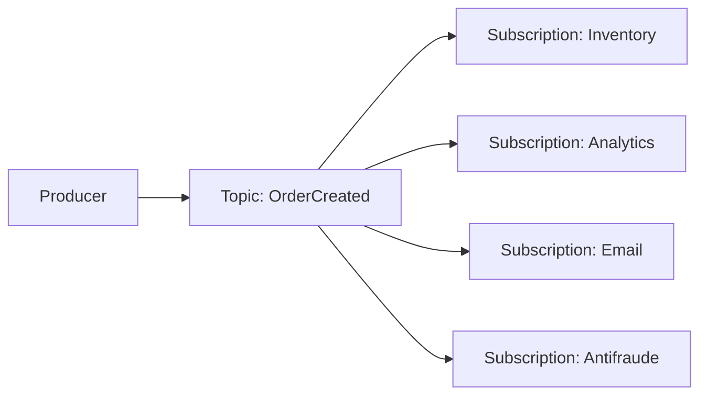
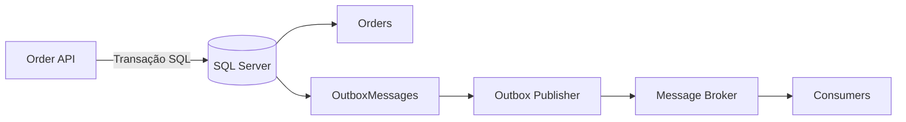
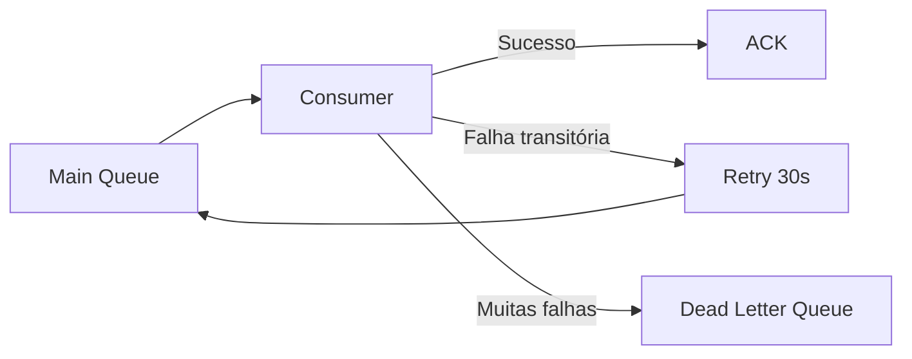
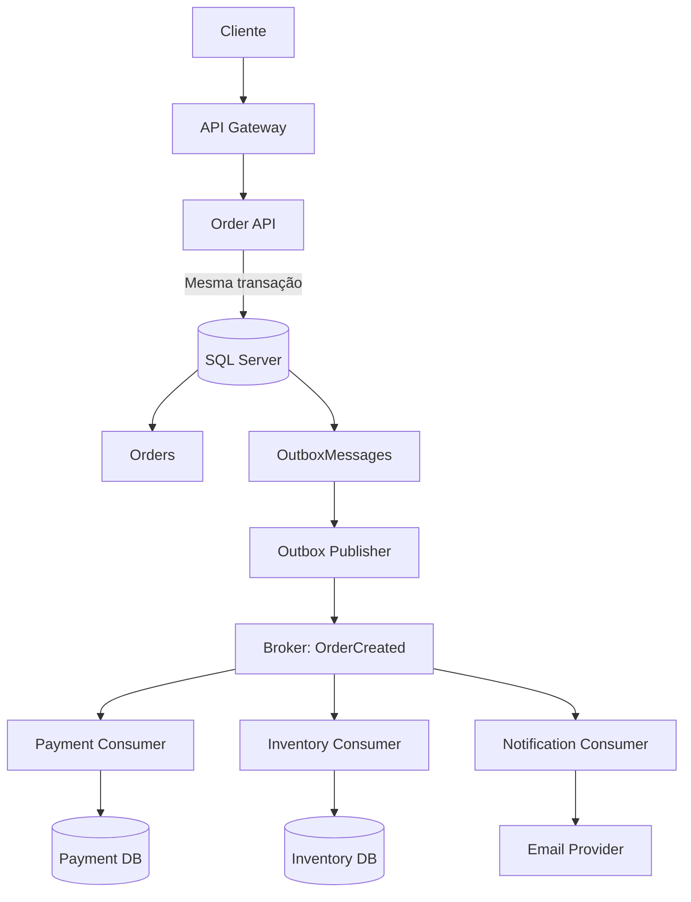
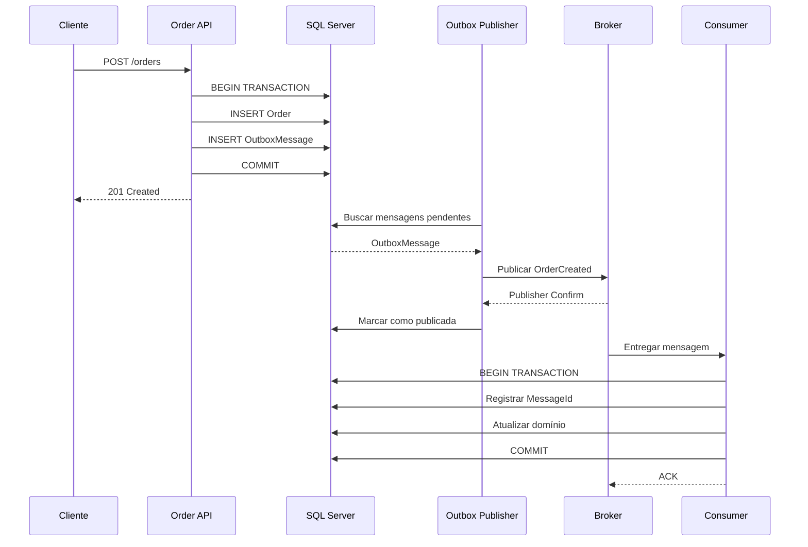
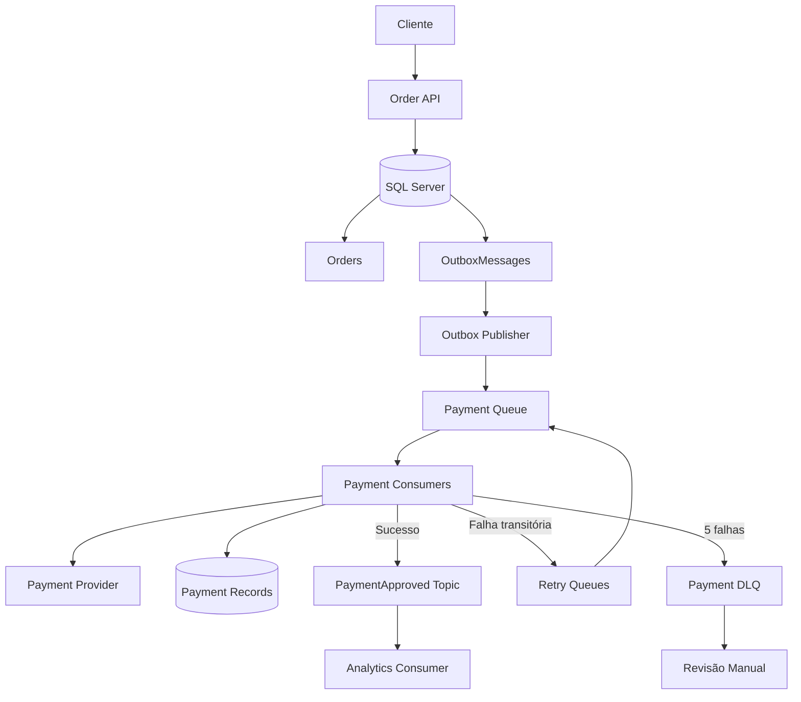

# Módulo 3 — Queues e Mensageria

> [!NOTE]
> **Objetivo**  
> Entender como filas e sistemas de mensageria funcionam, quando utilizá-los, quais garantias de entrega existem e como construir consumidores confiáveis, escaláveis e idempotentes.

---

## Sumário

1. [O que são filas](#1-o-que-são-filas)
    
2. [Por que usar filas](#2-por-que-usar-filas)
    
3. [Filas versus banco de dados](#3-filas-versus-banco-de-dados)
    
4. [Quando usar filas](#4-quando-usar-filas)
    
5. [Quando não usar filas](#5-quando-não-usar-filas)
    
6. [Queue versus Publish Subscribe](#6-queue-versus-publish-subscribe)
    
7. [Como os readers ou consumers operam](#7-como-os-readers-ou-consumers-operam)
    
8. [Acknowledgement](#8-acknowledgement)
    
9. [Tipos de entrega](#9-tipos-de-entrega)
    
10. [Idempotência](#10-idempotência)
    
11. [Consumer idempotente em C#](#11-consumer-idempotente-em-c)
    
12. [O problema da publicação dupla](#12-o-problema-da-publicação-dupla)
    
13. [Transactional Outbox](#13-transactional-outbox)
    
14. [Particionamento](#14-particionamento)
    
15. [Particionamento e ordem global](#15-particionamento-e-ordem-global)
    
16. [Consumer Groups](#16-consumer-groups)
    
17. [Como escalar consumers](#17-como-escalar-consumers)
    
18. [Prefetch e mensagens em voo](#18-prefetch-e-mensagens-em-voo)
    
19. [Backpressure](#19-backpressure)
    
20. [Retry](#20-retry)
    
21. [Retry local versus retry por fila](#21-retry-local-versus-retry-por-fila)
    
22. [Dead Letter Queue](#22-dead-letter-queue)
    
23. [Poison Messages](#23-poison-messages)
    
24. [Visibility Timeout](#24-visibility-timeout)
    
25. [Ordenação](#25-ordenação)
    
26. [Principais opções](#26-principais-opções)
    
27. [Comparação rápida](#27-comparação-rápida)
    
28. [Exemplo prático com RabbitMQ e C#](#28-exemplo-prático-com-rabbitmq-e-c)
    
29. [Respostas assíncronas](#29-respostas-assíncronas)
    
30. [Complexidade operacional](#30-complexidade-operacional)
    
31. [Limitações de escala](#31-limitações-de-escala)
    
32. [Mensagem como contrato](#32-mensagem-como-contrato)
    
33. [Observabilidade](#33-observabilidade)
    
34. [Segurança](#34-segurança)
    
35. [Custos](#35-custos)
    
36. [Arquitetura recomendada](#36-arquitetura-recomendada)
    
37. [Fluxo completo de uma mensagem](#37-fluxo-completo-de-uma-mensagem)
    
38. [Checklist de produção](#38-checklist-de-produção)
    
39. [Regras práticas](#39-regras-práticas)
    
40. [Questões comuns de entrevista](#40-questões-comuns-de-entrevista)
    
41. [Exercício prático](#41-exercício-prático)
    

---

## 1. O que são filas

Uma fila permite que um sistema entregue trabalho para outro sistema sem exigir que ambos estejam disponíveis e trabalhando ao mesmo tempo.

Em vez de o serviço A esperar o serviço B terminar, o serviço A registra uma mensagem e continua seu processamento.

### Exemplo de e-commerce

Quando um cliente finaliza uma compra, várias operações podem ser necessárias:

- Confirmar o pedido.
    
- Reservar estoque.
    
- Processar pagamento.
    
- Gerar nota fiscal.
    
- Enviar e-mail.
    
- Atualizar analytics.
    
- Avisar o sistema de logística.
    

Uma implementação totalmente síncrona poderia ser:

```text
Cliente
   |
   v
API de Pedidos
   |
   +--> Serviço de Estoque
   |
   +--> Serviço de Pagamento
   |
   +--> Serviço Fiscal
   |
   +--> Serviço de E-mail
   |
   +--> Serviço de Analytics
```

Nesse modelo, a API depende diretamente de todos os serviços.

Se o serviço de e-mail estiver lento, a criação do pedido pode ficar lenta.

Se o serviço de analytics estiver indisponível, a compra pode falhar mesmo que analytics não seja essencial para concluir o pedido.

Com uma fila:

```text
Cliente
   |
   v
API de Pedidos
   |
   | grava pedido
   v
SQL Server
   |
   | publica OrderCreated
   v
Queue ou Broker
   |
   +--------+---------+----------+-----------+
   |        |         |          |           |
   v        v         v          v           v
Estoque  Pagamento  E-mail   Analytics   Logística
```

A API pode responder ao cliente depois de registrar o pedido.

Os outros processos continuam de forma assíncrona.

### Elementos básicos

```text
Producer ---> Queue ou Broker ---> Consumer
```

#### Producer ou Publisher

Sistema que cria e publica a mensagem.

Exemplos:

- API de pedidos.
    
- Serviço de pagamentos.
    
- Sistema de logística.
    
- Aplicação de cadastro de usuários.
    

#### Queue ou Topic

Estrutura na qual mensagens são armazenadas ou distribuídas.

#### Consumer, Subscriber, Reader ou Worker

Sistema que lê e processa a mensagem.

#### Broker

Infraestrutura intermediária responsável por receber, armazenar, distribuir e, em alguns casos, replicar mensagens.

Exemplos:

- RabbitMQ.
    
- Apache Kafka.
    
- Amazon SQS.
    
- Google Cloud Pub/Sub.
    

### Exemplo de mensagem

```json
{
  "eventId": "43f62fd2-736b-48cc-a66f-707c39281566",
  "eventType": "OrderCreated",
  "version": 1,
  "occurredAt": "2026-07-13T15:30:00Z",
  "orderId": 98412,
  "customerId": 1881,
  "total": 299.90
}
```

Uma boa mensagem geralmente contém:

- Identificador único.
    
- Tipo do evento.
    
- Versão do contrato.
    
- Data de criação.
    
- Identificador da entidade.
    
- Dados necessários ao processamento.
    
- `CorrelationId`.
    
- `CausationId`.
    
- `TraceId`, quando houver tracing distribuído.
    

> [!IMPORTANT]
> Uma mensagem não deve ser vista apenas como um JSON. Ela é um contrato entre sistemas.

---

## 2. Por que usar filas

Filas resolvem principalmente problemas de desacoplamento, absorção de picos, resiliência e processamento assíncrono.

### 2.1. Desacoplamento

O produtor não precisa conhecer os detalhes internos dos consumidores.

A API de pedidos publica:

```text
OrderCreated
```

Ela não precisa saber:

- Quantos consumidores existem.
    
- Onde eles estão executando.
    
- Qual banco utilizam.
    
- Qual linguagem utilizam.
    
- Quanto tempo levam para processar.
    
- Se estão temporariamente indisponíveis.
    

Isso reduz o acoplamento entre sistemas.

### 2.2. Absorção de picos

Suponha que uma aplicação receba normalmente 100 pedidos por minuto.

Durante uma promoção, pode receber 10 mil pedidos por minuto.

Sem fila:

```text
10.000 requisições
        |
        v
Serviço de Nota Fiscal sobrecarregado
```

Com fila:

```text
10.000 mensagens
        |
        v
      Queue
        |
        v
50 workers processando gradualmente
```

A fila funciona como um buffer.

Ela permite que o produtor continue aceitando trabalho enquanto os consumidores processam na velocidade suportada.

> [!WARNING]
> A fila não elimina o trabalho.
> 
> Ela apenas permite que o trabalho seja processado posteriormente.

### 2.3. Resiliência

Se um consumidor ficar indisponível, as mensagens podem permanecer armazenadas até que o serviço volte.

```text
Producer --> Queue --> Consumer indisponível
              |
              +--> mensagem permanece armazenada
```

### 2.4. Processamento assíncrono

Algumas tarefas não precisam fazer parte da resposta HTTP principal:

- Enviar e-mail.
    
- Gerar relatório.
    
- Converter vídeo.
    
- Criar thumbnails.
    
- Atualizar um data warehouse.
    
- Indexar documentos.
    
- Processar webhooks.
    
- Atualizar sistemas secundários.
    
- Executar análises antifraude complementares.
    

---

## 3. Filas versus banco de dados

Uma fila e um banco de dados podem armazenar informações, mas possuem objetivos diferentes.

|Característica|Fila|Banco de dados|
|---|---|---|
|Objetivo principal|Transportar e distribuir trabalho|Armazenar estado de negócio|
|Forma de acesso|Consumir mensagens|Consultar registros|
|Retenção|Frequentemente temporária|Normalmente duradoura|
|Consultas flexíveis|Limitadas|SQL, filtros, joins e índices|
|Ordenação|Garantida apenas em determinados escopos|Definida pela consulta|
|Exclusão|Frequentemente após processamento|Conforme regras do domínio|
|Escala|Otimizada para throughput de mensagens|Otimizada para persistência e consulta|
|Consumidores|Workers e subscribers|Aplicações e usuários|
|Reprocessamento|Pode ser nativo|Precisa ser implementado|
|Transações|Normalmente locais ao broker|ACID no banco relacional|

### Um banco pode ser usado como fila?

Tecnicamente, sim.

Exemplo de tabela de jobs:

```sql
CREATE TABLE dbo.Jobs
(
    Id              BIGINT IDENTITY PRIMARY KEY,
    JobType         VARCHAR(100) NOT NULL,
    Payload         NVARCHAR(MAX) NOT NULL,
    Status          VARCHAR(20) NOT NULL
        CONSTRAINT DF_Jobs_Status DEFAULT 'Pending',
    CreatedAtUtc    DATETIME2 NOT NULL
        CONSTRAINT DF_Jobs_CreatedAtUtc DEFAULT SYSUTCDATETIME(),
    LockedAtUtc     DATETIME2 NULL,
    LockedBy        VARCHAR(200) NULL,
    Attempts        INT NOT NULL
        CONSTRAINT DF_Jobs_Attempts DEFAULT 0
);
```

Um worker poderia buscar:

```sql
SELECT TOP (10) *
FROM dbo.Jobs
WHERE Status = 'Pending'
ORDER BY Id;
```

O problema é que dois workers podem selecionar os mesmos registros.

Uma abordagem melhor utiliza locks:

```sql
BEGIN TRANSACTION;

;WITH JobsToLock AS
(
    SELECT TOP (10) *
    FROM dbo.Jobs WITH
    (
        UPDLOCK,
        READPAST,
        ROWLOCK
    )
    WHERE Status = 'Pending'
    ORDER BY Id
)
UPDATE JobsToLock
SET
    Status = 'Processing',
    LockedAtUtc = SYSUTCDATETIME(),
    LockedBy = @WorkerId,
    Attempts = Attempts + 1
OUTPUT inserted.*;

COMMIT;
```

### Quando uma fila baseada em SQL pode ser aceitável

- Sistema pequeno.
    
- Baixo volume.
    
- Equipe sem infraestrutura de mensageria.
    
- Jobs administrativos simples.
    
- Necessidade forte de transação junto aos dados.
    
- Dezenas ou poucas centenas de trabalhos por segundo.
    
- Operação interna de baixa criticidade.
    

### Por que essa abordagem pode deixar de funcionar

- Polling constante no banco.
    
- Contenção de locks.
    
- Crescimento contínuo da tabela.
    
- Manutenção de índices.
    
- Deadlocks.
    
- Dificuldade de reentrega.
    
- Dificuldade de controlar concorrência.
    
- Banco operacional disputando recursos com workers.
    
- Ausência de recursos nativos como DLQ.
    
- Ausência de acknowledgements nativos.
    
- Recuperação manual de jobs presos.
    
- Falta de consumer groups.
    
- Falta de replay estruturado.
    

> [!TIP]
> **Regra prática**  
> O banco deve ser a fonte do estado do negócio.
> 
> A fila deve ser o meio de transporte do trabalho.

---

## 4. Quando usar filas

### 4.1. Processamento demorado

Exemplo de upload de vídeo:

```text
POST /videos
    |
    +--> salva metadados
    +--> publica VideoUploaded
    +--> retorna 202 Accepted
```

Depois:

```text
VideoUploaded
    |
    +--> transcoding
    +--> geração de thumbnail
    +--> moderação
    +--> extração de metadados
```

### 4.2. Picos de demanda

Exemplos:

- Black Friday.
    
- Venda de ingressos.
    
- Inscrições para concursos.
    
- Fechamento financeiro.
    
- Processamento de folha.
    
- Campanhas de e-mail.
    

### 4.3. Integração entre sistemas

Um ERP publica uma alteração e outros sistemas reagem.

```text
ERP
 |
 +--> publica CustomerUpdated
            |
            +--> CRM
            +--> Billing
            +--> Analytics
```

### 4.4. Distribuição de trabalho

```text
Queue
  |
  +--> Worker 1
  +--> Worker 2
  +--> Worker 3
```

Cada mensagem é processada por um dos workers.

### 4.5. Eventos de domínio

Exemplos:

```text
PaymentApproved
OrderShipped
CustomerRegistered
InvoiceIssued
PasswordChanged
ProductPriceUpdated
```

### 4.6. Retentativas

Falhas temporárias podem ser tratadas sem bloquear a operação principal.

---

## 5. Quando não usar filas

Não utilize mensageria apenas porque arquiteturas modernas utilizam filas.

Uma fila pode ser inadequada quando:

- O usuário precisa da resposta imediatamente.
    
- O processo é simples e local.
    
- A consistência precisa ser imediatamente observável.
    
- O volume é baixo e a infraestrutura não se justifica.
    
- O consumidor precisa consultar mensagens arbitrariamente.
    
- Uma chamada síncrona simples resolve o problema.
    
- O fluxo assíncrono criaria complexidade maior do que o benefício.
    

### Exemplo

```text
Usuário consulta saldo bancário
```

Normalmente, não faz sentido colocar essa consulta em uma fila e pedir que o cliente consulte o resultado posteriormente.

O fluxo síncrono é mais natural:

```text
Cliente --> API de Contas --> Banco --> Resposta
```

---

## 6. Queue versus Publish Subscribe

Existem dois modelos comuns de distribuição.

### 6.1. Work Queue

Cada mensagem é processada por apenas um worker do grupo.

```text
                  +--> Worker A
Producer --> Queue
                  +--> Worker B
                  +--> Worker C
```

Exemplo:

```text
Mensagem 1 --> Worker A
Mensagem 2 --> Worker B
Mensagem 3 --> Worker C
```

Casos de uso:

- Geração de PDFs.
    
- Processamento de imagens.
    
- Envio de e-mails.
    
- Jobs em background.
    
- Importação de arquivos.
    
- Processamento de pagamentos.
    

### 6.2. Publish/Subscribe

Cada assinatura recebe sua própria cópia lógica do evento.

```text
                  +--> Estoque
Producer --> Topic+--> Analytics
                  +--> E-mail
                  +--> Antifraude
```

Casos de uso:

- Eventos de domínio.
    
- Integrações.
    
- Event-driven architecture.
    
- Propagação de alterações.
    
- Atualização de projeções.
    

### Diagrama Mermaid



### Kafka e consumer groups

No Kafka, grupos diferentes podem consumir o mesmo evento independentemente.

```text
Topic: OrderCreated

Consumer Group: inventory
Consumer Group: analytics
Consumer Group: notifications
```

Dentro do mesmo consumer group, cada partição é atribuída a somente um consumidor por vez.

---

## 7. Como os readers ou consumers operam

Existem dois modelos principais de consumo.

### 7.1. Polling ou Pull

O consumidor pergunta ao broker se há mensagens disponíveis.

```text
Consumer                     Broker
   |                            |
   |------ Receive/Poll ------->|
   |<----- Messages ------------|
   |                            |
   | processa                   |
   |                            |
   |------ Ack/Delete --------->|
```

Exemplos:

- Amazon SQS.
    
- Apache Kafka.
    
- Google Cloud Pub/Sub com pull subscription.
    

### Long polling

Em vez de consultar continuamente e receber respostas vazias, o consumidor mantém a requisição aberta por alguns segundos.

```text
Consumer: há mensagens?
Broker: aguarde...

Alguns segundos depois:

Broker: chegou uma mensagem
```

O long polling reduz:

- Requisições vazias.
    
- Uso de CPU.
    
- Custo de chamadas.
    
- Latência média.
    
- Tráfego desnecessário.
    

### 7.2. Push

O broker envia a mensagem para um endpoint do consumidor.

```text
Broker ---- HTTP POST ----> Consumer
```

Exemplos:

- Google Cloud Pub/Sub push subscription.
    
- Webhooks.
    
- Alguns serviços serverless.
    
- Event Grid e sistemas similares.
    

### Pull versus Push

|Pull|Push|
|---|---|
|Consumidor controla a velocidade|Broker controla a entrega|
|Mais fácil aplicar backpressure|Endpoint precisa absorver picos|
|Requer polling ou conexão|Requer endpoint acessível|
|Bom para workers|Bom para integrações HTTP|
|Controle fino de batches|Operação simples em cenários serverless|
|Consumidor pode pausar facilmente|Broker continuará tentando entregar|

---

## 8. Acknowledgement

O broker precisa saber quando uma mensagem foi processada com sucesso.

Essa confirmação é chamada de:

- ACK.
    
- Acknowledgement.
    
- Confirmação.
    
- Delete, em alguns serviços.
    

### 8.1. ACK automático

A mensagem é considerada processada assim que chega ao consumidor.

```text
Broker --> Consumer --> mensagem considerada concluída
```

Problema:

```text
1. Broker entrega.
2. Broker considera concluída.
3. Consumer cai antes de processar.
4. Mensagem é perdida.
```

Esse comportamento se aproxima de **at most once**.

### 8.2. ACK manual

O consumidor confirma apenas depois do processamento.

```text
Broker --> Consumer
              |
              +--> processa
              +--> grava no banco
              +--> commit
              +--> ACK
```

Se o consumidor cair antes do ACK, a mensagem pode ser entregue novamente.

### Regra fundamental

```text
Receber mensagem
      |
      v
Processar
      |
      v
Gravar estado
      |
      v
Commit
      |
      v
ACK
```

> [!CAUTION]
> Não envie o ACK antes de confirmar o efeito de negócio.

---

## 9. Tipos de entrega

As garantias mais conhecidas são:

- At most once.
    
- At least once.
    
- Exactly once.
    

---

### 9.1. At Most Once

> A mensagem será processada zero ou uma vez.

Ela não é reentregue após falha.

```text
Entrega
  |
  +--> sucesso: processada
  |
  +--> falha: perdida
```

#### Vantagens

- Menor complexidade.
    
- Menor latência.
    
- Ausência de duplicidade por reentrega.
    

#### Desvantagens

- Mensagens podem ser perdidas.
    
- Não serve para operações críticas.
    

#### Quando usar

- Métricas não críticas.
    
- Telemetria de alta frequência.
    
- Atualizações substituíveis.
    
- Informações em que alguma perda é aceitável.
    

Exemplo:

```text
Movimento aproximado do cursor de um usuário.
```

Perder uma atualização pode não importar, pois outra chegará logo depois.

---

### 9.2. At Least Once

> A mensagem será processada uma ou mais vezes.

O sistema prioriza não perder mensagens, mas duplicidades são possíveis.

```text
Broker entrega mensagem
        |
        v
Consumer processa
        |
        v
Consumer grava no banco
        |
        X cai antes do ACK
        |
        v
Broker entrega novamente
```

#### Vantagens

- Maior segurança contra perda.
    
- Suportado pela maioria dos brokers.
    
- Bom equilíbrio entre confiabilidade e complexidade.
    

#### Desvantagens

- Duplicidades são possíveis.
    
- Exige consumidores idempotentes.
    
- Pode causar efeitos duplicados em sistemas externos.
    

Exemplos de tecnologias que frequentemente operam nesse modelo:

- RabbitMQ com ACK manual.
    
- Amazon SQS Standard.
    
- Google Cloud Pub/Sub no comportamento padrão.
    
- Muitos consumers Kafka quando offsets e efeitos externos não são transacionados juntos.
    

---

### 9.3. Exactly Once

> O efeito de negócio ocorre exatamente uma vez.

Essa definição é mais importante do que dizer que o broker entregou a mensagem uma única vez.

Considere:

```text
Consumer --> Banco: COMMIT
Consumer <-- Banco: resposta perdida
```

O consumidor não sabe:

- O commit falhou?
    
- O commit funcionou e apenas a resposta se perdeu?
    

Se repetir, pode duplicar.

Se não repetir, pode perder.

Por isso, exatamente uma vez geralmente é construído com:

```text
At least once
+
Idempotência
+
Deduplicação
+
Transação local
+
Controle dos efeitos externos
```

### Regra prática

> Projete o transporte como at least once e torne o efeito de negócio idempotente.

### Limitações do exactly once

Uma garantia de exactly once em um broker não significa exactly once universal.

Exemplo:

```text
Kafka --> Consumer --> API de cartão de crédito
```

Mesmo que o Kafka controle transacionalmente offsets e produção de eventos, a API de cartão está fora da transação Kafka.

Nesse cenário, ainda é necessário usar:

- Idempotency key.
    
- Deduplicação.
    
- Reconciliação.
    
- Registro de tentativas.
    
- Controle de estado.
    

---

## 10. Idempotência

Uma operação idempotente pode ser executada várias vezes e produzir o mesmo resultado final.

### Operação não idempotente

```sql
UPDATE dbo.Accounts
SET Balance = Balance - 100
WHERE AccountId = 10;
```

Se executada duas vezes:

```text
Saldo inicial: 1.000
Primeira execução: 900
Segunda execução: 800
```

O efeito foi duplicado.

### Operação potencialmente idempotente

```sql
UPDATE dbo.Orders
SET Status = 'Paid'
WHERE OrderId = 1001
  AND Status <> 'Paid';
```

Executar novamente não muda o resultado final.

Entretanto, somente verificar o status pode não ser suficiente em todos os domínios.

### Tabela de mensagens processadas

```sql
CREATE TABLE dbo.ProcessedMessages
(
    ConsumerName    VARCHAR(100) NOT NULL,
    MessageId       UNIQUEIDENTIFIER NOT NULL,
    ProcessedAtUtc  DATETIME2 NOT NULL
        CONSTRAINT DF_ProcessedMessages_ProcessedAtUtc
        DEFAULT SYSUTCDATETIME(),

    CONSTRAINT PK_ProcessedMessages
        PRIMARY KEY (ConsumerName, MessageId)
);
```

A chave primária impede que o mesmo consumidor registre o mesmo `MessageId` duas vezes.

### Processamento transacional

```sql
CREATE OR ALTER PROCEDURE dbo.ProcessPaymentApproved
    @MessageId UNIQUEIDENTIFIER,
    @OrderId BIGINT,
    @PaymentId VARCHAR(100)
AS
BEGIN
    SET NOCOUNT ON;
    SET XACT_ABORT ON;

    BEGIN TRANSACTION;

    IF EXISTS
    (
        SELECT 1
        FROM dbo.ProcessedMessages
        WHERE ConsumerName = 'OrderPaymentConsumer'
          AND MessageId = @MessageId
    )
    BEGIN
        COMMIT;
        RETURN;
    END;

    UPDATE dbo.Orders
    SET
        Status = 'Paid',
        PaymentId = @PaymentId,
        PaidAtUtc = SYSUTCDATETIME()
    WHERE OrderId = @OrderId
      AND Status <> 'Paid';

    INSERT INTO dbo.ProcessedMessages
    (
        ConsumerName,
        MessageId
    )
    VALUES
    (
        'OrderPaymentConsumer',
        @MessageId
    );

    COMMIT;
END;
```

O ponto mais importante é:

```text
Atualização do domínio
+
Registro de deduplicação
=
Mesma transação SQL
```

Se forem operações separadas:

```text
1. Atualiza o pedido.
2. Aplicação cai.
3. MessageId não é registrado.
4. Broker reentrega.
5. Pedido é processado novamente.
```

---

## 11. Consumer idempotente em C#

```csharp
public sealed record PaymentApprovedMessage(
    Guid MessageId,
    long OrderId,
    string PaymentId,
    decimal Amount);

public sealed class PaymentApprovedHandler
{
    private readonly string _connectionString;

    public PaymentApprovedHandler(string connectionString)
    {
        _connectionString = connectionString;
    }

    public async Task HandleAsync(
        PaymentApprovedMessage message,
        CancellationToken cancellationToken)
    {
        await using var connection =
            new Microsoft.Data.SqlClient.SqlConnection(_connectionString);

        await connection.OpenAsync(cancellationToken);

        await using var transaction =
            (Microsoft.Data.SqlClient.SqlTransaction)
            await connection.BeginTransactionAsync(cancellationToken);

        try
        {
            const string insertProcessedMessageSql = """
                INSERT INTO dbo.ProcessedMessages
                (
                    ConsumerName,
                    MessageId,
                    ProcessedAtUtc
                )
                VALUES
                (
                    @ConsumerName,
                    @MessageId,
                    SYSUTCDATETIME()
                );
                """;

            await using (var command =
                new Microsoft.Data.SqlClient.SqlCommand(
                    insertProcessedMessageSql,
                    connection,
                    transaction))
            {
                command.Parameters.AddWithValue(
                    "@ConsumerName",
                    "PaymentApprovedConsumer");

                command.Parameters.AddWithValue(
                    "@MessageId",
                    message.MessageId);

                try
                {
                    await command.ExecuteNonQueryAsync(cancellationToken);
                }
                catch (Microsoft.Data.SqlClient.SqlException exception)
                    when (exception.Number is 2601 or 2627)
                {
                    await transaction.RollbackAsync(cancellationToken);

                    // Mensagem já processada.
                    // Do ponto de vista do broker, isso é sucesso.
                    return;
                }
            }

            const string updateOrderSql = """
                UPDATE dbo.Orders
                SET
                    Status = 'Paid',
                    PaymentId = @PaymentId,
                    PaidAtUtc = SYSUTCDATETIME()
                WHERE OrderId = @OrderId
                  AND Status <> 'Paid';
                """;

            await using (var command =
                new Microsoft.Data.SqlClient.SqlCommand(
                    updateOrderSql,
                    connection,
                    transaction))
            {
                command.Parameters.AddWithValue(
                    "@OrderId",
                    message.OrderId);

                command.Parameters.AddWithValue(
                    "@PaymentId",
                    message.PaymentId);

                await command.ExecuteNonQueryAsync(cancellationToken);
            }

            await transaction.CommitAsync(cancellationToken);
        }
        catch
        {
            await transaction.RollbackAsync(cancellationToken);
            throw;
        }
    }
}
```

### Fluxo correto

```text
Receber mensagem
      |
      v
Registrar MessageId
      |
      v
Atualizar domínio
      |
      v
Commit SQL
      |
      v
ACK
```

### Observação importante

Se a mensagem já tiver sido processada, o consumer deve tratá-la como sucesso.

Ele não deve enviar a mensagem para retry apenas porque encontrou uma duplicidade esperada.

---

## 12. O problema da publicação dupla

Considere:

```csharp
await SaveOrderAsync(order);
await PublishOrderCreatedAsync(order);
```

Existem duas operações independentes:

1. Gravar no SQL Server.
    
2. Publicar no broker.
    

### Falha depois de salvar e antes de publicar

```text
1. Pedido gravado no SQL Server.
2. Aplicação cai.
3. Evento não é publicado.
```

O pedido existe, mas nenhum consumidor foi notificado.

### Publicar antes de salvar também não resolve

```text
1. Evento publicado.
2. Aplicação cai.
3. Pedido não é gravado.
```

Os consumidores recebem um evento sobre um pedido que não existe.

### Dual Write Problem

Esse problema é conhecido como:

```text
Dual Write Problem
```

Ocorre quando uma aplicação precisa alterar dois recursos independentes:

- Banco de dados.
    
- Message broker.
    
- Cache.
    
- API externa.
    
- Outro banco.
    

Sem uma transação distribuída, não existe atomicidade automática entre eles.

---

## 13. Transactional Outbox

O padrão Transactional Outbox resolve o problema de publicação dupla gravando o estado do negócio e o evento na mesma transação local.

```text
API
 |
 | mesma transação SQL
 |
 +--> Orders
 |
 +--> OutboxMessages
```

Depois, um worker publica as mensagens da Outbox.

```text
OutboxMessages
      |
      v
Outbox Publisher
      |
      v
Message Broker
```

### Diagrama Mermaid



### Tabela Outbox

```sql
CREATE TABLE dbo.OutboxMessages
(
    Id              UNIQUEIDENTIFIER NOT NULL,
    EventType       VARCHAR(200) NOT NULL,
    Payload         NVARCHAR(MAX) NOT NULL,
    OccurredAtUtc   DATETIME2 NOT NULL,
    PublishedAtUtc  DATETIME2 NULL,
    Attempts        INT NOT NULL
        CONSTRAINT DF_OutboxMessages_Attempts DEFAULT 0,
    LastError       NVARCHAR(2000) NULL,

    CONSTRAINT PK_OutboxMessages PRIMARY KEY (Id)
);
```

### Índice para mensagens pendentes

```sql
CREATE INDEX IX_OutboxMessages_Unpublished
ON dbo.OutboxMessages (OccurredAtUtc)
INCLUDE
(
    EventType,
    Payload,
    Attempts
)
WHERE PublishedAtUtc IS NULL;
```

### Salvando pedido e evento

```csharp
await using var transaction =
    await connection.BeginTransactionAsync(cancellationToken);

await InsertOrderAsync(
    connection,
    transaction,
    order,
    cancellationToken);

var outboxMessage = new
{
    Id = Guid.NewGuid(),
    EventType = "OrderCreated",
    Payload = JsonSerializer.Serialize(new
    {
        order.Id,
        order.CustomerId,
        order.Total
    }),
    OccurredAtUtc = DateTime.UtcNow
};

await InsertOutboxMessageAsync(
    connection,
    transaction,
    outboxMessage,
    cancellationToken);

await transaction.CommitAsync(cancellationToken);
```

### Publisher da Outbox

```text
1. Busca mensagens não publicadas.
2. Publica no broker.
3. Recebe confirmação do broker.
4. Marca PublishedAtUtc.
```

### Duplicidade ainda é possível

Considere:

```text
1. Publisher publica no broker.
2. Broker confirma.
3. Aplicação cai antes de marcar PublishedAtUtc.
4. Publisher publica novamente.
```

Consequência:

```text
A mesma mensagem pode ser publicada duas vezes.
```

Portanto:

> A Outbox evita perda de eventos, mas o consumidor ainda deve ser idempotente.

### Possíveis implementações da Outbox

- Polling periódico.
    
- SQL Server Change Tracking.
    
- Change Data Capture.
    
- Debezium.
    
- Job agendado.
    
- BackgroundService em .NET.
    
- Serviço separado.
    

---

## 14. Particionamento

Uma única fila, topic ou partição possui limites físicos.

Para aumentar o throughput, sistemas de mensageria dividem os dados.

```text
Topic: orders

Partition 0: O1, O4, O7
Partition 1: O2, O5, O8
Partition 2: O3, O6, O9
```

### Partition Key

O produtor escolhe uma chave.

Um algoritmo conceitual pode ser:

```text
hash(key) % quantidade_de_partições
```

Exemplo:

```text
PartitionKey = CustomerId
```

Todas as mensagens do mesmo cliente tendem a ir para a mesma partição.

```text
Customer 10 --> Partition 1
Customer 20 --> Partition 0
Customer 30 --> Partition 2
```

### Por que isso importa

A ordem normalmente é garantida apenas dentro de uma partição.

Exemplo:

```text
OrderCreated
PaymentApproved
OrderCancelled
```

Se esses eventos precisam ser processados em ordem:

```text
PartitionKey = OrderId
```

Assim, eventos do mesmo pedido vão para a mesma partição.

```text
Partition 7:

OrderCreated
PaymentApproved
OrderShipped
```

### Má escolha de chave

```text
PartitionKey = Country
```

Suponha que 90% dos clientes estejam no Brasil.

```text
Brasil --> Partition 1: 90% das mensagens
Outros --> demais partições: 10%
```

Isso cria uma:

```text
Hot Partition
```

### Boas Partition Keys

- `OrderId`.
    
- `CustomerId`.
    
- `AccountId`.
    
- `DeviceId`.
    
- `ShipmentId`.
    
- `TenantId`, quando os tenants são equilibrados.
    

### Chaves perigosas

- País.
    
- Status.
    
- Booleanos.
    
- Tipo de evento com baixa cardinalidade.
    
- Cliente extremamente grande.
    
- Data atual.
    
- Região com tráfego muito concentrado.
    

### Problema do TenantId

Mesmo uma chave aparentemente boa pode ser problemática.

```text
Tenant A: 90% do tráfego
Tenant B: 5%
Tenant C: 5%
```

Se a partition key for `TenantId`, o Tenant A pode criar uma partição quente.

Alternativa:

```text
PartitionKey = TenantId + AggregateId
```

Exemplo:

```text
TenantId + OrderId
```

---

## 15. Particionamento e ordem global

Considere duas partições:

```text
Partition 0: Event A, Event C
Partition 1: Event B, Event D
```

É possível garantir:

```text
A antes de C
B antes de D
```

Mas não necessariamente:

```text
A antes de B antes de C antes de D
```

### Por que a ordem global reduz a escala

Para garantir ordem global, todos os eventos precisam passar pelo mesmo ponto de serialização.

```text
Todos os eventos --> Uma partição --> Um consumidor ativo
```

Isso reduz o paralelismo.

```text
Mais ordem global
        ^
        |
        | trade-off
        |
Mais paralelismo
```

### Regra prática

> Garanta ordem apenas no menor escopo necessário.

Exemplos:

- Ordem por pedido.
    
- Ordem por conta.
    
- Ordem por usuário.
    
- Ordem por dispositivo.
    
- Ordem por transação.
    

Evite ordem global, salvo quando for uma exigência real do domínio.

---

## 16. Consumer Groups

No Kafka, consumidores são organizados em grupos.

Exemplo com quatro partições:

```text
Partition 0 --> Consumer A
Partition 1 --> Consumer A
Partition 2 --> Consumer B
Partition 3 --> Consumer B
```

Dentro do mesmo grupo, uma partição é lida por apenas um consumer por vez.

### Mais consumidores do que partições

```text
P0 --> C1
P1 --> C2
P2 --> C3
P3 --> C4

C5 --> ocioso
C6 --> ocioso
C7 --> ocioso
C8 --> ocioso
```

O máximo de paralelismo de um consumer group é limitado pelo número de partições.

### Grupos diferentes

```text
Topic: OrderCreated

Consumer Group: inventory
Consumer Group: analytics
Consumer Group: notifications
```

Cada grupo processa todos os eventos de forma independente.

```text
OrderCreated
   |
   +--> Inventory Group
   +--> Analytics Group
   +--> Notifications Group
```

### Rebalanceamento

Quando consumidores entram ou saem do grupo, o Kafka redistribui partições.

```text
Antes:

P0 --> C1
P1 --> C1
P2 --> C2
P3 --> C2

Depois que C3 entra:

P0 --> C1
P1 --> C2
P2 --> C3
P3 --> C3
```

Esse processo é chamado de rebalanceamento.

Durante rebalanceamentos, o processamento pode sofrer pausas ou mudanças de ownership.

---

## 17. Como escalar consumers

### 17.1. Escala horizontal

```text
Antes:

Queue --> Worker 1
```

```text
Depois:

Queue --> Worker 1
      --> Worker 2
      --> Worker 3
      --> Worker 4
```

Essa costuma ser a abordagem preferida.

#### Benefícios

- Mais throughput.
    
- Maior disponibilidade.
    
- Falhas isoladas.
    
- Autoscaling.
    
- Melhor distribuição de carga.
    

#### Limitações

- Banco e APIs externas podem virar gargalos.
    
- Ordem pode ser afetada.
    
- Mais conexões são abertas.
    
- Maior concorrência pode causar contenção.
    

### 17.2. Escala vertical

Aumentar:

- CPU.
    
- Memória.
    
- Número de threads.
    
- Conexões.
    
- Tamanho dos batches.
    
- Recursos de disco.
    

É simples, mas possui limite físico.

### 17.3. Concorrência interna

Um worker pode processar várias mensagens em paralelo.

```csharp
var options = new ParallelOptions
{
    MaxDegreeOfParallelism = 16,
    CancellationToken = cancellationToken
};

await Parallel.ForEachAsync(
    messages,
    options,
    async (message, ct) =>
    {
        await ProcessAsync(message, ct);
    });
```

### Riscos da concorrência excessiva

Aumentar a concorrência pode sobrecarregar:

- SQL Server.
    
- APIs externas.
    
- Pools de conexão.
    
- CPU.
    
- Memória.
    
- Sistema de arquivos.
    
- Locks de aplicação.
    
- Rate limits de terceiros.
    

### Exemplo

```text
100 workers
x
20 mensagens em paralelo
=
2.000 processamentos simultâneos
```

Se cada processamento abre uma conexão SQL:

```text
2.000 conexões potenciais
```

O broker pode suportar, mas o banco pode não suportar.

> [!IMPORTANT]
> Escalar o consumer sem verificar o downstream apenas desloca o gargalo.

---

## 18. Prefetch e mensagens em voo

O prefetch controla quantas mensagens um consumer recebe sem confirmar as anteriores.

### Prefetch igual a 1

```text
Consumer recebe M1
Consumer processa M1
Consumer envia ACK
Consumer recebe M2
```

#### Benefícios

- Distribuição justa.
    
- Baixo uso de memória.
    
- Poucas mensagens presas em um consumer.
    

#### Desvantagens

- Menor throughput.
    
- Mais round trips.
    
- Possibilidade de o consumer ficar ocioso.
    

### Prefetch igual a 100

```text
Consumer recebe M1 até M100
```

#### Benefícios

- Maior throughput potencial.
    
- Melhor aproveitamento de processamento paralelo.
    

#### Desvantagens

- Maior uso de memória.
    
- Distribuição desigual.
    
- Muitas mensagens presas em um consumer lento.
    
- Reentrega em massa se o worker cair.
    

### Heurística inicial

```text
Prefetch ≈ concorrência do consumer × 1 a 3
```

Exemplo:

```text
Concorrência = 10
Prefetch inicial = 10 a 30
```

Essa não é uma fórmula universal.

O valor deve ser definido por testes e métricas.

---

## 19. Backpressure

Backpressure ocorre quando produtores criam trabalho mais rapidamente do que consumidores conseguem processar.

```text
Produção: 10.000 mensagens por segundo
Consumo:   6.000 mensagens por segundo
Déficit:   4.000 mensagens por segundo
```

Depois de uma hora:

```text
4.000 × 3.600
=
14.400.000 mensagens acumuladas
```

### Condição básica

```text
Arrival Rate > Processing Rate
```

### Como reagir

- Escalar consumers.
    
- Aumentar batches.
    
- Otimizar processamento.
    
- Reduzir chamadas externas.
    
- Aplicar rate limiting ao produtor.
    
- Descartar eventos não críticos.
    
- Separar cargas por prioridade.
    
- Aplicar limites de retenção.
    
- Usar circuit breaker.
    
- Implementar load shedding.
    
- Pausar temporariamente produtores.
    
- Diminuir a taxa de ingestão.
    

### A fila apenas compra tempo

Considere:

```text
Backlog: 10 milhões
Capacidade excedente após escalar: 1.000 mensagens por segundo
```

Tempo aproximado para consumir o backlog:

```text
10.000.000 / 1.000
=
10.000 segundos
≈
2 horas e 46 minutos
```

A recuperação pode levar horas mesmo depois que o problema foi resolvido.

---

## 20. Retry

Nem toda falha deve enviar a mensagem imediatamente para a DLQ.

### Falhas transitórias

- Timeout.
    
- API externa indisponível.
    
- Deadlock no banco.
    
- Limite temporário de conexões.
    
- HTTP 429.
    
- Falha de rede.
    
- DNS temporariamente indisponível.
    
- Broker secundário indisponível.
    

### Retry imediato

```text
Tentativa 1
  |
  X falha
  |
Tentativa 2 imediatamente
```

O problema é que a causa da falha pode continuar existindo.

Isso pode aumentar a sobrecarga.

### Exponential Backoff

```text
Tentativa 1: imediatamente
Tentativa 2: 5 segundos
Tentativa 3: 30 segundos
Tentativa 4: 2 minutos
Tentativa 5: 10 minutos
```

### Exemplo em C#

```csharp
public static TimeSpan CalculateRetryDelay(
    int attempt,
    TimeSpan maximumDelay)
{
    var exponentialSeconds = Math.Pow(2, attempt);
    var jitterMilliseconds = Random.Shared.Next(100, 1000);

    var delay =
        TimeSpan.FromSeconds(exponentialSeconds)
        + TimeSpan.FromMilliseconds(jitterMilliseconds);

    return delay <= maximumDelay
        ? delay
        : maximumDelay;
}
```

### Jitter

O jitter adiciona variação aleatória ao atraso.

Sem jitter:

```text
12:00:00 todos falham
12:00:30 todos tentam novamente
12:00:30 sistema sobrecarrega novamente
```

Com jitter:

```text
12:00:30.100 Worker A
12:00:30.450 Worker B
12:00:31.020 Worker C
12:00:31.600 Worker D
```

Isso reduz o chamado:

```text
Thundering Herd
```

### Política de retry

Uma política deve responder:

- Quais exceções são transitórias?
    
- Quantas tentativas?
    
- Qual intervalo?
    
- Existe jitter?
    
- Qual o intervalo máximo?
    
- Quando enviar para DLQ?
    
- O retry mantém a ordem?
    
- O retry bloqueia a partição?
    

---

## 21. Retry local versus retry por fila

### 21.1. Retry local

O worker segura a mensagem e tenta novamente.

```text
Consumer
  |
  +--> tentativa 1
  +--> espera
  +--> tentativa 2
  +--> espera
  +--> tentativa 3
```

#### Problemas

- Ocupa uma thread.
    
- Mantém a mensagem não confirmada.
    
- Pode ultrapassar o visibility timeout.
    
- Reduz a capacidade do consumer.
    
- Pode bloquear uma partição.
    

#### Quando usar

- Poucas tentativas.
    
- Intervalos curtos.
    
- Falhas rápidas.
    
- Operações de baixa latência.
    

### 21.2. Retry por fila

```text
Main Queue
    |
    X falha
    |
    v
Retry Queue 30s
    |
    v
Main Queue
```

Pode haver filas com atrasos diferentes:

```text
orders.retry.30s
orders.retry.5m
orders.retry.1h
orders.dlq
```

#### Vantagens

- Worker não fica bloqueado.
    
- Melhor controle operacional.
    
- Visibilidade das tentativas.
    
- Escala independente.
    
- Permite delays longos.
    

#### Desvantagens

- Mais filas.
    
- Mais roteamento.
    
- Mais complexidade.
    
- Ordem pode ser alterada.
    
- Mensagens podem circular várias vezes.
    

### Fluxo de retry por filas



---

## 22. Dead Letter Queue

Uma Dead Letter Queue recebe mensagens que não puderam ser processadas depois de determinadas tentativas.

```text
Main Queue
    |
    X falha
    |
Retry 1
    |
    X falha
    |
Retry 2
    |
    X falha
    |
    v
Dead Letter Queue
```

### Motivos comuns para envio à DLQ

- Número máximo de tentativas.
    
- Mensagem inválida.
    
- Schema incompatível.
    
- Entidade inexistente.
    
- Regra de negócio impossível.
    
- Mensagem expirada.
    
- Rejeição explícita.
    
- Erro permanente.
    

### Informações que devem ser preservadas

- `MessageId`.
    
- Payload original.
    
- Tipo da mensagem.
    
- Versão.
    
- Número de tentativas.
    
- Último erro.
    
- Horário da primeira falha.
    
- Horário da última falha.
    
- Consumer responsável.
    
- `CorrelationId`.
    
- `TraceId`.
    
- Stack trace resumida.
    
- Headers originais.
    

### DLQ não é lixeira

Uma DLQ precisa de:

- Alertas.
    
- Dashboard.
    
- Responsável.
    
- Processo de investigação.
    
- Ferramenta de replay.
    
- Política de retenção.
    
- Runbook operacional.
    
- Auditoria de reprocessamentos.
    

> [!CAUTION]
> Uma DLQ com milhares de mensagens ignoradas não representa tolerância a falhas.
> 
> Representa trabalho perdido silenciosamente.

### Replay

Ao reprocessar mensagens, é necessário considerar:

- A causa original foi corrigida?
    
- O contrato continua compatível?
    
- O efeito é idempotente?
    
- A mensagem ainda faz sentido?
    
- Ela precisa manter ordem?
    
- Pode causar carga excessiva?
    
- Deve ser reenviada de forma gradual?
    

---

## 23. Poison Messages

Uma poison message é uma mensagem que nunca poderá ser processada corretamente sem correção.

Exemplos:

- JSON inválido.
    
- Campo obrigatório ausente.
    
- Versão incompatível.
    
- Referência a entidade inexistente.
    
- Valor fora do intervalo.
    
- Arquivo corrompido.
    
- Tipo de dado incorreto.
    

Exemplo:

```json
{
  "orderId": "não-é-um-número",
  "total": -999999
}
```

Retentar 100 vezes não resolverá.

### Classificação de erros

```csharp
public enum FailureType
{
    Transient,
    Permanent,
    Unknown
}
```

```csharp
public static FailureType Classify(Exception exception)
{
    return exception switch
    {
        TimeoutException
            => FailureType.Transient,

        Microsoft.Data.SqlClient.SqlException sqlException
            when sqlException.Number == 1205
            => FailureType.Transient,

        JsonException
            => FailureType.Permanent,

        ArgumentException
            => FailureType.Permanent,

        _ => FailureType.Unknown
    };
}
```

### Estratégia

```text
Transient --> Retry com backoff
Permanent --> DLQ imediatamente
Unknown   --> Poucas tentativas e depois DLQ
```

### Por que não retentar tudo?

Retries desnecessários:

- Aumentam custos.
    
- Aumentam o backlog.
    
- Ocupam workers.
    
- Geram ruído em logs.
    
- Podem piorar indisponibilidades.
    
- Adiam a investigação do erro real.
    

---

## 24. Visibility Timeout

Em sistemas como Amazon SQS, receber uma mensagem não significa removê-la imediatamente.

Ela fica temporariamente invisível para outros consumidores.

```text
T0: Consumer A recebe
T0 até T30: mensagem invisível
T20: Consumer A termina e deleta
```

Se o consumer não deletar:

```text
T0: Consumer A recebe
T30: visibility timeout expira
T31: Consumer B pode receber
```

### Problema

```text
Processamento dura 2 minutos
Visibility timeout = 30 segundos
```

A mensagem pode ficar visível antes de o consumer terminar.

Resultado:

```text
Consumer A ainda processando
+
Consumer B recebe a mesma mensagem
=
Processamento concorrente duplicado
```

### Soluções

- Aumentar o visibility timeout.
    
- Renovar o timeout durante o processamento.
    
- Usar heartbeat.
    
- Dividir o trabalho em etapas menores.
    
- Manter idempotência.
    
- Monitorar processamentos longos.
    

### Timeout muito alto

Também existe um problema no outro extremo.

```text
Visibility timeout = 1 hora
Consumer cai após 5 segundos
```

A mensagem pode ficar indisponível por quase uma hora antes de ser reentregue.

### Estratégia prática

O timeout deve ser:

- Maior que a duração normal.
    
- Menor que um tempo de recuperação inaceitável.
    
- Renovável para tarefas longas.
    
- Monitorado.
    

---

## 25. Ordenação

Filas não significam automaticamente ordem global.

A ordem pode ser afetada por:

- Múltiplos consumers.
    
- Retries.
    
- Partições.
    
- Falhas.
    
- Rebalanceamentos.
    
- Diferentes tempos de processamento.
    
- DLQ.
    
- Batches.
    
- Processamento paralelo.
    

### Exemplo

```text
M1 leva 10 segundos
M2 leva 1 segundo
```

Com processamento paralelo:

```text
M2 termina antes de M1
```

A ordem de conclusão difere da ordem de leitura.

### Quando a ordem importa

- Eventos de uma conta bancária.
    
- Atualizações de estoque.
    
- Estado de uma máquina.
    
- Sequência de comandos.
    
- Eventos de um pedido.
    
- Atualizações de um documento.
    
- Movimentos financeiros.
    

### Solução comum

Garantir ordem por entidade:

```text
PartitionKey = OrderId
```

Assim, todos os eventos do mesmo pedido ficam na mesma partição.

### Retry e ordenação

Considere:

```text
M1 falha
M2 é processada
M1 é retentada depois
```

A ordem lógica foi alterada.

Para domínios sensíveis à ordem, pode ser necessário:

- Pausar o processamento da chave.
    
- Bloquear a partição.
    
- Utilizar sequência de versão.
    
- Rejeitar eventos fora de ordem.
    
- Manter um buffer de reordenação.
    
- Utilizar optimistic concurrency.
    

### Versionamento por entidade

Mensagem:

```json
{
  "orderId": 1001,
  "version": 8,
  "status": "Shipped"
}
```

O consumidor pode verificar se já processou uma versão posterior.

```sql
UPDATE dbo.Orders
SET
    Status = @Status,
    Version = @Version
WHERE OrderId = @OrderId
  AND Version < @Version;
```

---

## 26. Principais opções

### 26.1. RabbitMQ

RabbitMQ é um message broker tradicional, forte em filas de trabalho e roteamento.

```text
Producer
   |
   v
Exchange
   |
   +--> Queue A
   +--> Queue B
   +--> Queue C
```

O produtor normalmente publica em uma exchange.

A exchange roteia a mensagem para filas.

#### Tipos comuns de exchange

##### Direct

Roteia por correspondência exata da routing key.

```text
routing key = order.created
```

##### Topic

Roteia por padrões.

```text
order.*
payment.approved
*.failed
```

##### Fanout

Envia para todas as filas vinculadas.

##### Headers

Roteia usando headers.

#### Pontos fortes

- Roteamento sofisticado.
    
- ACK e NACK.
    
- Prefetch.
    
- TTL.
    
- Dead Letter Exchange.
    
- Filas de trabalho.
    
- Request/reply.
    
- AMQP.
    
- Boa experiência em sistemas empresariais.
    
- Flexible routing keys.
    

#### Pontos fracos

- Operação de cluster.
    
- Planejamento de durabilidade.
    
- Replicação exige atenção.
    
- Backlogs muito grandes exigem cuidado.
    
- Não é ideal para retenção longa e replay massivo.
    
- Escala horizontal pode exigir desenho de filas.
    

#### Quando escolher

- Processamento de jobs.
    
- Sistemas transacionais.
    
- Roteamento por regras.
    
- Mensagens de curta retenção.
    
- Controle detalhado de ACK.
    
- Retry e DLQ.
    
- Baixa ou média latência.
    

---

### 26.2. Apache Kafka

Kafka é melhor entendido como um log distribuído de eventos.

```text
Topic e Partition:

Offset 0: OrderCreated
Offset 1: PaymentApproved
Offset 2: OrderShipped
Offset 3: OrderCreated
```

A mensagem não é removida porque um consumidor a leu.

Ela permanece de acordo com a política de retenção.

### Offset

O consumidor mantém sua posição.

```text
Consumer offset = 2
```

O consumidor pode:

- Avançar.
    
- Reprocessar.
    
- Voltar para um offset anterior.
    
- Criar outro consumer group.
    

#### Pontos fortes

- Throughput muito alto.
    
- Retenção.
    
- Replay.
    
- Event streaming.
    
- Múltiplos consumer groups.
    
- Escala por partições.
    
- Integração com pipelines de dados.
    
- Bom para analytics.
    
- Bom para Change Data Capture.
    
- Bom para event sourcing.
    

#### Pontos fracos

- Maior complexidade operacional.
    
- Maior complexidade conceitual.
    
- Particionamento precisa ser planejado.
    
- Ordem somente dentro da partição.
    
- Rebalanceamentos afetam processamento.
    
- Não é tão natural para jobs individualizados.
    
- Alterar partições pode mudar a distribuição por chave.
    

#### Quando escolher

- Streaming de eventos.
    
- Audit log.
    
- Analytics em tempo real.
    
- Change Data Capture.
    
- Grande throughput.
    
- Necessidade de replay.
    
- Vários consumidores independentes.
    
- Pipelines de dados.
    
- Event sourcing.
    

---

### 26.3. Amazon SQS

Amazon SQS é uma fila gerenciada da AWS.

```text
Producer --> SQS Queue --> Consumers
```

#### Standard Queue

Características:

- Alto throughput.
    
- At least once.
    
- Duplicidade possível.
    
- Ordem não estritamente garantida.
    

#### FIFO Queue

Características:

- Ordem por `MessageGroupId`.
    
- Deduplicação.
    
- Processamento sequencial por grupo.
    
- Limites e custos específicos.
    

#### Pontos fortes

- Totalmente gerenciado.
    
- Pouca operação.
    
- Integração com Lambda.
    
- Integração com SNS.
    
- Integração com EventBridge.
    
- Visibility timeout.
    
- DLQ.
    
- Long polling.
    
- Escala automática.
    

#### Pontos fracos

- Vendor lock-in.
    
- Modelo baseado em polling.
    
- Roteamento limitado.
    
- Não é um log histórico.
    
- Retenção limitada.
    
- Exactly once de negócio ainda exige idempotência.
    

#### Quando escolher

- Aplicações na AWS.
    
- Jobs assíncronos.
    
- Integração com Lambda.
    
- Equipes que querem pouca operação.
    
- Work queues simples.
    
- Processamento em background.
    

---

### 26.4. Amazon SNS com SQS

SNS distribui eventos.

SQS armazena mensagens para cada consumidor.

```text
                    +--> SQS Estoque
Producer --> SNS ---+--> SQS E-mail
                    +--> SQS Analytics
```

Cada serviço possui sua própria fila.

Benefícios:

- Isolamento entre consumidores.
    
- Velocidades diferentes.
    
- Retentativas independentes.
    
- DLQ independente.
    
- Escala independente.
    

---

### 26.5. Google Cloud Pub/Sub

Google Cloud Pub/Sub é um serviço gerenciado de publish/subscribe.

```text
Publisher --> Topic --> Subscription A --> Consumer A
                    --> Subscription B --> Consumer B
```

#### Pontos fortes

- Totalmente gerenciado.
    
- Escala automática.
    
- Pull subscriptions.
    
- Push subscriptions.
    
- Dead-letter topics.
    
- Retenção.
    
- Replay conforme configuração.
    
- Integração com Cloud Run.
    
- Integração com Dataflow.
    
- Integração com funções.
    
- Ordering keys.
    
- Opções de exactly-once em cenários suportados.
    

#### Pontos fracos

- Vendor lock-in.
    
- Ordenação exige configuração.
    
- Redelivery precisa ser esperado.
    
- Exactly-once pode aumentar latência.
    
- Menor controle de baixo nível.
    

#### Quando escolher

- Aplicações no Google Cloud.
    
- Event-driven serverless.
    
- Ingestão de dados.
    
- Cloud Run.
    
- Dataflow.
    
- Pipelines gerenciados.
    
- Equipe que não quer operar brokers.
    

---

## 27. Comparação rápida

|Necessidade|Opção provável|
|---|---|
|Jobs empresariais e roteamento sofisticado|RabbitMQ|
|Streaming e replay de eventos|Kafka|
|Fila simples gerenciada na AWS|Amazon SQS|
|Pub/Sub na AWS|SNS + SQS|
|Pub/Sub gerenciado no Google Cloud|Google Cloud Pub/Sub|
|Grandes pipelines de eventos|Kafka ou Pub/Sub|
|Integração simples com Lambda|SQS|
|Exchanges e routing keys|RabbitMQ|
|Retenção longa e releitura|Kafka|
|Baixa operação de infraestrutura|SQS ou Pub/Sub|
|Event sourcing|Kafka|
|Work queues convencionais|RabbitMQ ou SQS|

### Pergunta errada

```text
Qual é a melhor fila?
```

### Pergunta correta

```text
Qual modelo de mensageria atende:
- às garantias?
- ao volume?
- à retenção?
- ao replay?
- à ordenação?
- ao custo?
- à capacidade operacional da equipe?
```

---

## 28. Exemplo prático com RabbitMQ e C#

Arquitetura:

```text
Order API --> RabbitMQ --> Payment Worker --> SQL Server
```

### Mensagem

```csharp
public sealed record OrderCreatedMessage(
    Guid MessageId,
    long OrderId,
    decimal Total,
    DateTime OccurredAtUtc);
```

### Abstração do barramento

```csharp
public interface IOrderMessageBus
{
    Task PublishAsync<T>(
        string exchange,
        string routingKey,
        T message,
        CancellationToken cancellationToken);
}
```

### Producer

```csharp
public sealed class OrderPublisher
{
    private readonly IOrderMessageBus _messageBus;

    public OrderPublisher(IOrderMessageBus messageBus)
    {
        _messageBus = messageBus;
    }

    public async Task PublishAsync(
        long orderId,
        decimal total,
        CancellationToken cancellationToken)
    {
        var message = new OrderCreatedMessage(
            MessageId: Guid.NewGuid(),
            OrderId: orderId,
            Total: total,
            OccurredAtUtc: DateTime.UtcNow);

        await _messageBus.PublishAsync(
            exchange: "orders",
            routingKey: "order.created",
            message,
            cancellationToken);
    }
}
```

### Resultado do processamento

```csharp
public enum MessageDisposition
{
    Acknowledge,
    Retry,
    DeadLetter
}
```

### Consumer

```csharp
public sealed class OrderCreatedConsumer
{
    private readonly ILogger<OrderCreatedConsumer> _logger;

    public OrderCreatedConsumer(
        ILogger<OrderCreatedConsumer> logger)
    {
        _logger = logger;
    }

    public async Task<MessageDisposition> ConsumeAsync(
        OrderCreatedMessage message,
        CancellationToken cancellationToken)
    {
        try
        {
            await ProcessOrderAsync(
                message,
                cancellationToken);

            return MessageDisposition.Acknowledge;
        }
        catch (JsonException exception)
        {
            _logger.LogError(
                exception,
                "Mensagem inválida {MessageId}",
                message.MessageId);

            return MessageDisposition.DeadLetter;
        }
        catch (TimeoutException exception)
        {
            _logger.LogWarning(
                exception,
                "Falha transitória na mensagem {MessageId}",
                message.MessageId);

            return MessageDisposition.Retry;
        }
        catch (Exception exception)
        {
            _logger.LogError(
                exception,
                "Erro inesperado na mensagem {MessageId}",
                message.MessageId);

            return MessageDisposition.Retry;
        }
    }

    private Task ProcessOrderAsync(
        OrderCreatedMessage message,
        CancellationToken cancellationToken)
    {
        // Executar regra de negócio.
        // Persistir no SQL Server.
        // Confirmar a transação.
        return Task.CompletedTask;
    }
}
```

### Mapeamento para o broker

```text
Acknowledge --> ACK
Retry       --> NACK ou infraestrutura de retry
DeadLetter  --> Rejeição sem requeue ou publicação na DLQ
```

### Publisher Confirms

Além do ACK do consumidor, o produtor também precisa saber se o broker recebeu a mensagem.

Fluxo:

```text
Producer --> Broker
Producer <-- Publisher Confirm
```

Sem confirmação do broker:

```text
Producer envia
Conexão cai
Producer não sabe se o broker recebeu
```

Novamente, existe uma situação ambígua.

Por isso:

- Use publisher confirms.
    
- Use Outbox.
    
- Mantenha consumidores idempotentes.
    

---

## 29. Respostas assíncronas

Uma fila quebra o modelo tradicional:

```text
Request --> Processamento --> Response
```

O novo modelo é:

```text
Request --> Aceita trabalho --> Response
                             
Processamento continua em background
```

### HTTP 202 Accepted

Requisição:

```http
POST /reports
Content-Type: application/json
```

Resposta:

```http
HTTP/1.1 202 Accepted
Location: /reports/8b39a7f4/status
```

```json
{
  "jobId": "8b39a7f4",
  "status": "Pending"
}
```

Depois:

```http
GET /reports/8b39a7f4/status
```

Resposta:

```json
{
  "jobId": "8b39a7f4",
  "status": "Completed",
  "downloadUrl": "/reports/8b39a7f4/download"
}
```

### Tabela de status

```sql
CREATE TABLE dbo.ReportJobs
(
    Id                  UNIQUEIDENTIFIER NOT NULL PRIMARY KEY,
    Status              VARCHAR(30) NOT NULL,
    RequestedAtUtc      DATETIME2 NOT NULL,
    StartedAtUtc        DATETIME2 NULL,
    CompletedAtUtc      DATETIME2 NULL,
    ResultLocation      NVARCHAR(1000) NULL,
    ErrorMessage        NVARCHAR(2000) NULL,
    Version             ROWVERSION NOT NULL
);
```

### Formas de comunicar o resultado

- Polling de status.
    
- Webhook.
    
- WebSocket.
    
- Server-Sent Events.
    
- Push notification.
    
- E-mail.
    
- Callback queue.
    
- SignalR.
    
- Notificação dentro da aplicação.
    

### Request/Reply sobre filas

É possível implementar:

```text
Request Queue
Response Queue
CorrelationId
```

Fluxo:

```text
Cliente publica request
      |
      v
Worker processa
      |
      v
Worker publica response
      |
      v
Cliente correlaciona pelo CorrelationId
```

Entretanto, esse modelo adiciona complexidade:

- Timeouts.
    
- Respostas atrasadas.
    
- Filas temporárias.
    
- Correlação.
    
- Limpeza de recursos.
    
- Cliente desconectado.
    
- Duplicidade.
    

> [!TIP]
> Quando o fluxo é naturalmente síncrono, uma chamada HTTP ou gRPC pode ser mais simples.

---

## 30. Complexidade operacional

Filas resolvem problemas, mas criam novas perguntas.

### Antes

```text
API --> Serviço B
```

A falha aparece diretamente na chamada.

### Depois

```text
API --> Queue --> Serviço B
```

Agora é necessário saber:

- A mensagem foi publicada?
    
- Está aguardando?
    
- Foi entregue?
    
- Está sendo processada?
    
- Falhou?
    
- Será retentada?
    
- Foi para a DLQ?
    
- Foi processada duas vezes?
    
- O consumidor está atrasado?
    
- O contrato continua compatível?
    
- O backlog está crescendo?
    
- A mensagem ficou presa?
    
- A partição está quente?
    
- O broker está sem disco?
    

### Novo tipo de consistência

Com mensageria, muitos fluxos passam a ser eventualmente consistentes.

Exemplo:

```text
Pedido criado às 10:00:00
Estoque atualizado às 10:00:02
Analytics atualizado às 10:00:05
E-mail enviado às 10:00:10
```

Durante alguns segundos, sistemas diferentes podem apresentar estados diferentes.

### Trade-off

```text
Menos acoplamento temporal
+
Mais resiliência
+
Melhor absorção de picos
=
Mais complexidade operacional
+
Consistência eventual
+
Maior dificuldade de debugging
```

---

## 31. Limitações de escala

### 31.1. Throughput do broker

Todo broker possui limites de:

- Disco.
    
- Rede.
    
- CPU.
    
- Memória.
    
- Número de conexões.
    
- Número de partições.
    
- Número de filas.
    
- Tamanho das mensagens.
    
- Taxa de confirmações.
    
- Replicação.
    
- Retenção.
    
- Número de subscribers.
    

### 31.2. Throughput do consumidor

O broker pode suportar mais mensagens do que o consumidor consegue processar.

```text
Broker: 100.000 mensagens por segundo
SQL Server: 5.000 operações por segundo
```

O gargalo está no SQL Server.

### 31.3. Número de partições

```text
4 partições
=
No máximo 4 consumidores ativos por consumer group
```

Adicionar 20 consumers não aumenta o paralelismo além desse limite.

### 31.4. Mensagens grandes

Mensagens grandes causam:

- Maior uso de rede.
    
- Maior pressão de memória.
    
- Menor throughput.
    
- Replicação mais cara.
    
- Maior latência.
    
- Maior tempo de serialização.
    
- Maior custo.
    

Em vez de enviar um arquivo de 100 MB:

```json
{
  "file": "conteúdo-base64-enorme"
}
```

Envie uma referência:

```json
{
  "fileId": "a821",
  "storageUri": "object-storage://bucket/files/a821"
}
```

```text
Queue transporta metadados.
Object Storage armazena conteúdo.
```

### 31.5. Hot Partitions

Uma chave mal distribuída concentra tráfego.

### 31.6. Ordenação

Mais ordenação significa menos paralelismo.

### 31.7. Backlog

Backlogs grandes afetam:

- Tempo de recuperação.
    
- Retenção.
    
- Disco.
    
- Custo.
    
- Rebalanceamentos.
    
- Tempo até conclusão.
    
- SLAs.
    
- Experiência do usuário.
    

### 31.8. Downstream

O consumidor pode depender de:

- SQL Server.
    
- Redis.
    
- API externa.
    
- Serviço de pagamento.
    
- Storage.
    
- SMTP.
    
- Elasticsearch.
    

A escala total é limitada pelo componente mais lento.

```text
Throughput do sistema
=
Throughput do gargalo
```

---

## 32. Mensagem como contrato

Uma mensagem é uma API assíncrona.

```json
{
  "eventType": "OrderCreated",
  "version": 1,
  "orderId": 1001
}
```

Alterar o schema pode quebrar consumidores.

### Mudança compatível

Adicionar campo opcional:

```json
{
  "eventType": "OrderCreated",
  "version": 1,
  "orderId": 1001,
  "salesChannel": "mobile"
}
```

Consumidores antigos podem ignorar o campo.

### Mudança incompatível

```json
{
  "orderIdentifier": "ORD-1001"
}
```

Remover `orderId` ou alterar seu tipo pode quebrar consumidores.

### Estratégias

- Campos novos opcionais.
    
- Não reutilizar campos com outra semântica.
    
- Versionamento explícito.
    
- Schema Registry.
    
- Compatibilidade backward.
    
- Compatibilidade forward.
    
- Período de migração.
    
- Consumidores tolerantes.
    
- Contract tests.
    

### Event Notification versus Event-Carried State Transfer

#### Event Notification

O evento informa que algo aconteceu.

```json
{
  "eventType": "OrderCreated",
  "orderId": 1001
}
```

O consumidor consulta a API ou banco de origem.

Vantagens:

- Mensagens menores.
    
- Menos duplicação de dados.
    

Desvantagens:

- Mais acoplamento em tempo de execução.
    
- Mais chamadas.
    
- A origem pode estar indisponível.
    

#### Event-Carried State Transfer

O evento carrega os dados necessários.

```json
{
  "eventType": "OrderCreated",
  "orderId": 1001,
  "customerId": 200,
  "total": 500.00,
  "items": [
    {
      "productId": 10,
      "quantity": 2,
      "unitPrice": 250.00
    }
  ]
}
```

Vantagens:

- Consumidor não precisa consultar a origem.
    
- Maior autonomia.
    
- Melhor resiliência.
    

Desvantagens:

- Mensagens maiores.
    
- Duplicação de dados.
    
- Maior preocupação com privacidade.
    
- Contratos mais complexos.
    

---

## 33. Observabilidade

Uma fila em produção precisa de métricas, logs e tracing.

### Métricas essenciais

- Taxa de publicação.
    
- Taxa de consumo.
    
- Mensagens disponíveis.
    
- Mensagens em voo.
    
- Idade da mensagem mais antiga.
    
- Consumer lag.
    
- Taxa de erro.
    
- Taxa de retry.
    
- Tamanho da DLQ.
    
- Tempo de processamento.
    
- Número de consumidores ativos.
    
- Rebalanceamentos.
    
- Taxa de duplicidade.
    
- Tempo entre publicação e conclusão.
    
- Taxa de ACK.
    
- Taxa de NACK.
    
- Throughput por partição.
    

### Consumer Lag

Exemplo Kafka:

```text
Latest offset:   1.000.000
Consumer offset:   900.000
Lag:               100.000
```

Quantidade de mensagens sozinha pode ser insuficiente.

Se cada mensagem leva 10 milissegundos:

```text
100.000 × 10 ms
=
1.000 segundos
```

O atraso temporal é mais relevante para o negócio.

### Métrica recomendada

```text
Age of Oldest Message
```

Essa métrica responde:

```text
Há quanto tempo o trabalho mais antigo está esperando?
```

### Tracing distribuído

Propague:

- `TraceId`.
    
- `CorrelationId`.
    
- `CausationId`.
    
- `MessageId`.
    

Exemplo:

```json
{
  "messageId": "m-101",
  "correlationId": "order-98412",
  "causationId": "http-request-882",
  "traceId": "4d88e4..."
}
```

### Diferença entre IDs

#### MessageId

Identifica uma mensagem específica.

#### CorrelationId

Agrupa operações pertencentes ao mesmo fluxo.

#### CausationId

Indica qual comando ou evento causou a mensagem atual.

#### TraceId

Conecta a operação ao tracing distribuído.

### Logs estruturados em C#

```csharp
_logger.LogInformation(
    "Processing message {MessageId} for order {OrderId}. " +
    "CorrelationId: {CorrelationId}",
    message.MessageId,
    message.OrderId,
    message.CorrelationId);
```

Evite:

```csharp
_logger.LogInformation(
    $"Processing message {message.MessageId}");
```

Logs estruturados facilitam buscas e dashboards.

---

## 34. Segurança

### 34.1. Criptografia em trânsito

Use TLS entre:

- Producer e broker.
    
- Consumer e broker.
    
- Nós do broker.
    
- Serviço e banco.
    
- Serviços e APIs externas.
    

### 34.2. Autenticação

Possibilidades:

- Credenciais específicas por aplicação.
    
- IAM roles.
    
- Certificados.
    
- Managed identities.
    
- OAuth.
    
- SAS tokens.
    
- Service accounts.
    

### 34.3. Autorização

Aplique princípio do menor privilégio.

```text
Order API:
  pode publicar em orders
  não pode consumir payments

Payment Worker:
  pode consumir orders.payment
  pode publicar payments
```

### 34.4. Dados sensíveis

Evite colocar mensagens contendo:

- Senhas.
    
- Tokens.
    
- Dados completos de cartão.
    
- Documentos pessoais desnecessários.
    
- Dados médicos sem proteção.
    
- Secrets.
    
- Connection strings.
    

Uma mensagem pode aparecer em:

- Logs.
    
- DLQs.
    
- Dashboards.
    
- Ferramentas administrativas.
    
- Backups.
    
- Sistemas de observabilidade.
    

### 34.5. Criptografia de payload

Em casos sensíveis, pode ser necessário:

- Criptografar campos específicos.
    
- Criptografar o payload.
    
- Utilizar envelope encryption.
    
- Gerenciar chaves via KMS.
    
- Aplicar rotação de chaves.
    

### 34.6. Auditoria

Registre:

- Quem publicou.
    
- Quando publicou.
    
- Quem reprocessou.
    
- Quem acessou a DLQ.
    
- Quem alterou configurações.
    
- Quem excluiu mensagens.
    

---

## 35. Custos

### Serviço gerenciado

SQS e Pub/Sub reduzem custo operacional, mas podem cobrar por:

- Operações.
    
- Volume de dados.
    
- Egress.
    
- Retenção.
    
- Entregas.
    
- Retries.
    
- Armazenamento.
    
- Throughput provisionado.
    

### Broker autogerenciado

Kafka e RabbitMQ próprios exigem:

- Máquinas.
    
- Disco.
    
- Rede.
    
- Replicação.
    
- Monitoramento.
    
- Patching.
    
- Backup.
    
- Especialistas.
    
- Plantão operacional.
    
- Planejamento de capacidade.
    

### Custo oculto dos retries

Se uma API externa estiver indisponível e houver 10 milhões de mensagens:

```text
10 milhões
×
5 tentativas
=
50 milhões de processamentos
```

Retries sem controle:

- Aumentam custos.
    
- Aumentam tráfego.
    
- Pioram a indisponibilidade.
    
- Ocupam workers.
    
- Sobrecarregam bancos.
    
- Aumentam logs.
    

### Custo de retenção

Kafka retendo eventos por meses exige:

- Mais disco.
    
- Mais replicação.
    
- Mais rede.
    
- Mais capacidade de recuperação.
    
- Mais governança.
    

### Custo humano

A tecnologia com menor custo de infraestrutura pode ter maior custo operacional.

A decisão deve considerar:

```text
Custo total
=
Infraestrutura
+
Operação
+
Equipe
+
Incidentes
+
Manutenção
+
Complexidade
```

---

## 36. Arquitetura recomendada

Exemplo de arquitetura para um e-commerce:

```text
                          +------------------+
                          |     Cliente      |
                          +---------+--------+
                                    |
                                    v
                          +------------------+
                          |   API Gateway    |
                          +---------+--------+
                                    |
                                    v
                          +------------------+
                          |    Order API     |
                          +----+--------+----+
                               |        |
                  transação    |        | leitura
                               v        v
                       +---------------+
                       |  SQL Server   |
                       | Orders        |
                       | Outbox        |
                       +-------+-------+
                               |
                               v
                      +------------------+
                      | Outbox Publisher |
                      +---------+--------+
                                |
                                v
                      +------------------+
                      | Broker ou Topic  |
                      | OrderCreated     |
                      +--+-----+-----+---+
                         |     |     |
             +-----------+     |     +-------------+
             |                 |                   |
             v                 v                   v
      +--------------+  +--------------+   +--------------+
      | Payment      |  | Inventory    |   | Notification |
      | Consumer     |  | Consumer     |   | Consumer     |
      +------+-------+  +------+-------+   +------+-------+
             |                 |                  |
             v                 v                  v
        SQL Server        SQL Server          E-mail API
```

### Mermaid



### Cada consumidor deve possuir

- ACK manual.
    
- Idempotência.
    
- Retry com backoff.
    
- Jitter.
    
- DLQ.
    
- Métricas.
    
- Logs estruturados.
    
- Tracing.
    
- Controle de concorrência.
    
- Timeout.
    
- Circuit breaker.
    
- Health checks.
    

---

## 37. Fluxo completo de uma mensagem

```text
1. Cliente cria o pedido.
2. API inicia uma transação SQL.
3. API grava Order.
4. API grava OutboxMessage.
5. API confirma a transação.
6. API responde ao cliente.
7. Outbox Publisher busca mensagem pendente.
8. Publisher publica no broker.
9. Broker confirma a publicação.
10. Publisher marca a Outbox como publicada.
11. Consumer recebe a mensagem.
12. Consumer verifica o MessageId.
13. Consumer executa a regra de negócio.
14. Consumer grava o estado e ProcessedMessage.
15. Consumer confirma a transação.
16. Consumer envia ACK.
```

### Falha no passo 10

```text
Evento pode ser publicado novamente.
```

A idempotência do consumidor evita efeito duplicado.

### Falha no passo 14

```text
Transação faz rollback.
Mensagem não recebe ACK.
Broker reentrega.
```

### Falha depois do passo 15 e antes do passo 16

```text
O estado foi salvo.
O ACK não foi enviado.
A mensagem será reentregue.
```

O consumidor verifica `ProcessedMessages` e trata a duplicidade como sucesso.

### Diagrama de sequência



---

## 38. Checklist de produção

### Contrato

-  Qual é o schema?
    
-  Como será versionado?
    
-  Existe `MessageId`?
    
-  Existe `CorrelationId`?
    
-  Existe `CausationId`?
    
-  Qual é a partition key?
    
-  A mensagem contém dados sensíveis?
    
-  Campos novos serão opcionais?
    
-  Existe contract test?
    

### Entrega

-  At most once ou at least once?
    
-  Como duplicidades serão tratadas?
    
-  Quando o ACK ocorre?
    
-  Existe publisher confirmation?
    
-  Existe idempotency key?
    
-  Existe deduplicação?
    

### Falhas

-  Quais erros são transitórios?
    
-  Quantas tentativas?
    
-  Qual backoff?
    
-  Existe jitter?
    
-  Quando a mensagem vai para a DLQ?
    
-  Como será feito replay?
    
-  Poison messages são identificadas?
    
-  Existe circuit breaker?
    

### Escala

-  Qual taxa de produção?
    
-  Qual taxa de consumo?
    
-  Qual backlog máximo?
    
-  Quantos consumers?
    
-  Quantas partições?
    
-  Qual limite do downstream?
    
-  Qual tamanho médio da mensagem?
    
-  Qual pico esperado?
    
-  Como funciona o autoscaling?
    

### Operação

-  Existe dashboard?
    
-  Existe alerta?
    
-  Quem é responsável pela DLQ?
    
-  Existe runbook?
    
-  Como rastrear uma mensagem?
    
-  Qual é a retenção?
    
-  Existe ferramenta de replay?
    
-  Existe auditoria?
    
-  Existe monitoramento da idade da mensagem?
    

### Segurança

-  TLS está habilitado?
    
-  Credenciais são específicas por serviço?
    
-  O princípio do menor privilégio foi aplicado?
    
-  Dados sensíveis foram removidos ou protegidos?
    
-  Existe rotação de credenciais?
    
-  O acesso à DLQ é restrito?
    

---

## 39. Regras práticas

1. Não confunda fila com banco de dados.
    
2. A fila transporta trabalho; o banco mantém o estado do negócio.
    
3. Assuma que duplicidades podem acontecer.
    
4. Envie ACK somente depois do commit.
    
5. Use idempotência no consumidor.
    
6. Use Transactional Outbox no produtor quando eventos não puderem ser perdidos.
    
7. Não faça retries infinitos.
    
8. Separe erros transitórios de erros permanentes.
    
9. Use exponential backoff com jitter.
    
10. Monitore a idade da mensagem mais antiga.
    
11. Particione pela entidade cuja ordem importa.
    
12. Evite ordem global.
    
13. Não envie arquivos grandes na fila.
    
14. Use object storage para arquivos e envie apenas referências.
    
15. DLQ exige processo operacional.
    
16. Uma fila absorve picos, mas não cria capacidade infinita.
    
17. Escalar consumers pode sobrecarregar o downstream.
    
18. Mensagens são contratos e precisam de versionamento.
    
19. Garanta observabilidade com IDs de correlação.
    
20. Exactly once no broker não significa exactly once no negócio.
    

---

## 40. Questões comuns de entrevista

### Como garantir exactly once?

Uma boa resposta:

> Eu não assumiria exactly once universal. Utilizaria entrega at least once, identificador único por mensagem, consumidor idempotente, registro de mensagens processadas na mesma transação do domínio e Transactional Outbox no produtor. Se o processamento ocorrer inteiramente dentro do Kafka, avaliaria transações Kafka. Para SQL Server ou APIs externas, ainda seria necessário controlar idempotência e efeitos externos.

### Como preservar a ordem?

> Eu garantiria ordem apenas por entidade, usando `OrderId`, `AccountId` ou outra chave de agregado como partition key. Ordem global exigiria uma única partição ou coordenação adicional, reduzindo o paralelismo.

### Como escalar consumers?

> Eu escalaria horizontalmente e ajustaria concorrência, batch size e prefetch. No Kafka, verificaria se existem partições suficientes, porque o número de consumidores ativos em um grupo não ultrapassa o número de partições. Também validaria se o downstream, como SQL Server, suporta a carga adicional.

### O que acontece se o consumer cair depois de gravar no banco e antes do ACK?

> A mensagem provavelmente será reentregue. Por isso, o processamento deve ser idempotente. O estado de negócio e o registro do `MessageId` devem ser gravados na mesma transação.

### RabbitMQ ou Kafka?

> RabbitMQ é normalmente mais natural para filas de trabalho, ACK detalhado e roteamento. Kafka é melhor para logs de eventos, retenção, replay, alto throughput e vários consumer groups. A escolha depende do modelo de uso, não apenas do volume.

### Banco de dados pode ser usado como fila?

> Pode, especialmente em sistemas pequenos e de baixo volume. Entretanto, polling, contenção de locks, crescimento da tabela, recuperação de jobs presos e ausência de recursos nativos tornam essa solução limitada em escalas maiores.

### Por que uma DLQ é necessária?

> Porque algumas mensagens não podem ser processadas mesmo após retries. A DLQ isola essas mensagens para investigação, evitando que bloqueiem o fluxo principal. Entretanto, ela exige alertas, responsáveis, retenção e ferramenta de replay.

### Como evitar cobrança duplicada?

> O serviço de pagamento deve receber uma idempotency key estável, geralmente relacionada à operação de negócio. O resultado da tentativa também deve ser persistido. Se a mesma mensagem for reentregue, o sistema deve retornar o resultado anterior em vez de executar uma nova cobrança.

### O que é backpressure?

> É a situação em que produtores geram mensagens mais rapidamente do que consumidores processam. A fila cresce, aumentando atraso, armazenamento e custo. As opções incluem escalar consumidores, limitar produtores, otimizar processamento e aplicar load shedding.

### Como escolher uma partition key?

> A chave deve preservar a ordem no escopo necessário e distribuir bem o tráfego. Para pedidos, `OrderId` é uma escolha comum. Chaves de baixa cardinalidade, como país ou status, podem criar hot partitions.

---

## 41. Exercício prático

Projete um fluxo de processamento de pagamentos com os seguintes requisitos:

```text
- 5.000 pedidos por minuto.
- Pagamento pode levar até 10 segundos.
- API de pagamento pode retornar timeout.
- Um pagamento nunca pode ser cobrado duas vezes.
- Após cinco falhas, o pedido deve ser revisado manualmente.
- Eventos precisam ser enviados para analytics.
```

### Componentes esperados

```text
Order API
SQL Server
Outbox
Broker
Payment Consumers
Idempotency Key
Retry com backoff
DLQ
Analytics Consumer
Observabilidade
```

### Pontos que precisam ser explicados

- Onde o pedido é armazenado?
    
- Onde a idempotency key é armazenada?
    
- Quando o ACK ocorre?
    
- O que acontece se a API de pagamento responder timeout?
    
- Como saber se a cobrança ocorreu mesmo após timeout?
    
- Como evitar cobrança duplicada?
    
- Como implementar as cinco tentativas?
    
- Como enviar para revisão manual?
    
- Como analytics recebe os eventos?
    
- Como o sistema escala?
    
- Qual é o limite do serviço de pagamento?
    
- Como monitorar backlog?
    
- Como reprocessar mensagens da DLQ?
    
- Como preservar a ordem por pedido?
    

### Arquitetura inicial possível



### Principal desafio

O principal desafio não é apenas escolher RabbitMQ, Kafka, SQS ou Pub/Sub.

É explicar:

- Onde está o estado.
    
- Quando ocorre o ACK.
    
- Como evitar cobrança duplicada.
    
- Como tratar timeout ambíguo.
    
- Como recuperar mensagens com falha.
    
- Como escalar sem derrubar o sistema de pagamento.
    
- Como observar o fluxo ponta a ponta.
    

---

## Resumo do módulo

```text
Queues
  |
  +--> desacoplam sistemas
  +--> absorvem picos
  +--> permitem processamento assíncrono
  +--> aumentam resiliência
  |
  +--> introduzem duplicidade
  +--> introduzem consistência eventual
  +--> exigem observabilidade
  +--> exigem retry e DLQ
  +--> exigem idempotência
```

A combinação mais comum para sistemas confiáveis é:

```text
Transactional Outbox no produtor
+
At Least Once no transporte
+
Consumidor idempotente
+
ACK após commit
+
Retry com backoff e jitter
+
Dead Letter Queue
+
Observabilidade
```

> [!NOTE]
> **Ideia central**  
> Filas não removem a complexidade.
> 
> Elas movem a complexidade do acoplamento síncrono para o processamento assíncrono, a consistência eventual e a operação distribuída.