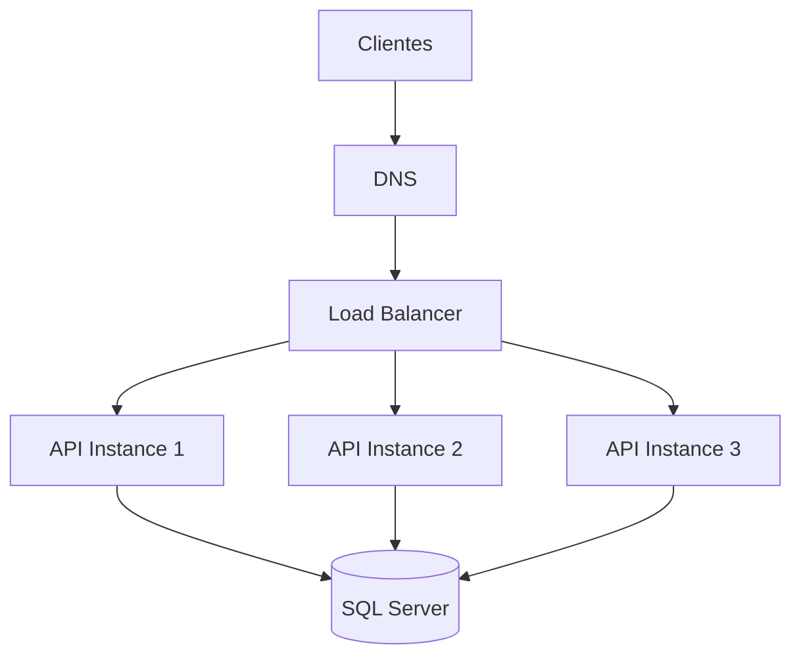
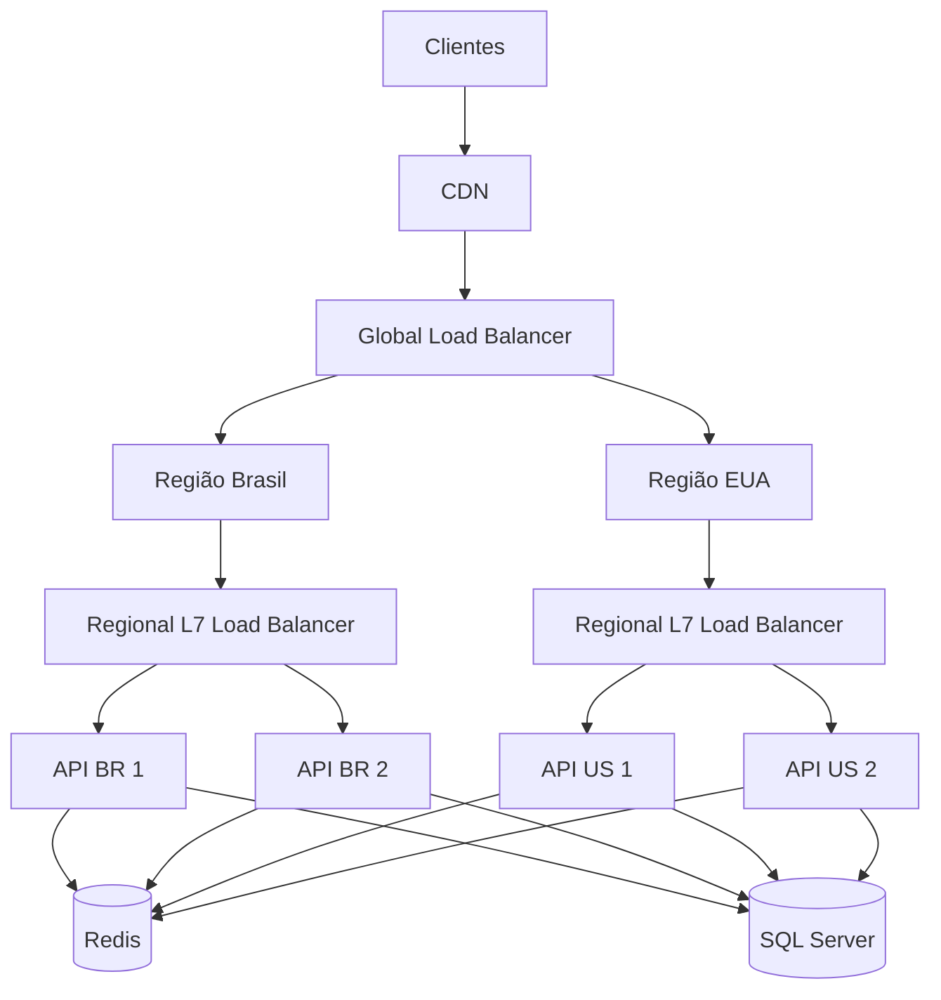
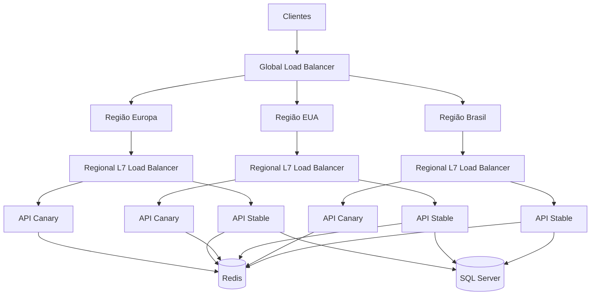

# Módulo 4 — Load Balancers

> [!abstract] Objetivo  
> Entender o que são load balancers, quais problemas resolvem, os principais tipos, algoritmos de distribuição, formas de escalar e os trade-offs envolvidos em cada decisão.

---

## Sumário

1. [[#1. O que é um Load Balancer]]
    
2. [[#2. Por que usar Load Balancers]]
    
3. [[#3. Arquitetura básica]]
    
4. [[#4. Tipos de Load Balancers]]
    
5. [[#5. Load Balancer de camada 4]]
    
6. [[#6. Load Balancer de camada 7]]
    
7. [[#7. Load Balancer interno e externo]]
    
8. [[#8. Load Balancer de hardware e software]]
    
9. [[#9. Load Balancer gerenciado em nuvem]]
    
10. [[#10. DNS Load Balancing]]
    
11. [[#11. Global Load Balancing]]
    
12. [[#12. Algoritmos de Load Balancing]]
    
13. [[#13. Round Robin]]
    
14. [[#14. Weighted Round Robin]]
    
15. [[#15. Least Connections]]
    
16. [[#16. Weighted Least Connections]]
    
17. [[#17. Least Response Time]]
    
18. [[#18. Random]]
    
19. [[#19. Hash]]
    
20. [[#20. Consistent Hashing]]
    
21. [[#21. IP Hash]]
    
22. [[#22. Power of Two Choices]]
    
23. [[#23. Health Checks]]
    
24. [[#24. Active e Passive Health Checks]]
    
25. [[#25. Session Affinity]]
    
26. [[#26. Sticky Sessions]]
    
27. [[#27. Stateless Applications]]
    
28. [[#28. Load Balancer e TLS]]
    
29. [[#29. Reverse Proxy e Load Balancer]]
    
30. [[#30. Load Balancer e API Gateway]]
    
31. [[#31. Load Balancer e Service Discovery]]
    
32. [[#32. Load Balancing em Kubernetes]]
    
33. [[#33. Escalando o próprio Load Balancer]]
    
34. [[#34. Alta disponibilidade]]
    
35. [[#35. Load Balancing e bancos de dados]]
    
36. [[#36. Exemplo com C#]]
    
37. [[#37. Exemplo com SQL Server]]
    
38. [[#38. Trade-offs]]
    
39. [[#39. Gargalos e limitações]]
    
40. [[#40. Observabilidade]]
    
41. [[#41. Segurança]]
    
42. [[#42. Custos]]
    
43. [[#43. Arquitetura de exemplo]]
    
44. [[#44. Checklist de produção]]
    
45. [[#45. Regras práticas]]
    
46. [[#46. Questões de entrevista]]
    
47. [[#47. Exercício prático]]
    

---

# 1. O que é um Load Balancer

Um **Load Balancer**, ou balanceador de carga, é um componente que recebe tráfego e distribui requisições entre múltiplos servidores.

```text
Clientes
   |
   v
Load Balancer
   |
   +--> Servidor A
   +--> Servidor B
   +--> Servidor C
```

Sem um load balancer, o cliente precisaria conhecer diretamente o endereço de cada servidor.

```text
Cliente --> Servidor A
Cliente --> Servidor B
Cliente --> Servidor C
```

Isso cria vários problemas:

- O cliente precisa conhecer a infraestrutura.
    
- Servidores indisponíveis continuam recebendo tráfego.
    
- Escalar exige alterar configurações dos clientes.
    
- A distribuição pode ficar desequilibrada.
    
- A manutenção se torna mais complexa.
    

Com um load balancer:

```text
Cliente --> endereço único --> vários servidores
```

O cliente conhece apenas um endpoint.

Exemplo:

```text
https://api.exemplo.com
```

O load balancer decide qual instância deve atender cada requisição.

---

# 2. Por que usar Load Balancers

Os principais objetivos são:

- Distribuir tráfego.
    
- Evitar sobrecarga.
    
- Aumentar disponibilidade.
    
- Permitir escalabilidade horizontal.
    
- Remover servidores com falha.
    
- Facilitar deploys.
    
- Centralizar TLS.
    
- Aplicar regras de roteamento.
    
- Permitir manutenção sem indisponibilidade.
    

## 2.1. Distribuição de carga

Sem balanceamento:

```text
Servidor A: 1.000 requisições
Servidor B: 100 requisições
Servidor C: 50 requisições
```

Com balanceamento:

```text
Servidor A: 390 requisições
Servidor B: 380 requisições
Servidor C: 380 requisições
```

## 2.2. Alta disponibilidade

Se uma instância falhar:

```text
Servidor A: saudável
Servidor B: indisponível
Servidor C: saudável
```

O load balancer para de enviar tráfego ao servidor B.

```text
Load Balancer
   |
   +--> Servidor A
   |
   X--> Servidor B
   |
   +--> Servidor C
```

## 2.3. Escalabilidade horizontal

Ao aumentar a demanda, novas instâncias podem ser adicionadas.

```text
Antes:

Load Balancer
   |
   +--> API 1
   +--> API 2
```

```text
Depois:

Load Balancer
   |
   +--> API 1
   +--> API 2
   +--> API 3
   +--> API 4
   +--> API 5
```

O cliente continua usando o mesmo endereço.

---

# 3. Arquitetura básica



## Fluxo

```text
1. Cliente resolve o domínio.
2. DNS retorna o endereço do load balancer.
3. Cliente envia uma requisição.
4. Load balancer verifica servidores disponíveis.
5. Algoritmo escolhe um servidor.
6. Requisição é encaminhada.
7. Resposta retorna ao cliente.
```

---

# 4. Tipos de Load Balancers

Load balancers podem ser classificados por diferentes critérios.

## Pela camada de rede

- Layer 4.
    
- Layer 7.
    

## Pela localização

- Externo.
    
- Interno.
    
- Global.
    
- Regional.
    

## Pela implementação

- Hardware.
    
- Software.
    
- Serviço gerenciado.
    

## Pela forma de distribuição

- Proxy.
    
- DNS.
    
- Client-side.
    
- Server-side.
    

---

# 5. Load Balancer de camada 4

Um load balancer de camada 4 opera na camada de transporte.

Protocolos comuns:

- TCP.
    
- UDP.
    
- TLS passthrough.
    

Ele normalmente toma decisões com base em:

- IP de origem.
    
- IP de destino.
    
- Porta de origem.
    
- Porta de destino.
    
- Protocolo.
    

```text
Cliente
   |
   | TCP
   v
Layer 4 Load Balancer
   |
   +--> Server A:443
   +--> Server B:443
```

## O que ele não analisa normalmente

Um balanceador L4 não precisa interpretar:

- URL.
    
- Headers HTTP.
    
- Cookies.
    
- Método HTTP.
    
- Corpo da requisição.
    

## Vantagens

- Alta performance.
    
- Menor latência.
    
- Menor uso de CPU.
    
- Suporta protocolos não HTTP.
    
- Pode lidar com TCP e UDP.
    
- Menor complexidade de processamento.
    

## Desvantagens

- Menos inteligência de roteamento.
    
- Não consegue rotear por URL.
    
- Não consegue tomar decisões por headers.
    
- Menos recursos de aplicação.
    

## Quando usar

- Tráfego TCP de alto volume.
    
- Bancos de dados.
    
- Jogos online.
    
- Sistemas de baixa latência.
    
- Protocolos proprietários.
    
- TLS passthrough.
    
- Serviços que não usam HTTP.
    

## Exemplo real

```text
Cliente SQL
   |
   v
TCP Load Balancer
   |
   +--> SQL Proxy A
   +--> SQL Proxy B
```

---

# 6. Load Balancer de camada 7

Um load balancer de camada 7 opera na camada de aplicação.

Ele entende protocolos como:

- HTTP.
    
- HTTPS.
    
- WebSocket.
    
- gRPC, dependendo da implementação.
    

Pode tomar decisões com base em:

- Host.
    
- URL.
    
- Método HTTP.
    
- Headers.
    
- Cookies.
    
- Query string.
    
- Content type.
    

## Roteamento por caminho

```text
/api/orders   --> Order Service
/api/payments --> Payment Service
/api/users    --> User Service
```

## Roteamento por host

```text
api.exemplo.com   --> APIs
admin.exemplo.com --> Backoffice
cdn.exemplo.com   --> Conteúdo estático
```

## Roteamento por header

```text
X-API-Version: 1 --> API V1
X-API-Version: 2 --> API V2
```

## Vantagens

- Roteamento avançado.
    
- Terminação TLS.
    
- Reescrita de URLs.
    
- Redirecionamento HTTP.
    
- Compressão.
    
- Rate limiting.
    
- Integração com autenticação.
    
- Canary releases.
    
- Blue-green deployments.
    

## Desvantagens

- Maior consumo de CPU.
    
- Maior latência.
    
- Mais complexidade.
    
- O load balancer precisa entender o protocolo.
    
- Pode se tornar um gargalo de aplicação.
    

## Quando usar

- APIs HTTP.
    
- Microserviços.
    
- Roteamento por URL.
    
- Aplicações web.
    
- Canary deployment.
    
- API versioning.
    
- WebSockets.
    
- gRPC com suporte apropriado.
    

---

# 7. Load Balancer interno e externo

## Load Balancer externo

Recebe tráfego vindo da internet.

```text
Internet
   |
   v
External Load Balancer
   |
   +--> Web Server A
   +--> Web Server B
```

Casos de uso:

- Sites públicos.
    
- APIs públicas.
    
- Aplicações móveis.
    
- Portais.
    

## Load Balancer interno

Recebe tráfego dentro de uma rede privada.

```text
Order Service
      |
      v
Internal Load Balancer
      |
      +--> Payment Service A
      +--> Payment Service B
```

Casos de uso:

- Comunicação entre microserviços.
    
- Bancos.
    
- Sistemas internos.
    
- APIs privadas.
    
- Serviços administrativos.
    

## Por que separar

Separar load balancers internos e externos:

- Reduz exposição.
    
- Melhora segurança.
    
- Permite regras diferentes.
    
- Evita acesso público desnecessário.
    
- Facilita segmentação de rede.
    

---

# 8. Load Balancer de hardware e software

## Hardware Load Balancer

Dispositivo físico dedicado.

Exemplos tradicionais:

- F5.
    
- Citrix ADC.
    
- A10 Networks.
    

### Vantagens

- Alto desempenho.
    
- Recursos especializados.
    
- Suporte empresarial.
    
- Offload de TLS.
    
- Hardware otimizado.
    

### Desvantagens

- Alto custo.
    
- Escala menos flexível.
    
- Provisionamento lento.
    
- Dependência de fornecedor.
    
- Operação especializada.
    

## Software Load Balancer

Executado em servidores comuns ou containers.

Exemplos:

- NGINX.
    
- HAProxy.
    
- Envoy.
    
- Traefik.
    
- YARP.
    
- Caddy.
    

### Vantagens

- Flexibilidade.
    
- Automação.
    
- Menor custo inicial.
    
- Integração com infraestrutura como código.
    
- Escala horizontal.
    

### Desvantagens

- Exige operação.
    
- Consome recursos dos servidores.
    
- Precisa de alta disponibilidade.
    
- Atualizações e patches são responsabilidade da equipe.
    

---

# 9. Load Balancer gerenciado em nuvem

Provedores de nuvem oferecem load balancers como serviço.

Exemplos conceituais:

```text
AWS:
- Application Load Balancer
- Network Load Balancer

Azure:
- Azure Load Balancer
- Application Gateway
- Front Door

Google Cloud:
- Cloud Load Balancing
```

## Vantagens

- Alta disponibilidade gerenciada.
    
- Integração com autoscaling.
    
- Health checks.
    
- Certificados gerenciados.
    
- Integração com WAF.
    
- Menor esforço operacional.
    
- Escala automática.
    

## Desvantagens

- Custo recorrente.
    
- Vendor lock-in.
    
- Menor controle.
    
- Limites específicos do provedor.
    
- Custos de processamento e tráfego.
    
- Comportamentos particulares de timeout.
    

## Quando escolher

Na maioria dos sistemas em nuvem, um load balancer gerenciado é a escolha inicial mais segura.

A equipe deve operar um load balancer próprio quando houver uma necessidade clara de:

- Controle avançado.
    
- Portabilidade.
    
- Customização.
    
- Protocolos específicos.
    
- Otimização de custo em grande escala.
    
- Infraestrutura híbrida.
    

---

# 10. DNS Load Balancing

DNS load balancing distribui diferentes endereços IP para o mesmo domínio.

```text
api.exemplo.com
   |
   +--> 10.0.0.1
   +--> 10.0.0.2
   +--> 10.0.0.3
```

## Round Robin DNS

O servidor DNS alterna a ordem dos IPs retornados.

```text
Consulta 1:
10.0.0.1
10.0.0.2
10.0.0.3
```

```text
Consulta 2:
10.0.0.2
10.0.0.3
10.0.0.1
```

## Vantagens

- Simples.
    
- Distribuição global.
    
- Baixo custo.
    
- Pode direcionar por região.
    
- Não exige proxy no caminho.
    

## Desvantagens

- Cache de DNS.
    
- TTL atrasa mudanças.
    
- Clientes podem continuar usando IP indisponível.
    
- Não conhece carga real.
    
- Menor controle por requisição.
    
- Failover pode ser lento.
    

## Regra prática

DNS load balancing funciona melhor como uma camada global.

Um load balancer regional pode atuar depois:

```text
Cliente
   |
   v
Global DNS
   |
   +--> Região Brasil
   |       |
   |       v
   |   Regional Load Balancer
   |
   +--> Região Estados Unidos
           |
           v
       Regional Load Balancer
```

---

# 11. Global Load Balancing

Um global load balancer distribui tráfego entre regiões.

```text
Usuário Brasil
   |
   v
Região São Paulo
```

```text
Usuário Europa
   |
   v
Região Frankfurt
```

Critérios possíveis:

- Menor latência.
    
- Proximidade geográfica.
    
- Saúde da região.
    
- Custo.
    
- Capacidade.
    
- Requisitos de residência de dados.
    
- Prioridade.
    

## Active-Active

Duas ou mais regiões atendem tráfego simultaneamente.

```text
Global Load Balancer
   |
   +--> Região A: ativa
   +--> Região B: ativa
```

### Vantagens

- Melhor uso de recursos.
    
- Menor latência global.
    
- Maior disponibilidade.
    
- Failover mais rápido.
    

### Desvantagens

- Dados distribuídos.
    
- Consistência mais complexa.
    
- Mais custo.
    
- Roteamento e observabilidade mais difíceis.
    

## Active-Passive

Uma região atende tráfego e outra permanece em espera.

```text
Global Load Balancer
   |
   +--> Região A: ativa
   +--> Região B: standby
```

### Vantagens

- Arquitetura de dados mais simples.
    
- Menor risco de conflito.
    
- Operação mais previsível.
    

### Desvantagens

- Recursos ociosos.
    
- Failover mais lento.
    
- Região secundária pode não estar suficientemente testada.
    

---

# 12. Algoritmos de Load Balancing

O algoritmo determina como o próximo servidor será escolhido.

Principais algoritmos:

- Round Robin.
    
- Weighted Round Robin.
    
- Least Connections.
    
- Weighted Least Connections.
    
- Least Response Time.
    
- Random.
    
- Hash.
    
- Consistent Hashing.
    
- IP Hash.
    
- Power of Two Choices.
    

A escolha depende de:

- Duração das requisições.
    
- Capacidade dos servidores.
    
- Persistência de sessão.
    
- Distribuição do tráfego.
    
- Custo de medir carga.
    
- Necessidade de estabilidade.
    

---

# 13. Round Robin

O Round Robin distribui requisições sequencialmente.

```text
Requisição 1 --> Server A
Requisição 2 --> Server B
Requisição 3 --> Server C
Requisição 4 --> Server A
```

## Exemplo

```text
Servidores:
A
B
C
```

Sequência:

```text
A, B, C, A, B, C...
```

## Vantagens

- Muito simples.
    
- Baixo custo computacional.
    
- Distribuição equilibrada quando servidores são semelhantes.
    
- Não exige métricas em tempo real.
    

## Desvantagens

- Ignora carga atual.
    
- Ignora duração das requisições.
    
- Ignora capacidade diferente dos servidores.
    
- Pode enviar trabalho a um servidor já sobrecarregado.
    

## Quando usar

- Servidores com capacidade semelhante.
    
- Requisições de duração parecida.
    
- Serviços stateless.
    
- Tráfego relativamente uniforme.
    

## Exemplo problemático

```text
Request 1: 10 segundos --> Server A
Request 2: 100 ms       --> Server B
Request 3: 100 ms       --> Server C
Request 4: 10 segundos  --> Server A
```

O Server A pode acumular requisições demoradas por acaso.

---

# 14. Weighted Round Robin

Weighted Round Robin atribui pesos aos servidores.

```text
Server A: peso 5
Server B: peso 3
Server C: peso 2
```

Em cada 10 requisições aproximadamente:

```text
Server A recebe 5
Server B recebe 3
Server C recebe 2
```

## Quando usar

- Servidores com capacidades diferentes.
    
- Migrações.
    
- Canary deployments.
    
- Máquinas com tamanhos distintos.
    
- Gradual traffic shifting.
    

## Exemplo de canary

```text
Versão estável: peso 95
Versão nova:    peso 5
```

```text
95% das requisições --> versão estável
5% das requisições  --> versão nova
```

## Vantagens

- Simples.
    
- Permite capacidades diferentes.
    
- Bom para deploy gradual.
    
- Baixo custo de decisão.
    

## Desvantagens

- Pesos podem ficar desatualizados.
    
- Não considera carga real.
    
- Requer calibração.
    
- Uma instância com peso alto pode estar temporariamente degradada.
    

---

# 15. Least Connections

Least Connections envia a próxima requisição ao servidor com menos conexões ativas.

```text
Server A: 100 conexões
Server B: 40 conexões
Server C: 75 conexões
```

Próxima requisição:

```text
Server B
```

## Por que usar

É útil quando:

- Requisições têm durações diferentes.
    
- Existem conexões persistentes.
    
- O número de conexões representa razoavelmente a carga.
    

## Vantagens

- Reage à carga atual.
    
- Melhor para requisições longas.
    
- Melhor para WebSockets.
    
- Melhor para conexões persistentes.
    

## Desvantagens

- Exige monitorar conexões.
    
- Uma conexão pode ser barata ou cara.
    
- Nem toda conexão representa a mesma carga.
    
- Pode favorecer uma instância recém-iniciada excessivamente.
    

## Exemplo

```text
Server A:
10 conexões executando relatórios pesados

Server B:
30 conexões pequenas
```

Least Connections escolheria o Server A, embora ele possa estar mais sobrecarregado.

---

# 16. Weighted Least Connections

Combina:

- Número de conexões.
    
- Capacidade do servidor.
    

Exemplo:

```text
Server A:
peso 4
80 conexões

Server B:
peso 2
30 conexões
```

A decisão considera conexões relativas à capacidade.

Uma fórmula conceitual:

```text
Carga relativa = conexões ativas / peso
```

```text
Server A = 80 / 4 = 20
Server B = 30 / 2 = 15
```

Próxima requisição:

```text
Server B
```

## Vantagens

- Considera capacidade.
    
- Considera carga atual.
    
- Melhor para ambientes heterogêneos.
    

## Desvantagens

- Mais complexo.
    
- Pesos precisam ser bem definidos.
    
- Número de conexões ainda é uma aproximação.
    

---

# 17. Least Response Time

Envia tráfego ao servidor com menor tempo de resposta observado.

Pode combinar:

```text
Tempo de resposta
+
Número de conexões
```

Exemplo:

```text
Server A: 40 ms
Server B: 120 ms
Server C: 70 ms
```

Próxima requisição:

```text
Server A
```

## Vantagens

- Reage ao desempenho real.
    
- Pode reduzir latência.
    
- Detecta degradação antes de uma falha completa.
    

## Desvantagens

- Exige medição contínua.
    
- Métricas podem oscilar.
    
- Risco de concentrar tráfego no servidor mais rápido.
    
- O servidor mais rápido pode ficar sobrecarregado rapidamente.
    
- Latência passada não garante latência futura.
    

## Problema de feedback

```text
Server A fica rápido
      |
      v
Recebe mais tráfego
      |
      v
Fica mais lento
      |
      v
Tráfego migra para B
```

Pode haver oscilação.

---

# 18. Random

Escolhe um servidor aleatoriamente.

```text
Request --> random(A, B, C)
```

## Vantagens

- Muito simples.
    
- Baixo custo.
    
- Boa distribuição em volumes grandes.
    
- Não exige estado compartilhado.
    

## Desvantagens

- Pode gerar desequilíbrio em amostras pequenas.
    
- Ignora carga.
    
- Ignora capacidade.
    
- Ignora latência.
    

## Quando usar

- Grandes volumes.
    
- Servidores homogêneos.
    
- Sistemas distribuídos simples.
    
- Quando vários load balancers precisam decidir sem coordenação.
    

---

# 19. Hash

O servidor é escolhido a partir de uma chave.

```text
server = hash(key) % quantidade_de_servidores
```

A chave pode ser:

- UserId.
    
- SessionId.
    
- CustomerId.
    
- IP.
    
- URL.
    
- TenantId.
    

## Exemplo

```text
hash(CustomerId 1001) --> Server B
hash(CustomerId 1002) --> Server A
hash(CustomerId 1003) --> Server C
```

## Vantagens

- Afinidade determinística.
    
- Mesmo usuário tende a ir ao mesmo servidor.
    
- Útil para caches locais.
    
- Útil para particionamento.
    

## Desvantagens

- Adicionar ou remover servidores redistribui muitas chaves.
    
- Pode criar hot spots.
    
- Uma chave muito popular pode sobrecarregar um servidor.
    
- Pode dificultar failover.
    

---

# 20. Consistent Hashing

Consistent Hashing reduz a quantidade de chaves redistribuídas quando servidores entram ou saem.

## Hash tradicional

```text
hash(key) % N
```

Se `N` mudar:

```text
N = 3
```

para:

```text
N = 4
```

Muitas chaves mudam de servidor.

## Consistent Hashing

Servidores e chaves são posicionados em um anel lógico.

```text
             Server A
                |
        Key 1   |   Key 2
                |
Server D ---------------- Server B
                |
        Key 4   |   Key 3
                |
             Server C
```

Cada chave é atribuída ao próximo servidor no anel.

Quando um servidor é adicionado, apenas parte das chaves é movida.

## Vantagens

- Menor redistribuição.
    
- Bom para caches.
    
- Bom para sistemas particionados.
    
- Facilita crescimento do cluster.
    

## Desvantagens

- Mais complexo.
    
- Pode gerar distribuição desigual.
    
- Normalmente exige virtual nodes.
    
- Hot keys continuam possíveis.
    

## Virtual Nodes

Cada servidor físico recebe múltiplas posições no anel.

```text
Server A:
A1
A2
A3

Server B:
B1
B2
B3
```

Isso melhora o equilíbrio.

## Casos de uso

- Distributed cache.
    
- Sharding.
    
- CDN.
    
- Storage distribuído.
    
- Afinidade de processamento.
    

---

# 21. IP Hash

O endereço IP do cliente é usado como chave.

```text
hash(client_ip) --> servidor
```

## Vantagens

- Afinidade simples.
    
- Não exige cookie.
    
- Mesmo IP tende a acessar o mesmo servidor.
    

## Desvantagens

- Muitos usuários podem compartilhar o mesmo IP.
    
- NAT pode concentrar tráfego.
    
- IP pode mudar.
    
- IPv4 e IPv6 complicam consistência.
    
- Proxies podem ocultar o IP real.
    
- Pode causar distribuição desigual.
    

## Exemplo problemático

Uma empresa possui 10 mil funcionários atrás do mesmo NAT.

```text
10.000 usuários
      |
      v
Mesmo IP público
      |
      v
Mesmo servidor
```

Isso cria um hot spot.

---

# 22. Power of Two Choices

O algoritmo escolhe dois servidores aleatoriamente e envia a requisição ao menos carregado.

```text
1. Escolhe A e C.
2. Compara a carga.
3. Envia para o menos carregado.
```

## Por que funciona

Ele combina:

- Baixo custo do random.
    
- Informação parcial de carga.
    
- Boa distribuição.
    

## Vantagens

- Menor complexidade que comparar todos os servidores.
    
- Bom equilíbrio.
    
- Escala bem com muitos servidores.
    
- Reduz hot spots.
    

## Desvantagens

- Ainda exige uma métrica de carga.
    
- A métrica pode estar desatualizada.
    
- Não garante a melhor escolha global.
    

## Quando usar

- Clusters grandes.
    
- Sistemas altamente distribuídos.
    
- Load balancers descentralizados.
    
- Quando consultar todos os servidores é caro.
    

---

# 23. Health Checks

Health checks determinam se uma instância está apta a receber tráfego.

```text
Load Balancer
   |
   +--> /health --> Server A: 200 OK
   +--> /health --> Server B: 500 Error
```

Resultado:

```text
Server A recebe tráfego.
Server B é removido temporariamente.
```

## Tipos de health check

- TCP.
    
- HTTP.
    
- HTTPS.
    
- gRPC.
    
- Comando customizado.
    

## TCP Health Check

Verifica se a porta aceita conexão.

```text
Consegue abrir TCP 443?
```

### Vantagem

Simples e rápido.

### Desvantagem

A aplicação pode aceitar conexões e ainda estar quebrada.

## HTTP Health Check

```http
GET /health
```

Resposta:

```http
HTTP/1.1 200 OK
```

Pode verificar:

- Aplicação.
    
- Configuração.
    
- Dependências essenciais.
    
- Estado de inicialização.
    

---

# 24. Active e Passive Health Checks

## Active Health Check

O load balancer consulta periodicamente as instâncias.

```text
A cada 10 segundos:
GET /health
```

### Vantagens

- Detecta falhas sem depender de tráfego real.
    
- Permite remoção rápida.
    

### Desvantagens

- Gera tráfego adicional.
    
- Pode remover instâncias por falhas temporárias.
    
- Configuração agressiva causa flapping.
    

## Passive Health Check

O load balancer observa respostas reais.

Exemplo:

```text
Server A retorna vários 500.
Load balancer marca como degradado.
```

### Vantagens

- Usa tráfego real.
    
- Detecta erros que o endpoint de health não detecta.
    
- Não gera consultas extras.
    

### Desvantagens

- Usuários reais experimentam a falha.
    
- Pode demorar para detectar em baixo tráfego.
    

## Melhor abordagem

Combinar active e passive health checks.

---

# 25. Session Affinity

Session affinity significa manter requisições relacionadas no mesmo servidor.

```text
Usuário A --> Server 1
Usuário A --> Server 1
Usuário A --> Server 1
```

Pode ser implementado com:

- Cookie.
    
- IP hash.
    
- Session ID.
    
- Header.
    
- Consistent hashing.
    

## Por que usar

Aplicações antigas frequentemente armazenam sessão em memória.

```text
Server A:
Session User 1001
Carrinho
Preferências
```

Se a próxima requisição for para o Server B:

```text
Server B não conhece a sessão.
```

---

# 26. Sticky Sessions

Sticky session é uma forma de session affinity.

O load balancer cria ou utiliza um cookie.

```http
Set-Cookie: SERVER_ID=A
```

Nas próximas requisições:

```text
Cookie SERVER_ID=A
      |
      v
Server A
```

## Vantagens

- Fácil adaptação de sistemas stateful.
    
- Reduz consultas a um storage central.
    
- Pode melhorar cache local.
    

## Desvantagens

- Distribuição desigual.
    
- Falha do servidor perde a afinidade.
    
- Dificulta autoscaling.
    
- Dificulta deploys.
    
- Estado local reduz resiliência.
    
- Pode criar sobrecarga em um nó.
    

## Problema durante deploy

```text
Usuários presos na versão antiga.
Novos usuários na versão nova.
```

Isso pode dificultar migração.

## Regra prática

Sticky sessions são úteis como solução transitória.

Para sistemas modernos, prefira aplicações stateless.

---

# 27. Stateless Applications

Uma aplicação stateless não depende de estado local entre requisições.

```text
Request 1 --> Server A
Request 2 --> Server C
Request 3 --> Server B
```

Todas funcionam corretamente.

## Onde armazenar estado

- Redis.
    
- SQL Server.
    
- Banco distribuído.
    
- JWT, com cautela.
    
- Object storage.
    
- Cache compartilhado.
    

## Exemplo com sessão distribuída

```text
Clients
   |
   v
Load Balancer
   |
   +--> API A
   +--> API B
   +--> API C
          |
          v
        Redis
```

## Vantagens

- Escala horizontal simples.
    
- Failover mais fácil.
    
- Deploys mais seguros.
    
- Menor dependência de sticky sessions.
    
- Melhor uso dos servidores.
    

## Desvantagens

- Requer storage compartilhado.
    
- Aumenta chamadas de rede.
    
- Redis pode virar gargalo.
    
- Estado distribuído exige consistência.
    

---

# 28. Load Balancer e TLS

Existem três modelos comuns.

## TLS Termination

O load balancer encerra a conexão TLS.

```text
Cliente -- HTTPS --> Load Balancer -- HTTP --> Backend
```

### Vantagens

- Reduz custo de TLS nos backends.
    
- Centraliza certificados.
    
- Permite inspeção HTTP.
    
- Facilita roteamento de camada 7.
    

### Desvantagens

- Tráfego interno pode ficar sem criptografia.
    
- Load balancer vê dados em texto claro.
    
- Certificados ficam centralizados.
    

## TLS Re-encryption

```text
Cliente -- HTTPS --> Load Balancer -- HTTPS --> Backend
```

### Vantagens

- Criptografia ponta a ponta por segmentos.
    
- Load balancer ainda pode inspecionar HTTP.
    
- Melhor para ambientes regulados.
    

### Desvantagens

- Mais CPU.
    
- Mais certificados.
    
- Mais complexidade operacional.
    

## TLS Passthrough

```text
Cliente -- HTTPS --------------------> Backend
                  Load Balancer L4
```

O load balancer não encerra TLS.

### Vantagens

- Criptografia termina apenas no backend.
    
- Load balancer não acessa o conteúdo.
    
- Menor responsabilidade sobre certificados.
    

### Desvantagens

- Sem roteamento HTTP avançado.
    
- Certificados em cada backend.
    
- Maior custo de TLS nos servidores.
    

---

# 29. Reverse Proxy e Load Balancer

Um reverse proxy recebe requisições em nome de servidores internos.

```text
Cliente --> Reverse Proxy --> Servidor
```

Funções comuns:

- Terminação TLS.
    
- Cache.
    
- Compressão.
    
- Autenticação.
    
- Reescrita de URL.
    
- Ocultação dos backends.
    
- Rate limiting.
    
- Logging.
    

Um load balancer é frequentemente um reverse proxy com capacidade de distribuir tráfego.

## Diferença conceitual

```text
Reverse Proxy:
um ponto intermediário na frente dos servidores

Load Balancer:
distribui tráfego entre múltiplos destinos
```

Na prática, ferramentas como NGINX, HAProxy e Envoy fazem ambos.

---

# 30. Load Balancer e API Gateway

Embora possam se sobrepor, têm responsabilidades diferentes.

## Load Balancer

Foco principal:

- Distribuição de tráfego.
    
- Health checks.
    
- Alta disponibilidade.
    
- TLS.
    
- Roteamento.
    

## API Gateway

Foco principal:

- Autenticação.
    
- Autorização.
    
- Rate limiting por cliente.
    
- API keys.
    
- Quotas.
    
- Versionamento.
    
- Transformação de requests.
    
- Monetização.
    
- Developer portal.
    
- Políticas de API.
    

## Arquitetura comum

```text
Clientes
   |
   v
API Gateway
   |
   v
Load Balancer
   |
   +--> API A
   +--> API B
   +--> API C
```

Ou:

```text
Clientes
   |
   v
Load Balancer
   |
   v
API Gateway Cluster
```

A organização depende da tecnologia e da arquitetura.

---

# 31. Load Balancer e Service Discovery

Em sistemas dinâmicos, instâncias entram e saem continuamente.

O load balancer precisa saber quais estão disponíveis.

## Service Registry

```text
Service Instances
      |
      v
Service Registry
      |
      v
Load Balancer
```

Exemplos conceituais:

- Consul.
    
- Kubernetes API.
    
- DNS interno.
    
- Service mesh.
    
- Cloud service registry.
    

## Server-side Load Balancing

O cliente chama um load balancer.

```text
Client --> Load Balancer --> Service Instance
```

### Vantagens

- Clientes simples.
    
- Lógica centralizada.
    
- Fácil manutenção.
    

### Desvantagens

- Novo hop de rede.
    
- Load balancer pode virar gargalo.
    

## Client-side Load Balancing

O cliente obtém a lista de instâncias e escolhe uma.

```text
Client --> Service Registry
Client --> Service Instance
```

### Vantagens

- Evita hop intermediário.
    
- Pode reduzir latência.
    
- Distribuição descentralizada.
    

### Desvantagens

- Lógica em cada cliente.
    
- Bibliotecas por linguagem.
    
- Atualização mais difícil.
    
- Estado de saúde pode ficar desatualizado.
    

---

# 32. Load Balancing em Kubernetes

Em Kubernetes, existem vários níveis.

## Service

Um Service fornece um endpoint estável para Pods.

```text
Service
   |
   +--> Pod A
   +--> Pod B
   +--> Pod C
```

## Ingress

O Ingress oferece roteamento HTTP externo.

```text
Internet
   |
   v
Ingress Controller
   |
   +--> /orders   --> Order Service
   +--> /payments --> Payment Service
```

## Service Mesh

Um service mesh pode realizar load balancing entre serviços.

```text
Service A Sidecar
       |
       v
Service B Sidecars
```

Recursos:

- Retries.
    
- Circuit breaking.
    
- mTLS.
    
- Telemetria.
    
- Load balancing.
    
- Traffic shifting.
    

## Cuidado com múltiplas camadas

```text
Cloud Load Balancer
        |
        v
Ingress
        |
        v
Kubernetes Service
        |
        v
Service Mesh
        |
        v
Pod
```

Cada camada adiciona:

- Latência.
    
- Complexidade.
    
- Timeout.
    
- Métricas.
    
- Possíveis retries.
    
- Dificuldade de debugging.
    

---

# 33. Escalando o próprio Load Balancer

O load balancer também possui limite de capacidade.

## Problema

```text
Milhões de clientes
       |
       v
Um único Load Balancer
```

Ele pode se tornar:

- Gargalo.
    
- Ponto único de falha.
    
- Limite de conexões.
    
- Limite de CPU.
    
- Limite de largura de banda.
    

## Estratégias

- Múltiplas instâncias.
    
- Active-active.
    
- Anycast.
    
- DNS load balancing.
    
- Load balancer gerenciado.
    
- Autoscaling.
    
- Sharding por domínio ou região.
    

## Arquitetura

```text
DNS
 |
 +--> Load Balancer A
 +--> Load Balancer B
 +--> Load Balancer C
```

## Estado compartilhado

Se load balancers mantêm estado local, surgem problemas com:

- Sticky sessions.
    
- Métricas.
    
- Rate limiting.
    
- Circuit breakers.
    
- Configuração dinâmica.
    

Prefira load balancers stateless ou com estado externo replicado.

---

# 34. Alta disponibilidade

Um único load balancer é um ponto único de falha.

```text
Clientes
   |
   v
Load Balancer único
   |
   X falha
```

Mesmo com vários backends saudáveis, o sistema fica indisponível.

## Active-Passive

```text
Load Balancer A: ativo
Load Balancer B: standby
```

Quando A falha, B assume.

### Vantagens

- Simples.
    
- Menor complexidade de coordenação.
    

### Desvantagens

- Recursos ociosos.
    
- Tempo de failover.
    
- Risco de standby desatualizado.
    

## Active-Active

```text
Load Balancer A: ativo
Load Balancer B: ativo
```

Ambos recebem tráfego.

### Vantagens

- Melhor uso dos recursos.
    
- Maior capacidade.
    
- Failover rápido.
    

### Desvantagens

- Coordenação mais complexa.
    
- Sessão e estado devem ser distribuídos.
    
- Observabilidade mais difícil.
    

---

# 35. Load Balancing e bancos de dados

Balancear banco de dados é diferente de balancear APIs.

## Escrita

Em arquiteturas leader-follower:

```text
Writes --> Primary
```

## Leitura

```text
Reads
  |
  +--> Read Replica 1
  +--> Read Replica 2
  +--> Read Replica 3
```

## Exemplo

```text
Application
   |
   +--> Write Connection --> SQL Primary
   |
   +--> Read Connection --> Read Replica Load Balancer
```

## Trade-off

Read replicas normalmente possuem algum atraso.

```text
Write no Primary
      |
      v
Replication Lag
      |
      v
Read Replica atualizada
```

O usuário pode gravar e, imediatamente depois, ler um valor antigo.

## Estratégias

- Read-your-writes no primary.
    
- Sticky read temporário.
    
- Version check.
    
- Consistência eventual.
    
- Separar consultas críticas e não críticas.
    

## SQL Server

Em ambientes SQL Server, soluções podem envolver:

- Availability Groups.
    
- Read-only routing.
    
- Listener.
    
- Failover Cluster.
    
- Réplicas de leitura.
    
- Proxies externos.
    

---

# 36. Exemplo com C#

## API stateless

Uma API deve evitar estado de sessão local.

```csharp
var builder = WebApplication.CreateBuilder(args);

builder.Services.AddControllers();

builder.Services.AddHealthChecks()
    .AddSqlServer(
        builder.Configuration.GetConnectionString("SqlServer")!);

var app = builder.Build();

app.MapControllers();

app.MapHealthChecks("/health");

app.Run();
```

## Endpoint simples

```csharp
[ApiController]
[Route("api/orders")]
public sealed class OrdersController : ControllerBase
{
    private readonly ILogger<OrdersController> _logger;

    public OrdersController(
        ILogger<OrdersController> logger)
    {
        _logger = logger;
    }

    [HttpGet("{orderId:long}")]
    public IActionResult Get(long orderId)
    {
        var instanceName =
            Environment.GetEnvironmentVariable("HOSTNAME")
            ?? Environment.MachineName;

        _logger.LogInformation(
            "Order {OrderId} handled by instance {InstanceName}",
            orderId,
            instanceName);

        return Ok(new
        {
            OrderId = orderId,
            Instance = instanceName,
            ProcessedAtUtc = DateTime.UtcNow
        });
    }
}
```

Ao executar múltiplas instâncias:

```text
Request 1 --> API-1
Request 2 --> API-2
Request 3 --> API-3
```

A resposta permite visualizar qual instância processou a requisição.

## Evitando estado local

Evite:

```csharp
public static Dictionary<string, ShoppingCart> Carts = new();
```

Esse estado existe apenas em uma instância.

Prefira:

```text
API
 |
 v
Redis ou SQL Server
```

---

# 37. Exemplo com SQL Server

## Tabela de pedidos

```sql
CREATE TABLE dbo.Orders
(
    OrderId        BIGINT IDENTITY PRIMARY KEY,
    CustomerId     BIGINT NOT NULL,
    Status         VARCHAR(30) NOT NULL,
    Total          DECIMAL(18, 2) NOT NULL,
    CreatedAtUtc   DATETIME2 NOT NULL
        CONSTRAINT DF_Orders_CreatedAtUtc
        DEFAULT SYSUTCDATETIME(),
    UpdatedAtUtc   DATETIME2 NOT NULL
        CONSTRAINT DF_Orders_UpdatedAtUtc
        DEFAULT SYSUTCDATETIME(),
    RowVersion     ROWVERSION NOT NULL
);
```

## Concorrência otimista

Quando múltiplas instâncias acessam o mesmo registro, utilize controle de concorrência.

```sql
UPDATE dbo.Orders
SET
    Status = @NewStatus,
    UpdatedAtUtc = SYSUTCDATETIME()
WHERE OrderId = @OrderId
  AND RowVersion = @ExpectedRowVersion;
```

Depois:

```sql
IF @@ROWCOUNT = 0
BEGIN
    THROW 50001, 'Order was modified by another process.', 1;
END;
```

## Por que isso importa

O load balancer pode enviar duas requisições simultâneas para instâncias diferentes.

```text
Request A --> API 1
Request B --> API 2
```

Ambas podem tentar alterar o mesmo pedido.

O load balancer não resolve concorrência de dados.

Essa responsabilidade pertence à aplicação e ao banco.

## Connection Pooling

Cada instância da API mantém seu próprio pool de conexões.

```text
10 instâncias
x
100 conexões máximas
=
1.000 conexões potenciais
```

Escalar APIs pode sobrecarregar o SQL Server.

## Boas práticas

- Limitar pool.
    
- Monitorar conexões.
    
- Usar timeout.
    
- Evitar transações longas.
    
- Utilizar índices adequados.
    
- Aplicar retries somente em erros transitórios.
    
- Considerar connection pooler ou proxy quando aplicável.
    

---

# 38. Trade-offs

## Layer 4 versus Layer 7

|Layer 4|Layer 7|
|---|---|
|Mais rápido|Mais inteligente|
|Menor latência|Roteamento por URL|
|Suporta TCP e UDP|Entende HTTP|
|Menor uso de CPU|Maior uso de CPU|
|Menos regras|Mais flexibilidade|
|TLS passthrough comum|TLS termination comum|

## Round Robin versus Least Connections

|Round Robin|Least Connections|
|---|---|
|Simples|Considera carga|
|Baixo overhead|Mais complexo|
|Bom para requisições uniformes|Bom para conexões longas|
|Ignora duração|Reage à duração|
|Não exige métricas|Exige estado de conexões|

## Sticky Sessions versus Stateless

|Sticky Sessions|Stateless|
|---|---|
|Fácil para sistemas legados|Melhor para escala|
|Estado local|Estado compartilhado|
|Pode desequilibrar carga|Distribuição livre|
|Failover difícil|Failover simples|
|Deploy mais complexo|Deploy mais seguro|

## Hardware versus Software

|Hardware|Software|
|---|---|
|Alto desempenho dedicado|Flexibilidade|
|Alto custo|Menor custo inicial|
|Provisionamento lento|Automação|
|Suporte especializado|Escala horizontal|
|Menor portabilidade|Mais portável|

## Próprio versus gerenciado

|Autogerenciado|Gerenciado|
|---|---|
|Mais controle|Menor operação|
|Mais customização|Alta disponibilidade nativa|
|Equipe opera tudo|Provedor opera infraestrutura|
|Pode ser mais barato em grande escala|Pode custar mais por uso|
|Maior responsabilidade|Vendor lock-in|

## Active-Active versus Active-Passive

|Active-Active|Active-Passive|
|---|---|
|Maior utilização|Mais simples|
|Maior capacidade|Menor risco de conflito|
|Failover rápido|Recursos ociosos|
|Dados mais complexos|Failover pode ser lento|
|Mais caro|Menor complexidade|

---

# 39. Gargalos e limitações

## Limite de conexões

Um load balancer possui limites de:

- Conexões simultâneas.
    
- Novas conexões por segundo.
    
- Throughput.
    
- Pacotes por segundo.
    
- CPU.
    
- Memória.
    
- TLS handshakes.
    

## TLS Handshake

TLS pode ser caro.

```text
Muitas novas conexões
      |
      v
Muitos handshakes
      |
      v
Uso elevado de CPU
```

Mitigações:

- Keep-alive.
    
- Connection reuse.
    
- HTTP/2.
    
- HTTP/3, quando aplicável.
    
- TLS session resumption.
    
- Offload de TLS.
    

## Connection Draining

Durante um deploy, uma instância não deve ser removida imediatamente.

```text
1. Parar novas requisições.
2. Aguardar requisições atuais terminarem.
3. Remover a instância.
```

Isso é chamado de:

```text
Connection Draining
```

ou:

```text
Graceful Deregistration
```

Sem draining:

```text
Requisições em andamento podem ser interrompidas.
```

## Slow Start

Uma instância recém-iniciada pode precisar de tempo para:

- Aquecer caches.
    
- Compilar código.
    
- Abrir conexões.
    
- Carregar configurações.
    
- Inicializar dependências.
    

Slow start aumenta o tráfego gradualmente.

```text
10% --> 25% --> 50% --> 100%
```

## Retry Storm

Se o load balancer fizer retry e o cliente também fizer retry:

```text
Cliente: 3 tentativas
Load Balancer: 3 tentativas
Serviço: 3 tentativas
```

Uma requisição pode gerar:

```text
3 × 3 × 3 = 27 tentativas
```

Isso pode agravar uma falha.

---

# 40. Observabilidade

## Métricas essenciais

- Requisições por segundo.
    
- Conexões ativas.
    
- Novas conexões por segundo.
    
- Latência.
    
- P50.
    
- P95.
    
- P99.
    
- Taxa de erro.
    
- Respostas 4xx.
    
- Respostas 5xx.
    
- Backends saudáveis.
    
- Backends indisponíveis.
    
- TLS handshake time.
    
- Bytes enviados.
    
- Bytes recebidos.
    
- Requisições por backend.
    
- Rejeições.
    
- Timeouts.
    
- Retries.
    
- Connection resets.
    

## Distribuição por backend

Exemplo:

```text
API 1: 40%
API 2: 35%
API 3: 25%
```

Pode indicar:

- Algoritmo desigual.
    
- Pesos diferentes.
    
- Instância degradada.
    
- Sticky sessions.
    
- Health check instável.
    

## Logs

Um log de acesso pode conter:

```text
Timestamp
Client IP
Request Method
Path
Status
Latency
Backend
Request ID
Trace ID
Bytes
```

Exemplo conceitual:

```text
2026-07-13T15:30:00Z
GET /api/orders/1001
200
42ms
backend=api-3
traceId=abc123
```

## Distributed Tracing

Propague:

```text
TraceId
RequestId
CorrelationId
```

Fluxo:

```text
Cliente
   |
   v
Load Balancer
   |
   v
API
   |
   v
Serviço
   |
   v
SQL Server
```

---

# 41. Segurança

## WAF

Um Web Application Firewall pode bloquear:

- SQL injection.
    
- Cross-site scripting.
    
- Bots.
    
- Payloads maliciosos.
    
- Padrões suspeitos.
    
- IPs bloqueados.
    

## DDoS Protection

O load balancer pode atuar em conjunto com:

- Rate limiting.
    
- Anycast.
    
- CDN.
    
- Scrubbing centers.
    
- Bloqueio geográfico.
    
- Limites de conexão.
    

## Ocultação dos backends

Os servidores não devem ser acessíveis diretamente pela internet.

```text
Internet
   |
   v
Load Balancer público
   |
   v
Backends em rede privada
```

## Headers confiáveis

Tenha cuidado com:

```text
X-Forwarded-For
X-Forwarded-Proto
X-Forwarded-Host
```

A aplicação deve confiar nesses headers apenas quando enviados por proxies conhecidos.

## Exemplo ASP.NET Core

```csharp
using Microsoft.AspNetCore.HttpOverrides;

var builder = WebApplication.CreateBuilder(args);

builder.Services.Configure<ForwardedHeadersOptions>(options =>
{
    options.ForwardedHeaders =
        ForwardedHeaders.XForwardedFor
        | ForwardedHeaders.XForwardedProto;
});

var app = builder.Build();

app.UseForwardedHeaders();

app.Run();
```

Em produção, configure proxies e redes confiáveis.

---

# 42. Custos

Os custos podem incluir:

- Horas de execução.
    
- Número de regras.
    
- Dados processados.
    
- Novas conexões.
    
- Load balancer units.
    
- Certificados.
    
- Endereço IP.
    
- Tráfego entre regiões.
    
- Logs.
    
- WAF.
    
- DDoS protection.
    
- NAT.
    
- Egress.
    

## Custo oculto de tráfego regional

```text
Load Balancer na região A
Backend na região B
```

Isso pode gerar:

- Latência maior.
    
- Custo de transferência.
    
- Dependência entre regiões.
    

## Custo de múltiplas camadas

```text
CDN
 |
 v
Global Load Balancer
 |
 v
Regional Load Balancer
 |
 v
Ingress
 |
 v
Service Mesh
```

Cada camada pode cobrar ou consumir recursos.

A arquitetura deve justificar cada salto.

---

# 43. Arquitetura de exemplo

## Sistema de e-commerce

```text
                             Internet
                                |
                                v
                         +--------------+
                         |     CDN      |
                         +------+-------+
                                |
                                v
                      +--------------------+
                      | Global Load        |
                      | Balancer           |
                      +---------+----------+
                                |
              +-----------------+-----------------+
              |                                   |
              v                                   v
     +------------------+                +------------------+
     | Região Brasil    |                | Região EUA       |
     +--------+---------+                +--------+---------+
              |                                   |
              v                                   v
     +------------------+                +------------------+
     | Regional LB L7   |                | Regional LB L7   |
     +---+----------+---+                +---+----------+---+
         |          |                        |          |
         v          v                        v          v
      API 1       API 2                   API 3       API 4
         |          |                        |          |
         +----------+------------+-----------+----------+
                                 |
                                 v
                          +--------------+
                          | SQL Server   |
                          | Redis        |
                          +--------------+
```

## Mermaid



## Decisões

### Global Load Balancer

Existe para:

- Direcionar por região.
    
- Reduzir latência.
    
- Fazer failover regional.
    

### Regional Load Balancer L7

Existe para:

- Roteamento HTTP.
    
- TLS termination.
    
- Health checks.
    
- Canary deployment.
    
- Distribuição entre APIs.
    

### APIs stateless

Permitem:

- Escala horizontal.
    
- Deploy sem sessão local.
    
- Failover rápido.
    

### Redis

Pode armazenar:

- Sessões.
    
- Cache.
    
- Rate limits.
    
- Locks, com cuidado.
    

### SQL Server

Mantém:

- Estado transacional.
    
- Pedidos.
    
- Pagamentos.
    
- Clientes.
    

---

# 44. Checklist de produção

## Arquitetura

-  O load balancer é L4 ou L7?
    
-  É interno ou externo?
    
-  É regional ou global?
    
-  Existe alta disponibilidade?
    
-  Existe mais de uma instância?
    
-  Há um ponto único de falha?
    

## Algoritmo

-  Qual algoritmo será utilizado?
    
-  Os servidores possuem capacidades iguais?
    
-  Requisições têm duração semelhante?
    
-  Existem conexões persistentes?
    
-  É necessária afinidade?
    
-  Há risco de hot keys?
    

## Health checks

-  Existe liveness check?
    
-  Existe readiness check?
    
-  O health check verifica dependências essenciais?
    
-  O intervalo é adequado?
    
-  O timeout é adequado?
    
-  Quantas falhas removem uma instância?
    
-  Quantos sucessos reintegram uma instância?
    
-  Existe risco de flapping?
    

## Deploy

-  Existe connection draining?
    
-  Existe graceful shutdown?
    
-  Existe slow start?
    
-  O deploy suporta blue-green?
    
-  O deploy suporta canary?
    
-  Sticky sessions afetam o deploy?
    

## Escala

-  Qual o limite de conexões?
    
-  Qual o throughput máximo?
    
-  O autoscaling está configurado?
    
-  O banco suporta novas instâncias?
    
-  O pool de conexões está limitado?
    
-  O próprio load balancer escala?
    

## TLS e segurança

-  Onde ocorre TLS termination?
    
-  Tráfego interno é criptografado?
    
-  Certificados renovam automaticamente?
    
-  Backends estão em rede privada?
    
-  Existe WAF?
    
-  Existe rate limiting?
    
-  Headers encaminhados são confiáveis?
    

## Observabilidade

-  Existem métricas de latência?
    
-  Existe monitoramento P95 e P99?
    
-  Existe taxa de erro por backend?
    
-  Existe distribuição de tráfego por servidor?
    
-  Existe tracing?
    
-  Logs possuem RequestId?
    
-  Existem alertas de backend unhealthy?
    

---

# 45. Regras práticas

1. Use um load balancer para habilitar escala horizontal.
    
2. Evite um único load balancer sem alta disponibilidade.
    
3. Prefira aplicações stateless.
    
4. Evite sticky sessions quando possível.
    
5. Use Layer 4 quando performance e protocolo forem prioridade.
    
6. Use Layer 7 quando precisar de roteamento HTTP avançado.
    
7. Round Robin funciona bem para servidores e requisições homogêneas.
    
8. Least Connections funciona melhor para conexões longas.
    
9. Use pesos quando servidores possuem capacidades diferentes.
    
10. Use Consistent Hashing quando afinidade e redistribuição mínima forem importantes.
    
11. Health check de porta não garante que a aplicação esteja saudável.
    
12. Separe liveness de readiness.
    
13. Use connection draining durante deploys.
    
14. Faça slow start em instâncias recém-iniciadas.
    
15. Escalar a API pode sobrecarregar o SQL Server.
    
16. Controle o pool de conexões.
    
17. Cuidado com retries em múltiplas camadas.
    
18. O load balancer não resolve concorrência de dados.
    
19. Não exponha backends diretamente à internet.
    
20. Monitore distribuição, latência e erros por instância.
    

---

# 46. Questões de entrevista

## O que é um load balancer?

> É um componente que recebe tráfego e distribui requisições entre múltiplas instâncias, melhorando escalabilidade, disponibilidade e tolerância a falhas.

## Qual a diferença entre L4 e L7?

> Um load balancer L4 opera sobre TCP ou UDP e toma decisões com base em IPs, portas e protocolo. Um L7 entende HTTP e pode rotear por host, URL, header, cookie e método. L4 tende a ter menor latência, enquanto L7 oferece maior flexibilidade.

## Quando usar Round Robin?

> Quando os servidores possuem capacidade semelhante e as requisições têm custo parecido. É simples, barato e não exige acompanhar métricas em tempo real.

## Quando usar Least Connections?

> Quando conexões possuem durações diferentes ou são persistentes, como WebSockets. Ele direciona novas conexões para a instância com menos conexões ativas.

## O que são sticky sessions?

> É uma técnica que mantém um usuário no mesmo backend, normalmente usando cookie ou hash. Facilita sistemas com estado local, mas reduz balanceamento, dificulta failover e prejudica escalabilidade.

## Como evitar sticky sessions?

> Tornando a aplicação stateless e movendo estado compartilhado para Redis, SQL Server ou outro storage acessível por todas as instâncias.

## O que acontece quando um backend falha?

> O health check deve detectar a falha e remover temporariamente a instância do pool. As novas requisições são enviadas para os servidores saudáveis.

## Como o load balancer pode ser um ponto único de falha?

> Se existir apenas uma instância, sua falha interrompe todo o tráfego. A solução é usar múltiplas instâncias active-active ou active-passive, ou um serviço gerenciado com alta disponibilidade.

## O que é connection draining?

> É o processo de parar de enviar novas requisições para uma instância enquanto se aguarda a conclusão das requisições em andamento antes de removê-la.

## O que é consistent hashing?

> É uma técnica que distribui chaves entre servidores reduzindo a quantidade de dados remapeados quando servidores entram ou saem. É comum em caches e sistemas particionados.

## Load balancer resolve todos os problemas de escala?

> Não. Ele distribui tráfego, mas o banco, cache, APIs externas e outros downstreams podem continuar sendo gargalos. Escalar servidores de aplicação sem considerar esses componentes pode piorar o sistema.

---

# 47. Exercício prático

Projete o balanceamento de carga de uma API de e-commerce com os seguintes requisitos:

```text
- 20 mil requisições por segundo.
- Tráfego HTTP e WebSocket.
- Três regiões.
- Usuários devem acessar a região mais próxima.
- APIs devem ser stateless.
- Deploys canary.
- Falha de uma região não pode derrubar o sistema inteiro.
- SQL Server é utilizado para pedidos.
- Redis é utilizado para cache.
```

## Componentes esperados

```text
DNS ou Global Load Balancer
Regional Load Balancer
Layer 4 ou Layer 7
Health Checks
Autoscaling
Stateless APIs
Redis
SQL Server
Connection Draining
Canary Deployment
Observabilidade
```

## Perguntas que devem ser respondidas

- Onde ocorre o balanceamento global?
    
- Como identificar a região mais próxima?
    
- Qual tipo de load balancer será usado para HTTP?
    
- Como WebSocket será balanceado?
    
- Qual algoritmo será utilizado?
    
- Será necessário sticky session?
    
- Como o canary receberá apenas parte do tráfego?
    
- Como o sistema remove instâncias doentes?
    
- Como ocorre failover regional?
    
- Como evitar sobrecarga no SQL Server?
    
- Como o pool de conexões será configurado?
    
- Como medir P95 e P99?
    
- Como realizar deploy sem interromper conexões?
    
- Como proteger os backends?
    

## Arquitetura inicial



## Exemplo de distribuição canary

```text
Versão estável: 95%
Versão canary:   5%
```

Após validação:

```text
Versão estável: 75%
Versão canary:  25%
```

Depois:

```text
Versão antiga:   0%
Versão nova:   100%
```

---

# Resumo do módulo

```text
Load Balancer
   |
   +--> distribui tráfego
   +--> remove instâncias com falha
   +--> permite escala horizontal
   +--> melhora disponibilidade
   +--> facilita deploys
   +--> centraliza TLS
   |
   +--> pode virar gargalo
   +--> pode virar ponto único de falha
   +--> adiciona latência
   +--> adiciona custo
   +--> exige observabilidade
```

## Escolha simplificada

```text
Precisa apenas de TCP ou UDP?
        |
        v
       L4
```

```text
Precisa rotear por URL, host ou header?
        |
        v
       L7
```

```text
Servidores iguais e requisições semelhantes?
        |
        v
   Round Robin
```

```text
Conexões longas ou duração variável?
        |
        v
Least Connections
```

```text
Servidores com capacidades diferentes?
        |
        v
Weighted Algorithm
```

```text
Precisa manter afinidade com pouca redistribuição?
        |
        v
Consistent Hashing
```

> [!summary] Ideia central  
> O load balancer não apenas distribui requisições.
> 
> Ele é uma peça fundamental para disponibilidade, escalabilidade, deploys e segurança. Porém, cada algoritmo e cada tipo de balanceador introduzem trade-offs de latência, complexidade, estado e custo.