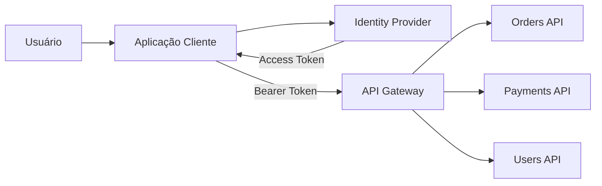
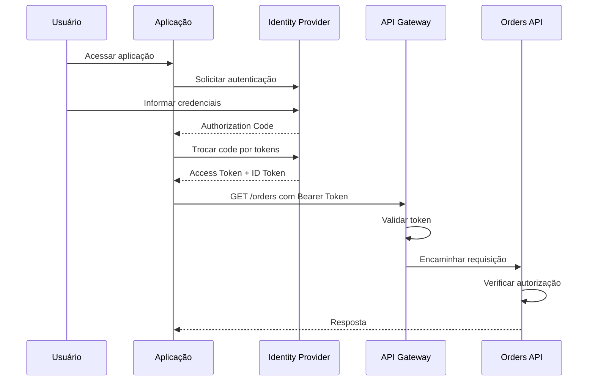
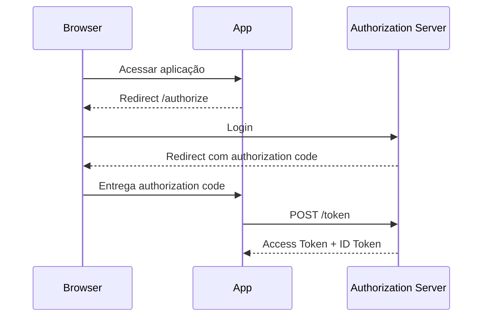
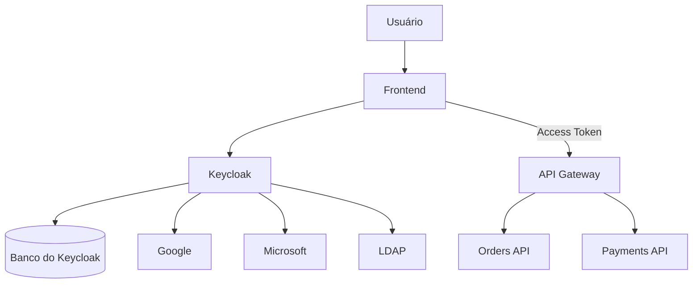
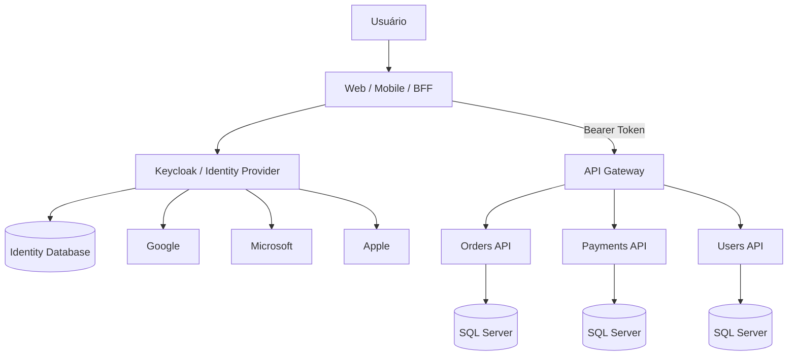
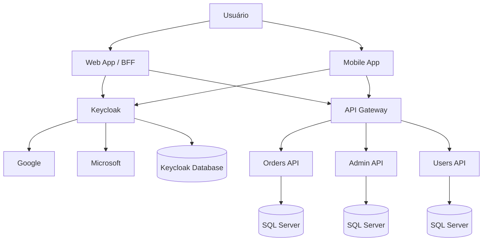

# Módulo 5 — Autenticação e Autorização

> [!NOTE]
> **Objetivo**  
> Entender como autenticação e autorização funcionam em sistemas distribuídos, como expor essas capacidades por APIs, qual o papel de API Gateways, como OAuth 2.0 e OpenID Connect funcionam, como utilizar Keycloak e como implementar social login de forma segura.

---

## Sumário

1. [Visão geral](#1-visão-geral)
2. [Autenticação versus autorização](#2-autenticação-versus-autorização)
3. [Identidade, credencial e sessão](#3-identidade-credencial-e-sessão)
4. [Visão geral da arquitetura](#4-visão-geral-da-arquitetura)
5. [Abstração de autenticação via API](#5-abstração-de-autenticação-via-api)
6. [Serviço de identidade](#6-serviço-de-identidade)
7. [API Gateway e autenticação](#7-api-gateway-e-autenticação)
8. [Fluxo de uma requisição autenticada](#8-fluxo-de-uma-requisição-autenticada)
9. [Tokens](#9-tokens)
10. [Access Token](#10-access-token)
11. [Refresh Token](#11-refresh-token)
12. [ID Token](#12-id-token)
13. [JWT](#13-jwt)
14. [Tokens opacos](#14-tokens-opacos)
15. [OAuth 2.0](#15-oauth-20)
16. [OpenID Connect](#16-openid-connect)
17. [Authorization Code Flow](#17-authorization-code-flow)
18. [Authorization Code com PKCE](#18-authorization-code-com-pkce)
19. [Client Credentials](#19-client-credentials)
20. [Device Authorization Flow](#20-device-authorization-flow)
21. [Resource Owner Password Credentials](#21-resource-owner-password-credentials)
22. [Scopes, roles e claims](#22-scopes-roles-e-claims)
23. [Keycloak](#23-keycloak)
24. [Realms](#24-realms)
25. [Clients](#25-clients)
26. [Users, groups e roles](#26-users-groups-e-roles)
27. [Keycloak em uma arquitetura](#27-keycloak-em-uma-arquitetura)
28. [Integração com ASP.NET Core](#28-integração-com-aspnet-core)
29. [Exemplo com JWT em C#](#29-exemplo-com-jwt-em-c)
30. [Policies e autorização](#30-policies-e-autorização)
31. [Exemplo com SQL Server](#31-exemplo-com-sql-server)
32. [Social Login](#32-social-login)
33. [Account Linking](#33-account-linking)
34. [Sessões](#34-sessões)
35. [Cookies versus tokens](#35-cookies-versus-tokens)
36. [Logout](#36-logout)
37. [Revogação](#37-revogação)
38. [Rotação de refresh tokens](#38-rotação-de-refresh-tokens)
39. [Single Sign-On](#39-single-sign-on)
40. [Multi-Factor Authentication](#40-multi-factor-authentication)
41. [Segurança](#41-segurança)
42. [Ataques comuns](#42-ataques-comuns)
43. [Escalabilidade](#43-escalabilidade)
44. [Alta disponibilidade](#44-alta-disponibilidade)
45. [Observabilidade](#45-observabilidade)
46. [Trade-offs](#46-trade-offs)
47. [Arquitetura recomendada](#47-arquitetura-recomendada)
48. [Checklist de produção](#48-checklist-de-produção)
49. [Regras práticas](#49-regras-práticas)
50. [Questões de entrevista](#50-questões-de-entrevista)
51. [Exercício prático](#51-exercício-prático)

---

## 1. Visão geral

Autenticação e autorização respondem a perguntas diferentes.

```text
Autenticação:
Quem é você?

Autorização:
O que você pode fazer?
```

Exemplo:

```text
Usuário informa e-mail e senha.
        |
        v
Sistema confirma sua identidade.
        |
        v
Usuário tenta acessar /admin.
        |
        v
Sistema verifica se ele possui permissão.
```

A primeira parte é autenticação.

A segunda é autorização.

---

## 2. Autenticação versus autorização

### Autenticação

Autenticação verifica a identidade de uma pessoa ou sistema.

Exemplos:

* Usuário e senha.
* Certificado digital.
* Biometria.
* Token.
* Chave de API.
* Login social.
* Autenticação multifator.

### Autorização

Autorização verifica se uma identidade pode executar uma ação.

Exemplos:

* Usuário pode visualizar pedidos.
* Gerente pode aprovar pagamentos.
* Administrador pode criar usuários.
* Serviço A pode chamar Serviço B.

### Comparação

| Autenticação        | Autorização                          |
| ------------------- | ------------------------------------ |
| Confirma identidade | Confirma permissão                   |
| Ocorre primeiro     | Ocorre depois                        |
| Usa credenciais     | Usa roles, scopes, policies e claims |
| Retorna identidade  | Retorna decisão de acesso            |
| Exemplo: login      | Exemplo: acessar `/admin`            |

> [!IMPORTANT]
> Um usuário autenticado não está automaticamente autorizado a acessar tudo.

---

## 3. Identidade, credencial e sessão

### Identidade

Representa quem está acessando o sistema.

Exemplo:

```json
{
  "userId": "usr-1001",
  "email": "maria@example.com",
  "name": "Maria"
}
```

### Credencial

É a prova apresentada para demonstrar a identidade.

Exemplos:

* Senha.
* Token.
* Certificado.
* Código temporário.
* Chave privada.

### Sessão

Representa um contexto autenticado durante um período.

```text
Login
  |
  v
Sessão criada
  |
  v
Usuário acessa várias páginas
  |
  v
Logout ou expiração
```

---

## 4. Visão geral da arquitetura

Uma arquitetura comum:

```text
Cliente
   |
   v
Identity Provider
   |
   | emite token
   v
Cliente
   |
   v
API Gateway
   |
   v
Backend APIs
```

### Mermaid



### Componentes

* Cliente.
* Identity Provider.
* Authorization Server.
* API Gateway.
* Resource Server.
* Banco de usuários.
* Serviço de autorização.
* Serviços de negócio.

---

## 5. Abstração de autenticação via API

Em uma arquitetura moderna, autenticação costuma ser exposta por endpoints padronizados.

Exemplos conceituais:

```http
POST /login
POST /logout
POST /refresh
GET /userinfo
POST /introspect
POST /revoke
```

Entretanto, em OAuth e OpenID Connect, esses endpoints normalmente seguem contratos padronizados.

Exemplos:

```text
/authorize
/token
/userinfo
/logout
/introspect
/revoke
```

### Por que abstrair

Sem abstração, cada aplicação pode implementar:

* Hash de senha.
* Sessão.
* Refresh token.
* Revogação.
* MFA.
* Recuperação de senha.
* Login social.

Isso causa duplicação e risco.

Com um serviço central de identidade:

```text
Aplicação A
Aplicação B
Aplicação C
     |
     v
Identity Provider central
```

Benefícios:

* Regras centralizadas.
* SSO.
* Auditoria.
* Menos duplicação.
* Mais consistência.
* Políticas de segurança uniformes.

---

## 6. Serviço de identidade

Um serviço de identidade gerencia:

* Usuários.
* Senhas.
* Tokens.
* Sessões.
* MFA.
* Roles.
* Claims.
* Login social.
* Recuperação de conta.
* Bloqueio.
* Auditoria.

### Arquitetura

```text
Clientes
   |
   v
Identity Service
   |
   +--> User Store
   +--> Session Store
   +--> Token Keys
   +--> Social Providers
```

### O que não deve ficar espalhado

Evite que cada microserviço:

* Valide senha.
* Armazene senha.
* Emita tokens.
* Gerencie login social.
* Controle sessões globais.

O microserviço deve receber uma identidade já autenticada e aplicar autorização no contexto do domínio.

---

## 7. API Gateway e autenticação

O API Gateway costuma ser o primeiro ponto de entrada das APIs.

```text
Cliente
   |
   v
API Gateway
   |
   +--> Orders API
   +--> Payments API
   +--> Users API
```

Ele pode:

* Validar assinatura do token.
* Verificar expiração.
* Validar issuer.
* Validar audience.
* Aplicar rate limiting.
* Bloquear tokens inválidos.
* Encaminhar claims.
* Aplicar políticas simples.

### Responsabilidade do Gateway

O Gateway pode verificar:

```text
O token é válido?
O token não expirou?
O token foi emitido por uma fonte confiável?
O token foi destinado a esta API?
```

### Responsabilidade da API

A API ainda deve verificar:

```text
Este usuário pode alterar este pedido?
Este usuário pertence a este tenant?
Este usuário pode aprovar este valor?
```

> [!WARNING]
> Não coloque toda a autorização apenas no Gateway.
>
> Regras de negócio devem permanecer no serviço responsável pelo domínio.

---

## 8. Fluxo de uma requisição autenticada

```text
1. Usuário abre a aplicação.
2. Aplicação redireciona para o Identity Provider.
3. Usuário autentica.
4. Identity Provider emite tokens.
5. Aplicação chama a API com Access Token.
6. Gateway valida o token.
7. API aplica regras de autorização.
8. API processa a requisição.
```

### Diagrama de sequência



---

## 9. Tokens

Tokens representam identidade, autorização ou sessão.

Principais tipos:

* Access Token.
* Refresh Token.
* ID Token.
* Token de sessão.
* Token opaco.
* JWT.

Cada token tem uma finalidade diferente.

---

## 10. Access Token

O Access Token é usado para acessar uma API.

```http
Authorization: Bearer eyJhbGciOi...
```

Ele pode conter ou representar:

* Subject.
* Issuer.
* Audience.
* Scopes.
* Roles.
* Expiração.
* Tenant.
* Client ID.

### Exemplo conceitual

```json
{
  "sub": "usr-1001",
  "iss": "https://identity.example.com",
  "aud": "orders-api",
  "scope": "orders.read orders.write",
  "role": ["customer"],
  "exp": 1783950000
}
```

### Características

* Vida curta.
* Enviado às APIs.
* Deve ser protegido.
* Não deve conter dados desnecessários.
* Pode ser JWT ou opaco.

---

## 11. Refresh Token

O Refresh Token é usado para obter novos Access Tokens.

```text
Access Token expira
       |
       v
Cliente envia Refresh Token
       |
       v
Authorization Server emite novo Access Token
```

### Por que existe

Sem refresh token, o usuário precisaria autenticar novamente sempre que o access token expirasse.

### Segurança

Refresh tokens devem:

* Ter vida maior.
* Ser armazenados com muito cuidado.
* Ser enviados apenas ao Authorization Server.
* Não ser enviados às APIs de negócio.
* Suportar rotação.
* Ser revogáveis.

> [!CAUTION]
> Um refresh token roubado pode permitir acesso por um longo período.

---

## 12. ID Token

O ID Token é usado pelo cliente para conhecer a identidade autenticada.

Ele pertence ao OpenID Connect.

Exemplo:

```json
{
  "sub": "usr-1001",
  "name": "Maria Silva",
  "email": "maria@example.com",
  "iss": "https://identity.example.com",
  "aud": "web-client"
}
```

### Diferença

```text
Access Token:
serve para acessar APIs.

ID Token:
serve para informar ao cliente quem autenticou.
```

> [!WARNING]
> Não use ID Token como substituto de Access Token para chamar APIs.

---

## 13. JWT

JWT significa JSON Web Token.

Estrutura:

```text
Header.Payload.Signature
```

Exemplo visual:

```text
xxxxx.yyyyy.zzzzz
```

### Header

```json
{
  "alg": "RS256",
  "typ": "JWT",
  "kid": "key-2026-01"
}
```

### Payload

```json
{
  "sub": "usr-1001",
  "aud": "orders-api",
  "scope": "orders.read",
  "exp": 1783950000
}
```

### Signature

A assinatura permite validar:

* Integridade.
* Emissor.
* Autenticidade.

### Importante

JWT normalmente é assinado, não criptografado.

Portanto, qualquer pessoa que possua o token pode ler o payload.

Não coloque:

* Senha.
* Segredos.
* Dados de cartão.
* Informações pessoais desnecessárias.
* Dados médicos sensíveis.

### Vantagens

* Validação local.
* Menos chamadas ao Identity Provider.
* Bom para sistemas distribuídos.
* Carrega claims.
* Escala bem para leitura.

### Desvantagens

* Revogação é difícil.
* Tokens podem crescer.
* Claims ficam desatualizadas até expirar.
* Vazamento é grave.
* Rotação de chaves exige cuidado.

---

## 14. Tokens opacos

Um token opaco não contém informações legíveis pelo cliente.

Exemplo:

```text
n20f8a9dx82k2m4v9m3
```

A API ou Gateway precisa consultar o Authorization Server:

```text
Token
  |
  v
Introspection Endpoint
  |
  v
Token ativo ou inativo
```

### Vantagens

* Fácil revogação.
* Menos informação exposta.
* Estado centralizado.
* Claims sempre atualizadas.

### Desvantagens

* Chamada adicional.
* Dependência do Authorization Server.
* Maior latência.
* Necessidade de cache.

### Comparação

| JWT                      | Token opaco             |
| ------------------------ | ----------------------- |
| Validação local          | Validação remota        |
| Mais escalável           | Mais controle           |
| Revogação difícil        | Revogação simples       |
| Claims no token          | Claims no servidor      |
| Pode crescer             | Token pequeno           |
| Menos dependência online | Mais dependência online |

---

## 15. OAuth 2.0

OAuth 2.0 é um framework de autorização delegada.

Ele permite que uma aplicação acesse recursos em nome de um usuário sem receber diretamente sua senha.

### Exemplo real

Uma aplicação deseja acessar seus arquivos em outro serviço.

Em vez de pedir sua senha:

```text
Aplicação
   |
   v
Authorization Server
   |
   v
Usuário autoriza acesso
   |
   v
Aplicação recebe token limitado
```

### Papéis

#### Resource Owner

Pessoa ou entidade dona do recurso.

#### Client

Aplicação que solicita acesso.

#### Authorization Server

Emite tokens.

#### Resource Server

API que protege os dados.

### Exemplo

```text
Usuário:
Resource Owner

Aplicação web:
Client

Keycloak:
Authorization Server

Orders API:
Resource Server
```

> [!IMPORTANT]
> OAuth 2.0 é principalmente sobre autorização.
>
> Para autenticação, use OpenID Connect sobre OAuth 2.0.

---

## 16. OpenID Connect

OpenID Connect, ou OIDC, adiciona autenticação ao OAuth 2.0.

Ele introduz:

* ID Token.
* UserInfo endpoint.
* Claims de identidade.
* Discovery document.
* Session management.

### Comparação

```text
OAuth 2.0:
A aplicação pode acessar determinada API?

OpenID Connect:
Quem é o usuário autenticado?
```

### Discovery

Clientes podem descobrir endpoints por um documento de configuração:

```text
/.well-known/openid-configuration
```

Esse documento informa:

* Authorization endpoint.
* Token endpoint.
* UserInfo endpoint.
* Logout endpoint.
* JWKS endpoint.
* Algorithms suportados.

---

## 17. Authorization Code Flow

É um dos fluxos mais comuns para aplicações web.

```text
1. Cliente redireciona o usuário ao Authorization Server.
2. Usuário autentica.
3. Authorization Server devolve um code.
4. Cliente troca o code por tokens.
```

### Por que usar um code

O token não é exposto diretamente na URL.

O code:

* Tem vida curta.
* Só pode ser usado uma vez.
* É trocado em um canal seguro.
* Pode ser associado a client secret ou PKCE.

### Fluxo



---

## 18. Authorization Code com PKCE

PKCE protege o Authorization Code Flow em clientes públicos.

Exemplos:

* SPA.
* Aplicação mobile.
* Desktop app.

### Problema

Clientes públicos não conseguem guardar `client_secret` com segurança.

### Solução

O cliente cria:

```text
code_verifier
```

E deriva:

```text
code_challenge
```

O challenge é enviado no início.

O verifier é enviado na troca do code.

O Authorization Server verifica se correspondem.

### Fluxo simplificado

```text
Cliente gera code_verifier
        |
        v
Gera code_challenge
        |
        v
Envia challenge no /authorize
        |
        v
Recebe authorization code
        |
        v
Envia code + verifier no /token
```

### Benefício

Se um atacante roubar apenas o authorization code, não conseguirá trocá-lo sem o `code_verifier`.

> [!TIP]
> Para aplicações móveis e SPAs, prefira Authorization Code com PKCE.

---

## 19. Client Credentials

Usado para comunicação máquina a máquina.

```text
Serviço A
   |
   | client_id + client_secret
   v
Authorization Server
   |
   | access token
   v
Serviço A chama Serviço B
```

Não há usuário.

A identidade é o próprio serviço.

### Casos de uso

* Jobs.
* Integrações internas.
* Microserviços.
* Processamento batch.
* Daemons.
* Automação.

### Exemplo

```text
Billing Worker
   |
   v
Payments API
```

O token pode conter:

```json
{
  "sub": "billing-worker",
  "client_id": "billing-worker",
  "scope": "payments.process"
}
```

---

## 20. Device Authorization Flow

Usado em dispositivos com entrada limitada.

Exemplos:

* Smart TV.
* Console.
* Dispositivo IoT.
* Terminal.

Fluxo:

```text
Dispositivo mostra:
Acesse example.com/device
Digite o código ABCD-EFGH
```

O usuário autentica em outro dispositivo.

Depois, o dispositivo original recebe os tokens.

---

## 21. Resource Owner Password Credentials

Esse fluxo recebe usuário e senha diretamente no cliente.

```text
Cliente recebe senha
      |
      v
Envia ao Authorization Server
```

É uma abordagem legada e deve ser evitada.

### Problemas

* Cliente vê a senha.
* Dificulta MFA.
* Dificulta login social.
* Aumenta risco.
* Reduz isolamento.
* Não oferece experiência moderna de login.

> [!CAUTION]
> Não utilize esse fluxo em novos sistemas.

---

## 22. Scopes, roles e claims

### Scope

Representa uma permissão delegada para uma API.

Exemplos:

```text
orders.read
orders.write
payments.process
users.manage
```

### Role

Representa uma função de negócio ou organizacional.

Exemplos:

```text
customer
support
manager
administrator
```

### Claim

É uma afirmação sobre a identidade.

Exemplos:

```text
sub
email
tenant_id
department
role
scope
```

### Exemplo de token

```json
{
  "sub": "usr-1001",
  "scope": "orders.read orders.write",
  "role": ["customer"],
  "tenant_id": "tenant-10"
}
```

### Diferença prática

```text
Role:
quem o usuário é no contexto organizacional.

Scope:
qual acesso foi concedido ao cliente.

Claim:
qualquer informação afirmada sobre a identidade.
```

---

## 23. Keycloak

Keycloak é uma plataforma de Identity and Access Management.

Ele pode oferecer:

* Login.
* Logout.
* SSO.
* OAuth 2.0.
* OpenID Connect.
* SAML.
* Social login.
* MFA.
* Gestão de usuários.
* Gestão de grupos.
* Roles.
* Federation.
* Identity brokering.
* Administração.

### Por que utilizar

Construir um Identity Provider do zero exige lidar com:

* Senhas.
* Hashing.
* MFA.
* Sessões.
* Tokens.
* Rotação de chaves.
* Login social.
* Bloqueio.
* Recuperação de conta.
* Auditoria.
* Vulnerabilidades.

Keycloak reduz esse trabalho.

### Trade-off

Ele reduz desenvolvimento, mas introduz:

* Operação.
* Atualizações.
* Banco próprio.
* Alta disponibilidade.
* Configuração complexa.
* Dependência crítica.

---

## 24. Realms

Um realm é um espaço isolado dentro do Keycloak.

Ele contém:

* Usuários.
* Clients.
* Roles.
* Grupos.
* Identity providers.
* Sessões.
* Políticas.

### Exemplo

```text
Realm: company-internal
Realm: customer-platform
Realm: partners
```

Cada realm é isolado.

### Quando usar realms diferentes

* Ambientes totalmente separados.
* Empresas independentes.
* Regras de segurança muito diferentes.
* Identidades sem compartilhamento.

### Quando não usar um realm por tenant

Criar milhares de realms pode aumentar a complexidade operacional.

Para SaaS multi-tenant, muitas vezes é melhor usar:

```text
Um realm
+
tenant_id em claims
+
grupos ou organizações
```

A decisão depende do nível de isolamento exigido.

---

## 25. Clients

No Keycloak, um client representa uma aplicação ou API.

Exemplos:

```text
web-frontend
mobile-app
orders-api
payments-api
admin-portal
```

### Tipos conceituais

#### Public Client

Não consegue manter segredo.

Exemplos:

* SPA.
* Mobile app.
* Desktop app.

Usa PKCE.

#### Confidential Client

Consegue manter credencial com segurança.

Exemplos:

* Backend.
* Aplicação web server-side.
* Serviço interno.

Pode usar client secret ou certificado.

---

## 26. Users, groups e roles

### Users

Representam identidades humanas.

### Groups

Agrupam usuários.

Exemplo:

```text
/company
/company/finance
/company/support
```

### Roles

Representam funções ou permissões.

Exemplo:

```text
orders-reader
orders-manager
payments-approver
```

### Estratégia

```text
Usuário
  |
  v
Grupo
  |
  v
Roles
```

Isso evita atribuir dezenas de roles individualmente.

---

## 27. Keycloak em uma arquitetura

```text
Usuários
   |
   v
Keycloak
   |
   +--> PostgreSQL
   +--> Google Login
   +--> Microsoft Login
   +--> LDAP
   +--> MFA
```

Aplicações:

```text
Web App
Mobile App
API Gateway
Microservices
      |
      v
Keycloak
```

### Mermaid



---

## 28. Integração com ASP.NET Core

Uma API ASP.NET Core pode validar tokens emitidos pelo Keycloak.

### Configuração conceitual

```csharp
using Microsoft.AspNetCore.Authentication.JwtBearer;

var builder = WebApplication.CreateBuilder(args);

builder.Services
    .AddAuthentication(JwtBearerDefaults.AuthenticationScheme)
    .AddJwtBearer(options =>
    {
        options.Authority =
            "https://identity.example.com/realms/customer-platform";

        options.Audience = "orders-api";

        options.RequireHttpsMetadata = true;
    });

builder.Services.AddAuthorization();

var app = builder.Build();

app.UseAuthentication();
app.UseAuthorization();

app.MapGet("/orders", () =>
{
    return Results.Ok(new[]
    {
        new { OrderId = 1001, Status = "Created" }
    });
})
.RequireAuthorization();

app.Run();
```

### O que será validado

* Assinatura.
* Emissor.
* Expiração.
* Audience.
* Estrutura do token.

---

## 29. Exemplo com JWT em C#

### Controller protegido

```csharp
using Microsoft.AspNetCore.Authorization;
using Microsoft.AspNetCore.Mvc;
using System.Security.Claims;

[ApiController]
[Route("api/orders")]
[Authorize]
public sealed class OrdersController : ControllerBase
{
    [HttpGet]
    public IActionResult GetOrders()
    {
        var userId =
            User.FindFirstValue(ClaimTypes.NameIdentifier)
            ?? User.FindFirstValue("sub");

        var tenantId =
            User.FindFirstValue("tenant_id");

        return Ok(new
        {
            UserId = userId,
            TenantId = tenantId,
            Orders = Array.Empty<object>()
        });
    }
}
```

### Endpoint com role

```csharp
[HttpPost]
[Authorize(Roles = "orders-manager")]
public IActionResult CreateOrder()
{
    return Created();
}
```

### Cuidado com nomes de claims

Providers diferentes podem usar:

```text
role
roles
realm_access.roles
resource_access
```

Pode ser necessário mapear claims.

---

## 30. Policies e autorização

Roles simples podem não ser suficientes.

Exemplo:

```text
Usuário pode aprovar pagamento
apenas se:
- possuir role payments-approver
- pertencer ao mesmo tenant
- valor for menor que seu limite
```

Isso exige policy baseada em regras.

### Criando uma policy

```csharp
builder.Services.AddAuthorization(options =>
{
    options.AddPolicy("CanApprovePayment", policy =>
    {
        policy.RequireAuthenticatedUser();
        policy.RequireClaim("permission", "payments.approve");
        policy.RequireClaim("tenant_id");
    });
});
```

### Utilizando

```csharp
[Authorize(Policy = "CanApprovePayment")]
[HttpPost("{paymentId:long}/approve")]
public IActionResult Approve(long paymentId)
{
    return NoContent();
}
```

### Autorização por recurso

Em muitos casos, a decisão depende do recurso.

```text
Usuário pode editar este pedido?
```

Não basta verificar uma role global.

É necessário comparar:

```text
token.tenant_id
com
order.tenant_id
```

ou:

```text
token.sub
com
order.owner_id
```

---

## 31. Exemplo com SQL Server

O Identity Provider pode armazenar usuários em seu próprio banco.

Entretanto, o sistema de negócio pode manter dados de perfil e autorização específicos do domínio.

### Tabela de perfil

```sql
CREATE TABLE dbo.UserProfiles
(
    UserId          UNIQUEIDENTIFIER NOT NULL,
    ExternalSubject VARCHAR(200) NOT NULL,
    DisplayName     NVARCHAR(200) NOT NULL,
    Email           NVARCHAR(320) NULL,
    TenantId        UNIQUEIDENTIFIER NOT NULL,
    IsActive        BIT NOT NULL
        CONSTRAINT DF_UserProfiles_IsActive DEFAULT 1,
    CreatedAtUtc    DATETIME2 NOT NULL
        CONSTRAINT DF_UserProfiles_CreatedAtUtc
        DEFAULT SYSUTCDATETIME(),

    CONSTRAINT PK_UserProfiles
        PRIMARY KEY (UserId),

    CONSTRAINT UQ_UserProfiles_ExternalSubject
        UNIQUE (ExternalSubject)
);
```

### Permissões de domínio

```sql
CREATE TABLE dbo.UserPermissions
(
    UserId          UNIQUEIDENTIFIER NOT NULL,
    PermissionCode  VARCHAR(100) NOT NULL,

    CONSTRAINT PK_UserPermissions
        PRIMARY KEY (UserId, PermissionCode),

    CONSTRAINT FK_UserPermissions_UserProfiles
        FOREIGN KEY (UserId)
        REFERENCES dbo.UserProfiles(UserId)
);
```

### Consulta

```sql
SELECT 1
FROM dbo.UserPermissions
WHERE UserId = @UserId
  AND PermissionCode = 'payments.approve';
```

### Regra importante

Não armazene a senha novamente no banco da aplicação de negócio.

```text
Identity Provider:
credenciais e autenticação

Aplicação:
perfil e regras do domínio
```

---

## 32. Social Login

Social login permite autenticar usando um provedor externo.

Exemplos:

* Google.
* Microsoft.
* Apple.
* GitHub.
* Facebook.

### Arquitetura

```text
Usuário
   |
   v
Aplicação
   |
   v
Identity Provider da aplicação
   |
   v
Google ou Microsoft
```

O Identity Provider da aplicação atua como broker de identidade.

### Fluxo

```text
1. Usuário escolhe “Entrar com Google”.
2. Aplicação redireciona ao Identity Provider.
3. Identity Provider redireciona ao Google.
4. Usuário autentica no Google.
5. Google devolve resultado ao Identity Provider.
6. Identity Provider cria ou localiza o usuário local.
7. Identity Provider emite seus próprios tokens.
```

### Por que emitir tokens próprios

A aplicação deve confiar em um emissor central.

```text
Google
Microsoft
Apple
GitHub
   |
   v
Keycloak
   |
   v
Tokens padronizados para suas APIs
```

Assim, as APIs não precisam implementar lógica específica para cada provedor.

---

## 33. Account Linking

Account linking relaciona diferentes identidades externas à mesma conta local.

Exemplo:

```text
maria@gmail.com
maria@outlook.com
        |
        v
Mesmo UserId interno
```

### Problema

Não vincule contas apenas porque os e-mails são iguais.

Razões:

* E-mail pode não estar verificado.
* Provedores podem ter regras diferentes.
* Conta pode ter sido reciclada.
* Um atacante pode controlar endereço semelhante.

### Estratégia segura

Para vincular uma conta externa:

```text
1. Usuário autentica na conta atual.
2. Usuário inicia vínculo.
3. Usuário autentica no novo provedor.
4. Sistema confirma ambos os lados.
5. Vínculo é registrado.
```

### Modelo SQL

```sql
CREATE TABLE dbo.ExternalIdentities
(
    Provider        VARCHAR(50) NOT NULL,
    ProviderSubject VARCHAR(200) NOT NULL,
    UserId          UNIQUEIDENTIFIER NOT NULL,
    Email           NVARCHAR(320) NULL,
    CreatedAtUtc    DATETIME2 NOT NULL
        CONSTRAINT DF_ExternalIdentities_CreatedAtUtc
        DEFAULT SYSUTCDATETIME(),

    CONSTRAINT PK_ExternalIdentities
        PRIMARY KEY (Provider, ProviderSubject),

    CONSTRAINT FK_ExternalIdentities_UserProfiles
        FOREIGN KEY (UserId)
        REFERENCES dbo.UserProfiles(UserId)
);
```

A chave correta é:

```text
Provider + ProviderSubject
```

Não apenas o e-mail.

---

## 34. Sessões

Sessões podem ser:

* Server-side.
* Baseadas em cookie.
* Baseadas em token.
* Centralizadas.
* Distribuídas.

### Sessão server-side

```text
Cookie contém SessionId
       |
       v
Servidor consulta Session Store
```

Exemplo:

```text
SessionId --> Redis
```

### Vantagens

* Fácil revogação.
* Dados ficam no servidor.
* Cookie pequeno.
* Controle central.

### Desvantagens

* Consulta adicional.
* Session store vira dependência.
* Requer replicação.

---

## 35. Cookies versus tokens

### Cookies

Comuns em aplicações web server-side.

Vantagens:

* Suporte nativo do navegador.
* Podem ser `HttpOnly`.
* Podem ser `Secure`.
* Podem usar `SameSite`.
* Boa proteção contra acesso via JavaScript.

Desvantagens:

* Exigem proteção contra CSRF.
* Mais ligados ao navegador.
* Cross-domain exige cuidado.

### Tokens em JavaScript

Vantagens:

* Flexíveis para APIs.
* Comuns em SPAs.
* Fácil envio em headers.

Desvantagens:

* Se armazenados em `localStorage`, ficam expostos a XSS.
* Refresh token no navegador exige cuidado.
* Logout e revogação são mais complexos.

### BFF Pattern

Uma abordagem segura para SPAs:

```text
Browser
   |
   | Cookie seguro
   v
Backend for Frontend
   |
   | Access Token
   v
APIs
```

O navegador não acessa diretamente os tokens.

O BFF mantém os tokens no servidor.

---

## 36. Logout

Logout pode significar:

* Encerrar sessão local.
* Revogar refresh token.
* Encerrar sessão no Identity Provider.
* Encerrar sessão em todos os dispositivos.
* Encerrar sessão nos provedores sociais.

### Logout local

Remove cookie ou sessão da aplicação.

### Single Logout

Tenta encerrar sessões relacionadas em múltiplas aplicações.

### Problema com JWT

Um access token JWT já emitido pode continuar válido até expirar.

Por isso:

* Access tokens devem ter vida curta.
* Refresh tokens devem ser revogáveis.
* Sistemas críticos podem usar denylist.
* Pode haver introspection.

---

## 37. Revogação

Revogar significa tornar um token ou sessão inválido.

### Access Token JWT

Difícil de revogar imediatamente sem estado adicional.

Estratégias:

* Expiração curta.
* Denylist.
* Token version.
* Introspection.
* Sessão central.
* Rotação de chaves, em incidentes graves.

### Refresh Token

Deve ser revogável.

Exemplo de tabela:

```sql
CREATE TABLE dbo.RefreshTokens
(
    Id              UNIQUEIDENTIFIER NOT NULL PRIMARY KEY,
    UserId          UNIQUEIDENTIFIER NOT NULL,
    TokenHash       VARBINARY(64) NOT NULL,
    ExpiresAtUtc    DATETIME2 NOT NULL,
    RevokedAtUtc    DATETIME2 NULL,
    ReplacedById    UNIQUEIDENTIFIER NULL,
    CreatedAtUtc    DATETIME2 NOT NULL
        CONSTRAINT DF_RefreshTokens_CreatedAtUtc
        DEFAULT SYSUTCDATETIME()
);
```

> [!IMPORTANT]
> Armazene o hash do refresh token, não necessariamente o valor bruto.

---

## 38. Rotação de refresh tokens

Ao usar um refresh token:

```text
Refresh Token A
      |
      v
Novo Access Token
+
Refresh Token B
```

O token A é invalidado.

### Reuse Detection

Se o token A aparecer novamente:

```text
Possível roubo
```

O sistema pode:

* Revogar toda a família.
* Encerrar a sessão.
* Solicitar login novamente.
* Gerar alerta.

### Fluxo

```text
RT-A usado
  |
  v
RT-A revogado
RT-B emitido

RT-A usado novamente
  |
  v
Família inteira revogada
```

---

## 39. Single Sign-On

SSO permite que o usuário autentique uma vez e acesse várias aplicações.

```text
Portal
Admin
Reports
Support
   |
   v
Mesmo Identity Provider
```

### Fluxo

```text
Usuário entra no Portal
      |
      v
Sessão criada no IdP
      |
      v
Usuário abre Reports
      |
      v
IdP reconhece sessão
      |
      v
Não pede senha novamente
```

### Benefícios

* Melhor experiência.
* Menos senhas.
* Segurança centralizada.
* Revogação central.
* Políticas comuns.

### Riscos

* Identity Provider é crítico.
* Comprometimento afeta várias aplicações.
* Indisponibilidade impacta todo o ecossistema.

---

## 40. Multi-Factor Authentication

MFA exige mais de um fator.

### Fatores

#### Algo que o usuário sabe

* Senha.
* PIN.

#### Algo que o usuário possui

* Celular.
* Token físico.
* Chave de segurança.

#### Algo que o usuário é

* Biometria.
* Impressão digital.
* Reconhecimento facial.

### Exemplos

* Senha + TOTP.
* Senha + WebAuthn.
* Senha + push notification.

### Step-up Authentication

Nem toda ação precisa do mesmo nível de segurança.

Exemplo:

```text
Visualizar perfil:
sessão comum

Alterar conta bancária:
exigir MFA novamente
```

---

## 41. Segurança

### Senhas

Use:

* Hash forte.
* Salt individual.
* Algoritmos apropriados.
* Política contra senhas vazadas.
* Rate limiting.
* Bloqueio progressivo.

Nunca use:

```text
MD5
SHA1 puro
SHA256 puro
Criptografia reversível
```

### Chaves de assinatura

Use:

* Rotação.
* `kid`.
* Armazenamento seguro.
* KMS ou HSM quando necessário.
* Algoritmos assimétricos.

### Validação de token

Sempre valide:

* Signature.
* Issuer.
* Audience.
* Expiration.
* Not before.
* Algorithm.
* Key ID.

### HTTPS

Tokens nunca devem trafegar em HTTP.

### Menor privilégio

Conceda apenas os scopes necessários.

```text
orders.read
```

é melhor que:

```text
admin.all
```

---

## 42. Ataques comuns

### Credential Stuffing

Atacantes reutilizam senhas vazadas.

Mitigações:

* MFA.
* Rate limiting.
* Detecção de anomalia.
* Senhas bloqueadas.
* Alertas.

### Brute Force

Tentativas massivas de senha.

Mitigações:

* Rate limiting.
* Backoff.
* CAPTCHA.
* Bloqueio progressivo.
* MFA.

### Token Theft

Roubo de access ou refresh token.

Mitigações:

* HTTPS.
* `HttpOnly`.
* `Secure`.
* Rotação.
* Expiração curta.
* Device binding, quando aplicável.
* BFF.

### CSRF

Explora cookies enviados automaticamente.

Mitigações:

* Anti-forgery token.
* `SameSite`.
* Verificação de origin.
* Métodos seguros.

### XSS

Permite roubar tokens armazenados no navegador.

Mitigações:

* CSP.
* Sanitização.
* Evitar `localStorage` para tokens sensíveis.
* Cookies `HttpOnly`.
* BFF.

### Open Redirect

O atacante manipula uma URL de redirecionamento.

Mitigação:

```text
Permitir apenas redirect URIs previamente cadastradas.
```

### Authorization Code Interception

Mitigação:

```text
PKCE
```

---

## 43. Escalabilidade

O serviço de identidade é crítico.

Ele pode receber:

* Logins.
* Refreshes.
* Validação.
* Introspection.
* UserInfo.
* Logout.
* MFA.
* Social callbacks.

### Estratégias

* Múltiplas instâncias.
* Load balancer.
* Banco altamente disponível.
* Cache.
* Sessões distribuídas.
* Chaves compartilhadas.
* Rate limiting.
* CDN para conteúdo estático.

### JWT e escala

JWT permite validação local.

```text
API valida token
sem chamar o IdP
```

Isso reduz carga no Identity Provider.

### Trade-off

```text
Validação local:
mais escala
menos controle imediato

Introspection:
mais controle
mais dependência
```

---

## 44. Alta disponibilidade

Arquitetura:

```text
Clientes
   |
   v
Load Balancer
   |
   +--> Identity Instance 1
   +--> Identity Instance 2
   +--> Identity Instance 3
             |
             v
      Banco altamente disponível
```

### Cuidados

* Sessões não podem depender apenas de memória local.
* Chaves de assinatura devem ser compartilhadas.
* Banco deve suportar failover.
* Cache deve ser resiliente.
* Login social depende de terceiros.
* DNS e certificados precisam estar corretos.

### Ponto crítico

Se o Identity Provider cair:

* Novos logins falham.
* Refresh pode falhar.
* Tokens JWT existentes podem continuar funcionando.
* Introspection pode falhar.
* Logout pode falhar.

---

## 45. Observabilidade

### Métricas

* Logins por segundo.
* Logins bem-sucedidos.
* Logins falhos.
* Refreshes.
* Tokens emitidos.
* Tokens revogados.
* Sessões ativas.
* Tentativas de MFA.
* Falhas por provedor social.
* Latência do token endpoint.
* Erros de assinatura.
* Erros de audience.
* Erros de issuer.
* Contas bloqueadas.
* Reuse de refresh token.

### Logs

Registre:

* User ID.
* Client ID.
* Grant type.
* IP.
* User agent.
* Resultado.
* Correlation ID.
* Trace ID.

Não registre:

* Senha.
* Access token completo.
* Refresh token.
* Client secret.
* Código MFA.

### Alertas

* Pico de login falho.
* Muitas tentativas do mesmo IP.
* Reuse de refresh token.
* Falha de social provider.
* Falha de rotação de chave.
* Crescimento anormal de sessões.
* Erros de banco.

---

## 46. Trade-offs

### JWT versus token opaco

| JWT                             | Token opaco             |
| ------------------------------- | ----------------------- |
| Validação local                 | Introspection           |
| Alta escala                     | Controle central        |
| Revogação difícil               | Revogação fácil         |
| Claims podem ficar antigas      | Claims atuais           |
| Mais simples para microserviços | Mais dependência do IdP |

### Sessão server-side versus stateless

| Server-side              | Stateless                 |
| ------------------------ | ------------------------- |
| Fácil revogação          | Escala simples            |
| Depende de session store | Menos estado central      |
| Mais consultas           | Menos consultas           |
| Controle central         | Tokens podem ficar ativos |

### Keycloak versus solução própria

| Keycloak            | Solução própria                  |
| ------------------- | -------------------------------- |
| Recursos prontos    | Controle total                   |
| Menor tempo inicial | Maior esforço                    |
| Exige operação      | Exige desenvolvimento e operação |
| Padrões prontos     | Risco de implementação incorreta |
| Pode ser complexo   | Pode ser ainda mais complexo     |

### Social login versus conta local

| Social login        | Conta local                         |
| ------------------- | ----------------------------------- |
| Menos fricção       | Controle completo                   |
| Menos senhas        | Exige gestão de senha               |
| Dependência externa | Menos dependência                   |
| Dados do provedor   | Maior responsabilidade de segurança |

### Gateway centralizando auth versus auth em cada API

| Gateway                | Cada API               |
| ---------------------- | ---------------------- |
| Validação central      | Defesa em profundidade |
| Menos duplicação       | Mais segurança local   |
| Pode virar ponto único | Mais código            |
| Regras simples         | Regras de domínio      |

A melhor prática costuma ser:

```text
Gateway valida autenticação básica
+
API valida autorização de negócio
```

---

## 47. Arquitetura recomendada

```text
                           +----------------------+
                           |      Usuários        |
                           +----------+-----------+
                                      |
                                      v
                           +----------------------+
                           | Web / Mobile / BFF   |
                           +----------+-----------+
                                      |
                                      v
                           +----------------------+
                           | Keycloak / IdP       |
                           +---+--------------+---+
                               |              |
                               v              v
                      +---------------+  +----------------+
                      | User Database |  | Social Login   |
                      +---------------+  | Google/MS/etc. |
                                         +----------------+
                                     
Cliente recebe token
         |
         v
+----------------------+
| API Gateway          |
| Valida JWT            |
| Rate Limit            |
+----------+-----------+
           |
           +------------------+------------------+
           |                  |                  |
           v                  v                  v
    +-------------+    +-------------+    +-------------+
    | Orders API  |    | Payments API|    | Users API   |
    +------+------+    +------+------+    +------+------+
           |                  |                  |
           v                  v                  v
      SQL Server         SQL Server         SQL Server
```

### Mermaid



### Responsabilidades

#### Keycloak

* Autenticação.
* Emissão de tokens.
* Sessões.
* MFA.
* Social login.
* SSO.

#### API Gateway

* Validação inicial.
* Rate limiting.
* Proteção de borda.
* Roteamento.
* Logs de entrada.

#### APIs

* Autorização de domínio.
* Validação de tenant.
* Ownership.
* Regras de negócio.

#### SQL Server

* Estado do domínio.
* Perfil complementar.
* Permissões específicas.
* Auditoria de negócio.

---

## 48. Checklist de produção

### Identity Provider

* [ ] Existe alta disponibilidade?
* [ ] O banco está replicado?
* [ ] Sessões são distribuídas?
* [ ] Chaves são rotacionadas?
* [ ] Existe backup?
* [ ] Existe plano de recuperação?
* [ ] MFA está disponível?
* [ ] Social login está configurado com redirect URIs restritas?

### Tokens

* [ ] Access token possui vida curta?
* [ ] Refresh token possui rotação?
* [ ] Reuse detection está habilitada?
* [ ] Issuer é validado?
* [ ] Audience é validada?
* [ ] Algoritmo é validado?
* [ ] Clock skew está controlado?
* [ ] Dados sensíveis foram removidos?

### APIs

* [ ] Gateway valida token?
* [ ] APIs também aplicam autorização?
* [ ] Tenant é validado?
* [ ] Ownership é validado?
* [ ] Policies estão documentadas?
* [ ] Existe defesa em profundidade?

### Social Login

* [ ] `state` é validado?
* [ ] `nonce` é validado?
* [ ] PKCE está habilitado?
* [ ] Redirect URIs são exatas?
* [ ] E-mail verificado é tratado corretamente?
* [ ] Account linking exige confirmação?
* [ ] Provider subject é armazenado?

### Segurança

* [ ] HTTPS obrigatório?
* [ ] Cookies são `HttpOnly`?
* [ ] Cookies são `Secure`?
* [ ] `SameSite` está configurado?
* [ ] Existe proteção contra CSRF?
* [ ] Existe rate limiting?
* [ ] Existe proteção contra brute force?
* [ ] Secrets estão em secret manager?

### Observabilidade

* [ ] Logins falhos são monitorados?
* [ ] MFA falha é monitorada?
* [ ] Reuse de refresh token gera alerta?
* [ ] Social providers são monitorados?
* [ ] Existe tracing?
* [ ] Tokens não aparecem nos logs?
* [ ] Existe auditoria de ações administrativas?

---

## 49. Regras práticas

1. Autenticação responde quem é o usuário.

2. Autorização responde o que ele pode fazer.

3. Não implemente um Identity Provider do zero sem necessidade extrema.

4. Use OpenID Connect para autenticação.

5. Use OAuth 2.0 para autorização delegada.

6. Use Authorization Code com PKCE para SPAs e apps móveis.

7. Use Client Credentials para comunicação entre serviços.

8. Não use Resource Owner Password Credentials em novos sistemas.

9. Access tokens devem ter vida curta.

10. Refresh tokens devem ser rotacionados e revogáveis.

11. Não armazene tokens sensíveis em `localStorage` quando puder evitar.

12. Considere BFF para SPAs sensíveis.

13. Não use ID Token para chamar APIs.

14. Valide issuer, audience, assinatura e expiração.

15. O Gateway não substitui a autorização dentro da API.

16. Use scopes para acesso a APIs.

17. Use roles para funções organizacionais.

18. Use policies para regras complexas.

19. Não confie apenas no e-mail para account linking.

20. Utilize `Provider + Subject` como identidade externa.

21. Não coloque dados sensíveis em JWT.

22. Keycloak também precisa de alta disponibilidade.

23. Social login reduz fricção, mas aumenta dependência externa.

24. MFA deve ser obrigatório para ações sensíveis.

25. Autorização por recurso é mais importante que apenas roles globais.

---

## 50. Questões de entrevista

### Qual a diferença entre autenticação e autorização?

> Autenticação verifica a identidade. Autorização verifica se a identidade pode executar determinada ação.

### Qual a diferença entre OAuth e OpenID Connect?

> OAuth 2.0 é um framework de autorização delegada. OpenID Connect adiciona autenticação sobre OAuth e introduz o ID Token.

### Access Token e ID Token são iguais?

> Não. O Access Token é destinado às APIs. O ID Token informa ao cliente quem autenticou.

### Por que access tokens devem ter vida curta?

> Porque tokens roubados normalmente continuam válidos até expirar. Uma vida curta reduz a janela de exposição.

### Qual o papel do refresh token?

> Permitir obter novos access tokens sem exigir login novamente. Ele deve ser protegido, rotacionado e revogável.

### JWT ou token opaco?

> JWT é melhor quando validação local e escala são importantes. Token opaco é melhor quando revogação imediata e controle central são prioritários.

### O Gateway deve fazer toda a autorização?

> Não. O Gateway pode validar token e aplicar políticas gerais, mas regras de domínio, ownership e tenant devem ser verificadas pela API responsável.

### Por que usar PKCE?

> Para proteger o authorization code contra interceptação, principalmente em clientes públicos que não conseguem guardar client secret.

### Quando usar Client Credentials?

> Em comunicação máquina a máquina, sem usuário humano.

### O que é SSO?

> É a possibilidade de autenticar uma vez e acessar várias aplicações confiando no mesmo Identity Provider.

### O que é account linking?

> É o vínculo de múltiplas identidades externas à mesma conta interna. Deve exigir confirmação segura e usar o subject do provedor, não apenas e-mail.

### Keycloak deve ser usado como banco de negócio?

> Não. Keycloak deve gerenciar identidade, autenticação e autorização geral. Dados de negócio devem permanecer nos sistemas de domínio.

### Como revogar um JWT?

> JWTs autônomos são difíceis de revogar. Estratégias incluem expiração curta, denylist, token version, introspection ou sessões centralizadas.

### Como proteger uma SPA?

> Authorization Code com PKCE, tokens de curta duração, proteção contra XSS e, em sistemas sensíveis, uso do padrão BFF para manter tokens no servidor.

---

## 51. Exercício prático

Projete autenticação e autorização para uma plataforma SaaS com os seguintes requisitos:

```text
- Aplicação web.
- Aplicação mobile.
- Múltiplos tenants.
- Login com e-mail e senha.
- Login com Google e Microsoft.
- MFA obrigatório para administradores.
- API Gateway.
- Microserviços em ASP.NET Core.
- Keycloak como Identity Provider.
- SQL Server para dados de negócio.
- Single Sign-On entre portal e backoffice.
```

### Componentes esperados

```text
Web App
Mobile App
Keycloak
API Gateway
Authorization Code com PKCE
Access Token
Refresh Token
Social Login
MFA
Orders API
Admin API
SQL Server
Tenant Claim
Policies
Observabilidade
```

### Perguntas que devem ser respondidas

* Qual flow será usado no frontend?
* Qual flow será usado no mobile?
* Onde os tokens serão armazenados?
* O sistema usará BFF?
* Como o tenant será representado?
* Como evitar acesso entre tenants?
* Como o Gateway valida tokens?
* Como as APIs validam autorização?
* Como o social login será vinculado a contas existentes?
* Como MFA será exigido apenas para administradores?
* Como fazer logout global?
* Como revogar refresh tokens?
* Como escalar o Keycloak?
* Como proteger o banco do Keycloak?
* Como monitorar logins suspeitos?

### Arquitetura inicial



### Fluxo sugerido para web

```text
Browser
  |
  v
BFF
  |
  v
Keycloak
```

O BFF:

* Mantém tokens no servidor.
* Entrega cookie seguro ao navegador.
* Reduz exposição a XSS.
* Chama APIs em nome do usuário.

### Fluxo sugerido para mobile

```text
Mobile App
   |
   v
Authorization Code + PKCE
   |
   v
Keycloak
```

### Tenant

O token pode conter:

```json
{
  "sub": "usr-1001",
  "tenant_id": "tenant-10",
  "role": ["customer"]
}
```

A API deve validar:

```text
token.tenant_id == resource.tenant_id
```

### MFA para administradores

```text
Role: administrator
      |
      v
Authentication Flow exige MFA
```

### Principal desafio

O desafio não é apenas fazer login.

É garantir:

* Isolamento entre tenants.
* Tokens seguros.
* Revogação.
* MFA.
* Social login confiável.
* Autorização por recurso.
* Alta disponibilidade do Identity Provider.
* Auditoria ponta a ponta.

---

## Resumo do módulo

```text
Auth
 |
 +--> autenticação
 +--> autorização
 +--> emissão de tokens
 +--> sessões
 +--> SSO
 +--> MFA
 +--> social login
 |
 +--> exige segurança
 +--> exige revogação
 +--> exige observabilidade
 +--> exige alta disponibilidade
```

### Modelo recomendado

```text
Keycloak como Identity Provider
+
OpenID Connect para login
+
OAuth 2.0 para autorização
+
Authorization Code com PKCE
+
Access Tokens curtos
+
Refresh Token Rotation
+
API Gateway na borda
+
Autorização de domínio nas APIs
+
Policies e claims
+
MFA para operações sensíveis
```

> [!NOTE]
> **Ideia central**  
> Autenticação deve ser centralizada, mas autorização precisa ser aplicada em múltiplas camadas.
>
> O Identity Provider confirma a identidade e emite tokens. O Gateway protege a borda. Cada API protege seu próprio domínio.
