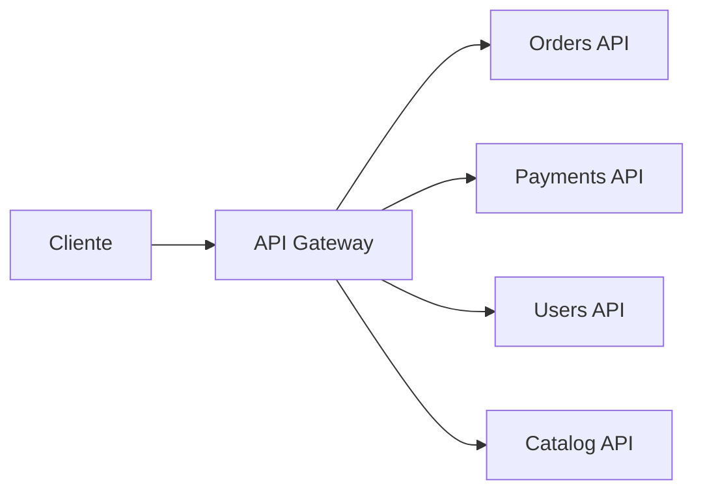
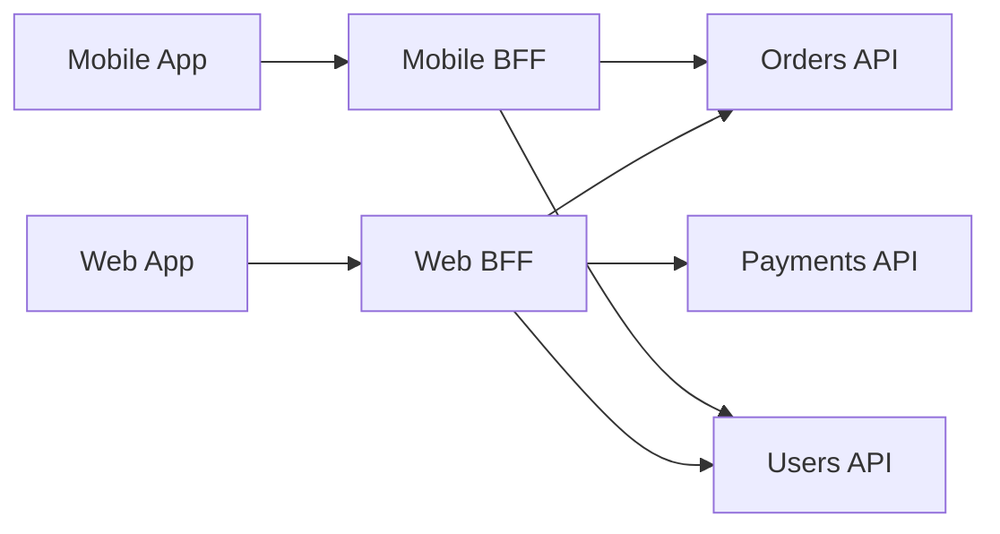
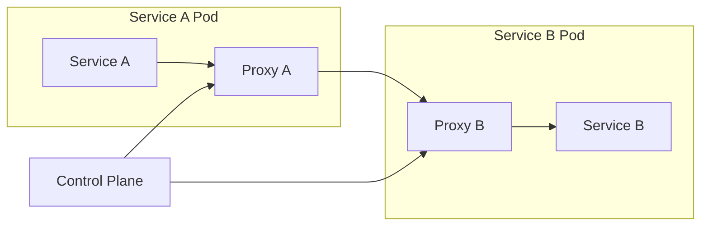
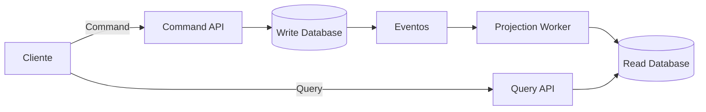
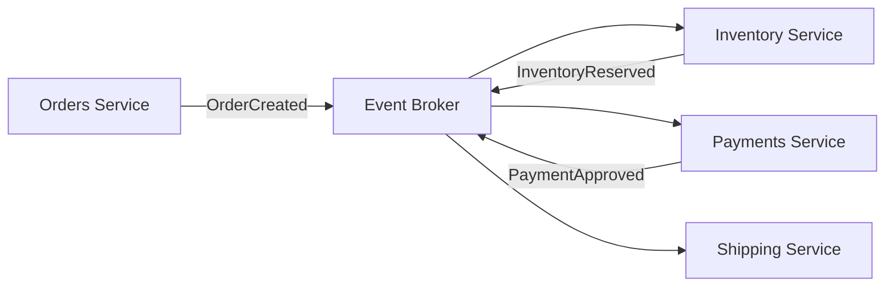
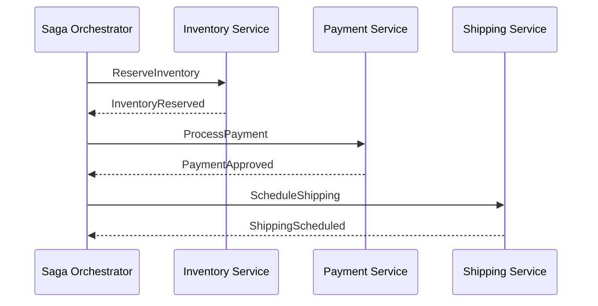
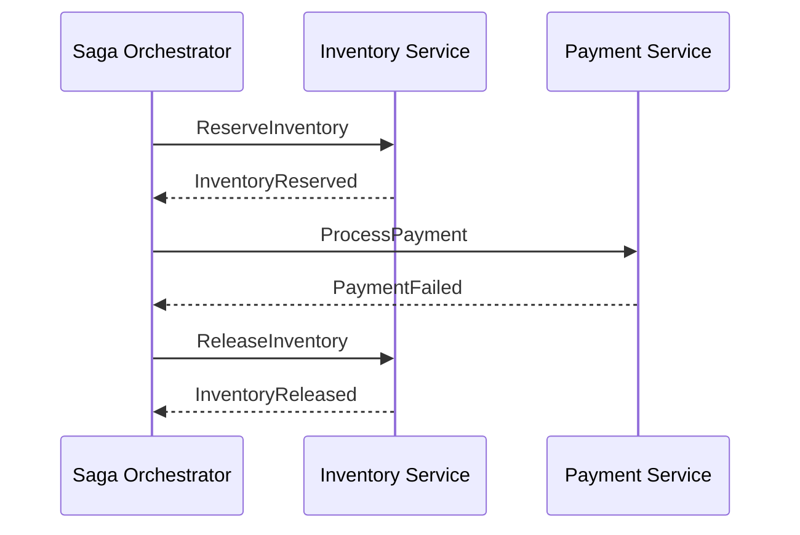
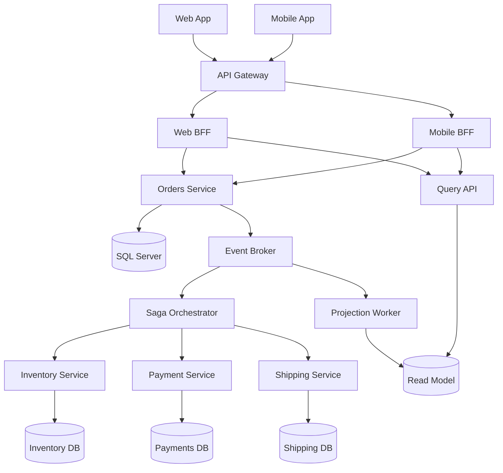
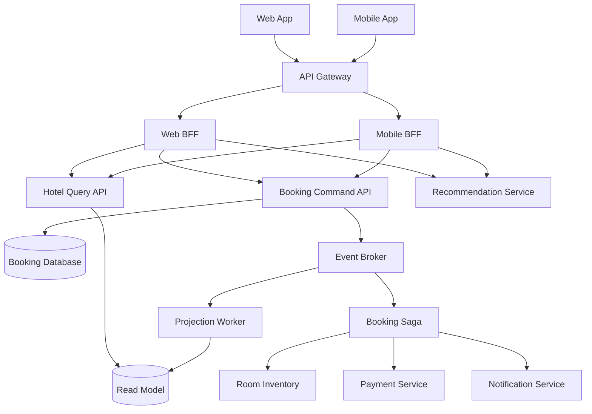

---

title: "Módulo 7 — Conceitos Adicionais e Padrões de Arquitetura"
description: "API Gateway, Rate Limiting, BFF, Service Mesh, CQRS, SAGA, Event Sourcing, resiliência, deployment, concorrência e paralelismo."
tags:

* system-design
* software-architecture
* distributed-systems
* microservices
* csharp
* sql-server

---

# Módulo 7 — Conceitos Adicionais e Padrões de Arquitetura

Este módulo apresenta conceitos e padrões comuns em sistemas distribuídos e arquiteturas modernas.

O objetivo não é apenas conhecer os nomes, mas entender:

* Qual problema cada padrão resolve.
* Quando utilizar.
* Quando evitar.
* Quais trade-offs são introduzidos.
* Como esses conceitos se relacionam.
* Como aplicá-los com C# e SQL Server.

---

## Sumário

* [1. Visão geral](#1-visão-geral)
* [2. API Gateway](#2-api-gateway)
* [3. Rate Limiting](#3-rate-limiting)
* [4. Backend for Frontends](#4-backend-for-frontends)
* [5. Service Mesh](#5-service-mesh)
* [6. CQRS](#6-cqrs)
* [7. SAGA](#7-saga)
* [8. Event Sourcing](#8-event-sourcing)
* [9. Padrões de resiliência](#9-padrões-de-resiliência)
* [10. Modelos de deployment](#10-modelos-de-deployment)
* [11. Concorrência e paralelismo](#11-concorrência-e-paralelismo)
* [12. Como os padrões se relacionam](#12-como-os-padrões-se-relacionam)
* [13. Arquitetura de exemplo](#13-arquitetura-de-exemplo)
* [14. Checklist de produção](#14-checklist-de-produção)
* [15. Regras práticas](#15-regras-práticas)
* [16. Questões de entrevista](#16-questões-de-entrevista)
* [17. Exercício prático](#17-exercício-prático)
* [18. Resumo do módulo](#18-resumo-do-módulo)

---

# 1. Visão geral

Os padrões deste módulo atuam em diferentes partes de uma arquitetura.

```text
Clientes
   |
   v
API Gateway
   |
   +--> BFF Web
   +--> BFF Mobile
           |
           v
       Microserviços
           |
           +--> Service Mesh
           |
           +--> CQRS
           |
           +--> SAGA
           |
           +--> Event Sourcing
```

Enquanto isso, outros padrões atravessam toda a arquitetura:

```text
Rate Limiting
Resiliência
Observabilidade
Segurança
Deployment
Concorrência
Paralelismo
```

Nem todo sistema precisa de todos esses padrões.

Adicionar padrões sem necessidade aumenta:

* Complexidade.
* Custo operacional.
* Curva de aprendizado.
* Dificuldade de diagnóstico.
* Tempo de desenvolvimento.
* Quantidade de falhas possíveis.

Uma arquitetura madura não é aquela que possui mais padrões.

É aquela que utiliza somente os padrões necessários para seus requisitos.

---

# 2. API Gateway

Um API Gateway é um ponto de entrada central para clientes acessarem APIs e serviços internos.

```text
Cliente
   |
   v
API Gateway
   |
   +--> Orders API
   +--> Payments API
   +--> Users API
```

## 2.1. Problema sem API Gateway

Sem um Gateway, o cliente pode precisar conhecer vários serviços.

```text
Mobile App
   |
   +--> Orders API
   +--> Payments API
   +--> Customers API
   +--> Inventory API
```

Isso cria acoplamento entre cliente e infraestrutura.

O cliente precisa conhecer:

* Endereços.
* Portas.
* Versões.
* Protocolos.
* Serviços disponíveis.
* Estratégias de autenticação.
* Formatos de erro.

Quando a arquitetura muda, o cliente também pode precisar mudar.

## 2.2. Responsabilidades comuns

Um API Gateway pode executar:

* Roteamento.
* Autenticação.
* Validação de tokens.
* Rate limiting.
* TLS termination.
* Logging.
* Métricas.
* Cache.
* Transformação de requests.
* Transformação de responses.
* Versionamento.
* Agregação.
* Canary releases.
* Proteção contra abuso.

## 2.3. Roteamento por caminho

```text
/api/orders   --> Orders API
/api/payments --> Payments API
/api/users    --> Users API
```

## 2.4. Roteamento por host

```text
api.example.com   --> APIs públicas
admin.example.com --> APIs administrativas
```

## 2.5. Diagrama



## 2.6. Benefícios

* Endpoint único para clientes.
* Oculta a topologia interna.
* Centraliza políticas de borda.
* Facilita autenticação.
* Reduz duplicação.
* Permite roteamento gradual.
* Simplifica clientes.

## 2.7. Desvantagens

* Pode virar gargalo.
* Pode virar ponto único de falha.
* Adiciona latência.
* Pode acumular lógica demais.
* Aumenta a criticidade operacional.
* Pode acoplar serviços se fizer muita orquestração.

## 2.8. Gateway gordo

Um erro comum é colocar regras de negócio no Gateway.

Exemplo inadequado:

```text
Gateway:
- calcula desconto
- valida estoque
- decide aprovação de pedido
- atualiza pagamento
```

O Gateway deve cuidar principalmente de preocupações transversais.

Regras de domínio devem permanecer nos serviços responsáveis.

## 2.9. Exemplo com YARP e C#

YARP é um reverse proxy para .NET.

Exemplo de configuração:

```json
{
  "ReverseProxy": {
    "Routes": {
      "orders-route": {
        "ClusterId": "orders-cluster",
        "Match": {
          "Path": "/api/orders/{**catch-all}"
        }
      },
      "payments-route": {
        "ClusterId": "payments-cluster",
        "Match": {
          "Path": "/api/payments/{**catch-all}"
        }
      }
    },
    "Clusters": {
      "orders-cluster": {
        "Destinations": {
          "orders-api-1": {
            "Address": "https://orders-api:8080/"
          }
        }
      },
      "payments-cluster": {
        "Destinations": {
          "payments-api-1": {
            "Address": "https://payments-api:8080/"
          }
        }
      }
    }
  }
}
```

Programação:

```csharp
var builder = WebApplication.CreateBuilder(args);

builder.Services
    .AddReverseProxy()
    .LoadFromConfig(
        builder.Configuration.GetSection("ReverseProxy"));

builder.Services.AddAuthentication();
builder.Services.AddAuthorization();

var app = builder.Build();

app.UseAuthentication();
app.UseAuthorization();

app.MapReverseProxy();

app.Run();
```

## 2.10. Quando usar

* Muitos serviços.
* Múltiplos clientes.
* APIs públicas.
* Necessidade de políticas centralizadas.
* Necessidade de esconder a topologia interna.
* Rate limiting central.
* Autenticação comum.

## 2.11. Quando evitar

* Sistema pequeno com uma única API.
* Arquitetura simples.
* Gateway não oferece benefício concreto.
* Equipe não consegue operar mais uma camada crítica.

---

# 3. Rate Limiting

Rate limiting limita quantas requisições um cliente pode fazer em determinado período.

Exemplo:

```text
100 requisições por minuto por usuário
```

## 3.1. Por que existe

Rate limiting ajuda a proteger contra:

* Abuso.
* Bots.
* Ataques.
* Clientes com bugs.
* Loops acidentais.
* Sobrecarga.
* Consumo injusto.
* Custos imprevisíveis.

## 3.2. Resposta HTTP

Quando o limite é excedido:

```http
HTTP/1.1 429 Too Many Requests
Retry-After: 30
```

## 3.3. Chaves de limitação

O limite pode ser aplicado por:

* IP.
* Usuário.
* Tenant.
* API key.
* Client ID.
* Endpoint.
* Região.
* Combinação de fatores.

## 3.4. Fixed Window

Divide o tempo em janelas fixas.

Exemplo:

```text
Limite: 100 requisições por minuto

12:00:00 até 12:00:59
12:01:00 até 12:01:59
```

### Vantagens

* Simples.
* Fácil de implementar.
* Baixo custo.

### Desvantagens

Pode permitir picos na fronteira.

```text
100 requisições em 12:00:59
+
100 requisições em 12:01:00
=
200 requisições em aproximadamente 1 segundo
```

## 3.5. Sliding Window Log

Armazena o horário de cada requisição.

```text
12:00:01
12:00:04
12:00:08
...
```

Ao receber uma nova requisição, remove entradas antigas e conta as restantes.

### Vantagens

* Muito preciso.
* Evita picos de fronteira.

### Desvantagens

* Consome mais memória.
* Armazena muitos timestamps.
* Mais caro em grande escala.

## 3.6. Sliding Window Counter

Combina a janela atual e a anterior.

É uma aproximação mais eficiente do sliding window log.

### Vantagens

* Boa precisão.
* Menor custo de memória.

### Desvantagens

* Mais complexo que fixed window.
* Ainda é uma aproximação.

## 3.7. Token Bucket

Um balde recebe tokens em determinada taxa.

Cada requisição consome um token.

```text
Capacidade: 100 tokens
Reposição: 10 tokens por segundo
```

Se houver token, a requisição passa.

Se não houver, ela é rejeitada ou aguardada.

### Vantagens

* Permite bursts controlados.
* Flexível.
* Muito utilizado.

### Desvantagens

* Exige controle de estado.
* Implementação distribuída pode ser complexa.

## 3.8. Leaky Bucket

Requisições entram em uma fila e saem em velocidade constante.

```text
Entrada variável
      |
      v
   Bucket
      |
      v
Saída constante
```

### Vantagens

* Suaviza picos.
* Produz taxa estável.

### Desvantagens

* Pode aumentar latência.
* A fila pode encher.
* Requisições podem ser descartadas.

## 3.9. Comparação

| Algoritmo       |   Precisão | Memória | Suporta bursts |
| --------------- | ---------: | ------: | -------------: |
| Fixed Window    |      Baixa |   Baixa |        Parcial |
| Sliding Log     |       Alta |    Alta |            Não |
| Sliding Counter | Média/Alta |   Média |        Parcial |
| Token Bucket    |       Alta |   Média |            Sim |
| Leaky Bucket    |       Alta |   Média |     Controlado |

## 3.10. Rate limiting distribuído

Com múltiplas instâncias:

```text
Gateway 1
Gateway 2
Gateway 3
```

Se cada instância mantiver um contador local:

```text
Limite global desejado: 100

Gateway 1 permite 100
Gateway 2 permite 100
Gateway 3 permite 100
```

O limite efetivo vira 300.

Por isso, limites globais normalmente precisam de armazenamento compartilhado.

Exemplo:

```text
Gateways
   |
   v
Redis
```

## 3.11. Exemplo em ASP.NET Core

```csharp
using System.Threading.RateLimiting;

var builder = WebApplication.CreateBuilder(args);

builder.Services.AddRateLimiter(options =>
{
    options.RejectionStatusCode =
        StatusCodes.Status429TooManyRequests;

    options.AddPolicy("user-policy", httpContext =>
    {
        var userId =
            httpContext.User.Identity?.Name
            ?? httpContext.Connection.RemoteIpAddress?.ToString()
            ?? "anonymous";

        return RateLimitPartition.GetTokenBucketLimiter(
            partitionKey: userId,
            factory: _ => new TokenBucketRateLimiterOptions
            {
                TokenLimit = 100,
                TokensPerPeriod = 20,
                ReplenishmentPeriod = TimeSpan.FromMinutes(1),
                AutoReplenishment = true,
                QueueLimit = 0
            });
    });
});

var app = builder.Build();

app.UseRateLimiter();

app.MapGet("/api/orders", () => Results.Ok())
    .RequireRateLimiting("user-policy");

app.Run();
```

## 3.12. Trade-offs

Limites agressivos:

* Protegem melhor.
* Podem bloquear clientes legítimos.
* Podem causar pior experiência.

Limites permissivos:

* Melhor experiência.
* Menor proteção.
* Maior risco de custos.

## 3.13. Rate limit versus quota

Rate limit controla a velocidade.

```text
100 requisições por minuto
```

Quota controla o total.

```text
1 milhão de requisições por mês
```

Um sistema pode utilizar ambos.

---

# 4. Backend for Frontends

Backend for Frontends, ou BFF, é um backend específico para um tipo de cliente.

```text
Web App    --> Web BFF
Mobile App --> Mobile BFF
TV App     --> TV BFF
```

## 4.1. Problema sem BFF

Clientes diferentes têm necessidades diferentes.

Web pode precisar:

* Dados detalhados.
* Respostas maiores.
* Recursos administrativos.

Mobile pode precisar:

* Payload menor.
* Menos requisições.
* Imagens reduzidas.
* Suporte a redes instáveis.

TV pode precisar:

* Navegação simples.
* Poucos dados.
* Respostas agregadas.

Uma única API genérica pode ficar:

* Complexa.
* Cheia de parâmetros.
* Ineficiente.
* Acoplada a todos os clientes.

## 4.2. Arquitetura



## 4.3. Responsabilidades

Um BFF pode:

* Agregar respostas.
* Adaptar payloads.
* Reduzir round trips.
* Aplicar autenticação específica.
* Manter tokens fora do navegador.
* Criar endpoints específicos.
* Formatar dados para o cliente.

## 4.4. Exemplo de agregação

Sem BFF:

```text
Cliente --> Orders API
Cliente --> Customers API
Cliente --> Payments API
```

Com BFF:

```text
Cliente --> BFF
             |
             +--> Orders API
             +--> Customers API
             +--> Payments API
```

O cliente recebe uma resposta agregada.

## 4.5. Exemplo em C#

```csharp
public sealed record OrderPageResponse(
    OrderDto Order,
    CustomerDto Customer,
    PaymentDto? Payment);

public sealed class OrdersBffService
{
    private readonly HttpClient _ordersClient;
    private readonly HttpClient _customersClient;
    private readonly HttpClient _paymentsClient;

    public OrdersBffService(
        IHttpClientFactory httpClientFactory)
    {
        _ordersClient =
            httpClientFactory.CreateClient("orders");

        _customersClient =
            httpClientFactory.CreateClient("customers");

        _paymentsClient =
            httpClientFactory.CreateClient("payments");
    }

    public async Task<OrderPageResponse> GetOrderPageAsync(
        long orderId,
        CancellationToken cancellationToken)
    {
        var orderTask =
            _ordersClient.GetFromJsonAsync<OrderDto>(
                $"/api/orders/{orderId}",
                cancellationToken);

        var paymentTask =
            _paymentsClient.GetFromJsonAsync<PaymentDto>(
                $"/api/payments/by-order/{orderId}",
                cancellationToken);

        var order =
            await orderTask
            ?? throw new InvalidOperationException(
                "Order not found.");

        var customerTask =
            _customersClient.GetFromJsonAsync<CustomerDto>(
                $"/api/customers/{order.CustomerId}",
                cancellationToken);

        await Task.WhenAll(customerTask, paymentTask);

        return new OrderPageResponse(
            Order: order,
            Customer: await customerTask
                ?? throw new InvalidOperationException(
                    "Customer not found."),
            Payment: await paymentTask);
    }
}
```

## 4.6. BFF para segurança

Em aplicações web, um BFF pode manter tokens no servidor.

```text
Browser
   |
   | Cookie HttpOnly
   v
BFF
   |
   | Bearer Token
   v
APIs
```

Isso reduz a exposição de tokens a JavaScript.

## 4.7. Vantagens

* Interfaces específicas por cliente.
* Menos round trips.
* Melhor desempenho em mobile.
* Maior autonomia entre equipes.
* Adaptação de contratos.
* Pode melhorar segurança.

## 4.8. Desvantagens

* Mais serviços.
* Mais código.
* Duplicação.
* Maior custo operacional.
* Risco de lógica de negócio no BFF.
* Pode virar um monólito de integração.

## 4.9. Quando usar

* Clientes com necessidades muito diferentes.
* Mobile sensível a latência.
* SPA utilizando padrão BFF.
* Necessidade de agregação.
* Equipes separadas por experiência.

## 4.10. Quando evitar

* Apenas um cliente.
* APIs já atendem bem às necessidades.
* Diferenças pequenas.
* Complexidade adicional não se justifica.

---

# 5. Service Mesh

Service Mesh é uma camada de infraestrutura para controlar comunicação entre serviços.

Normalmente utiliza proxies próximos às aplicações.

```text
Service A --> Proxy A --> Proxy B --> Service B
```

## 5.1. Sidecar Proxy

No modelo sidecar, cada serviço possui um proxy ao lado.

```text
Pod A
+------------------+
| Service A        |
| Sidecar Proxy A  |
+------------------+

Pod B
+------------------+
| Service B        |
| Sidecar Proxy B  |
+------------------+
```

## 5.2. Data Plane e Control Plane

### Data Plane

Responsável pelo tráfego real.

```text
Proxy A --> Proxy B
```

### Control Plane

Distribui configurações e políticas.

```text
Control Plane
   |
   +--> Proxy A
   +--> Proxy B
   +--> Proxy C
```

## 5.3. Recursos comuns

* mTLS.
* Service discovery.
* Load balancing.
* Retries.
* Timeouts.
* Circuit breakers.
* Telemetria.
* Traffic shifting.
* Canary.
* Fault injection.
* Autorização entre serviços.

## 5.4. Arquitetura



## 5.5. Benefícios

* Preocupações de rede padronizadas.
* Menos código repetido.
* mTLS automático.
* Observabilidade central.
* Políticas uniformes.
* Controle de tráfego avançado.

## 5.6. Desvantagens

* Mais proxies.
* Mais CPU e memória.
* Mais latência.
* Debugging mais complexo.
* Curva de aprendizado.
* Dependência da plataforma.
* Mais uma camada de falha.

## 5.7. Service Mesh versus biblioteca

Sem mesh:

```text
Aplicação implementa:
- retries
- timeout
- circuit breaker
- tracing
```

Com mesh:

```text
Proxy implementa parte dessas funções
```

Mesmo com mesh, a aplicação ainda precisa entender a semântica do domínio.

Um proxy não sabe se uma operação é idempotente.

## 5.8. Cuidado com retries

Considere:

```text
Aplicação faz 3 retries
Service Mesh faz 3 retries
Load Balancer faz 3 retries
```

Uma chamada pode gerar muitas tentativas.

```text
3 x 3 x 3 = 27 tentativas
```

## 5.9. Quando usar

* Muitos microserviços.
* Kubernetes.
* Necessidade de mTLS.
* Políticas de tráfego avançadas.
* Equipe de plataforma madura.
* Observabilidade distribuída.

## 5.10. Quando evitar

* Poucos serviços.
* Equipe pequena.
* Arquitetura ainda simples.
* Custo operacional maior que o benefício.

---

# 6. CQRS

CQRS significa Command Query Responsibility Segregation.

A ideia é separar operações de escrita das operações de leitura.

```text
Commands --> Write Model
Queries  --> Read Model
```

## 6.1. Modelo tradicional

```text
Orders Service
   |
   v
Orders Database
```

O mesmo modelo atende:

* Escritas.
* Leituras.
* Regras de negócio.
* Relatórios.
* Consultas complexas.

Com o crescimento, esses usos podem entrar em conflito.

## 6.2. Modelo CQRS

```text
Commands
   |
   v
Write Model
   |
   v
Write Database

Queries
   |
   v
Read Model
   |
   v
Read Database
```

## 6.3. Command

Um command representa uma intenção de mudança.

Exemplos:

```text
CreateOrder
ApprovePayment
CancelOrder
ChangeAddress
```

Commands devem possuir nomes imperativos.

## 6.4. Query

Uma query solicita informação sem alterar estado.

Exemplos:

```text
GetOrderById
SearchOrders
GetCustomerDashboard
```

## 6.5. CQRS simples

É possível separar apenas o código, usando o mesmo banco.

```text
Command Handlers
      |
      v
SQL Server

Query Handlers
      |
      v
Mesmo SQL Server
```

Isso já pode melhorar organização.

## 6.6. CQRS completo

Pode utilizar modelos e bancos separados.

```text
Write Model --> SQL Server
Read Model  --> Elasticsearch
```

ou:

```text
Write Model --> SQL Server normalizado
Read Model  --> SQL Server desnormalizado
```

## 6.7. Fluxo



## 6.8. Eventual Consistency

Ao separar os modelos:

```text
Command gravado às 10:00:00
Read model atualizado às 10:00:01
```

Durante esse intervalo, a leitura pode estar desatualizada.

## 6.9. Exemplo de tabelas

Write model normalizado:

```sql
CREATE TABLE dbo.Orders
(
    OrderId BIGINT PRIMARY KEY,
    CustomerId BIGINT NOT NULL,
    Status VARCHAR(30) NOT NULL,
    Total DECIMAL(18, 2) NOT NULL,
    CreatedAtUtc DATETIME2 NOT NULL
);

CREATE TABLE dbo.OrderItems
(
    OrderId BIGINT NOT NULL,
    ProductId BIGINT NOT NULL,
    Quantity INT NOT NULL,
    UnitPrice DECIMAL(18, 2) NOT NULL,

    CONSTRAINT PK_OrderItems
        PRIMARY KEY (OrderId, ProductId)
);
```

Read model desnormalizado:

```sql
CREATE TABLE dbo.OrderSummaries
(
    OrderId BIGINT PRIMARY KEY,
    CustomerId BIGINT NOT NULL,
    CustomerName NVARCHAR(200) NOT NULL,
    Status VARCHAR(30) NOT NULL,
    Total DECIMAL(18, 2) NOT NULL,
    ItemCount INT NOT NULL,
    LastUpdatedAtUtc DATETIME2 NOT NULL
);
```

## 6.10. Command em C#

```csharp
public sealed record CreateOrderCommand(
    long CustomerId,
    IReadOnlyCollection<CreateOrderItem> Items);

public sealed record CreateOrderItem(
    long ProductId,
    int Quantity,
    decimal UnitPrice);
```

Handler:

```csharp
public sealed class CreateOrderHandler
{
    private readonly IOrderRepository _repository;

    public CreateOrderHandler(IOrderRepository repository)
    {
        _repository = repository;
    }

    public async Task<long> HandleAsync(
        CreateOrderCommand command,
        CancellationToken cancellationToken)
    {
        if (command.Items.Count == 0)
        {
            throw new InvalidOperationException(
                "Order must contain at least one item.");
        }

        var order = Order.Create(
            command.CustomerId,
            command.Items);

        await _repository.AddAsync(
            order,
            cancellationToken);

        return order.Id;
    }
}
```

## 6.11. Query em C#

```csharp
public sealed class GetOrderSummaryHandler
{
    private readonly string _connectionString;

    public GetOrderSummaryHandler(string connectionString)
    {
        _connectionString = connectionString;
    }

    public async Task<OrderSummaryDto?> HandleAsync(
        long orderId,
        CancellationToken cancellationToken)
    {
        const string sql = """
            SELECT
                OrderId,
                CustomerName,
                Status,
                Total,
                ItemCount
            FROM dbo.OrderSummaries
            WHERE OrderId = @OrderId;
            """;

        await using var connection =
            new Microsoft.Data.SqlClient.SqlConnection(
                _connectionString);

        await connection.OpenAsync(cancellationToken);

        await using var command =
            new Microsoft.Data.SqlClient.SqlCommand(
                sql,
                connection);

        command.Parameters.AddWithValue(
            "@OrderId",
            orderId);

        await using var reader =
            await command.ExecuteReaderAsync(
                cancellationToken);

        if (!await reader.ReadAsync(cancellationToken))
        {
            return null;
        }

        return new OrderSummaryDto(
            reader.GetInt64(0),
            reader.GetString(1),
            reader.GetString(2),
            reader.GetDecimal(3),
            reader.GetInt32(4));
    }
}
```

## 6.12. Benefícios

* Modelos otimizados.
* Leitura escala separadamente.
* Escrita preserva regras de domínio.
* Consultas ficam simples.
* Boa integração com eventos.

## 6.13. Desvantagens

* Mais componentes.
* Consistência eventual.
* Projeções podem falhar.
* Necessidade de reprocessamento.
* Mais bancos ou tabelas.
* Debugging mais difícil.

## 6.14. Quando usar

* Leituras muito diferentes de escritas.
* Alto volume de leitura.
* Domínio complexo.
* Relatórios pesados.
* Projeções específicas.
* Event Sourcing.

## 6.15. Quando evitar

* CRUD simples.
* Baixo volume.
* Equipe pequena.
* Consistência imediata obrigatória.
* Complexidade não justificada.

---

# 7. SAGA

SAGA é um padrão para coordenar transações distribuídas.

Em microserviços, uma operação pode atravessar vários bancos.

Exemplo:

```text
Criar pedido
Reservar estoque
Processar pagamento
Agendar entrega
```

Cada serviço possui sua própria transação.

```text
Orders DB
Inventory DB
Payments DB
Shipping DB
```

Não existe uma única transação ACID envolvendo todos eles.

## 7.1. Transação distribuída

Uma transação distribuída tradicional poderia tentar coordenar todos os recursos.

Porém, isso geralmente:

* Aumenta acoplamento.
* Reduz disponibilidade.
* É difícil de operar.
* Pode não ser suportado.
* Mantém locks por mais tempo.

SAGA utiliza uma sequência de transações locais.

## 7.2. Compensações

Quando uma etapa falha, etapas anteriores podem ser compensadas.

```text
Criar pedido
      |
      v
Reservar estoque
      |
      v
Pagamento falha
      |
      v
Liberar estoque
      |
      v
Cancelar pedido
```

## 7.3. Compensação não é rollback

Em SQL:

```text
ROLLBACK
```

restaura uma transação que ainda não foi concluída.

Em uma SAGA, a transação anterior já foi confirmada.

A compensação executa uma nova ação.

```text
Reserva de estoque confirmada
+
Comando posterior para liberar estoque
```

## 7.4. Coreografia

Na coreografia, serviços reagem a eventos.

```text
OrderCreated
   |
   v
Inventory Service reserva
   |
   v
InventoryReserved
   |
   v
Payment Service cobra
```

## 7.5. Diagrama de coreografia



## 7.6. Vantagens da coreografia

* Baixo acoplamento direto.
* Serviços autônomos.
* Escala distribuída.
* Boa integração com eventos.

## 7.7. Desvantagens da coreografia

* Fluxo fica difícil de visualizar.
* Ciclos podem surgir.
* Debugging complexo.
* Regras ficam espalhadas.
* Dificuldade de saber o estado global.

## 7.8. Orquestração

Na orquestração, um componente central coordena o fluxo.

```text
Saga Orchestrator
   |
   +--> Reserve Inventory
   +--> Process Payment
   +--> Schedule Shipping
```

## 7.9. Diagrama de orquestração



## 7.10. Falha com compensação



## 7.11. Estado da SAGA

Uma SAGA longa deve persistir seu estado.

```sql
CREATE TABLE dbo.OrderSagas
(
    SagaId UNIQUEIDENTIFIER NOT NULL PRIMARY KEY,
    OrderId BIGINT NOT NULL,
    CurrentStep VARCHAR(50) NOT NULL,
    Status VARCHAR(30) NOT NULL,
    LastError NVARCHAR(2000) NULL,
    CreatedAtUtc DATETIME2 NOT NULL,
    UpdatedAtUtc DATETIME2 NOT NULL,
    RowVersion ROWVERSION NOT NULL
);
```

## 7.12. Exemplo de estados

```text
Started
InventoryReserved
PaymentApproved
ShippingScheduled
Completed
Compensating
Compensated
Failed
```

## 7.13. Idempotência

Mensagens de SAGA podem ser duplicadas.

Cada etapa deve ser idempotente.

Exemplo:

```text
ReserveInventory command
CommandId = abc-123
```

Se recebido novamente, o serviço deve devolver o mesmo resultado em vez de reservar duas vezes.

## 7.14. Benefícios

* Evita transações distribuídas.
* Permite autonomia de serviços.
* Funciona com bancos diferentes.
* Adequado para processos longos.

## 7.15. Desvantagens

* Consistência eventual.
* Compensações complexas.
* Estados intermediários.
* Debugging difícil.
* Necessidade de idempotência.
* Compensações podem falhar.

## 7.16. Quando usar

* Processos envolvendo múltiplos serviços.
* Cada serviço possui seu próprio banco.
* Operações longas.
* Compensações são possíveis.
* Consistência imediata não é obrigatória.

## 7.17. Quando evitar

* Tudo está no mesmo banco.
* Uma única transação local resolve.
* Compensação não é possível.
* Domínio exige atomicidade imediata.

---

# 8. Event Sourcing

Event Sourcing armazena eventos como fonte principal do estado.

Em vez de armazenar apenas o estado atual:

```text
Order Status = Shipped
```

armazenamos o histórico:

```text
OrderCreated
ItemAdded
PaymentApproved
OrderShipped
```

O estado atual é reconstruído aplicando os eventos.

## 8.1. Modelo tradicional

```sql
UPDATE dbo.Orders
SET Status = 'Shipped'
WHERE OrderId = 1001;
```

O estado anterior é perdido, salvo se houver auditoria separada.

## 8.2. Event Sourcing

```text
Stream: order-1001

Event 1: OrderCreated
Event 2: ItemAdded
Event 3: PaymentApproved
Event 4: OrderShipped
```

## 8.3. Reconstrução

```text
Estado inicial
   |
   + OrderCreated
   |
   + ItemAdded
   |
   + PaymentApproved
   |
   + OrderShipped
   |
   v
Estado atual
```

## 8.4. Event Store

Tabela simplificada:

```sql
CREATE TABLE dbo.EventStore
(
    StreamId VARCHAR(200) NOT NULL,
    Version BIGINT NOT NULL,
    EventId UNIQUEIDENTIFIER NOT NULL,
    EventType VARCHAR(200) NOT NULL,
    EventData NVARCHAR(MAX) NOT NULL,
    Metadata NVARCHAR(MAX) NULL,
    OccurredAtUtc DATETIME2 NOT NULL,

    CONSTRAINT PK_EventStore
        PRIMARY KEY (StreamId, Version),

    CONSTRAINT UQ_EventStore_EventId
        UNIQUE (EventId)
);
```

## 8.5. Concorrência otimista

Ao adicionar um evento, a aplicação informa a versão esperada.

Exemplo:

```text
Versão atual esperada: 5
Nova versão: 6
```

Se outra operação já gravou a versão 6, ocorre conflito.

```sql
INSERT INTO dbo.EventStore
(
    StreamId,
    Version,
    EventId,
    EventType,
    EventData,
    Metadata,
    OccurredAtUtc
)
VALUES
(
    @StreamId,
    @ExpectedVersion + 1,
    @EventId,
    @EventType,
    @EventData,
    @Metadata,
    SYSUTCDATETIME()
);
```

A chave primária impede duas versões iguais.

## 8.6. Aggregate em C#

```csharp
public abstract class AggregateRoot
{
    private readonly List<object> _uncommittedEvents = [];

    public long Version { get; private set; }

    public IReadOnlyCollection<object> UncommittedEvents =>
        _uncommittedEvents.AsReadOnly();

    protected void Raise(object domainEvent)
    {
        Apply(domainEvent);
        _uncommittedEvents.Add(domainEvent);
    }

    public void LoadFromHistory(
        IEnumerable<object> events)
    {
        foreach (var domainEvent in events)
        {
            Apply(domainEvent);
            Version++;
        }
    }

    protected abstract void Apply(object domainEvent);

    public void MarkEventsAsCommitted()
    {
        Version += _uncommittedEvents.Count;
        _uncommittedEvents.Clear();
    }
}
```

Exemplo de pedido:

```csharp
public sealed record OrderCreated(
    long OrderId,
    long CustomerId);

public sealed record OrderPaid(
    long OrderId,
    decimal Amount);

public sealed class OrderAggregate : AggregateRoot
{
    public long Id { get; private set; }
    public long CustomerId { get; private set; }
    public string Status { get; private set; } = "Unknown";
    public decimal PaidAmount { get; private set; }

    public static OrderAggregate Create(
        long orderId,
        long customerId)
    {
        var order = new OrderAggregate();

        order.Raise(new OrderCreated(
            orderId,
            customerId));

        return order;
    }

    public void MarkAsPaid(decimal amount)
    {
        if (Status == "Paid")
        {
            return;
        }

        Raise(new OrderPaid(Id, amount));
    }

    protected override void Apply(object domainEvent)
    {
        switch (domainEvent)
        {
            case OrderCreated created:
                Id = created.OrderId;
                CustomerId = created.CustomerId;
                Status = "Created";
                break;

            case OrderPaid paid:
                PaidAmount = paid.Amount;
                Status = "Paid";
                break;
        }
    }
}
```

## 8.7. Projeções

Eventos alimentam modelos de leitura.

```text
Event Store
   |
   +--> Order Summary Projection
   +--> Customer History Projection
   +--> Revenue Projection
```

## 8.8. Snapshots

Reproduzir milhares de eventos pode ser caro.

Snapshot salva um estado intermediário.

```text
Snapshot na versão 10.000
+
Eventos 10.001 até 10.050
```

## 8.9. Vantagens

* Auditoria completa.
* Histórico natural.
* Reconstrução de estado.
* Novas projeções.
* Time travel.
* Boa integração com CQRS.
* Eventos refletem fatos de negócio.

## 8.10. Desvantagens

* Alta complexidade.
* Versionamento de eventos.
* Migração difícil.
* Projeções assíncronas.
* Debugging mais difícil.
* LGPD e exclusão de dados exigem cuidado.
* Rebuilds podem ser caros.

## 8.11. Eventos são imutáveis

Um evento representa algo que já aconteceu.

```text
PaymentApproved
```

Ele não deve ser alterado.

Se houve erro:

```text
PaymentApprovalReversed
```

Um novo evento corrige o histórico.

## 8.12. Event Sourcing versus Event-Driven

São conceitos diferentes.

### Event-Driven

Serviços comunicam eventos.

### Event Sourcing

Eventos são a fonte de verdade do estado.

Um sistema pode ser event-driven sem usar Event Sourcing.

## 8.13. Quando usar

* Auditoria é essencial.
* Histórico completo é requisito.
* Domínio temporal.
* Reconstrução de estado.
* Múltiplas projeções.
* Sistemas financeiros ou de rastreabilidade.

## 8.14. Quando evitar

* CRUD simples.
* Equipe sem experiência.
* Domínio não precisa de histórico.
* Custo operacional não se justifica.
* Requisitos de exclusão são incompatíveis com o modelo escolhido.

---

# 9. Padrões de resiliência

Resiliência é a capacidade de continuar operando diante de falhas.

Em sistemas distribuídos, falhas são esperadas.

```text
Timeouts
Conexões interrompidas
Serviços lentos
Bancos indisponíveis
Mensagens duplicadas
Dependências degradadas
```

---

## 9.1. Timeout

Toda chamada remota precisa de timeout.

Sem timeout:

```text
Serviço A chama Serviço B
          |
          v
espera indefinidamente
```

Com timeout:

```text
Aguarda até 2 segundos
        |
        +--> resposta
        |
        +--> timeout
```

Exemplo:

```csharp
builder.Services.AddHttpClient(
    "payments",
    client =>
    {
        client.BaseAddress =
            new Uri("https://payments-api");

        client.Timeout =
            TimeSpan.FromSeconds(3);
    });
```

### Trade-off

Timeout muito baixo:

* Falhas falsas.
* Mais retries.
* Operações válidas são interrompidas.

Timeout muito alto:

* Threads e conexões ficam presas.
* Maior latência.
* Propagação de falhas.

---

## 9.2. Retry

Retry repete uma operação que falhou temporariamente.

```text
Tentativa 1
   |
   X timeout
   |
Tentativa 2
```

Use retry apenas quando:

* Falha é transitória.
* Operação é idempotente.
* Existe limite.
* Existe backoff.
* Existe jitter.

Evite retry em:

* Erro de validação.
* HTTP 400.
* Credencial inválida.
* Regra de negócio.
* Operação não idempotente sem proteção.

---

## 9.3. Exponential Backoff

```text
1 segundo
2 segundos
4 segundos
8 segundos
```

Com jitter:

```text
1,2 segundos
2,4 segundos
4,1 segundos
8,7 segundos
```

Jitter evita que todos os clientes tentem novamente ao mesmo tempo.

---

## 9.4. Circuit Breaker

Circuit breaker interrompe chamadas para uma dependência que está falhando.

Estados:

```text
Closed
Open
Half-Open
```

### Closed

Chamadas passam normalmente.

### Open

Chamadas são rejeitadas rapidamente.

### Half-Open

Algumas chamadas são permitidas para testar recuperação.

```text
Closed
  |
muitas falhas
  |
  v
Open
  |
tempo de espera
  |
  v
Half-Open
  |
  +--> sucesso --> Closed
  |
  +--> falha   --> Open
```

### Benefícios

* Evita sobrecarregar dependência com falha.
* Falha rapidamente.
* Reduz cascata.
* Permite recuperação.

### Desvantagens

* Configuração difícil.
* Pode abrir cedo demais.
* Pode mascarar recuperação parcial.
* Requer métricas.

---

## 9.5. Bulkhead

Bulkhead isola recursos.

Sem isolamento:

```text
Todas as chamadas usam o mesmo pool
```

Uma dependência lenta pode consumir todos os recursos.

Com bulkhead:

```text
Pool Payments
Pool E-mail
Pool Reports
```

Se Reports travar, Payments continua operando.

## 9.6. Exemplo conceitual

```text
100 threads totais

Sem bulkhead:
Reports usa 100
Payments usa 0

Com bulkhead:
Reports máximo 20
Payments máximo 40
Outros máximo 40
```

---

## 9.7. Fallback

Fallback fornece uma resposta alternativa.

Exemplos:

* Cache antigo.
* Valor padrão.
* Funcionalidade reduzida.
* Resposta parcial.
* Mensagem amigável.

```text
Recommendation Service indisponível
        |
        v
Mostrar produtos populares
```

### Cuidado

Fallback não deve esconder erros críticos.

Exemplo perigoso:

```text
Serviço de saldo falha
        |
        v
Retornar saldo zero
```

Isso pode causar decisões incorretas.

---

## 9.8. Cache como resiliência

Cache pode reduzir dependência de serviços lentos.

```text
API
 |
 +--> Redis
 |
 +--> Banco
```

Com stale cache:

```text
Banco indisponível
      |
      v
Retornar dado anterior por curto período
```

Isso é aceitável apenas quando o domínio permite.

---

## 9.9. Load Shedding

Load shedding rejeita parte do tráfego para proteger o sistema.

```text
Sistema em 95% de capacidade
        |
        v
Rejeitar operações não essenciais
```

Exemplos:

* Desabilitar relatórios.
* Reduzir sugestões.
* Rejeitar requisições anônimas.
* Manter checkout e pagamentos.

---

## 9.10. Graceful Degradation

O sistema continua funcionando com recursos reduzidos.

```text
Busca disponível
Recomendações indisponíveis
Checkout disponível
Analytics atrasado
```

## 9.11. Health Checks

### Liveness

A aplicação está viva?

### Readiness

A aplicação está pronta para receber tráfego?

```text
/health/live
/health/ready
```

Uma aplicação pode estar viva, mas não pronta.

Exemplo:

```text
Processo iniciado
Banco ainda indisponível
```

## 9.12. Idempotência

Idempotência é um padrão de resiliência porque permite retries seguros.

```text
POST /payments
Idempotency-Key: abc-123
```

Se a chamada for repetida, o resultado anterior é retornado.

## 9.13. Polly e C#

Exemplo conceitual com pipeline de resiliência:

```csharp
builder.Services
    .AddHttpClient("payments")
    .AddStandardResilienceHandler(options =>
    {
        options.AttemptTimeout.Timeout =
            TimeSpan.FromSeconds(2);

        options.TotalRequestTimeout.Timeout =
            TimeSpan.FromSeconds(10);

        options.Retry.MaxRetryAttempts = 3;

        options.CircuitBreaker.FailureRatio = 0.5;
        options.CircuitBreaker.MinimumThroughput = 20;
        options.CircuitBreaker.SamplingDuration =
            TimeSpan.FromSeconds(30);
        options.CircuitBreaker.BreakDuration =
            TimeSpan.FromSeconds(15);
    });
```

---

# 10. Modelos de deployment

Deployment é a forma como uma nova versão é colocada em produção.

Objetivos:

* Reduzir indisponibilidade.
* Diminuir risco.
* Facilitar rollback.
* Validar progressivamente.
* Preservar dados.

---

## 10.1. Recreate

A versão antiga é encerrada e a nova é iniciada.

```text
Versão A: desligada
Versão B: iniciada
```

### Vantagens

* Simples.
* Baixo custo.
* Sem coexistência.

### Desvantagens

* Downtime.
* Rollback mais lento.
* Alto risco.

### Quando usar

* Ambientes internos.
* Sistemas não críticos.
* Desenvolvimento.
* Janela de manutenção aceitável.

---

## 10.2. Rolling Deployment

Instâncias são substituídas gradualmente.

```text
A A A A

B A A A
B B A A
B B B A
B B B B
```

### Vantagens

* Baixo ou nenhum downtime.
* Utiliza infraestrutura existente.
* Suporte comum em orquestradores.

### Desvantagens

* Duas versões coexistem.
* Rollback pode levar tempo.
* Contratos precisam ser compatíveis.

---

## 10.3. Blue-Green

Existem dois ambientes.

```text
Blue  = versão atual
Green = nova versão
```

O tráfego muda de um para outro.

```text
Antes:
Load Balancer --> Blue

Depois:
Load Balancer --> Green
```

### Vantagens

* Troca rápida.
* Rollback rápido.
* Ambiente completo para validação.

### Desvantagens

* Custo dobrado temporariamente.
* Migrações de banco são complexas.
* Estado compartilhado exige cuidado.

---

## 10.4. Canary Deployment

Uma pequena parcela recebe a nova versão.

```text
95% --> versão estável
5%  --> versão canary
```

Depois:

```text
75% --> estável
25% --> canary
```

Finalmente:

```text
100% --> nova versão
```

### Vantagens

* Reduz impacto.
* Permite validação com tráfego real.
* Facilita comparação.

### Desvantagens

* Exige observabilidade forte.
* Roteamento mais complexo.
* Dados das versões podem se misturar.
* Rollback precisa ser automatizado.

---

## 10.5. A/B Testing

A/B testing é semelhante visualmente ao canary, mas o objetivo é diferente.

### Canary

Validar estabilidade técnica.

### A/B Testing

Comparar comportamento de usuários.

```text
Grupo A --> experiência A
Grupo B --> experiência B
```

A segmentação deve ser estável.

---

## 10.6. Shadow Deployment

A nova versão recebe cópia do tráfego, mas sua resposta não é usada.

```text
Cliente
   |
   v
Versão atual --> resposta real
   |
   +--> cópia para versão shadow
```

### Vantagens

* Teste com tráfego real.
* Sem impacto direto no usuário.
* Bom para validar performance.

### Desvantagens

* Pode duplicar efeitos.
* Escritas precisam ser bloqueadas ou isoladas.
* Custo adicional.
* Dados sensíveis exigem cuidado.

---

## 10.7. Feature Flags

Código é publicado, mas a funcionalidade é habilitada separadamente.

```text
Deploy realizado
FeatureEnabled = false
```

Depois:

```text
FeatureEnabled = true para 5% dos usuários
```

### Vantagens

* Separação entre deploy e release.
* Rollback lógico rápido.
* Segmentação.
* Testes progressivos.

### Desvantagens

* Dívida de flags.
* Caminhos de código multiplicados.
* Testes mais complexos.
* Flags antigas precisam ser removidas.

---

## 10.8. Migração de banco

Deploys seguros exigem compatibilidade de schema.

Evite:

```text
1. Remover coluna.
2. Publicar aplicação nova.
```

Instâncias antigas podem ainda usar a coluna.

## 10.9. Expand and Contract

### Expand

Adicionar estrutura compatível.

```sql
ALTER TABLE dbo.Customers
ADD FullName NVARCHAR(300) NULL;
```

### Migrate

Aplicações passam a preencher e ler o novo campo.

### Contract

Depois que nenhuma versão antiga depende da estrutura anterior, ela pode ser removida.

```text
Adicionar
Migrar
Remover depois
```

## 10.10. Connection Draining

Antes de remover uma instância:

```text
1. Parar de receber novas requisições.
2. Concluir as existentes.
3. Encerrar.
```

## 10.11. Graceful Shutdown em C#

```csharp
public sealed class Worker : BackgroundService
{
    protected override async Task ExecuteAsync(
        CancellationToken stoppingToken)
    {
        while (!stoppingToken.IsCancellationRequested)
        {
            await ProcessNextMessageAsync(stoppingToken);
        }
    }

    private static async Task ProcessNextMessageAsync(
        CancellationToken cancellationToken)
    {
        await Task.Delay(
            TimeSpan.FromSeconds(1),
            cancellationToken);
    }
}
```

O processo deve respeitar o `CancellationToken` e concluir operações importantes de forma segura.

---

# 11. Concorrência e paralelismo

Concorrência e paralelismo são relacionados, mas não iguais.

## 11.1. Concorrência

Múltiplas tarefas progridem durante o mesmo intervalo de tempo.

```text
Tarefa A inicia
Tarefa A espera I/O
Tarefa B executa
Tarefa B espera I/O
Tarefa A continua
```

Pode ocorrer em um único núcleo.

## 11.2. Paralelismo

Múltiplas tarefas executam literalmente ao mesmo tempo.

```text
Core 1 --> Tarefa A
Core 2 --> Tarefa B
Core 3 --> Tarefa C
```

## 11.3. I/O-bound versus CPU-bound

### I/O-bound

A maior parte do tempo é gasta esperando:

* Banco.
* Rede.
* Arquivo.
* API externa.

Use operações assíncronas.

### CPU-bound

A maior parte do tempo é gasta processando:

* Criptografia.
* Compressão.
* Cálculos.
* Processamento de imagem.

Pode utilizar paralelismo.

## 11.4. Async não significa paralelismo

```csharp
var result =
    await httpClient.GetStringAsync(url);
```

Durante a espera, a thread pode atender outro trabalho.

Isso melhora concorrência.

Não significa que o código esteja usando vários núcleos para a mesma operação.

## 11.5. Exemplo concorrente

```csharp
var customerTask =
    customerClient.GetCustomerAsync(
        customerId,
        cancellationToken);

var ordersTask =
    orderClient.GetOrdersAsync(
        customerId,
        cancellationToken);

await Task.WhenAll(
    customerTask,
    ordersTask);

var customer = await customerTask;
var orders = await ordersTask;
```

As duas chamadas podem esperar I/O simultaneamente.

## 11.6. Exemplo sequencial

```csharp
var customer =
    await customerClient.GetCustomerAsync(
        customerId,
        cancellationToken);

var orders =
    await orderClient.GetOrdersAsync(
        customerId,
        cancellationToken);
```

Se as operações são independentes, a segunda abordagem aumenta a latência.

## 11.7. Paralelismo com Parallel.ForEachAsync

```csharp
var options = new ParallelOptions
{
    MaxDegreeOfParallelism = 8,
    CancellationToken = cancellationToken
};

await Parallel.ForEachAsync(
    items,
    options,
    async (item, ct) =>
    {
        await ProcessAsync(item, ct);
    });
```

## 11.8. Por que limitar paralelismo

Sem limite:

```text
10.000 itens
=
10.000 operações simultâneas
```

Isso pode sobrecarregar:

* Banco.
* Rede.
* APIs externas.
* Pool de conexões.
* Memória.
* CPU.

## 11.9. Race Condition

Race condition ocorre quando o resultado depende da ordem de execução.

Exemplo:

```text
Saldo inicial: 100

Thread A lê 100
Thread B lê 100

Thread A soma 10 e grava 110
Thread B subtrai 20 e grava 80
```

Resultado correto deveria ser 90.

## 11.10. Lost Update

O exemplo anterior é um lost update.

Uma atualização sobrescreve a outra.

## 11.11. Concorrência otimista

Assume que conflitos são raros.

Utiliza uma versão.

Tabela:

```sql
CREATE TABLE dbo.Products
(
    ProductId BIGINT PRIMARY KEY,
    StockQuantity INT NOT NULL,
    RowVersion ROWVERSION NOT NULL
);
```

Atualização:

```sql
UPDATE dbo.Products
SET StockQuantity = @NewQuantity
WHERE ProductId = @ProductId
  AND RowVersion = @ExpectedRowVersion;
```

Validação:

```sql
IF @@ROWCOUNT = 0
BEGIN
    THROW 50001, 'Concurrency conflict.', 1;
END;
```

### Vantagens

* Poucos locks longos.
* Boa escala para baixa contenção.
* Simples de detectar conflitos.

### Desvantagens

* Operação pode precisar ser repetida.
* Usuário pode precisar resolver conflito.
* Não funciona bem em alta contenção sem estratégia.

## 11.12. Concorrência pessimista

Bloqueia o recurso antes de alterá-lo.

```sql
BEGIN TRANSACTION;

SELECT StockQuantity
FROM dbo.Products WITH (UPDLOCK, ROWLOCK)
WHERE ProductId = @ProductId;

UPDATE dbo.Products
SET StockQuantity = StockQuantity - @Quantity
WHERE ProductId = @ProductId;

COMMIT;
```

### Vantagens

* Evita alterações concorrentes.
* Bom para conflitos frequentes.

### Desvantagens

* Locks.
* Deadlocks.
* Menor throughput.
* Transações precisam ser curtas.

## 11.13. Operações atômicas no SQL Server

Para reduzir estoque:

```sql
UPDATE dbo.Products
SET StockQuantity = StockQuantity - @Quantity
WHERE ProductId = @ProductId
  AND StockQuantity >= @Quantity;
```

Depois:

```sql
IF @@ROWCOUNT = 0
BEGIN
    THROW 50002, 'Insufficient stock.', 1;
END;
```

Isso é melhor que:

```text
1. SELECT estoque.
2. Aplicação verifica.
3. UPDATE.
```

pois reduz a janela de corrida.

## 11.14. Locks em C#

```csharp
private readonly object _sync = new();

public void Increment()
{
    lock (_sync)
    {
        _counter++;
    }
}
```

Esse lock vale apenas dentro do mesmo processo.

Em múltiplas instâncias:

```text
API 1
API 2
API 3
```

cada uma possui seu próprio lock.

Portanto, ele não protege um recurso distribuído.

## 11.15. SemaphoreSlim

Limita concorrência local.

```csharp
private readonly SemaphoreSlim _semaphore =
    new(initialCount: 10, maxCount: 10);

public async Task ProcessAsync(
    CancellationToken cancellationToken)
{
    await _semaphore.WaitAsync(cancellationToken);

    try
    {
        await ExecuteOperationAsync(cancellationToken);
    }
    finally
    {
        _semaphore.Release();
    }
}
```

## 11.16. Distributed Lock

Um lock distribuído coordena múltiplas instâncias.

Exemplos possíveis:

* Redis.
* Banco de dados.
* Serviço de coordenação.
* Lease em storage.

### Problemas

* Expiração.
* Renovação.
* Partição de rede.
* Processo pausado.
* Lock órfão.
* Clock skew.
* Fencing tokens.

Distributed locks devem ser usados com cautela.

## 11.17. Fencing Token

Cada aquisição de lock recebe um número crescente.

```text
Lock 1 recebe token 100
Lock 2 recebe token 101
```

O recurso rejeita operações com token antigo.

Isso ajuda quando um processo continua executando após perder o lock.

## 11.18. Deadlock

Deadlock ocorre quando operações esperam umas pelas outras.

```text
Transação A bloqueia Recurso 1
Transação B bloqueia Recurso 2

A espera Recurso 2
B espera Recurso 1
```

## 11.19. Como reduzir deadlocks

* Acessar recursos na mesma ordem.
* Manter transações curtas.
* Criar índices adequados.
* Reduzir escopo de locks.
* Evitar interação externa dentro da transação.
* Implementar retry para deadlocks.

## 11.20. Thread Safety

Um tipo é thread-safe quando pode ser usado por múltiplas threads sem corromper estado.

Exemplos:

* `ConcurrentDictionary`.
* `Interlocked`.
* `Channel<T>`.
* Imutabilidade.

## 11.21. Interlocked

```csharp
private long _counter;

public long Increment()
{
    return Interlocked.Increment(ref _counter);
}
```

## 11.22. Channel em C#

`Channel<T>` pode criar filas concorrentes dentro de um processo.

```csharp
using System.Threading.Channels;

var channel =
    Channel.CreateBounded<Job>(
        new BoundedChannelOptions(1000)
        {
            FullMode =
                BoundedChannelFullMode.Wait
        });
```

Producer:

```csharp
await channel.Writer.WriteAsync(
    job,
    cancellationToken);
```

Consumer:

```csharp
await foreach (
    var job in channel.Reader.ReadAllAsync(
        cancellationToken))
{
    await ProcessAsync(
        job,
        cancellationToken);
}
```

Canal bounded ajuda a implementar backpressure local.

## 11.23. Concorrência em sistemas distribuídos

Mesmo que cada processo seja thread-safe, ainda podem ocorrer conflitos entre instâncias.

```text
API 1 atualiza pedido
API 2 atualiza o mesmo pedido
```

Soluções:

* Optimistic concurrency.
* Locks de banco.
* Partitioning.
* Serialização por chave.
* Filas.
* Idempotência.
* Versionamento.
* Compare-and-swap.

---

# 12. Como os padrões se relacionam

Esses padrões normalmente aparecem em conjunto.

## 12.1. API Gateway e Rate Limiting

```text
Cliente
   |
   v
API Gateway
   |
   +--> autenticação
   +--> rate limiting
   +--> roteamento
```

## 12.2. BFF e API Gateway

```text
Cliente
   |
   v
API Gateway
   |
   v
BFF
   |
   v
Microserviços
```

O Gateway protege a borda.

O BFF adapta respostas para o cliente.

## 12.3. Service Mesh e Gateway

```text
Internet
   |
   v
API Gateway
   |
   v
Microserviços com Service Mesh
```

Gateway controla north-south traffic.

Service Mesh controla east-west traffic.

### North-South

Tráfego entrando ou saindo do sistema.

### East-West

Tráfego entre serviços internos.

## 12.4. CQRS e Event Sourcing

```text
Commands
   |
   v
Event Store
   |
   v
Projeções
   |
   v
Read Models
```

CQRS pode existir sem Event Sourcing.

Event Sourcing frequentemente utiliza CQRS.

## 12.5. SAGA e mensageria

```text
OrderCreated
   |
   v
Saga
   |
   +--> Inventory
   +--> Payment
   +--> Shipping
```

Mensageria ajuda a desacoplar etapas e persistir comandos e eventos.

## 12.6. Resiliência e SAGA

Cada etapa da SAGA precisa de:

* Timeout.
* Retry.
* Idempotência.
* DLQ.
* Compensação.
* Observabilidade.

## 12.7. Deployment e banco

Canary ou rolling deployment exigem compatibilidade entre versões.

```text
Versão antiga
+
Versão nova
+
Mesmo banco
```

Por isso, migrations devem ser backward-compatible.

## 12.8. Concorrência e Event Sourcing

Event Sourcing utiliza versão do stream para detectar concorrência.

```text
ExpectedVersion = 10
```

Se outro processo já gravou a versão 11, a operação falha.

---

# 13. Arquitetura de exemplo

Considere uma plataforma de e-commerce.

Requisitos:

* Web e mobile.
* Pedidos.
* Estoque.
* Pagamentos.
* Entrega.
* Alta disponibilidade.
* Deploys progressivos.
* Auditoria.
* Processos distribuídos.

## 13.1. Arquitetura



## 13.2. Papel de cada componente

### API Gateway

* Autenticação.
* Rate limiting.
* Roteamento.
* TLS.
* Logging.

### BFF

* Adapta resposta para web ou mobile.
* Agrega consultas.
* Reduz round trips.

### Orders Service

* Recebe comandos.
* Valida regras.
* Persiste estado.
* Publica eventos.

### Saga Orchestrator

* Reserva estoque.
* Processa pagamento.
* Agenda entrega.
* Executa compensações.

### Read Model

* Otimizado para consultas.
* Atualizado por projeções.
* Eventualmente consistente.

### Service Mesh

Pode controlar:

* mTLS.
* Timeouts.
* Tracing.
* Load balancing interno.

### Resiliência

Aplicada entre todos os serviços:

* Retry.
* Circuit breaker.
* Timeout.
* Bulkhead.

---

# 14. Checklist de produção

## API Gateway

* [ ] Existe alta disponibilidade?
* [ ] O Gateway possui health checks?
* [ ] Existe autenticação?
* [ ] Existe rate limiting?
* [ ] Regras de negócio estão fora do Gateway?
* [ ] Existe tracing?
* [ ] Existe timeout por rota?

## Rate Limiting

* [ ] O limite é por IP, usuário ou tenant?
* [ ] O algoritmo é adequado?
* [ ] Existe armazenamento distribuído?
* [ ] A resposta utiliza HTTP 429?
* [ ] `Retry-After` está configurado?
* [ ] Existem limites diferentes por endpoint?
* [ ] Existe quota mensal?

## BFF

* [ ] Clientes possuem necessidades realmente diferentes?
* [ ] O BFF apenas adapta e agrega?
* [ ] Regras de domínio permanecem nos serviços?
* [ ] Existe timeout nas chamadas agregadas?
* [ ] Existe resposta parcial quando apropriado?
* [ ] Tokens estão protegidos?

## Service Mesh

* [ ] A escala de microserviços justifica o mesh?
* [ ] mTLS está configurado?
* [ ] Retries não estão duplicados em várias camadas?
* [ ] Existe limite de recursos para sidecars?
* [ ] A equipe consegue operar o control plane?
* [ ] Existe observabilidade dos proxies?

## CQRS

* [ ] Leitura e escrita possuem necessidades diferentes?
* [ ] A consistência eventual é aceitável?
* [ ] Projeções podem ser reconstruídas?
* [ ] Existe idempotência?
* [ ] Existe monitoramento de lag?
* [ ] O read model possui estratégia de recuperação?

## SAGA

* [ ] Cada etapa é idempotente?
* [ ] Existem compensações?
* [ ] Compensações também podem falhar?
* [ ] O estado da SAGA é persistido?
* [ ] Existe timeout por etapa?
* [ ] Existe DLQ?
* [ ] Existe ferramenta de intervenção manual?

## Event Sourcing

* [ ] Eventos são imutáveis?
* [ ] Existe versionamento?
* [ ] Existe estratégia de snapshot?
* [ ] Existe optimistic concurrency?
* [ ] Projeções podem ser reconstruídas?
* [ ] Dados pessoais podem ser tratados corretamente?
* [ ] Existe política de retenção?

## Resiliência

* [ ] Toda chamada remota possui timeout?
* [ ] Retries possuem backoff e jitter?
* [ ] Apenas erros transitórios são retentados?
* [ ] Existe circuit breaker?
* [ ] Existe bulkhead?
* [ ] Existe graceful degradation?
* [ ] Existe proteção contra retry storm?

## Deployment

* [ ] O modelo de deploy foi definido?
* [ ] Existe rollback?
* [ ] Migrations são backward-compatible?
* [ ] Existe connection draining?
* [ ] Existe readiness check?
* [ ] Canary possui métricas de sucesso?
* [ ] Feature flags antigas são removidas?

## Concorrência

* [ ] Existe risco de lost update?
* [ ] Há controle de versão?
* [ ] Transações são curtas?
* [ ] Locks são realmente necessários?
* [ ] O paralelismo possui limite?
* [ ] O SQL Server suporta a concorrência?
* [ ] Existem retries para deadlocks?
* [ ] Operações críticas são idempotentes?

---

# 15. Regras práticas

1. Não adicione padrões apenas por popularidade.

2. API Gateway deve cuidar da borda, não do domínio.

3. Rate limiting deve ser aplicado por uma chave coerente com o negócio.

4. BFF é útil quando clientes possuem necessidades realmente diferentes.

5. Service Mesh só faz sentido quando a escala operacional justifica.

6. CQRS não exige bancos diferentes.

7. Comece com CQRS simples antes de separar toda a infraestrutura.

8. SAGA é uma sequência de transações locais, não uma transação ACID global.

9. Compensação não é rollback.

10. Toda etapa de SAGA deve ser idempotente.

11. Event Sourcing não é obrigatório em arquiteturas orientadas a eventos.

12. Eventos de Event Sourcing devem ser imutáveis.

13. Use snapshots somente quando o replay ficar caro.

14. Toda chamada remota deve possuir timeout.

15. Retry só deve ser usado em falhas transitórias.

16. Retry exige idempotência.

17. Circuit breaker evita sobrecarga em dependências com falha.

18. Bulkhead evita que uma falha consuma todos os recursos.

19. Deploy rolling exige compatibilidade entre versões.

20. Blue-green exige cuidado com bancos compartilhados.

21. Canary exige métricas e rollback automatizado.

22. Feature flags precisam de prazo para remoção.

23. Async melhora concorrência de I/O, não paralelismo de CPU.

24. Paralelismo sem limite pode derrubar dependências.

25. Locks locais não protegem múltiplas instâncias.

26. Prefira operações atômicas no banco.

27. Use concorrência otimista quando conflitos são raros.

28. Use concorrência pessimista apenas quando necessário.

29. Não mantenha transações abertas durante chamadas externas.

30. Observabilidade é obrigatória em arquiteturas distribuídas.

---

# 16. Questões de entrevista

## O que é um API Gateway?

É um ponto de entrada central para clientes acessarem APIs internas. Ele pode realizar roteamento, autenticação, rate limiting, TLS e observabilidade.

## API Gateway e Load Balancer são iguais?

Não. Um load balancer distribui tráfego entre instâncias. Um API Gateway também pode balancear, mas normalmente oferece políticas de API, autenticação, quotas, transformação e roteamento avançado.

## O que é token bucket?

É um algoritmo de rate limiting no qual tokens são adicionados a um balde ao longo do tempo. Cada requisição consome um token. Ele permite bursts limitados.

## Qual a diferença entre BFF e API Gateway?

O Gateway é uma camada geral de entrada. O BFF é específico para um tipo de cliente e adapta ou agrega dados para esse cliente.

## O que é Service Mesh?

É uma camada de infraestrutura que controla comunicação entre serviços, geralmente utilizando proxies. Pode oferecer mTLS, retries, observabilidade e traffic management.

## CQRS exige dois bancos?

Não. CQRS significa separar responsabilidades de comando e consulta. Pode ser implementado inicialmente com o mesmo banco e modelos separados no código.

## Qual a diferença entre CQRS e Event Sourcing?

CQRS separa leitura e escrita. Event Sourcing armazena eventos como fonte do estado. Eles podem ser usados juntos ou separadamente.

## O que é SAGA?

É um padrão para coordenar múltiplas transações locais em um processo distribuído. Quando uma etapa falha, ações compensatórias podem ser executadas.

## Coreografia ou orquestração?

Coreografia usa eventos e reduz acoplamento direto, mas dificulta visualização do fluxo. Orquestração centraliza a coordenação e facilita entendimento, mas cria um coordenador crítico.

## Compensação é rollback?

Não. Rollback desfaz uma transação ainda não confirmada. Compensação é uma nova transação que tenta reverter semanticamente uma operação já confirmada.

## O que é Circuit Breaker?

É um padrão que interrompe temporariamente chamadas a uma dependência que está falhando, permitindo falha rápida e recuperação.

## Qual a diferença entre concorrência e paralelismo?

Concorrência é a progressão de múltiplas tarefas no mesmo intervalo de tempo. Paralelismo é a execução simultânea em múltiplos núcleos.

## Async cria uma nova thread?

Não necessariamente. Em operações de I/O, `async` permite liberar a thread enquanto a operação aguarda.

## O que é optimistic concurrency?

É uma estratégia que permite operações concorrentes e detecta conflitos por meio de versão, timestamp ou compare-and-swap.

## Quando usar blue-green?

Quando rollback rápido e troca instantânea de ambiente são importantes e o custo de manter dois ambientes é aceitável.

## Canary e A/B testing são a mesma coisa?

Não. Canary busca validar estabilidade técnica com uma fração do tráfego. A/B testing busca comparar comportamento de usuários e resultados de negócio.

---

# 17. Exercício prático

Projete uma plataforma de reservas de hotel com os seguintes requisitos:

```text
- Aplicação web e mobile.
- 20 mil requisições por segundo.
- Busca muito maior que escrita.
- Reserva envolve quarto, pagamento e confirmação.
- Não pode ocorrer reserva duplicada.
- Serviços independentes.
- Deploy sem downtime.
- Nova versão deve ser liberada para 5% dos usuários.
- Falhas no serviço de recomendação não podem impedir reservas.
- Histórico de alterações de reserva deve ser auditável.
```

## Componentes esperados

```text
API Gateway
Rate Limiting
Web BFF
Mobile BFF
Service Mesh
CQRS
SAGA
Event Broker
Event Sourcing ou Audit Log
Circuit Breaker
Timeout
Retry
Bulkhead
Canary Deployment
Optimistic Concurrency
SQL Server
Read Model
```

## Perguntas que devem ser respondidas

* Qual responsabilidade fica no API Gateway?
* Qual algoritmo de rate limiting será utilizado?
* Web e mobile precisam de BFFs diferentes?
* Service Mesh é realmente necessário?
* Como separar leitura e escrita?
* Como o read model é atualizado?
* Como evitar dupla reserva?
* A SAGA será coreografada ou orquestrada?
* Quais compensações existem?
* O pagamento é idempotente?
* Event Sourcing será usado em todo o sistema ou apenas em reservas?
* Como o sistema reage se recomendações falharem?
* Qual timeout será usado?
* Onde aplicar retry?
* Como fazer canary?
* Como fazer rollback?
* Como manter compatibilidade de banco?
* Como monitorar lag, erros e compensações?

## Arquitetura inicial



## Possível fluxo da reserva

```text
1. Cliente envia CreateBooking.
2. API verifica versão e disponibilidade.
3. Reserva provisória é criada.
4. SAGA solicita bloqueio do quarto.
5. SAGA solicita pagamento.
6. Pagamento é aprovado.
7. Reserva é confirmada.
8. Evento BookingConfirmed atualiza o read model.
9. Notificação é enviada.
```

## Possível compensação

```text
Pagamento falha
      |
      v
Liberar quarto
      |
      v
Cancelar reserva provisória
```

## Controle de concorrência

Exemplo SQL:

```sql
UPDATE dbo.RoomAvailability
SET AvailableRooms = AvailableRooms - 1
WHERE HotelId = @HotelId
  AND RoomTypeId = @RoomTypeId
  AND StayDate = @StayDate
  AND AvailableRooms > 0;
```

Depois:

```sql
IF @@ROWCOUNT = 0
BEGIN
    THROW 50010, 'No rooms available.', 1;
END;
```

Essa operação é atômica e reduz o risco de dupla reserva.

---

# 18. Resumo do módulo

```text
API Gateway
   |
   +--> entrada central
   +--> autenticação
   +--> rate limiting
   +--> roteamento

BFF
   |
   +--> interface específica por cliente
   +--> agregação
   +--> adaptação

Service Mesh
   |
   +--> comunicação entre serviços
   +--> mTLS
   +--> telemetria
   +--> controle de tráfego

CQRS
   |
   +--> separa leitura e escrita
   +--> modelos otimizados
   +--> consistência eventual

SAGA
   |
   +--> transações distribuídas
   +--> compensações
   +--> orquestração ou coreografia

Event Sourcing
   |
   +--> eventos como fonte de verdade
   +--> histórico completo
   +--> projeções

Resiliência
   |
   +--> timeout
   +--> retry
   +--> circuit breaker
   +--> bulkhead
   +--> fallback

Deployment
   |
   +--> rolling
   +--> blue-green
   +--> canary
   +--> feature flags

Concorrência
   |
   +--> optimistic concurrency
   +--> pessimistic locking
   +--> atomicidade
   +--> controle de paralelismo
```

A combinação desses padrões pode produzir sistemas altamente escaláveis e resilientes.
Porém, também pode aumentar significativamente a complexidade.
A principal habilidade em design de sistemas não é saber implementar todos os padrões.
É saber qual problema precisa ser resolvido e escolher o padrão mais simples que atenda aos requisitos.
