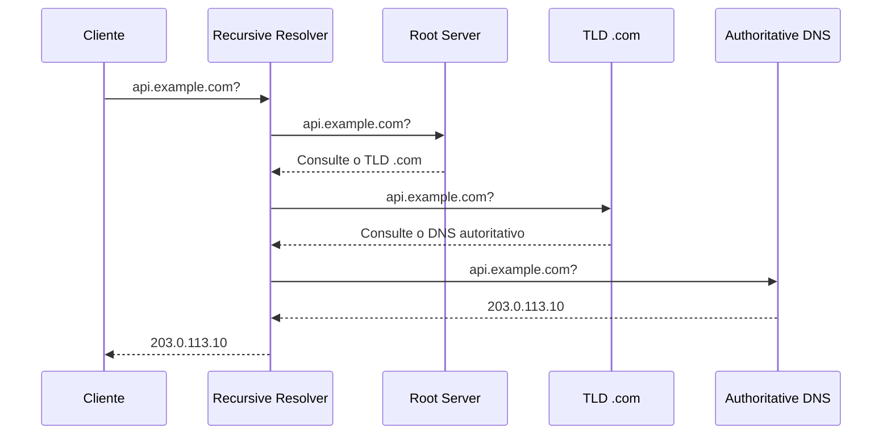
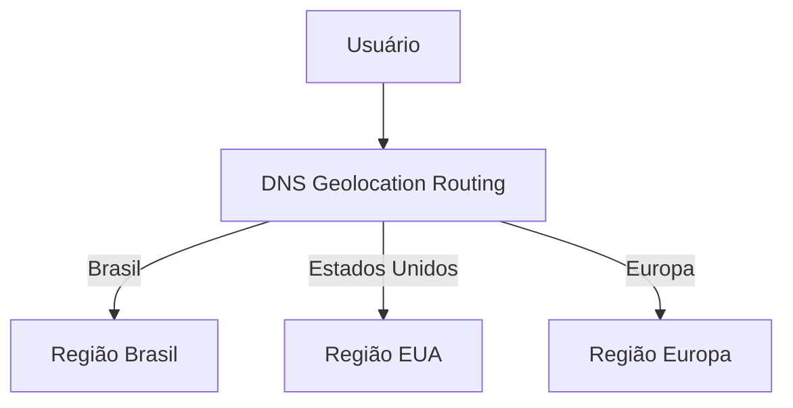
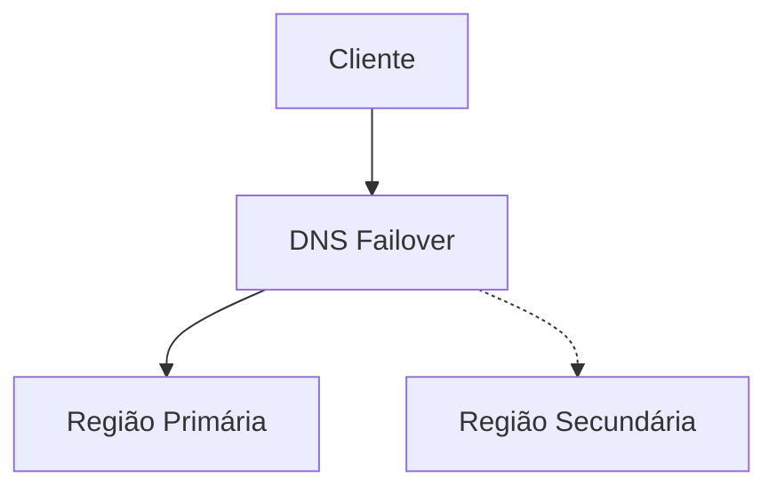
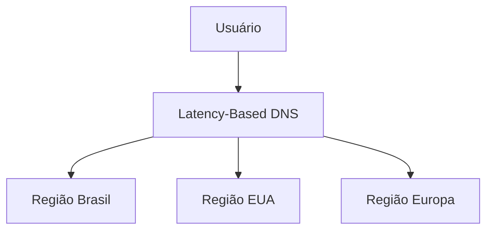
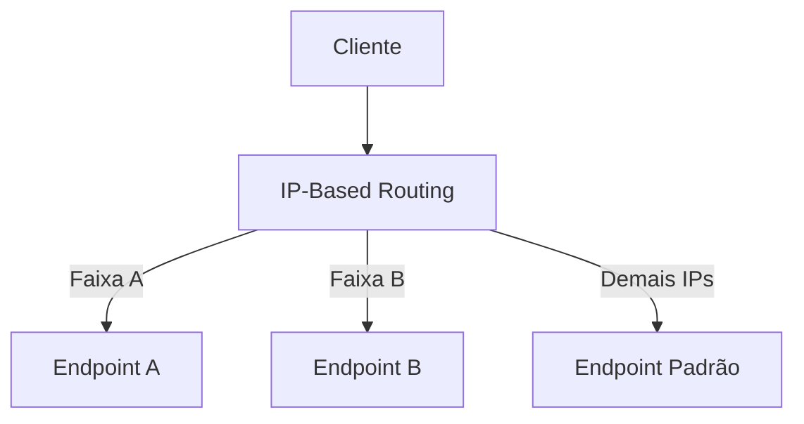
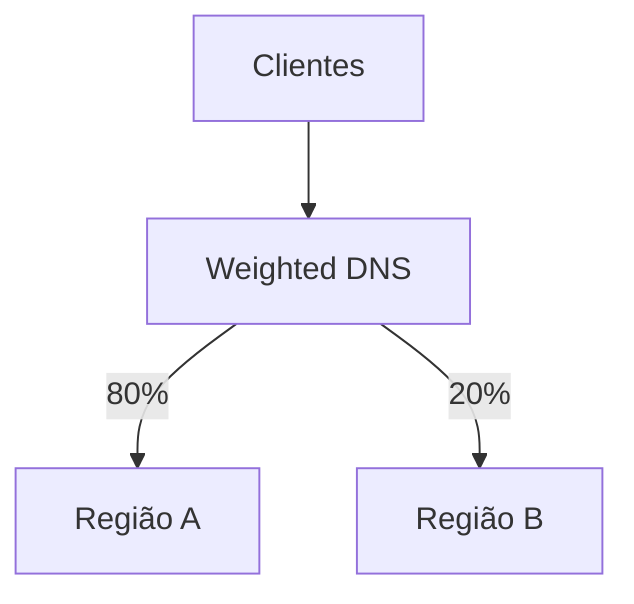
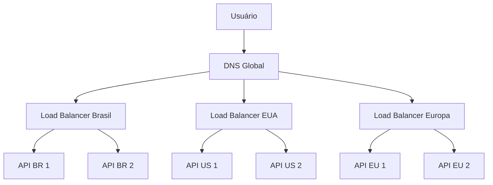
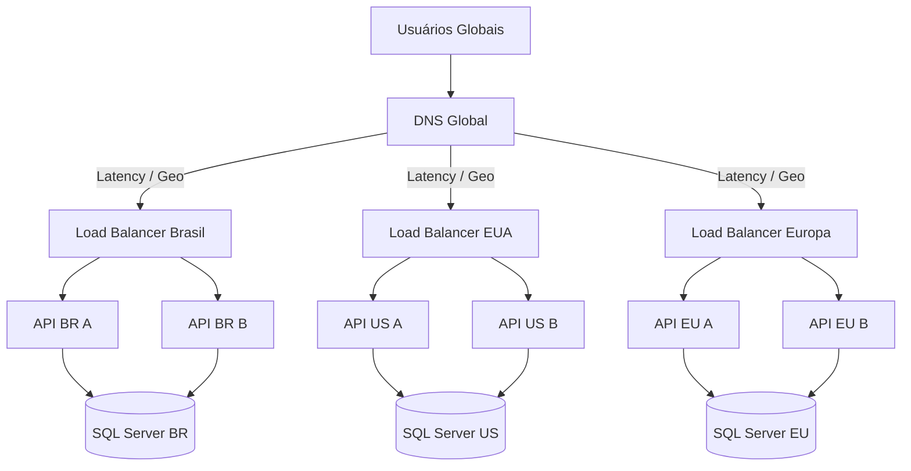
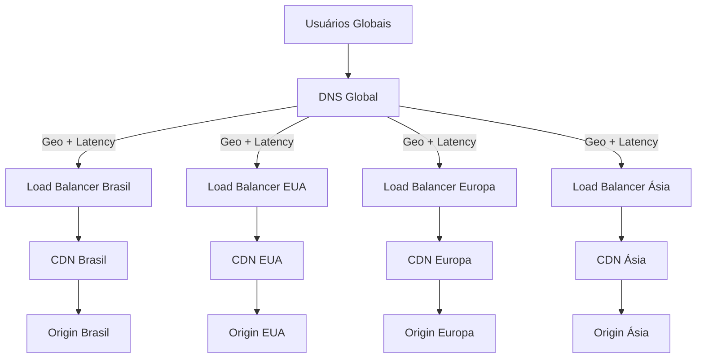

# Módulo 7 — DNS

Este módulo apresenta os fundamentos do DNS e as principais estratégias de roteamento utilizadas em sistemas distribuídos, aplicações globais e arquiteturas de alta disponibilidade.

O objetivo é entender:

* Como nomes de domínio são resolvidos.
* Quais componentes participam da resolução.
* Como DNS pode distribuir tráfego.
* Como implementar failover entre regiões.
* Como direcionar usuários pela localização ou latência.
* Quais são os limites e trade-offs de cada estratégia.

---

## Sumário

* [1. O que é DNS](#1-o-que-é-dns)
* [2. Por que DNS existe](#2-por-que-dns-existe)
* [3. Componentes do DNS](#3-componentes-do-dns)
* [4. Como funciona uma resolução DNS](#4-como-funciona-uma-resolução-dns)
* [5. Tipos de registros DNS](#5-tipos-de-registros-dns)
* [6. DNS autoritativo e DNS recursivo](#6-dns-autoritativo-e-dns-recursivo)
* [7. Cache e TTL](#7-cache-e-ttl)
* [8. DNS em arquiteturas distribuídas](#8-dns-em-arquiteturas-distribuídas)
* [9. Geolocation Routing](#9-geolocation-routing)
* [10. Failover Routing](#10-failover-routing)
* [11. Latency-Based Routing](#11-latency-based-routing)
* [12. IP-Based Routing](#12-ip-based-routing)
* [13. Weighted Routing](#13-weighted-routing)
* [14. Multi-Answer Routing](#14-multi-answer-routing)
* [15. Comparação entre estratégias](#15-comparação-entre-estratégias)
* [16. DNS e Load Balancing](#16-dns-e-load-balancing)
* [17. DNS global e regiões](#17-dns-global-e-regiões)
* [18. Health Checks e DNS](#18-health-checks-e-dns)
* [19. Alta disponibilidade](#19-alta-disponibilidade)
* [20. Limitações do DNS](#20-limitações-do-dns)
* [21. Segurança](#21-segurança)
* [22. Observabilidade](#22-observabilidade)
* [23. Exemplo prático com aplicação em C#](#23-exemplo-prático-com-aplicação-em-c)
* [24. Exemplo com SQL Server](#24-exemplo-com-sql-server)
* [25. Arquitetura de exemplo](#25-arquitetura-de-exemplo)
* [26. Trade-offs](#26-trade-offs)
* [27. Checklist de produção](#27-checklist-de-produção)
* [28. Regras práticas](#28-regras-práticas)
* [29. Questões de entrevista](#29-questões-de-entrevista)
* [30. Exercício prático](#30-exercício-prático)
* [31. Resumo do módulo](#31-resumo-do-módulo)

---

# 1. O que é DNS

DNS significa **Domain Name System**.

Ele transforma nomes legíveis por humanos em endereços IP utilizados por computadores.

**Vídeo recomendado:** [O que é DNS? (YouTube)](https://www.youtube.com/watch?v=oukRwnVAamo)

Exemplo:

```text
api.example.com
```

pode ser resolvido para:

```text
203.0.113.10
```

Sem DNS, usuários e aplicações precisariam acessar serviços diretamente por IP.

```text
https://203.0.113.10
```

Com DNS:

```text
https://api.example.com
```

## Analogia

O DNS funciona como uma agenda telefônica.

```text
Nome: api.example.com
Endereço: 203.0.113.10
```

O cliente conhece o nome.

O DNS informa o endereço.

---

# 2. Por que DNS existe

Endereços IP são difíceis de memorizar e podem mudar.

Um domínio fornece uma camada de abstração.

```text
Cliente
   |
   v
api.example.com
   |
   v
DNS
   |
   v
203.0.113.10
```

Benefícios:

* Nomes estáveis.
* IPs podem mudar sem alterar clientes.
* Failover entre servidores.
* Roteamento por região.
* Distribuição de tráfego.
* Integração com CDNs.
* Alta disponibilidade.
* Separação entre ambiente e infraestrutura.

## Exemplo

Hoje:

```text
api.example.com --> 203.0.113.10
```

Depois de uma migração:

```text
api.example.com --> 198.51.100.25
```

O cliente continua utilizando:

```text
api.example.com
```

---

# 3. Componentes do DNS

Uma resolução DNS envolve vários componentes.

## 3.1. Stub Resolver

É a parte do sistema operacional ou aplicação que inicia a consulta.

Exemplo:

```text
Browser
Aplicação mobile
API
Sistema operacional
```

## 3.2. Recursive Resolver

Recebe a consulta do cliente e procura a resposta.

Pode pertencer a:

* Provedor de internet.
* Empresa.
* Cloud provider.
* Serviço público de DNS.

## 3.3. Root Name Server

Indica quais servidores conhecem o domínio de nível superior.

Exemplo:

```text
.com
.org
.net
.br
```

## 3.4. TLD Name Server

TLD significa Top-Level Domain.

O servidor TLD informa quais servidores são autoritativos para o domínio.

Exemplo:

```text
example.com
```

## 3.5. Authoritative Name Server

É a fonte oficial dos registros do domínio.

Ele responde:

```text
api.example.com --> 203.0.113.10
```

---

# 4. Como funciona uma resolução DNS

Considere:

```text
api.example.com
```

O fluxo simplificado é:

```text
1. Cliente consulta o cache local.
2. Se não encontrar, consulta o recursive resolver.
3. Resolver consulta os root servers.
4. Root indica o servidor do TLD .com.
5. TLD indica o servidor autoritativo de example.com.
6. Autoritativo retorna o IP de api.example.com.
7. Resolver armazena a resposta em cache.
8. Cliente conecta ao IP retornado.
```

## Diagrama



## Resolução com cache

Em consultas futuras:

```text
Cliente --> Resolver --> resposta em cache
```

Não é necessário consultar toda a hierarquia novamente.

---

# 5. Tipos de registros DNS

## 5.1. A

Mapeia um domínio para um endereço IPv4.

```dns
api.example.com. 300 IN A 203.0.113.10
```

## 5.2. AAAA

Mapeia um domínio para um endereço IPv6.

```dns
api.example.com. 300 IN AAAA 2001:db8::10
```

## 5.3. CNAME

Cria um alias para outro nome.

```dns
www.example.com. 300 IN CNAME app.example.net.
```

O cliente ainda precisa resolver:

```text
app.example.net
```

## 5.4. MX

Indica servidores de e-mail.

```dns
example.com. 300 IN MX 10 mail.example.com.
```

## 5.5. TXT

Armazena texto arbitrário.

Usos comuns:

* Verificação de domínio.
* SPF.
* DKIM.
* DMARC.
* Configurações de segurança.

```dns
example.com. 300 IN TXT "verification=abc123"
```

## 5.6. NS

Indica os servidores autoritativos do domínio.

```dns
example.com. 300 IN NS ns1.example-dns.com.
```

## 5.7. SOA

Start of Authority.

Contém informações administrativas da zona.

Exemplos:

* Servidor principal.
* Número serial.
* Tempos de refresh.
* Retry.
* Expiração.

## 5.8. PTR

Faz resolução reversa.

```text
203.0.113.10 --> api.example.com
```

## 5.9. SRV

Indica localização e porta de um serviço.

```dns
_service._tcp.example.com.
```

Pode conter:

* Prioridade.
* Peso.
* Porta.
* Host.

---

# 6. DNS autoritativo e DNS recursivo

## DNS autoritativo

Possui a resposta oficial.

```text
example.com
   |
   v
Authoritative DNS
```

Ele sabe:

```text
api.example.com = 203.0.113.10
```

## DNS recursivo

Pesquisa a resposta em nome do cliente.

```text
Cliente
   |
   v
Recursive Resolver
   |
   v
Root, TLD e Authoritative DNS
```

## Diferença

| DNS autoritativo                  | DNS recursivo             |
| --------------------------------- | ------------------------- |
| Fonte oficial                     | Intermediário de consulta |
| Mantém zonas                      | Mantém cache              |
| Responde por domínios específicos | Resolve qualquer domínio  |
| Configurado pelo dono do domínio  | Usado pelo cliente        |

---

# 7. Cache e TTL

TTL significa **Time To Live**.

Ele informa por quanto tempo uma resposta pode permanecer em cache.

Exemplo:

```dns
api.example.com. 300 IN A 203.0.113.10
```

O valor `300` significa:

```text
300 segundos
=
5 minutos
```

## TTL alto

Exemplo:

```text
24 horas
```

### Vantagens

* Menos consultas.
* Menor custo.
* Menor latência.
* Menor carga no DNS autoritativo.

### Desvantagens

* Mudanças demoram a se propagar.
* Failover pode ser lento.
* Clientes continuam usando IP antigo.

## TTL baixo

Exemplo:

```text
30 segundos
```

### Vantagens

* Mudanças mais rápidas.
* Failover mais ágil.
* Melhor controle de tráfego.

### Desvantagens

* Mais consultas.
* Maior custo.
* Mais carga no DNS.
* Alguns resolvers podem ignorar valores muito baixos.

## Trade-off

```text
TTL alto
=
mais cache
+
menos flexibilidade

TTL baixo
=
menos cache
+
mais flexibilidade
```

> DNS não oferece mudança instantânea.

Mesmo com TTL baixo, caches intermediários podem manter respostas por mais tempo do que o esperado.

---

# 8. DNS em arquiteturas distribuídas

Em sistemas distribuídos, DNS pode decidir para onde o cliente será direcionado.

```text
Cliente
   |
   v
DNS
   |
   +--> Região A
   +--> Região B
   +--> Região C
```

O DNS pode considerar:

* Localização.
* Latência.
* Peso.
* Saúde.
* Endereço IP.
* Prioridade.
* Capacidade.
* Disponibilidade.

## Arquitetura comum

```text
Cliente
   |
   v
DNS Global
   |
   +--> Load Balancer Região Brasil
   +--> Load Balancer Região EUA
   +--> Load Balancer Região Europa
```

O DNS faz o roteamento global.

O load balancer faz o balanceamento regional.

---

# 9. Geolocation Routing

Geolocation routing direciona o tráfego com base na localização geográfica estimada do cliente.

Exemplo:

```text
Usuário do Brasil
      |
      v
Região São Paulo
```

```text
Usuário da Alemanha
      |
      v
Região Frankfurt
```

## Critérios possíveis

* Continente.
* País.
* Estado.
* Região.
* Localização padrão.

## Arquitetura



## Casos de uso

* Residência de dados.
* Conteúdo regional.
* Regras legais.
* Idioma.
* Preços regionais.
* Catálogos diferentes.
* Restrições de acesso.
* Infraestrutura multi-região.

## Exemplo

```text
br.example.com
```

pode não ser necessário.

O mesmo domínio pode direcionar usuários:

```text
api.example.com
```

para regiões diferentes.

## Vantagens

* Controle geográfico.
* Suporte a requisitos regulatórios.
* Personalização regional.
* Redução de tráfego entre continentes.

## Desvantagens

* Localização por IP é aproximada.
* VPNs alteram a localização aparente.
* Proxies podem mascarar a origem.
* Usuário geograficamente próximo pode ter maior latência.
* Regras podem ficar complexas.

## Importante

Geolocation routing não é o mesmo que latency-based routing.

```text
Geolocation:
considera localização.

Latency-based:
considera latência estimada.
```

Um usuário na América do Sul pode, em certos casos, ter melhor conectividade com uma região nos Estados Unidos do que com outra região geograficamente mais próxima.

---

# 10. Failover Routing

Failover routing possui um destino primário e um secundário.

```text
Primário: Região A
Secundário: Região B
```

Fluxo normal:

```text
DNS --> Região A
```

Em caso de falha:

```text
DNS --> Região B
```

## Arquitetura



## Active-Passive

O modelo mais comum de failover DNS é active-passive.

```text
Região A:
ativa

Região B:
standby
```

## Health Check

O DNS ou serviço de monitoramento verifica:

```text
https://region-a.example.com/health
```

Se a região falhar:

```text
Primary unhealthy
      |
      v
DNS passa a retornar Secondary
```

## Vantagens

* Arquitetura simples.
* Recuperação de desastre.
* Menor risco de conflito entre regiões.
* Dados centralizados no primário.

## Desvantagens

* Failover não é instantâneo.
* Caches podem continuar usando o IP antigo.
* Região secundária pode ficar subutilizada.
* Replicação de dados pode estar atrasada.
* Failback também exige cuidado.

## Falha do primário

```text
1. Health check detecta falha.
2. Rota primária é marcada como indisponível.
3. DNS passa a responder com destino secundário.
4. Novas consultas recebem o novo destino.
5. Clientes com cache antigo podem continuar no primário.
```

## Failback

Quando o primário volta:

```text
Secundário --> Primário
```

Esse retorno deve ser planejado.

Problemas possíveis:

* Dados escritos durante o failover.
* Replicação reversa.
* Conflitos.
* Cache.
* Sessões ativas.
* Conexões persistentes.

---

# 11. Latency-Based Routing

Latency-based routing direciona o cliente para a região com menor latência estimada.

Exemplo:

```text
Usuário A
   |
   v
Região com resposta estimada mais rápida
```

## Arquitetura



O DNS escolhe uma região com base em medições de rede.

## Exemplo

```text
Latência estimada:

Brasil: 45 ms
EUA: 120 ms
Europa: 190 ms
```

Resposta:

```text
Região Brasil
```

## Vantagens

* Melhor experiência global.
* Menor latência.
* Melhor distribuição geográfica.
* Boa estratégia para aplicações multi-região.

## Desvantagens

* Latência estimada não é exata.
* Pode mudar ao longo do tempo.
* Não considera necessariamente carga do backend.
* Região rápida pode estar sobrecarregada.
* Pode direcionar usuário a uma região juridicamente inadequada.

## Latência versus carga

```text
Região A:
latência 30 ms
CPU 95%

Região B:
latência 50 ms
CPU 30%
```

Latency-based routing pode continuar escolhendo a região A.

Por isso, normalmente é combinado com:

* Health checks.
* Autoscaling.
* Capacity management.
* Load balancers regionais.

---

# 12. IP-Based Routing

IP-based routing toma decisões com base no endereço IP de origem do cliente.

A diferença para geolocation é que a regra pode usar faixas específicas definidas pela organização.

Exemplo:

```text
10.10.0.0/16 --> Região interna A
10.20.0.0/16 --> Região interna B
```

Ou:

```text
Faixa de IP de parceiro X
        |
        v
Endpoint dedicado
```

## Casos de uso

* Empresas com redes conhecidas.
* Parceiros.
* Clientes corporativos.
* Redes privadas.
* Ambientes híbridos.
* Roteamento por filial.
* Migrações controladas.

## Arquitetura



## Exemplo

```text
203.0.113.0/24
      |
      v
Região Brasil

198.51.100.0/24
      |
      v
Região EUA
```

## Vantagens

* Controle preciso.
* Bom para redes corporativas.
* Permite tratamento especial por cliente.
* Útil em migrações.

## Desvantagens

* Regras precisam ser mantidas.
* IPs podem mudar.
* NAT mascara usuários.
* VPNs alteram a origem.
* Faixas podem se sobrepor.
* Não é escalável para milhões de regras manuais.

## IP-based versus geolocation

```text
IP-based:
usa regras explícitas de IP.

Geolocation:
usa base geográfica associada ao IP.
```

---

# 13. Weighted Routing

Weighted routing distribui tráfego com base em pesos.

Exemplo:

```text
Região A: peso 80
Região B: peso 20
```

Distribuição aproximada:

```text
80% --> Região A
20% --> Região B
```

## Arquitetura



## Casos de uso

* Canary deployment.
* Migração de datacenter.
* Teste de nova região.
* Blue-green.
* Distribuição gradual.
* Controle de capacidade.

## Exemplo de migração

### Etapa 1

```text
Datacenter antigo: 100
Cloud nova: 0
```

### Etapa 2

```text
Datacenter antigo: 90
Cloud nova: 10
```

### Etapa 3

```text
Datacenter antigo: 50
Cloud nova: 50
```

### Etapa 4

```text
Datacenter antigo: 0
Cloud nova: 100
```

## Vantagens

* Simples.
* Bom para migrações.
* Bom para canary.
* Permite mudanças graduais.
* Pode controlar capacidade.

## Desvantagens

* Distribuição não é exata.
* Cache DNS distorce os percentuais.
* Um resolver pode atender milhares de usuários.
* Não considera carga real.
* Não garante divisão por usuário individual.

## Por que o percentual não é exato

O DNS responde para resolvers, não necessariamente para cada usuário.

```text
Resolver corporativo
      |
      v
Recebe uma resposta
      |
      v
Milhares de usuários usam a mesma resposta
```

Assim, um único resultado pode representar muitos clientes.

## Sticky distribution

O weighted routing não garante que o mesmo usuário permaneça sempre no mesmo destino.

Para testes A/B, pode ser necessário usar:

* Cookie.
* User ID hash.
* Feature flag.
* BFF.
* Application-level routing.

---

# 14. Multi-Answer Routing

Multi-answer routing retorna vários endereços na mesma resposta DNS.

Exemplo:

```text
api.example.com
   |
   +--> 203.0.113.10
   +--> 203.0.113.11
   +--> 203.0.113.12
```

Resposta DNS:

```dns
api.example.com. 60 IN A 203.0.113.10
api.example.com. 60 IN A 203.0.113.11
api.example.com. 60 IN A 203.0.113.12
```

## Como o cliente usa

O cliente ou sistema operacional pode escolher um dos endereços.

A ordem pode variar.

```text
Consulta 1:
10
11
12

Consulta 2:
11
12
10
```

## Relação com Round Robin DNS

Multi-answer pode ser combinado com rotação da ordem dos registros.

Isso é conhecido como round-robin DNS.

## Vantagens

* Simples.
* Distribui tráfego.
* Sem proxy adicional.
* Permite múltiplos endpoints.
* Pode aumentar disponibilidade.

## Desvantagens

* Cliente escolhe o IP.
* Cliente pode ignorar parte das respostas.
* Health checks podem ser limitados.
* Caches mantêm IPs antigos.
* Não há controle por requisição.
* Um IP indisponível pode continuar no cache.

## Multi-answer com health checks

Uma implementação melhor retorna apenas endpoints saudáveis.

```text
Endpoint A: saudável
Endpoint B: indisponível
Endpoint C: saudável
```

Resposta:

```text
A
C
```

## Limite conceitual

Multi-answer DNS não substitui completamente um load balancer.

```text
DNS:
decide antes da conexão.

Load Balancer:
decide durante cada conexão ou requisição.
```

---

# 15. Comparação entre estratégias

| Estratégia    | Critério principal     | Caso de uso                    |
| ------------- | ---------------------- | ------------------------------ |
| Geolocation   | Localização geográfica | Compliance e conteúdo regional |
| Failover      | Saúde e prioridade     | Disaster recovery              |
| Latency-based | Latência estimada      | Aplicações globais             |
| IP-based      | Faixa de IP explícita  | Clientes corporativos          |
| Weighted      | Peso configurado       | Canary e migração              |
| Multi-answer  | Múltiplos endereços    | Distribuição simples           |

## Comparação detalhada

| Estratégia    |        Controle |                    Precisão |            Failover | Complexidade |
| ------------- | --------------: | --------------------------: | ------------------: | -----------: |
| Geolocation   | Alto por região |                       Média |       Pode combinar |        Média |
| Failover      |            Alto |        Alta para prioridade |  Principal objetivo |        Média |
| Latency-based |      Automático |                  Aproximada |       Pode combinar |        Média |
| IP-based      |      Muito alto | Alta para faixas conhecidas | Manual ou combinado |         Alta |
| Weighted      |            Alto |                  Aproximada |       Pode combinar |        Baixa |
| Multi-answer  |           Baixo |                       Baixa |            Limitado |        Baixa |

---

# 16. DNS e Load Balancing

DNS pode distribuir tráfego, mas não é um substituto completo para load balancing.

## DNS Load Balancing

```text
Cliente
   |
   v
DNS
   |
   +--> IP A
   +--> IP B
   +--> IP C
```

## Load Balancer

```text
Cliente
   |
   v
Load Balancer
   |
   +--> Server A
   +--> Server B
   +--> Server C
```

## Diferenças

| DNS                     | Load Balancer                    |
| ----------------------- | -------------------------------- |
| Decide antes da conexão | Decide por conexão ou requisição |
| Sujeito a cache         | Controle em tempo real           |
| Menor custo de proxy    | Adiciona hop                     |
| Não vê HTTP             | Pode ver HTTP                    |
| Failover mais lento     | Failover mais rápido             |
| Distribuição aproximada | Distribuição mais precisa        |

## Arquitetura recomendada

```text
DNS Global
   |
   +--> Load Balancer Região A
   +--> Load Balancer Região B
```

DNS escolhe a região.

Load balancer escolhe a instância.

---

# 17. DNS global e regiões

Aplicações globais frequentemente usam duas camadas.

```text
Camada 1:
DNS global

Camada 2:
Load balancer regional
```

## Exemplo



## Benefícios

* Escala global.
* Isolamento regional.
* Failover.
* Menor latência.
* Menor dependência de um único datacenter.

---

# 18. Health Checks e DNS

Health checks permitem remover destinos indisponíveis.

## Tipos

* TCP.
* HTTP.
* HTTPS.
* Endpoint customizado.

## Exemplo

```http
GET /health/ready
```

Resposta saudável:

```http
HTTP/1.1 200 OK
```

Resposta não saudável:

```http
HTTP/1.1 503 Service Unavailable
```

## Fluxo

```text
1. Monitor verifica endpoint.
2. Detecta falhas consecutivas.
3. Marca destino como unhealthy.
4. DNS deixa de retornar o destino.
5. Novas resoluções recebem outros destinos.
```

## Thresholds

Não remova uma região após uma única falha.

Exemplo:

```text
3 falhas consecutivas
=
unhealthy
```

Para voltar:

```text
3 sucessos consecutivos
=
healthy
```

Isso evita flapping.

## Health check superficial

```text
Porta 443 aberta
```

não garante que:

* Banco funciona.
* Aplicação aceita tráfego.
* Dependências estão saudáveis.
* Serviço consegue responder.

## Health check profundo

Pode verificar:

* Aplicação.
* Banco.
* Cache.
* Mensageria.
* Configuração.

Mas há um trade-off.

Se qualquer dependência não crítica falhar, remover toda a região pode ser excessivo.

---

# 19. Alta disponibilidade

DNS é parte crítica da disponibilidade.

## Riscos

* Provedor DNS indisponível.
* Configuração incorreta.
* Zona removida.
* Registros errados.
* Credenciais comprometidas.
* TTL inadequado.
* Health check incorreto.

## Estratégias

* Provedor DNS altamente disponível.
* Múltiplos name servers.
* Infraestrutura como código.
* Controle de mudanças.
* Auditoria.
* DNSSEC.
* Testes de failover.
* TTL planejado.
* Monitoramento externo.

## Multi-provider DNS

Algumas arquiteturas críticas utilizam mais de um provedor DNS.

```text
Provider DNS A
Provider DNS B
```

### Vantagens

* Menor dependência.
* Maior resiliência.

### Desvantagens

* Configuração duplicada.
* Sincronização complexa.
* Comportamentos diferentes.
* Maior risco operacional.

---

# 20. Limitações do DNS

## 20.1. Cache

Mesmo que o registro seja alterado, clientes podem manter a resposta anterior.

## 20.2. Falta de controle por requisição

DNS decide antes da conexão.

Ele não sabe:

* Qual endpoint está com CPU alta.
* Qual instância está lenta.
* Qual servidor acabou de receber muitas requisições.
* Qual request é mais pesado.

## 20.3. Resolvers compartilhados

Muitos usuários podem usar o mesmo resolver.

Isso afeta:

* Geolocation.
* Weighted routing.
* Distribuição.
* Métricas.

## 20.4. Localização imprecisa

O DNS geralmente observa o resolver, não o cliente final.

```text
Usuário no Brasil
Resolver nos EUA
```

O roteamento pode ser incorreto.

## 20.5. Conexões persistentes

Mesmo após mudança DNS:

```text
HTTP keep-alive
WebSocket
TCP connection
```

podem continuar conectadas ao destino anterior.

## 20.6. Failover não instantâneo

```text
Health check detecta
+
DNS atualiza
+
TTL expira
+
Cliente resolve novamente
```

Todo esse processo leva tempo.

---

# 21. Segurança

## 21.1. DNS Spoofing

Um atacante tenta fornecer uma resposta DNS falsa.

Objetivo:

```text
api.example.com
      |
      v
IP do atacante
```

## 21.2. Cache Poisoning

O atacante tenta inserir uma resposta falsa no cache de um resolver.

## 21.3. DNSSEC

DNSSEC adiciona assinaturas criptográficas aos registros DNS.

Ele ajuda a validar:

* Integridade.
* Autenticidade da resposta.

DNSSEC não criptografa a consulta.

Ele assina a cadeia de confiança.

## 21.4. DoH e DoT

### DNS over HTTPS

Consulta DNS sobre HTTPS.

### DNS over TLS

Consulta DNS sobre TLS.

Ambos protegem a consulta contra observação ou alteração no caminho.

## 21.5. Proteção operacional

* MFA no provedor DNS.
* Controle de acesso.
* Menor privilégio.
* Auditoria.
* Bloqueio de alterações manuais.
* Infraestrutura como código.
* Aprovação de mudanças.
* Alertas de alteração de zona.

## 21.6. Domain Hijacking

O atacante assume o controle do domínio.

Impacto:

* Redirecionamento de tráfego.
* Roubo de credenciais.
* Interrupção do sistema.
* Emissão indevida de certificados.

Mitigações:

* Registrar lock.
* MFA.
* Proteção do e-mail administrativo.
* Contas separadas.
* Monitoramento.

---

# 22. Observabilidade

## Métricas

* Consultas por segundo.
* Latência de resolução.
* Taxa de erros.
* NXDOMAIN.
* SERVFAIL.
* Health checks falhos.
* Registros retornados.
* Distribuição por região.
* Mudanças de rota.
* Taxa de failover.
* Respostas por record.

## Logs DNS

Podem registrar:

* Nome consultado.
* Tipo de registro.
* Resolver.
* Região.
* Resposta.
* Código de erro.
* Timestamp.

## Métricas de negócio

DNS sozinho não mostra a experiência completa.

Também monitore:

* Latência da aplicação.
* Taxa de erro por região.
* Número de usuários por destino.
* Conversão.
* Backlog.
* Saturação.
* Tempo de failover.

## Monitoramento externo

Use probes em diferentes regiões.

```text
Probe Brasil
Probe EUA
Probe Europa
Probe Ásia
```

Cada probe verifica:

* Resolução.
* IP retornado.
* Latência.
* Conectividade.
* Certificado.
* Resposta HTTP.

---

# 23. Exemplo prático com aplicação em C#

A aplicação normalmente não implementa o DNS global.

Ela precisa estar preparada para funcionar corretamente atrás dele.

## Health check

```csharp
var builder = WebApplication.CreateBuilder(args);

builder.Services.AddHealthChecks();

var app = builder.Build();

app.MapHealthChecks("/health/live");

app.MapGet("/health/ready", () =>
{
    return Results.Ok(new
    {
        Status = "Ready",
        Region =
            Environment.GetEnvironmentVariable("REGION")
            ?? "unknown",
        Instance =
            Environment.MachineName,
        CheckedAtUtc =
            DateTime.UtcNow
    });
});

app.MapGet("/", () =>
{
    return Results.Ok(new
    {
        Service = "Orders API",
        Region =
            Environment.GetEnvironmentVariable("REGION")
            ?? "unknown",
        Instance =
            Environment.MachineName
    });
});

app.Run();
```

## Resposta

```json
{
  "service": "Orders API",
  "region": "south-america",
  "instance": "orders-api-03"
}
```

Esse tipo de endpoint ajuda a validar:

* Região escolhida.
* Instância.
* Roteamento.
* Failover.

## DNS caching em aplicações .NET

Clientes HTTP podem reutilizar conexões por muito tempo.

Isso significa que uma mudança DNS pode não ser observada imediatamente.

Exemplo com `HttpClientFactory`:

```csharp
builder.Services.AddHttpClient(
    "inventory",
    client =>
    {
        client.BaseAddress =
            new Uri("https://inventory.example.com");
    })
    .SetHandlerLifetime(
        TimeSpan.FromMinutes(5));
```

O objetivo é evitar que conexões sejam reutilizadas indefinidamente.

> TTL DNS e lifetime de conexão são conceitos diferentes.

Mesmo que o TTL expire, uma conexão TCP existente pode continuar ativa.

---

# 24. Exemplo com SQL Server

DNS também pode ser usado para abstrair endpoints de banco.

Exemplo:

```text
sql-primary.internal.example.com
```

pode apontar para:

```text
SQL Server Primário
```

Em failover:

```text
sql-primary.internal.example.com
      |
      v
Novo primário
```

## Cuidados

Clientes SQL podem manter conexões abertas.

Uma alteração DNS não move conexões já existentes.

```text
DNS mudou
+
Conexão antiga continua ativa
```

O pool de conexões pode precisar descartar conexões falhas e criar novas.

## Connection string

```text
Server=sql-primary.internal.example.com;
Database=Orders;
Integrated Security=true;
Encrypt=true;
TrustServerCertificate=false;
```

## Listener

Em SQL Server, geralmente mecanismos próprios de alta disponibilidade são mais apropriados que DNS manual.

Exemplos conceituais:

* Listener.
* Failover Cluster.
* Availability Group.
* Read-only routing.

DNS pode fazer parte da abstração, mas não deve substituir o mecanismo nativo de failover do banco.

## Leitura e escrita

```text
sql-write.internal.example.com
      |
      v
Primary

sql-read.internal.example.com
      |
      +--> Replica A
      +--> Replica B
```

## Trade-off

Réplicas de leitura podem apresentar atraso.

```text
Write no primary
      |
      v
Replication lag
      |
      v
Read replica atualizada
```

---

# 25. Arquitetura de exemplo

Considere uma plataforma global de e-commerce.

Requisitos:

* Usuários em vários continentes.
* Baixa latência.
* Failover regional.
* Canary deployment.
* Infraestrutura em três regiões.
* APIs stateless.
* SQL Server no domínio de pedidos.

## Arquitetura



## Estratégia

### Latency-Based Routing

Direciona usuário para a região com menor latência.

### Failover

Se uma região ficar indisponível:

```text
Brasil unhealthy
      |
      v
Usuários são direcionados para EUA
```

### Weighted Routing

Durante uma migração:

```text
Região antiga: 90
Região nova: 10
```

### Geolocation

Pode ser usada quando dados precisam permanecer em uma região específica.

### Multi-answer

Pode ser usado para retornar múltiplos load balancers saudáveis.

---

# 26. Trade-offs

## Geolocation versus Latency-Based

| Geolocation                     | Latency-Based                  |
| ------------------------------- | ------------------------------ |
| Baseado em localização          | Baseado em latência estimada   |
| Bom para compliance             | Bom para performance           |
| Pode ignorar conectividade real | Pode ignorar fronteiras legais |
| Mais previsível por país        | Mais adaptável à rede          |

## Failover versus Active-Active

| Failover Active-Passive   | Active-Active              |
| ------------------------- | -------------------------- |
| Mais simples              | Mais capacidade            |
| Menos conflitos           | Mais complexidade de dados |
| Região secundária ociosa  | Todas as regiões ativas    |
| Failover mais perceptível | Failover mais rápido       |

## Weighted Routing versus Application-Level Routing

| Weighted DNS            | Aplicação                |
| ----------------------- | ------------------------ |
| Simples                 | Mais preciso             |
| Distribuição aproximada | Controle por usuário     |
| Sujeito a cache         | Pode usar sessão ou hash |
| Bom para migração       | Bom para A/B testing     |

## Multi-Answer versus Load Balancer

| Multi-Answer DNS        | Load Balancer        |
| ----------------------- | -------------------- |
| Sem proxy               | Proxy no caminho     |
| Baixo custo             | Maior controle       |
| Failover lento          | Failover rápido      |
| Cliente escolhe destino | LB escolhe destino   |
| Distribuição aproximada | Distribuição precisa |

## TTL baixo versus TTL alto

| TTL baixo            | TTL alto                 |
| -------------------- | ------------------------ |
| Mudança rápida       | Mais cache               |
| Mais consultas       | Menos consultas          |
| Maior custo          | Menor custo              |
| Melhor para failover | Melhor para estabilidade |

---

# 27. Checklist de produção

## Zona DNS

* [ ] O domínio está registrado corretamente?
* [ ] Existem múltiplos name servers?
* [ ] Os registros estão versionados?
* [ ] Infraestrutura como código é utilizada?
* [ ] Alterações exigem aprovação?
* [ ] Existe rollback de configuração?

## TTL

* [ ] O TTL foi definido conforme o caso de uso?
* [ ] O TTL permite failover aceitável?
* [ ] O custo de consultas foi considerado?
* [ ] Mudanças críticas são planejadas com antecedência?

## Roteamento

* [ ] A estratégia é geolocation, latency, weighted ou failover?
* [ ] Existe rota padrão?
* [ ] Regiões possuem capacidade suficiente?
* [ ] Weighted routing foi testado?
* [ ] IP ranges estão documentados?

## Health checks

* [ ] Existem health checks?
* [ ] O endpoint verifica readiness?
* [ ] O threshold evita flapping?
* [ ] O failover foi testado?
* [ ] O failback foi testado?
* [ ] O health check depende de componentes não críticos?

## Segurança

* [ ] MFA está habilitado no provedor DNS?
* [ ] DNSSEC está configurado quando apropriado?
* [ ] Existe registrar lock?
* [ ] Permissões seguem menor privilégio?
* [ ] Alterações geram alertas?
* [ ] Credenciais estão em secret manager?

## Alta disponibilidade

* [ ] O provedor DNS é altamente disponível?
* [ ] Existe estratégia multi-região?
* [ ] Existe disaster recovery?
* [ ] A região secundária é testada?
* [ ] Os dados suportam failover?
* [ ] Conexões persistentes foram consideradas?

## Observabilidade

* [ ] DNS queries são monitoradas?
* [ ] NXDOMAIN é monitorado?
* [ ] Health checks são monitorados?
* [ ] A distribuição por região é visível?
* [ ] Existem probes externos?
* [ ] A latência ponta a ponta é monitorada?

---

# 28. Regras práticas

1. DNS transforma nomes em endereços IP.

2. DNS é uma camada de abstração, não apenas uma agenda de IPs.

3. TTL define por quanto tempo a resposta pode permanecer em cache.

4. DNS não oferece failover instantâneo.

5. TTL baixo não elimina completamente caches.

6. Use DNS para roteamento global.

7. Use load balancer para distribuição regional.

8. Geolocation routing é útil para compliance e conteúdo regional.

9. Latency-based routing é melhor para performance global.

10. Failover routing exige health checks confiáveis.

11. Weighted routing é bom para migração e canary.

12. Weighted DNS não oferece percentual exato por usuário.

13. Multi-answer DNS não substitui completamente um load balancer.

14. IP-based routing é útil para clientes corporativos e redes conhecidas.

15. VPNs e proxies podem distorcer geolocation.

16. Conexões persistentes sobrevivem a mudanças DNS.

17. DNS e conexão TCP possuem ciclos de vida diferentes.

18. Health check deve refletir readiness, não apenas processo vivo.

19. Não remova uma região por uma única falha transitória.

20. Teste failover e failback regularmente.

21. Proteja a conta do provedor DNS com MFA.

22. Use infraestrutura como código para registros críticos.

23. Monitore resolução a partir de múltiplas regiões.

24. DNS global precisa ser combinado com estratégia de dados.

25. Roteamento é relativamente fácil; consistência de dados é a parte difícil.

---

# 29. Questões de entrevista

## O que é DNS?

DNS é um sistema hierárquico e distribuído que resolve nomes de domínio para endereços IP e outros tipos de registro.

## O que é TTL?

TTL é o tempo durante o qual uma resposta DNS pode permanecer em cache.

## Qual a diferença entre DNS autoritativo e recursivo?

O DNS autoritativo contém a resposta oficial de uma zona. O DNS recursivo pesquisa a resposta em nome do cliente e mantém cache.

## O que é geolocation routing?

É o roteamento baseado na localização geográfica estimada do cliente.

## O que é latency-based routing?

É o roteamento que direciona o cliente para o endpoint com menor latência estimada.

## Geolocation e latency routing são iguais?

Não. Geolocation usa localização. Latency routing usa medições ou estimativas de latência.

## O que é failover routing?

É uma estratégia com destino primário e secundário. O secundário é utilizado quando o primário é considerado indisponível.

## O que é weighted routing?

É uma estratégia que distribui respostas entre destinos com base em pesos configurados.

## Weighted routing garante exatamente 90/10?

Não. DNS trabalha com resolvers e cache. A distribuição é aproximada.

## O que é multi-answer routing?

É uma estratégia em que o DNS retorna múltiplos endereços na mesma resposta.

## DNS substitui um load balancer?

Não completamente. DNS decide antes da conexão e está sujeito a cache. Um load balancer pode decidir por conexão ou requisição.

## Por que DNS failover pode ser lento?

Porque depende de health checks, atualização da resposta, expiração de TTL e nova resolução pelo cliente.

## Como DNS ajuda em aplicações multi-região?

Ele pode direcionar usuários por latência, localização, peso ou saúde para load balancers regionais.

## Qual é o maior desafio de active-active global?

Normalmente não é o DNS, mas consistência, replicação e conflitos de dados entre regiões.

## O que é DNSSEC?

É um conjunto de extensões que adiciona assinaturas criptográficas aos registros DNS para validar autenticidade e integridade.

---

# 30. Exercício prático

Projete o DNS de uma plataforma global de streaming com os seguintes requisitos:

```text
- Usuários no Brasil, Estados Unidos, Europa e Ásia.
- Quatro regiões.
- Usuários devem acessar a região com menor latência.
- Conteúdo licenciado deve respeitar o país.
- Falha de uma região não pode derrubar o sistema.
- Uma nova região será liberada gradualmente.
- O sistema usa load balancers regionais.
- Existem conexões longas de streaming.
```

## Componentes esperados

```text
Authoritative DNS
Latency-Based Routing
Geolocation Routing
Failover Routing
Weighted Routing
Health Checks
Regional Load Balancers
CDN
TTL
Observabilidade
```

## Perguntas que devem ser respondidas

* Qual estratégia é usada como principal?
* Como aplicar regras de licenciamento?
* Geolocation deve ter prioridade sobre latency?
* Como funciona o failover?
* Qual TTL será usado?
* Como liberar a nova região para 5% do tráfego?
* Como medir se a nova região está saudável?
* Como conexões de streaming reagem ao failover?
* Como usuários já conectados são tratados?
* Como evitar que usuários sejam direcionados para região sem capacidade?
* Como monitorar distribuição por região?
* Como os dados e catálogos são sincronizados?

## Arquitetura inicial



## Possível prioridade de decisão

```text
1. Regra legal ou geográfica.
2. Saúde da região.
3. Menor latência entre regiões permitidas.
4. Peso configurado.
5. Rota padrão.
```

## Exemplo

Usuário na Alemanha:

```text
Regiões permitidas:
Europa

Região Europa saudável:
sim

Resposta:
Load Balancer Europa
```

Usuário no Brasil com região Brasil indisponível:

```text
Região Brasil:
unhealthy

Próxima região permitida:
Estados Unidos

Resposta:
Load Balancer EUA
```

## Principal desafio

O principal desafio não é apenas retornar o IP correto.

É coordenar:

* Regras geográficas.
* Health checks.
* Cache.
* TTL.
* Conexões persistentes.
* Capacidade regional.
* Catálogo.
* Dados.
* Failover.
* Experiência do usuário.

---

# 31. Resumo do módulo

```text
DNS
 |
 +--> resolve nomes
 +--> abstrai IPs
 +--> mantém cache
 +--> habilita roteamento global
 |
 +--> geolocation
 +--> failover
 +--> latency-based
 +--> IP-based
 +--> weighted
 +--> multi-answer
```

## Estratégias

```text
Geolocation
    |
    +--> localização e compliance

Failover
    |
    +--> primário e secundário

Latency-Based
    |
    +--> menor latência estimada

IP-Based
    |
    +--> regras explícitas por IP

Weighted
    |
    +--> divisão gradual de tráfego

Multi-Answer
    |
    +--> múltiplos IPs por resposta
```

## Modelo recomendado para sistemas globais

```text
DNS global
+
Health checks
+
Roteamento geográfico ou por latência
+
Failover regional
+
Load balancers regionais
+
Aplicações stateless
+
Estratégia de dados multi-região
+
Observabilidade externa
```

A principal ideia é:

> DNS é excelente para decidir qual região ou endpoint global deve receber uma nova conexão.

Entretanto:

> DNS não possui controle preciso por requisição e não substitui load balancers, health checks de aplicação ou uma estratégia de dados bem projetada.
