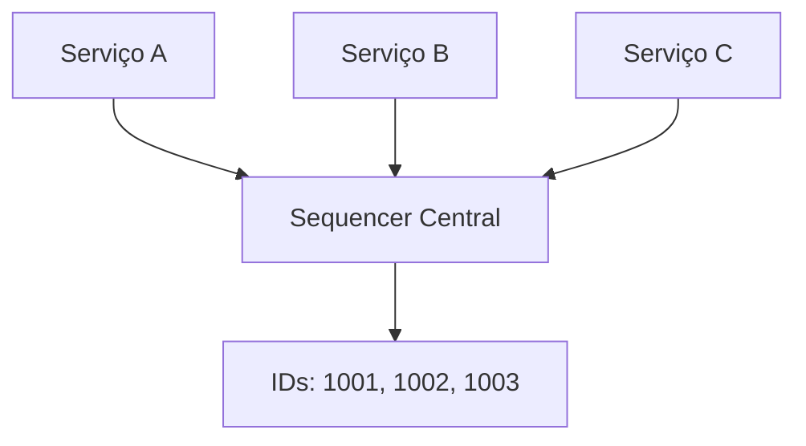
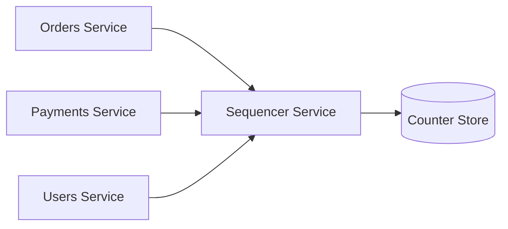
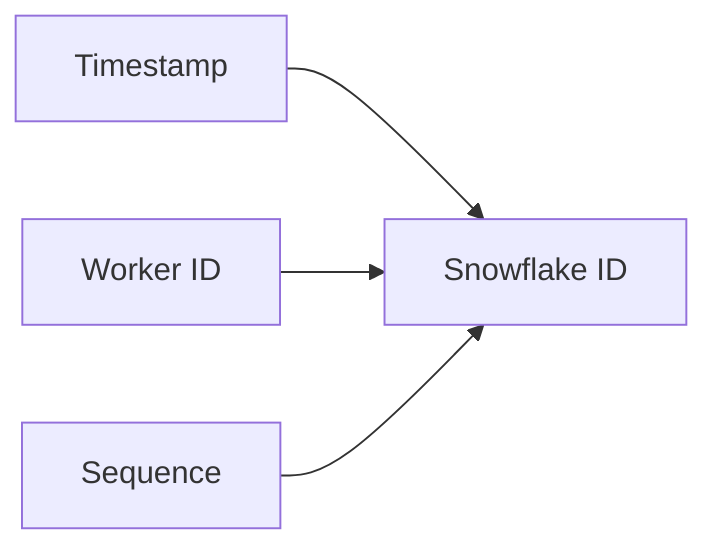
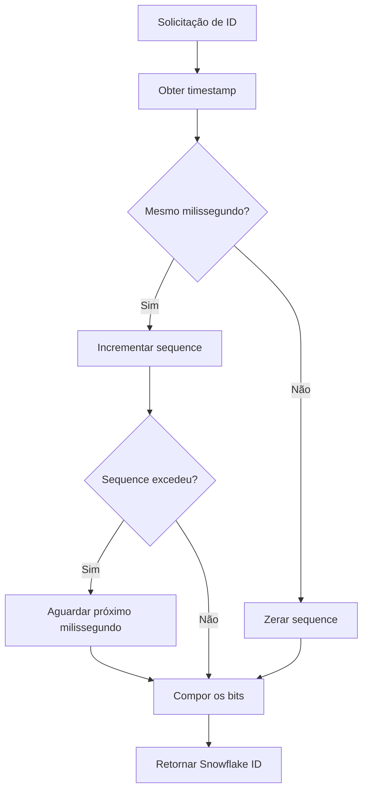
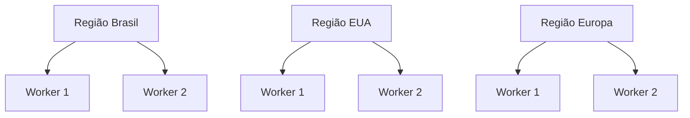
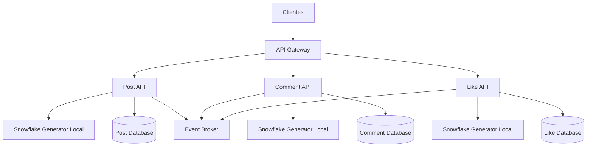
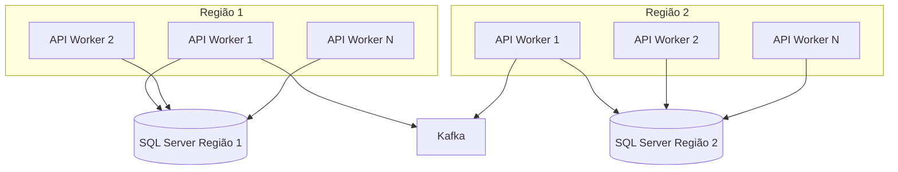

# Módulo 8 — Sequencer e Snowflake IDs

Este módulo apresenta técnicas para geração de identificadores únicos em sistemas distribuídos, com foco em **Sequencers** e no algoritmo **Snowflake**, popularizado pelo Twitter.

O objetivo é entender:

* Por que gerar IDs distribuídos é difícil.
* Quais propriedades um identificador pode precisar.
* Como funciona um sequencer centralizado.
* Como o Snowflake gera IDs únicos sem consultar um banco central.
* Quais trade-offs existem.
* Como implementar uma versão simplificada em C#.
* Como armazenar esses identificadores no SQL Server.

---

## Sumário

* [1. O problema dos identificadores distribuídos](#1-o-problema-dos-identificadores-distribuídos)
* [2. O que é um Sequencer](#2-o-que-é-um-sequencer)
* [3. Requisitos de um bom identificador](#3-requisitos-de-um-bom-identificador)
* [4. Estratégias comuns de geração de IDs](#4-estratégias-comuns-de-geração-de-ids)
* [5. Auto Increment no banco](#5-auto-increment-no-banco)
* [6. UUID e GUID](#6-uuid-e-guid)
* [7. Hi-Lo e alocação de blocos](#7-hi-lo-e-alocação-de-blocos)
* [8. Sequencer centralizado](#8-sequencer-centralizado)
* [9. O que é Snowflake](#9-o-que-é-snowflake)
* [10. Estrutura de um Snowflake ID](#10-estrutura-de-um-snowflake-id)
* [11. Timestamp](#11-timestamp)
* [12. Worker ID e Datacenter ID](#12-worker-id-e-datacenter-id)
* [13. Sequence Number](#13-sequence-number)
* [14. Como o Snowflake gera IDs](#14-como-o-snowflake-gera-ids)
* [15. Exemplo de geração](#15-exemplo-de-geração)
* [16. Capacidade e escala](#16-capacidade-e-escala)
* [17. Ordenação temporal](#17-ordenação-temporal)
* [18. Clock Skew](#18-clock-skew)
* [19. Colisão de Worker IDs](#19-colisão-de-worker-ids)
* [20. Alta disponibilidade](#20-alta-disponibilidade)
* [21. Implementação simplificada em C#](#21-implementação-simplificada-em-c)
* [22. Testando a implementação](#22-testando-a-implementação)
* [23. Uso com ASP.NET Core](#23-uso-com-aspnet-core)
* [24. Uso com SQL Server](#24-uso-com-sql-server)
* [25. Índices e fragmentação](#25-índices-e-fragmentação)
* [26. Comparação entre Snowflake, GUID e Identity](#26-comparação-entre-snowflake-guid-e-identity)
* [27. Segurança e previsibilidade](#27-segurança-e-previsibilidade)
* [28. Multi-região](#28-multi-região)
* [29. Observabilidade](#29-observabilidade)
* [30. Trade-offs](#30-trade-offs)
* [31. Arquitetura de exemplo](#31-arquitetura-de-exemplo)
* [32. Checklist de produção](#32-checklist-de-produção)
* [33. Regras práticas](#33-regras-práticas)
* [34. Questões de entrevista](#34-questões-de-entrevista)
* [35. Exercício prático](#35-exercício-prático)
* [36. Resumo do módulo](#36-resumo-do-módulo)

---

# 1. O problema dos identificadores distribuídos

Em um sistema simples, um banco de dados pode gerar IDs sequenciais.

```text
Pedido 1
Pedido 2
Pedido 3
Pedido 4
```

Exemplo no SQL Server:

```sql
CREATE TABLE dbo.Orders
(
    OrderId BIGINT IDENTITY(1,1) PRIMARY KEY,
    CustomerId BIGINT NOT NULL
);
```

Isso funciona bem quando existe um único banco responsável pela geração.

Em sistemas distribuídos, surgem novos desafios.

```text
API 1 --> Banco A
API 2 --> Banco B
API 3 --> Banco C
```

Se cada banco começar em `1`, podem ocorrer colisões.

```text
Banco A gera ID 100
Banco B gera ID 100
Banco C gera ID 100
```

Quando os dados forem combinados, os IDs deixam de ser únicos.

## Pergunta central

Como gerar IDs que sejam:

* Únicos.
* Rápidos.
* Escaláveis.
* Distribuídos.
* Compactos.
* Aproximadamente ordenados.
* Gerados sem depender de um único banco?

---

# 2. O que é um Sequencer

Um **Sequencer** é um componente responsável por gerar números únicos e, em alguns casos, ordenados.

```text
Serviço A
Serviço B
Serviço C
    |
    v
Sequencer
    |
    v
1001, 1002, 1003, 1004...
```

Ele pode ser implementado como:

* Uma sequence no banco.
* Uma tabela de contadores.
* Um serviço dedicado.
* Um sistema distribuído.
* Um gerador baseado em timestamp.
* Um algoritmo como Snowflake.

## Sequencer centralizado



## Benefício

Todos os serviços recebem IDs únicos.

## Problema

O Sequencer pode se tornar:

* Gargalo.
* Ponto único de falha.
* Dependência de rede.
* Limite de throughput.
* Componente crítico.

---

# 3. Requisitos de um bom identificador

Nem todo sistema precisa das mesmas propriedades.

Um identificador pode precisar ser:

## Único

Nenhum outro registro pode receber o mesmo valor.

## Globalmente único

A unicidade deve valer entre:

* Serviços.
* Bancos.
* Regiões.
* Datacenters.
* Shards.

## Ordenável

IDs mais novos devem ser maiores que IDs antigos.

```text
ID 1001 criado antes de ID 1002
```

## Aproximadamente ordenável

A ordem reflete o tempo de criação na maioria dos casos, mas não necessariamente de forma perfeita entre todas as máquinas.

## Compacto

Um `BIGINT` ocupa menos espaço que uma string extensa.

## Gerável sem coordenação

Cada nó pode criar IDs sem consultar um serviço central.

## Não previsível

Em alguns sistemas, não é desejável que o usuário consiga adivinhar o próximo ID.

## Alta performance

A geração deve suportar milhares ou milhões de IDs por segundo.

---

# 4. Estratégias comuns de geração de IDs

Principais opções:

* Auto increment.
* Database sequence.
* UUID ou GUID.
* Hi-Lo.
* Sequencer centralizado.
* Range allocation.
* Snowflake.
* ULID.
* KSUID.
* IDs compostos.

Cada opção prioriza propriedades diferentes.

---

# 5. Auto Increment no banco

No SQL Server:

```sql
CREATE TABLE dbo.Customers
(
    CustomerId BIGINT IDENTITY(1,1) PRIMARY KEY,
    Name NVARCHAR(200) NOT NULL
);
```

## Vantagens

* Simples.
* Rápido.
* IDs pequenos.
* Boa localização no índice.
* Ordem natural.

## Desvantagens

* Dependência do banco.
* Difícil em múltiplos bancos.
* Pode virar gargalo.
* Exige round trip para obter o ID.
* IDs são previsíveis.

## Uso em múltiplos bancos

Uma estratégia simples é usar incrementos diferentes.

Banco A:

```sql
IDENTITY(1, 3)
```

Gera:

```text
1, 4, 7, 10...
```

Banco B:

```sql
IDENTITY(2, 3)
```

Gera:

```text
2, 5, 8, 11...
```

Banco C:

```sql
IDENTITY(3, 3)
```

Gera:

```text
3, 6, 9, 12...
```

### Problema

Adicionar novos bancos exige replanejamento.

Essa abordagem não escala bem operacionalmente.

---

# 6. UUID e GUID

GUID é a implementação comum de UUID no ecossistema .NET.

Exemplo:

```text
d0f7e5e1-1268-4a92-b5c1-b32fbcd99811
```

Em C#:

```csharp
var id = Guid.NewGuid();
```

## Vantagens

* Gerado localmente.
* Não exige coordenação.
* Probabilidade extremamente baixa de colisão.
* Funciona em múltiplas regiões.
* Suporte nativo.

## Desvantagens

* Ocupa mais espaço.
* Difícil de ler.
* Não é naturalmente ordenado.
* Pode fragmentar índices.
* Maior custo de armazenamento e cache.
* Prejudica índices clustered quando aleatório.

## GUID no SQL Server

```sql
CREATE TABLE dbo.Orders
(
    OrderId UNIQUEIDENTIFIER NOT NULL PRIMARY KEY,
    CustomerId BIGINT NOT NULL
);
```

GUID aleatório em clustered index pode causar inserções espalhadas.

```text
Página 1
Página 200
Página 14
Página 800
```

Isso aumenta:

* Page splits.
* Fragmentação.
* Escritas aleatórias.
* Uso de armazenamento.

## Sequential GUID

O SQL Server possui:

```sql
NEWSEQUENTIALID()
```

Exemplo:

```sql
CREATE TABLE dbo.Orders
(
    OrderId UNIQUEIDENTIFIER NOT NULL
        DEFAULT NEWSEQUENTIALID(),
    CustomerId BIGINT NOT NULL,

    CONSTRAINT PK_Orders PRIMARY KEY (OrderId)
);
```

Melhora a localização no índice, mas continua sendo maior que `BIGINT`.

---

# 7. Hi-Lo e alocação de blocos

No padrão Hi-Lo, um componente central distribui blocos de IDs.

Exemplo:

```text
Worker A recebe 1 até 1.000
Worker B recebe 1.001 até 2.000
Worker C recebe 2.001 até 3.000
```

Cada worker gera localmente dentro de seu bloco.

## Fluxo

```text
1. Worker solicita um range.
2. Sequencer reserva o range.
3. Worker gera IDs localmente.
4. Quando o range acaba, solicita outro.
```

## Vantagens

* Poucas chamadas ao sequencer.
* Bom throughput.
* IDs compactos.
* Implementação relativamente simples.

## Desvantagens

* Pode haver buracos.
* Range pode ser perdido se o worker cair.
* Ainda existe coordenação central.
* Gerenciamento de blocos aumenta complexidade.

## Buracos não significam erro

Se o worker recebe:

```text
1.001 até 2.000
```

e cai depois de usar apenas até `1.100`, os demais IDs podem nunca ser usados.

```text
1.101 até 2.000
```

ficam vazios.

IDs não precisam ser contíguos para serem válidos.

---

# 8. Sequencer centralizado

Um serviço de Sequencer pode expor uma API:

```http
POST /ids/next
```

Resposta:

```json
{
  "id": 1000001
}
```

## Arquitetura



## Benefícios

* Controle central.
* Ordem global.
* Implementação conceitualmente simples.
* Auditoria da geração.

## Desvantagens

* Novo hop de rede.
* Ponto único de falha.
* Pode limitar throughput.
* Aumenta latência.
* Requer replicação.
* Ordem global é cara.

## Alta disponibilidade

Um sequencer centralizado com múltiplos nós precisa de coordenação.

```text
Sequencer A
Sequencer B
Sequencer C
```

Se todos gerarem valores independentemente, podem colidir.

É necessário algum mecanismo como:

* Líder único.
* Banco transacional.
* Consensus.
* Range allocation.
* Particionamento.

---

# 9. O que é Snowflake

Snowflake é uma estratégia para gerar IDs distribuídos usando um número inteiro de 64 bits.

A ideia é combinar:

* Timestamp.
* Identificador do nó.
* Sequência local.

```text
Timestamp + Worker ID + Sequence
```

Cada máquina pode gerar IDs localmente, sem consultar um banco a cada requisição.

## Propriedades

* Globalmente único dentro da configuração.
* Gerado localmente.
* Baseado em tempo.
* Aproximadamente ordenado.
* Compacto.
* Adequado para sistemas distribuídos.

## Visão geral



---

# 10. Estrutura de um Snowflake ID

Uma configuração clássica utiliza 64 bits.

```text
| Sign | Timestamp | Datacenter | Worker | Sequence |
```

Uma divisão comum:

```text
1 bit   - sinal
41 bits - timestamp
5 bits  - datacenter
5 bits  - worker
12 bits - sequência
```

Total:

```text
1 + 41 + 5 + 5 + 12 = 64 bits
```

## Representação

```text
0 | 00000000000000000000000000000000000000000 | 00000 | 00000 | 000000000000
```

## Bit de sinal

O primeiro bit normalmente permanece `0`.

Isso mantém o valor positivo em um inteiro assinado de 64 bits.

## Timestamp

Representa quantos milissegundos se passaram desde uma época customizada.

## Datacenter ID

Identifica o datacenter ou região.

## Worker ID

Identifica a máquina, processo ou instância.

## Sequence

Diferencia IDs gerados no mesmo milissegundo pelo mesmo worker.

---

# 11. Timestamp

O timestamp normalmente representa:

```text
CurrentTimeMilliseconds - CustomEpoch
```

Exemplo:

```text
Época customizada:
2025-01-01

Data atual:
2026-07-13
```

Em vez de armazenar o timestamp Unix completo, o sistema armazena a diferença.

## Por que usar uma época customizada

Menos bits são desperdiçados com datas anteriores ao início do sistema.

## Capacidade de 41 bits

Com 41 bits:

```text
2^41 milissegundos
```

Isso representa aproximadamente várias décadas.

Depois desse período, o espaço de timestamp se esgota.

## Escolha da época

A época deve:

* Ser anterior ao início da produção.
* Ser fixa.
* Nunca mudar entre workers.
* Ser documentada.
* Ser compartilhada por todas as regiões.

> Alterar a época depois que o sistema entrou em produção pode gerar colisões ou quebrar a ordenação.

---

# 12. Worker ID e Datacenter ID

Os bits de datacenter e worker identificam o nó gerador.

Com 5 bits para datacenter:

```text
2^5 = 32 datacenters
```

Com 5 bits para worker:

```text
2^5 = 32 workers por datacenter
```

Capacidade total:

```text
32 x 32 = 1.024 workers
```

## Exemplo

```text
Datacenter ID: 3
Worker ID: 17
```

Essa combinação deve ser única.

## Alternativa

Em vez de separar datacenter e worker, é possível usar 10 bits para um único identificador de nó.

```text
Node ID:
0 até 1.023
```

## Como atribuir Worker IDs

Possibilidades:

* Configuração manual.
* Variável de ambiente.
* StatefulSet ordinal.
* Registro em banco.
* Service discovery.
* Coordination service.
* Lease distribuído.

## Exemplo em Kubernetes

```text
snowflake-generator-0 --> Worker ID 0
snowflake-generator-1 --> Worker ID 1
snowflake-generator-2 --> Worker ID 2
```

StatefulSets ajudam porque os nomes são estáveis.

---

# 13. Sequence Number

A sequência diferencia IDs criados pelo mesmo worker no mesmo milissegundo.

Com 12 bits:

```text
2^12 = 4.096 valores
```

Isso significa:

```text
4.096 IDs por milissegundo por worker
```

Capacidade teórica por segundo:

```text
4.096 x 1.000
=
4.096.000 IDs por segundo por worker
```

## Funcionamento

Se o timestamp atual for igual ao anterior:

```text
sequence = sequence + 1
```

Se o timestamp avançar:

```text
sequence = 0
```

## Sequence overflow

Se o worker gerar mais de 4.096 IDs no mesmo milissegundo:

```text
sequence ultrapassa o limite
```

O gerador deve esperar o próximo milissegundo.

```text
while currentTimestamp <= lastTimestamp:
    aguardar
```

---

# 14. Como o Snowflake gera IDs

Fluxo simplificado:

```text
1. Obter timestamp atual.
2. Comparar com o último timestamp usado.
3. Se o relógio voltou, tratar erro.
4. Se estiver no mesmo milissegundo, incrementar sequence.
5. Se for um novo milissegundo, zerar sequence.
6. Combinar os campos usando bit shifting.
7. Retornar o BIGINT.
```

## Fórmula conceitual

```text
ID =
(timestamp << timestampShift)
|
(datacenterId << datacenterShift)
|
(workerId << workerShift)
|
sequence
```

## Diagrama



---

# 15. Exemplo de geração

Considere:

```text
Timestamp relativo: 500000
Datacenter ID: 3
Worker ID: 17
Sequence: 25
```

Representação conceitual:

```text
Timestamp:
500000

Datacenter:
00011

Worker:
10001

Sequence:
000000011001
```

Os valores são deslocados e combinados.

```text
Timestamp << 22
Datacenter << 17
Worker << 12
Sequence
```

O resultado é um único `long`.

## Importante

O ID final não é uma concatenação de strings.

É uma combinação binária.

Errado:

```text
"500000" + "3" + "17" + "25"
```

Correto:

```text
Bit shifting e bitwise OR
```

---

# 16. Capacidade e escala

Considerando:

* 1.024 workers.
* 4.096 IDs por milissegundo por worker.

Capacidade teórica global:

```text
1.024
x
4.096
x
1.000
=
4.194.304.000 IDs por segundo
```

Esse é um valor teórico.

Na prática, a capacidade será limitada por:

* CPU.
* Lock interno.
* Linguagem.
* Runtime.
* Sincronização.
* Relógio.
* Uso da rede, se existir um serviço remoto.

## Geração local

Cada aplicação pode gerar seus próprios IDs.

```text
Orders API 1 --> gera localmente
Orders API 2 --> gera localmente
Payments API --> gera localmente
```

Desde que cada instância tenha um Worker ID único.

## Serviço dedicado

Outra opção:

```text
Aplicações --> Snowflake Service --> IDs
```

Isso simplifica a atribuição de Worker IDs aos clientes, mas reintroduz:

* Rede.
* Dependência central.
* Latência.
* Necessidade de alta disponibilidade.

---

# 17. Ordenação temporal

Snowflake IDs são aproximadamente ordenados por tempo.

IDs gerados posteriormente normalmente são maiores.

```text
ID 1000001
ID 1000002
ID 1000003
```

Isso é bom para índices.

## Limite da ordenação

A ordenação global não é perfeita quando vários workers geram IDs no mesmo milissegundo.

Exemplo:

```text
Worker A gera ID X às 10:00:00.001
Worker B gera ID Y às 10:00:00.001
```

A ordem entre `X` e `Y` depende dos bits dos workers e da sequência.

## Garantia mais adequada

Snowflake fornece:

* Ordenação temporal aproximada global.
* Ordenação monotônica dentro de um mesmo worker, se o relógio não voltar.
* Unicidade global dentro da configuração.

Não fornece necessariamente:

* Ordem causal.
* Ordem total distribuída.
* Ordem de commit no banco.
* Ordem de chegada ao broker.

## ID não substitui timestamp de negócio

Mesmo utilizando Snowflake, armazene:

```sql
CreatedAtUtc DATETIME2
```

O ID não deve ser a única fonte temporal do domínio.

---

# 18. Clock Skew

Clock skew ocorre quando relógios de máquinas estão desalinhados.

Exemplo:

```text
Worker A: 10:00:00.500
Worker B: 10:00:00.300
```

## Clock rollback

O caso mais perigoso é quando o relógio volta.

```text
Último timestamp usado:
10:00:10.000

Timestamp atual:
10:00:09.500
```

O worker pode gerar um timestamp já utilizado.

Isso pode causar colisão.

## Possíveis estratégias

### Falhar imediatamente

```text
Clock moved backwards.
Refusing to generate ID.
```

Vantagens:

* Evita colisão.
* Comportamento seguro.

Desvantagens:

* Serviço fica indisponível.

### Aguardar o relógio alcançar o último timestamp

```text
esperar 500 ms
```

Vantagens:

* Mantém unicidade.

Desvantagens:

* Aumenta latência.
* Pode travar por muito tempo.

### Usar uma sequência adicional

Pode ser possível absorver pequenos recuos, dependendo da implementação.

Desvantagens:

* Mais complexidade.
* Risco de esgotamento.
* Pode quebrar ordenação.

### Trocar Worker ID

Uma nova identidade de worker pode evitar colisões.

Desvantagens:

* Requer coordenação.
* Pode mascarar problema de relógio.

## Sincronização de relógio

Use mecanismos de sincronização como:

* NTP.
* Relógios sincronizados pelo provedor.
* Monitoramento de drift.
* Alertas de clock rollback.

> O Snowflake depende fortemente de relógios confiáveis.

---

# 19. Colisão de Worker IDs

Dois workers não podem usar a mesma combinação de IDs ao mesmo tempo.

Exemplo incorreto:

```text
Worker A:
Datacenter 1
Worker 5

Worker B:
Datacenter 1
Worker 5
```

Se ambos gerarem no mesmo milissegundo com a mesma sequência:

```text
mesmo Snowflake ID
```

## Como evitar

* Configuração centralizada.
* Registro com constraint única.
* Leases.
* StatefulSet.
* Coordination service.
* Range fixo por região.
* Health checks de ownership.

## Registro no SQL Server

```sql
CREATE TABLE dbo.SnowflakeWorkers
(
    DatacenterId INT NOT NULL,
    WorkerId INT NOT NULL,
    InstanceName VARCHAR(200) NOT NULL,
    LeaseExpiresAtUtc DATETIME2 NOT NULL,

    CONSTRAINT PK_SnowflakeWorkers
        PRIMARY KEY (DatacenterId, WorkerId),

    CONSTRAINT UQ_SnowflakeWorkers_Instance
        UNIQUE (InstanceName)
);
```

A aplicação pode tentar adquirir um worker ID com lease.

## Problema de leases

Se uma instância perde a conectividade, mas continua executando, pode acreditar que ainda possui o Worker ID.

Isso cria risco de split-brain.

Soluções robustas podem exigir:

* Fencing tokens.
* Encerramento da instância.
* Identidade estável.
* Orquestrador confiável.
* Grace period bem planejado.

---

# 20. Alta disponibilidade

## Geração local

Quando cada instância gera seus IDs:

```text
API 1
API 2
API 3
```

A falha de uma instância não impede as outras de gerar IDs.

### Vantagem

Alta disponibilidade natural.

### Desvantagem

Atribuir Worker IDs fica mais difícil.

## Serviço central de Snowflake

```text
Clientes
   |
   v
Load Balancer
   |
   +--> Generator A
   +--> Generator B
   +--> Generator C
```

Cada generator precisa de Worker ID diferente.

## Cuidados

* Health checks.
* Worker IDs únicos.
* Relógios sincronizados.
* Sem sticky session obrigatória.
* Baixa latência.
* Timeouts.
* Retry com cuidado.

## Retry

Se o cliente chama o serviço de ID e perde a resposta:

```text
1. Gerador cria ID.
2. Resposta se perde.
3. Cliente tenta novamente.
4. Novo ID é gerado.
```

Isso cria um buraco, mas não uma colisão.

```text
ID 1001 não usado
ID 1002 usado
```

Buracos geralmente são aceitáveis.

---

# 21. Implementação simplificada em C#

A implementação abaixo utiliza:

* 41 bits para timestamp.
* 5 bits para datacenter.
* 5 bits para worker.
* 12 bits para sequence.

```csharp
public sealed class SnowflakeIdGenerator
{
    private const int WorkerIdBits = 5;
    private const int DatacenterIdBits = 5;
    private const int SequenceBits = 12;

    private const long MaxWorkerId =
        (1L << WorkerIdBits) - 1;

    private const long MaxDatacenterId =
        (1L << DatacenterIdBits) - 1;

    private const long SequenceMask =
        (1L << SequenceBits) - 1;

    private const int WorkerIdShift =
        SequenceBits;

    private const int DatacenterIdShift =
        SequenceBits + WorkerIdBits;

    private const int TimestampShift =
        SequenceBits
        + WorkerIdBits
        + DatacenterIdBits;

    private static readonly DateTimeOffset Epoch =
        new(
            year: 2025,
            month: 1,
            day: 1,
            hour: 0,
            minute: 0,
            second: 0,
            offset: TimeSpan.Zero);

    private readonly long _workerId;
    private readonly long _datacenterId;
    private readonly object _sync = new();

    private long _lastTimestamp = -1;
    private long _sequence;

    public SnowflakeIdGenerator(
        long workerId,
        long datacenterId)
    {
        if (workerId is < 0 or > MaxWorkerId)
        {
            throw new ArgumentOutOfRangeException(
                nameof(workerId),
                $"Worker ID must be between 0 and {MaxWorkerId}.");
        }

        if (datacenterId is < 0 or > MaxDatacenterId)
        {
            throw new ArgumentOutOfRangeException(
                nameof(datacenterId),
                $"Datacenter ID must be between 0 and {MaxDatacenterId}.");
        }

        _workerId = workerId;
        _datacenterId = datacenterId;
    }

    public long NextId()
    {
        lock (_sync)
        {
            var timestamp = GetCurrentTimestamp();

            if (timestamp < _lastTimestamp)
            {
                var difference =
                    _lastTimestamp - timestamp;

                throw new InvalidOperationException(
                    $"Clock moved backwards by {difference} ms.");
            }

            if (timestamp == _lastTimestamp)
            {
                _sequence =
                    (_sequence + 1) & SequenceMask;

                if (_sequence == 0)
                {
                    timestamp =
                        WaitUntilNextMillisecond(
                            _lastTimestamp);
                }
            }
            else
            {
                _sequence = 0;
            }

            _lastTimestamp = timestamp;

            return
                (timestamp << TimestampShift)
                | (_datacenterId << DatacenterIdShift)
                | (_workerId << WorkerIdShift)
                | _sequence;
        }
    }

    private static long GetCurrentTimestamp()
    {
        return
            DateTimeOffset.UtcNow.ToUnixTimeMilliseconds()
            - Epoch.ToUnixTimeMilliseconds();
    }

    private static long WaitUntilNextMillisecond(
        long lastTimestamp)
    {
        var timestamp = GetCurrentTimestamp();

        while (timestamp <= lastTimestamp)
        {
            Thread.SpinWait(100);
            timestamp = GetCurrentTimestamp();
        }

        return timestamp;
    }
}
```

## Uso

```csharp
var generator =
    new SnowflakeIdGenerator(
        workerId: 7,
        datacenterId: 2);

var id = generator.NextId();

Console.WriteLine(id);
```

---

# 22. Testando a implementação

## Gerando múltiplos IDs

```csharp
var generator =
    new SnowflakeIdGenerator(
        workerId: 1,
        datacenterId: 1);

var ids = new HashSet<long>();

for (var index = 0; index < 100_000; index++)
{
    var id = generator.NextId();

    if (!ids.Add(id))
    {
        throw new InvalidOperationException(
            $"Duplicate ID detected: {id}");
    }
}

Console.WriteLine(
    $"Generated {ids.Count} unique IDs.");
```

## Teste concorrente

```csharp
var generator =
    new SnowflakeIdGenerator(
        workerId: 1,
        datacenterId: 1);

var ids =
    new System.Collections.Concurrent.ConcurrentDictionary<
        long,
        byte>();

Parallel.For(
    fromInclusive: 0,
    toExclusive: 100_000,
    body: _ =>
    {
        var id = generator.NextId();

        if (!ids.TryAdd(id, 0))
        {
            throw new InvalidOperationException(
                $"Duplicate ID detected: {id}");
        }
    });

Console.WriteLine(
    $"Generated {ids.Count} unique IDs.");
```

## Observação

O `lock` garante segurança dentro de um processo.

Ele não coordena múltiplos processos.

```text
Processo A possui seu lock
Processo B possui outro lock
```

A unicidade entre processos depende de Worker IDs diferentes.

---

# 23. Uso com ASP.NET Core

## Registrando o generator

```csharp
var builder = WebApplication.CreateBuilder(args);

var workerId =
    builder.Configuration.GetValue<long>(
        "Snowflake:WorkerId");

var datacenterId =
    builder.Configuration.GetValue<long>(
        "Snowflake:DatacenterId");

builder.Services.AddSingleton(
    new SnowflakeIdGenerator(
        workerId,
        datacenterId));

var app = builder.Build();

app.MapPost(
    "/orders",
    (
        CreateOrderRequest request,
        SnowflakeIdGenerator generator) =>
    {
        var orderId = generator.NextId();

        return Results.Created(
            $"/orders/{orderId}",
            new
            {
                OrderId = orderId,
                request.CustomerId
            });
    });

app.Run();

public sealed record CreateOrderRequest(
    long CustomerId);
```

## Configuração

```json
{
  "Snowflake": {
    "WorkerId": 7,
    "DatacenterId": 2
  }
}
```

## Em containers

As configurações podem vir de variáveis de ambiente:

```text
Snowflake__WorkerId=7
Snowflake__DatacenterId=2
```

## Cuidado com réplicas

Não configure todas as réplicas com o mesmo Worker ID.

Errado:

```text
API 1 --> Worker 7
API 2 --> Worker 7
API 3 --> Worker 7
```

Correto:

```text
API 1 --> Worker 7
API 2 --> Worker 8
API 3 --> Worker 9
```

---

# 24. Uso com SQL Server

Snowflake IDs cabem em `BIGINT`.

```sql
CREATE TABLE dbo.Orders
(
    OrderId BIGINT NOT NULL,
    CustomerId BIGINT NOT NULL,
    Status VARCHAR(30) NOT NULL,
    CreatedAtUtc DATETIME2 NOT NULL
        CONSTRAINT DF_Orders_CreatedAtUtc
        DEFAULT SYSUTCDATETIME(),

    CONSTRAINT PK_Orders
        PRIMARY KEY CLUSTERED (OrderId)
);
```

## Inserção

```sql
INSERT INTO dbo.Orders
(
    OrderId,
    CustomerId,
    Status
)
VALUES
(
    @OrderId,
    @CustomerId,
    'Created'
);
```

O ID é gerado pela aplicação antes da inserção.

## Benefício

A aplicação já conhece o ID antes de persistir.

Isso facilita:

* Criar relações.
* Montar eventos.
* Gerar URLs.
* Persistir em múltiplas tabelas.
* Publicar mensagens com o mesmo ID.

## Exemplo de transação

```csharp
var orderId = generator.NextId();

await using var transaction =
    await connection.BeginTransactionAsync(
        cancellationToken);

await InsertOrderAsync(
    connection,
    transaction,
    orderId,
    cancellationToken);

await InsertOutboxMessageAsync(
    connection,
    transaction,
    messageId: generator.NextId(),
    aggregateId: orderId,
    cancellationToken);

await transaction.CommitAsync(
    cancellationToken);
```

---

# 25. Índices e fragmentação

Snowflake IDs tendem a crescer ao longo do tempo.

Isso é melhor para clustered indexes do que GUIDs aleatórios.

```text
ID 1001
ID 1002
ID 1003
ID 1004
```

Novos registros tendem a ser inseridos no final do índice.

## Benefícios

* Menos page splits.
* Melhor localidade.
* Melhor uso de cache.
* Índices menores que GUIDs.
* Inserts mais previsíveis.

## Limite

Como múltiplos workers podem gerar IDs no mesmo milissegundo, a ordem não é perfeitamente contínua.

Mesmo assim, os valores costumam permanecer próximos.

## Hot page

IDs crescentes podem concentrar inserts na última página do índice.

```text
Todos os workers
      |
      v
Última página do índice
```

Em volumes muito altos, isso pode causar contenção.

Possíveis estratégias:

* Particionamento.
* Sharding.
* Índice não clustered.
* Ajustes específicos do banco.
* Distribuição por shard key.
* Batching.

## ID não precisa ser a shard key

Um Snowflake ID pode identificar o registro, enquanto outra coluna determina o shard.

```text
OrderId:
Snowflake

Shard key:
CustomerId
```

---

# 26. Comparação entre Snowflake, GUID e Identity

| Característica      |           Identity |  GUID aleatório |       Snowflake |
| ------------------- | -----------------: | --------------: | --------------: |
| Gerado localmente   |                Não |             Sim |             Sim |
| Coordenação central |              Banco |             Não |       Worker ID |
| Tamanho             | 8 bytes com BIGINT |        16 bytes |         8 bytes |
| Ordenável           |                Sim |             Não | Aproximadamente |
| Bom para índice     |                Sim | Menos favorável |  Geralmente sim |
| Multi-região        |            Difícil |             Sim |             Sim |
| Previsível          |                Sim |             Não |    Parcialmente |
| Legível             |                Sim |           Menos |        Moderado |
| Clock-dependent     |                Não |             Não |             Sim |

## Identity

Melhor quando:

* Existe um único banco.
* A simplicidade é prioridade.
* Escala distribuída não é necessária.

## GUID

Melhor quando:

* Deseja geração sem coordenação.
* Ordenação não é essencial.
* Previsibilidade deve ser menor.
* O tamanho maior é aceitável.

## Snowflake

Melhor quando:

* Existem múltiplos nós.
* IDs compactos são desejáveis.
* Ordenação temporal ajuda.
* Worker IDs podem ser administrados.
* O relógio pode ser controlado.

---

# 27. Segurança e previsibilidade

Snowflake IDs podem revelar informações.

Como parte do ID representa tempo, um atacante pode estimar:

* Quando o registro foi criado.
* Ordem aproximada de criação.
* Volume aproximado.
* Identificador de worker, dependendo do layout.

## Exemplo

Ao comparar IDs públicos:

```text
Pedido A:
823456000000000001

Pedido B:
823456000000004500
```

Pode ser possível inferir que foram criados próximos no tempo.

## Não use Snowflake como controle de acesso

Errado:

```text
Se o usuário conhece o OrderId, pode acessar o pedido.
```

Correto:

```text
OrderId identifica.
Autorização protege.
```

A API deve validar:

* Owner.
* Tenant.
* Role.
* Permission.
* Policy.

## Exposição pública

Quando previsibilidade for indesejada, alternativas incluem:

* Public ID separado.
* UUID externo.
* Token aleatório.
* Hashids, com cuidado.
* Slug opaco.

Exemplo:

```text
InternalOrderId:
823456000000000001

PublicOrderId:
ord_6fG9kP2x
```

---

# 28. Multi-região

Em uma arquitetura multi-região, cada região pode receber um Datacenter ID.

```text
Brasil:
Datacenter ID 1

Estados Unidos:
Datacenter ID 2

Europa:
Datacenter ID 3
```

Dentro de cada região, workers recebem IDs locais.

```text
Brasil:
Worker 0 até 31
```

## Arquitetura



A combinação:

```text
Datacenter ID + Worker ID
```

permanece única.

## Problema de expansão

Com 5 bits, existem apenas 32 datacenters.

Se a empresa ultrapassar esse número, o layout precisa mudar.

Por isso, o particionamento de bits deve ser planejado.

## Possíveis layouts

### Mais workers

```text
41 timestamp
3 datacenter
8 worker
12 sequence
```

### Mais datacenters

```text
41 timestamp
8 datacenter
3 worker
12 sequence
```

### Mais sequência

```text
39 timestamp
5 datacenter
5 worker
14 sequence
```

Cada escolha reduz espaço de outro campo.

---

# 29. Observabilidade

Um gerador de IDs deve ser monitorado.

## Métricas

* IDs gerados por segundo.
* IDs por worker.
* Sequence overflow.
* Espera pelo próximo milissegundo.
* Clock rollback.
* Clock drift.
* Worker ID duplicado.
* Latência de geração.
* Erros.
* Número de workers ativos.

## Logs

Exemplo:

```text
event=clock_rollback
worker_id=7
datacenter_id=2
difference_ms=450
```

## Alertas

* Clock moved backwards.
* Worker ID collision.
* Taxa próxima do limite.
* Muitas esperas por sequence overflow.
* Worker sem heartbeat.
* Lease próximo da expiração.

## Diagnóstico

Idealmente, o sistema consegue decompor um Snowflake ID em:

* Timestamp.
* Datacenter.
* Worker.
* Sequence.

Isso ajuda em debugging.

---

# 30. Trade-offs

## Coordenação versus autonomia

Sequencer centralizado:

```text
Mais coordenação
Menos risco de configuração distribuída
```

Snowflake local:

```text
Menos dependência central
Mais responsabilidade sobre Worker IDs
```

## Ordenação versus aleatoriedade

Snowflake:

* Mais ordenável.
* Mais previsível.

GUID:

* Menos ordenável.
* Menos previsível.

## Simplicidade versus escala

Identity:

* Muito simples.
* Limitado a uma autoridade central.

Snowflake:

* Mais complexo.
* Escala horizontalmente.

## Relógio versus banco

Snowflake depende de:

* Relógio.
* Worker ID.
* Configuração.

Identity depende de:

* Banco.
* Sequence central.

## Buracos versus continuidade

Sistemas distribuídos normalmente aceitam buracos.

```text
1001
1002
1005
1008
```

Exigir IDs contínuos aumenta a coordenação e reduz a disponibilidade.

> Unicidade é comum. Continuidade normalmente não deve ser requisito técnico.

---

# 31. Arquitetura de exemplo

Considere uma plataforma social com:

* Milhões de usuários.
* Publicações.
* Comentários.
* Curtidas.
* Múltiplas regiões.
* Bancos particionados.
* Eventos em Kafka.

## Arquitetura



## Fluxo de criação de post

```text
1. Post API recebe a requisição.
2. Snowflake generator cria PostId.
3. Post é persistido.
4. Evento PostCreated é publicado.
5. Consumers utilizam o mesmo PostId.
```

## Benefício

O ID já existe antes da persistência.

```text
PostId
   |
   +--> Banco
   +--> Evento
   +--> Cache
   +--> URL
   +--> Logs
```

---

# 32. Checklist de produção

## Layout

* [ ] Quantos bits são usados para timestamp?
* [ ] Quantos bits são usados para região?
* [ ] Quantos bits são usados para worker?
* [ ] Quantos bits são usados para sequência?
* [ ] A capacidade atende ao pico?
* [ ] A duração da época atende ao ciclo de vida do sistema?

## Epoch

* [ ] A época é fixa?
* [ ] Está documentada?
* [ ] É igual em todas as regiões?
* [ ] Está armazenada em configuração imutável?
* [ ] Existe teste para valores negativos?

## Worker IDs

* [ ] Cada worker possui identidade única?
* [ ] Existe mecanismo de atribuição?
* [ ] Existe proteção contra duplicidade?
* [ ] O comportamento durante restart foi definido?
* [ ] O comportamento em split-brain foi definido?

## Relógio

* [ ] As máquinas usam sincronização de tempo?
* [ ] Clock drift é monitorado?
* [ ] Clock rollback gera alerta?
* [ ] A estratégia de rollback foi definida?
* [ ] O serviço falha ou espera?

## Capacidade

* [ ] Quantos IDs por milissegundo são suportados?
* [ ] Existe métrica de sequence overflow?
* [ ] O pico por worker foi estimado?
* [ ] O número máximo de workers foi estimado?
* [ ] O número de regiões futuras foi considerado?

## Banco

* [ ] O tipo é `BIGINT`?
* [ ] O índice clustered é apropriado?
* [ ] Existe risco de last-page contention?
* [ ] `CreatedAtUtc` é armazenado separadamente?
* [ ] O ID é usado corretamente como chave primária?

## Segurança

* [ ] IDs públicos podem revelar volume?
* [ ] Existe autorização por recurso?
* [ ] É necessário um public ID separado?
* [ ] Logs evitam expor dados sensíveis?

## Observabilidade

* [ ] IDs por segundo são monitorados?
* [ ] Clock rollback é monitorado?
* [ ] Colisões são detectáveis?
* [ ] Worker IDs ativos são visíveis?
* [ ] O ID pode ser decomposto para debugging?

---

# 33. Regras práticas

1. Nem todo sistema precisa de Snowflake.

2. Use `IDENTITY` quando um único banco resolve o problema.

3. Use GUID quando geração sem coordenação for mais importante que ordenação.

4. Use Snowflake quando precisar de IDs compactos e distribuídos.

5. Snowflake não oferece ordem global perfeita.

6. Worker IDs precisam ser únicos.

7. O relógio é parte crítica do algoritmo.

8. Clock rollback deve ser tratado explicitamente.

9. Não altere a época depois que o sistema entra em produção.

10. Planeje a divisão de bits conforme número de regiões e workers.

11. Sequence overflow deve aguardar o próximo milissegundo.

12. IDs não precisam ser contínuos.

13. Buracos normalmente são aceitáveis.

14. Não use Snowflake como mecanismo de autorização.

15. Snowflake IDs podem revelar tempo e volume.

16. Armazene `CreatedAtUtc` separadamente.

17. `BIGINT` é uma boa opção no SQL Server.

18. Teste geração concorrente.

19. Locks locais protegem apenas um processo.

20. Em Kubernetes, StatefulSets ajudam na atribuição de Worker IDs.

21. Um serviço central simplifica configuração, mas reintroduz dependência de rede.

22. Observe sequence overflow e clock drift em produção.

23. A chave primária não precisa ser a chave de particionamento.

24. Snowflake resolve identificação, não consistência distribuída.

25. Unicidade global exige configuração global correta.

---

# 34. Questões de entrevista

## O que é um Sequencer?

É um componente ou algoritmo responsável por gerar identificadores únicos e, em alguns casos, ordenados.

## Qual problema o Snowflake resolve?

Geração de IDs globalmente únicos em sistemas distribuídos sem consultar um banco central a cada criação.

## Como um Snowflake ID é formado?

Normalmente combina timestamp, datacenter ID, worker ID e sequence number dentro de um inteiro de 64 bits.

## Por que existe uma sequence?

Para permitir que o mesmo worker gere vários IDs dentro do mesmo milissegundo.

## O que acontece quando a sequence acaba?

O gerador precisa aguardar o próximo milissegundo.

## Por que Worker IDs precisam ser únicos?

Porque dois workers com o mesmo ID, no mesmo timestamp e sequência, podem gerar o mesmo identificador.

## Snowflake garante ordenação global?

Não perfeitamente. Ele oferece ordenação temporal aproximada e geralmente monotônica dentro do mesmo worker.

## Qual é o maior risco do Snowflake?

Os principais riscos são clock rollback e colisão de Worker IDs.

## Snowflake é melhor que GUID?

Depende. Snowflake é menor e mais ordenável. GUID é mais simples de gerar sem administrar Worker IDs e não depende do relógio da mesma forma.

## Snowflake é melhor que Identity?

Depende. Identity é mais simples com um banco único. Snowflake é melhor para geração distribuída e múltiplos bancos ou regiões.

## O que é uma época customizada?

É uma data base usada para calcular o timestamp relativo do ID, economizando bits.

## Por que não usar o timestamp Unix completo?

Porque uma época customizada permite utilizar os bits apenas para o período de vida do sistema.

## IDs precisam ser contínuos?

Normalmente não. Eles precisam ser únicos. Exigir continuidade aumenta coordenação e reduz disponibilidade.

## O Snowflake pode ser usado como timestamp?

Ele pode ajudar a estimar o momento de geração, mas o sistema deve armazenar um campo temporal explícito.

## Como usar Snowflake em múltiplas regiões?

Atribuindo IDs únicos de datacenter ou região e IDs únicos de worker dentro de cada região.

---

# 35. Exercício prático

Projete um sistema de geração de IDs para uma plataforma global com os seguintes requisitos:

```text
- 8 regiões.
- Até 100 instâncias por região.
- Pico de 1 milhão de IDs por segundo por região.
- IDs devem caber em BIGINT.
- IDs devem ser aproximadamente ordenáveis.
- O sistema deve operar mesmo se uma região perder conectividade com as outras.
- IDs serão usados em SQL Server e Kafka.
- O sistema deve funcionar por pelo menos 30 anos.
```

## Pontos que devem ser definidos

* Quantos bits para timestamp?
* Quantos bits para região?
* Quantos bits para worker?
* Quantos bits para sequence?
* Qual será a época?
* Como Worker IDs serão atribuídos?
* Como detectar Worker IDs duplicados?
* Como tratar clock rollback?
* Como tratar sequence overflow?
* O generator será local ou um serviço?
* Como monitorar geração?
* Como testar colisões?
* Como armazenar no SQL Server?

## Estimativa inicial

Para 8 regiões:

```text
3 bits
=
2^3
=
8 regiões
```

Para 100 workers:

```text
7 bits
=
2^7
=
128 workers por região
```

Se forem reservados 12 bits para sequência:

```text
4.096 IDs por milissegundo por worker
```

Capacidade por worker:

```text
4.096.000 IDs por segundo
```

Capacidade por região com 100 workers:

```text
409.600.000 IDs por segundo
```

É muito maior que o requisito de 1 milhão por segundo.

Talvez seja possível reduzir bits de sequência e aumentar o espaço de timestamp ou expansão futura.

## Possível layout

```text
1 bit  - sinal
42 bits - timestamp
3 bits  - região
7 bits  - worker
11 bits - sequence
```

Total:

```text
1 + 42 + 3 + 7 + 11 = 64 bits
```

Com 11 bits de sequência:

```text
2.048 IDs por milissegundo por worker
```

Capacidade por worker:

```text
2.048.000 IDs por segundo
```

Ainda superior ao requisito médio distribuído entre os workers.

## Arquitetura possível



## Principal desafio

O principal desafio não é o bit shifting.

É garantir:

* Relógios confiáveis.
* Worker IDs únicos.
* Planejamento de capacidade.
* Expansão futura.
* Tratamento de falhas.
* Observabilidade.
* Operação multi-região.

---

# 36. Resumo do módulo

```text
Sequencer
   |
   +--> gera IDs únicos
   +--> pode oferecer ordenação
   +--> pode ser centralizado
   +--> pode ser distribuído
```

```text
Snowflake
   |
   +--> timestamp
   +--> datacenter ou região
   +--> worker
   +--> sequence
```

## Principais benefícios

```text
- Geração local.
- Alto throughput.
- BIGINT.
- Aproximadamente ordenado.
- Adequado para múltiplas regiões.
```

## Principais riscos

```text
- Clock rollback.
- Worker ID duplicado.
- Layout de bits inadequado.
- Sequence overflow.
- Previsibilidade.
```

## Modelo mental

```text
Unicidade
=
tempo
+
identidade do nó
+
sequência local
```

A principal ideia é:

> O Snowflake troca a dependência de um sequencer central pela necessidade de administrar corretamente relógios e identidades de workers.

Ele é uma excelente opção quando o sistema precisa de IDs compactos, distribuídos e aproximadamente ordenados, mas não deve ser utilizado automaticamente em sistemas que poderiam ser atendidos de forma mais simples por `IDENTITY`, `SEQUENCE` ou GUID.
