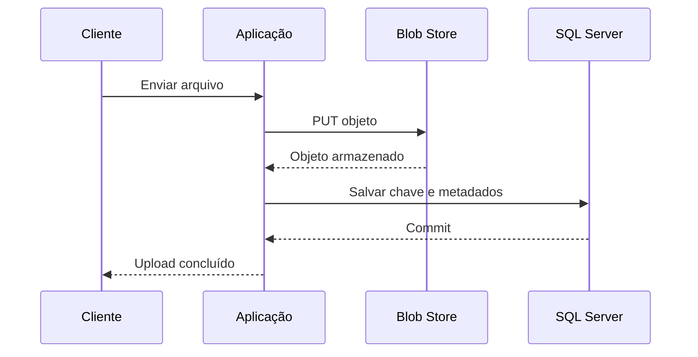
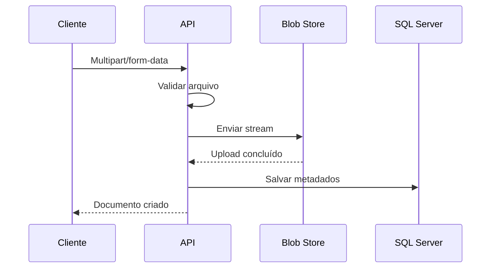
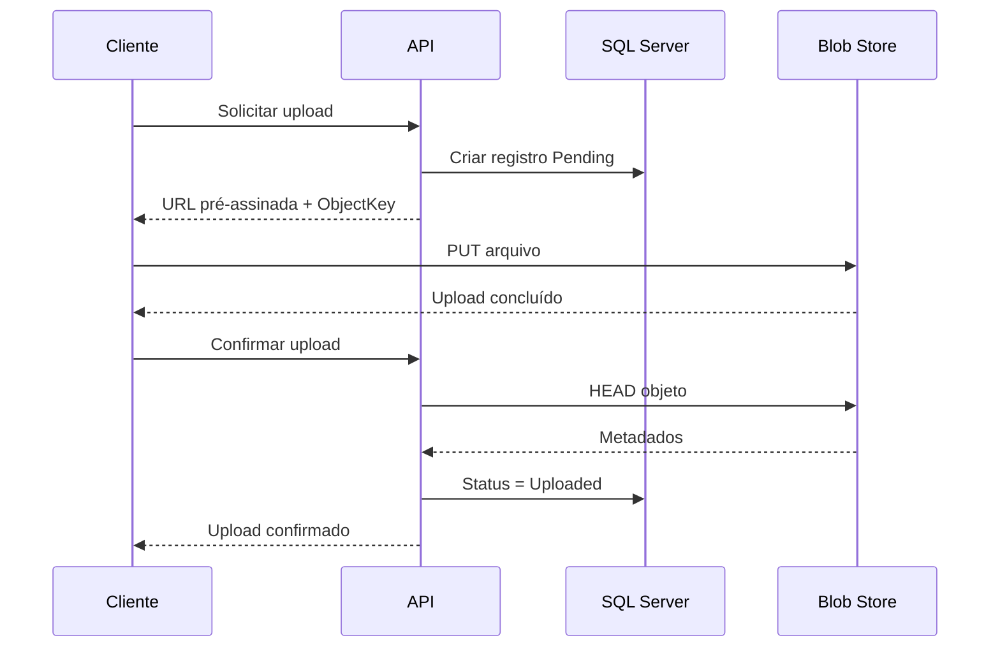
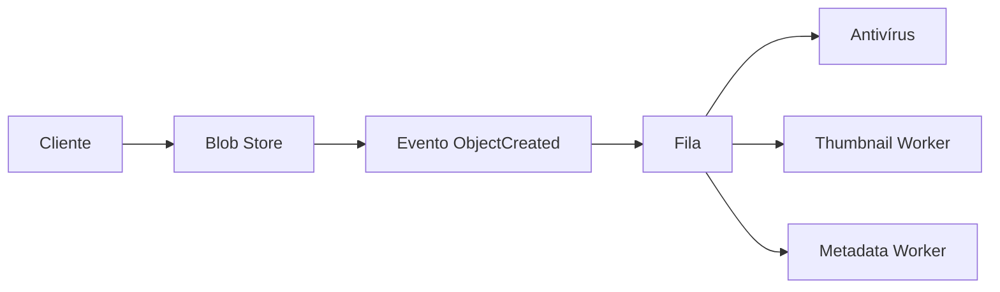

# Módulo 9 — Blob Store e Object Storage

Blob Store é um sistema de armazenamento desenvolvido para guardar grandes volumes de dados não estruturados, como imagens, vídeos, documentos, backups e arquivos de aplicação.

Neste módulo, estudaremos:

* O que é um Blob Store.
* Como o armazenamento de objetos funciona.
* Diferenças entre object storage, banco de dados e file system.
* Como realizar upload e download de arquivos.
* Quando usar e quando evitar.
* Como armazenar metadados no SQL Server.
* Como usar URLs pré-assinadas.
* Segurança, versionamento, replicação e lifecycle.
* Principais opções: Amazon S3, Google Cloud Storage e Cloudflare R2.

> Neste material, os termos **Blob Store** e **Object Storage** serão usados de forma semelhante. Alguns provedores preferem o termo *blob*, enquanto outros utilizam *object*.

---

## Sumário

* [1. O que é um Blob Store](#1-o-que-é-um-blob-store)
* [2. O que é um Blob](#2-o-que-é-um-blob)
* [3. Modelo de armazenamento](#3-modelo-de-armazenamento)
* [4. Como funciona](#4-como-funciona)
* [5. Buckets e objetos](#5-buckets-e-objetos)
* [6. Object Key](#6-object-key)
* [7. Metadados](#7-metadados)
* [8. Blob Store versus File System](#8-blob-store-versus-file-system)
* [9. Blob Store versus banco de dados](#9-blob-store-versus-banco-de-dados)
* [10. Quando usar](#10-quando-usar)
* [11. Quando não usar](#11-quando-não-usar)
* [12. Fluxo de upload](#12-fluxo-de-upload)
* [13. Upload passando pela API](#13-upload-passando-pela-api)
* [14. Upload direto com URL pré-assinada](#14-upload-direto-com-url-pré-assinada)
* [15. Fluxo de download](#15-fluxo-de-download)
* [16. URLs públicas e privadas](#16-urls-públicas-e-privadas)
* [17. Multipart Upload](#17-multipart-upload)
* [18. Upload resumable](#18-upload-resumable)
* [19. Consistência](#19-consistência)
* [20. Versionamento](#20-versionamento)
* [21. Lifecycle Policies](#21-lifecycle-policies)
* [22. Storage Classes](#22-storage-classes)
* [23. Replicação](#23-replicação)
* [24. CDN e Blob Store](#24-cdn-e-blob-store)
* [25. Processamento assíncrono](#25-processamento-assíncrono)
* [26. Segurança](#26-segurança)
* [27. Criptografia](#27-criptografia)
* [28. Validação de arquivos](#28-validação-de-arquivos)
* [29. Exclusão e retenção](#29-exclusão-e-retenção)
* [30. Amazon S3](#30-amazon-s3)
* [31. Google Cloud Storage](#31-google-cloud-storage)
* [32. Cloudflare R2](#32-cloudflare-r2)
* [33. Comparação entre as opções](#33-comparação-entre-as-opções)
* [34. Abstração de Blob Store em C#](#34-abstração-de-blob-store-em-c)
* [35. Implementação com Amazon S3](#35-implementação-com-amazon-s3)
* [36. Uso do Cloudflare R2 com SDK S3](#36-uso-do-cloudflare-r2-com-sdk-s3)
* [37. Endpoint de upload em ASP.NET Core](#37-endpoint-de-upload-em-aspnet-core)
* [38. Upload direto com URL pré-assinada](#38-upload-direto-com-url-pré-assinada)
* [39. Modelagem no SQL Server](#39-modelagem-no-sql-server)
* [40. Fluxo transacional](#40-fluxo-transacional)
* [41. Problema do Dual Write](#41-problema-do-dual-write)
* [42. Estratégias para arquivos órfãos](#42-estratégias-para-arquivos-órfãos)
* [43. Organização de chaves](#43-organização-de-chaves)
* [44. Idempotência](#44-idempotência)
* [45. Escalabilidade](#45-escalabilidade)
* [46. Observabilidade](#46-observabilidade)
* [47. Custos](#47-custos)
* [48. Trade-offs](#48-trade-offs)
* [49. Arquitetura de exemplo](#49-arquitetura-de-exemplo)
* [50. Checklist de produção](#50-checklist-de-produção)
* [51. Regras práticas](#51-regras-práticas)
* [52. Questões de entrevista](#52-questões-de-entrevista)
* [53. Exercício prático](#53-exercício-prático)
* [54. Resumo do módulo](#54-resumo-do-módulo)

---

# 1. O que é um Blob Store

Um Blob Store é um sistema especializado em armazenar dados não estruturados como objetos.

Exemplos de objetos:

* Imagens.
* Vídeos.
* Áudios.
* Documentos PDF.
* Arquivos ZIP.
* Backups.
* Logs.
* Datasets.
* Arquivos CSV.
* Modelos de machine learning.
* Artefatos de build.
* Conteúdo estático.
* Anexos de e-mail.
* Arquivos enviados por usuários.

Arquitetura simplificada:

```text
Aplicação
    |
    v
Blob Store
    |
    +--> imagem-1.jpg
    +--> contrato-32.pdf
    +--> video-98.mp4
    +--> backup-2026-07-13.zip
```

Diferentemente de um banco relacional, um Blob Store não é otimizado para:

* Joins.
* Consultas por múltiplas colunas.
* Relacionamentos.
* Atualizações parciais frequentes.
* Transações envolvendo muitas entidades.

Seu objetivo principal é:

> Armazenar e recuperar grandes quantidades de objetos de maneira durável, escalável e relativamente simples.

---

# 2. O que é um Blob

Blob significa **Binary Large Object**.

É uma sequência de bytes que pode representar praticamente qualquer arquivo.

```text
Blob
 |
 +--> bytes de uma imagem
 +--> bytes de um vídeo
 +--> bytes de um PDF
 +--> bytes de um arquivo compactado
```

O Blob Store geralmente não precisa compreender o conteúdo interno do objeto.

Ele armazena:

```text
Object Key
+
Conteúdo binário
+
Metadados
```

Exemplo conceitual:

```json
{
  "key": "users/1001/avatar.jpg",
  "contentType": "image/jpeg",
  "contentLength": 458221,
  "metadata": {
    "userId": "1001",
    "uploadedBy": "usr-72"
  }
}
```

---

# 3. Modelo de armazenamento

Um Blob Store normalmente utiliza uma estrutura lógica como:

```text
Bucket
  |
  +--> Object Key
          |
          +--> Conteúdo
          +--> Metadados
          +--> Versão
```

Exemplo:

```text
Bucket:
customer-documents

Object Key:
customers/1001/contracts/contract-2026.pdf

Conteúdo:
bytes do PDF

Metadados:
content-type=application/pdf
customer-id=1001
```

Os principais componentes são:

* Bucket.
* Object key.
* Conteúdo.
* Metadados.
* Version ID, quando versionamento está habilitado.
* ETag ou checksum.
* Storage class.
* Regras de acesso.

---

# 4. Como funciona

O fluxo básico de gravação é:

```text
1. Aplicação escolhe um bucket.
2. Aplicação gera uma object key.
3. Aplicação envia o conteúdo.
4. Blob Store persiste o objeto.
5. Blob Store retorna metadados ou confirmação.
6. Aplicação registra a referência do objeto.
```

Diagrama:



Para recuperar:

```text
1. Aplicação identifica a object key.
2. Aplicação solicita o objeto.
3. Blob Store localiza o objeto pela chave.
4. Conteúdo é retornado como stream de bytes.
```

---

# 5. Buckets e objetos

Um bucket é um contêiner lógico de objetos.

Exemplo:

```text
Bucket: profile-images

users/1001/avatar.jpg
users/1002/avatar.jpg
users/1003/avatar.jpg
```

Outro bucket:

```text
Bucket: customer-documents

customers/1001/document.pdf
customers/1002/document.pdf
```

Serviços como Amazon S3 e Google Cloud Storage armazenam objetos dentro de buckets.

## O que um bucket pode definir

Dependendo do provedor:

* Região.
* Controle de acesso.
* Versionamento.
* Lifecycle.
* Retenção.
* Replicação.
* Criptografia.
* Logs.
* CORS.
* Eventos.
* Classe padrão de armazenamento.

## Quantos buckets criar

Não é necessário criar um bucket por usuário.

Exemplo inadequado:

```text
bucket-user-1
bucket-user-2
bucket-user-3
...
```

Uma alternativa mais simples:

```text
Bucket:
user-files

Keys:
users/1/file-a.pdf
users/2/file-b.pdf
users/3/file-c.pdf
```

Separe buckets quando houver diferenças relevantes de:

* Segurança.
* Retenção.
* Região.
* Lifecycle.
* Compliance.
* Proprietário.
* Ambiente.
* Classificação dos dados.

---

# 6. Object Key

A object key é o identificador do objeto dentro do bucket.

Exemplo:

```text
customers/1001/invoices/2026/invoice-872.pdf
```

Em muitos serviços, as barras não representam necessariamente diretórios físicos.

Elas formam apenas parte da chave.

```text
Object Key:
customers/1001/invoices/2026/invoice-872.pdf
```

A interface pode apresentar isso como pastas:

```text
customers/
  1001/
    invoices/
      2026/
        invoice-872.pdf
```

Mas o objeto pode ser armazenado internamente em um namespace plano.

## Chave única

Dentro do mesmo bucket, a chave deve identificar um objeto.

```text
Bucket: documents
Key: customers/1001/document.pdf
```

Se outro upload utilizar a mesma chave, o comportamento pode ser:

* Sobrescrever o objeto atual.
* Criar uma nova versão.
* Falhar por condição configurada.

Isso depende do serviço e da operação realizada.

## Não use o nome original como única chave

Inadequado:

```text
invoice.pdf
```

Dois usuários podem enviar arquivos com o mesmo nome.

Uma opção melhor:

```text
customers/1001/invoices/0190f39c-954f-7adc-a15d-486e31d94425.pdf
```

O nome original deve ser armazenado como metadado:

```text
OriginalFileName:
invoice.pdf
```

---

# 7. Metadados

Metadados descrevem o objeto.

Exemplos:

* Content type.
* Tamanho.
* Checksum.
* Data de criação.
* Cache control.
* Content disposition.
* Identificador do usuário.
* Classificação de segurança.
* Nome original.

Exemplo:

```text
Content-Type: image/jpeg
Content-Length: 458221
Cache-Control: public, max-age=86400
Content-Disposition: inline
```

## Metadados no Blob Store versus SQL Server

Metadados técnicos podem ficar no Blob Store:

* Content type.
* Cache control.
* Checksum.
* Encoding.

Metadados de negócio normalmente devem ficar no banco:

* Proprietário.
* Tenant.
* Status.
* Tipo de documento.
* Permissões.
* Relacionamento com pedido.
* Data de aprovação.
* Estado do processamento.

Exemplo:

```text
Blob Store:
bytes e metadados técnicos

SQL Server:
estado, autorização e relacionamentos
```

---

# 8. Blob Store versus File System

Um file system tradicional é baseado em:

* Diretórios.
* Arquivos.
* Caminhos.
* Operações de leitura e escrita.
* Montagem local ou em rede.

Exemplo:

```text
/var/app/files/customer-1001/document.pdf
```

Um Blob Store é acessado normalmente por:

* API HTTP.
* SDK.
* Object key.
* Bucket.
* Credenciais ou identidade.

Exemplo:

```text
Bucket: customer-documents
Key: customers/1001/document.pdf
```

## Comparação

| File System                      | Blob Store                          |
| -------------------------------- | ----------------------------------- |
| Diretórios reais                 | Namespace de objetos                |
| Pode permitir acesso aleatório   | Objetos tratados como unidades      |
| Montado no sistema operacional   | Acessado por API                    |
| Escala depende da infraestrutura | Projetado para grande escala        |
| Rename pode ser operação nativa  | Rename pode exigir copiar e excluir |
| Bom para arquivos locais         | Bom para objetos distribuídos       |
| Pode suportar locks de arquivo   | Semântica diferente de locks        |

## Quando usar File System

* Aplicação local.
* Arquivos temporários.
* Software exige POSIX.
* Operações frequentes de leitura e escrita parcial.
* Ferramentas legadas.
* Baixa necessidade de escala.

## Quando usar Blob Store

* Uploads de usuários.
* Distribuição via internet.
* Grandes volumes.
* Retenção longa.
* Acesso por múltiplas aplicações.
* Arquitetura cloud-native.
* Integração com CDN e eventos.

---

# 9. Blob Store versus banco de dados

É possível armazenar arquivos em SQL Server usando:

```sql
VARBINARY(MAX)
```

Exemplo:

```sql
CREATE TABLE dbo.Documents
(
    DocumentId BIGINT PRIMARY KEY,
    FileName NVARCHAR(500) NOT NULL,
    Content VARBINARY(MAX) NOT NULL
);
```

Isso pode funcionar em alguns cenários, mas possui trade-offs.

## Arquivos dentro do banco

### Vantagens

* Transação única.
* Backup unificado.
* Segurança centralizada.
* Consistência forte entre dados e arquivo.
* Consulta e exclusão coordenadas.

### Desvantagens

* Banco cresce rapidamente.
* Backups ficam maiores.
* Restore fica mais lento.
* Mais pressão sobre memória, log e I/O.
* Mais tráfego no banco.
* Escala de arquivos compete com transações do negócio.

## Arquivos no Blob Store

```text
SQL Server:
DocumentId
ObjectKey
FileName
ContentType
Size
OwnerId
Status

Blob Store:
conteúdo binário
```

### Vantagens

* Banco permanece menor.
* Blob Store escala independentemente.
* Melhor integração com CDN.
* Downloads não sobrecarregam o SQL Server.
* Lifecycle e classes de armazenamento.
* Melhor para arquivos grandes.

### Desvantagens

* Duas fontes precisam ser coordenadas.
* Pode haver arquivos órfãos.
* Não existe transação ACID automática entre banco e storage.
* Exclusões precisam ser coordenadas.

## Regra prática

> Armazene o arquivo no Blob Store e os metadados de negócio no banco.

Use `VARBINARY(MAX)` quando houver uma razão clara, por exemplo:

* Arquivos pequenos.
* Volume limitado.
* Consistência transacional indispensável.
* Ambiente sem object storage.
* Requisitos específicos de backup.

---

# 10. Quando usar

Use Blob Store para:

## Imagens

```text
Avatares
Fotos de produtos
Banners
Thumbnails
Imagens médicas
```

## Vídeos e áudios

```text
Streaming
Aulas gravadas
Podcasts
Chamadas gravadas
Vídeos enviados por usuários
```

## Documentos

```text
PDF
Contratos
Notas fiscais
Currículos
Comprovantes
Planilhas
```

## Backups e arquivos

```text
Backups de banco
Arquivos ZIP
Exports
Logs antigos
Snapshots
```

## Data Lake

```text
CSV
JSON
Parquet
Avro
Dados brutos
Resultados de processamento
```

## Conteúdo estático

```text
JavaScript
CSS
Fontes
Imagens
Downloads
```

## Artefatos

```text
Builds
Pacotes
Modelos de IA
Datasets
Relatórios gerados
```

---

# 11. Quando não usar

Blob Store pode ser inadequado para:

* Consultas relacionais.
* Atualizações pequenas e frequentes dentro do arquivo.
* Locks de arquivo com semântica de file system.
* Transações envolvendo partes do arquivo.
* Estruturas consultadas por campos internos.
* Estado pequeno que pertence naturalmente ao banco.
* Dados que precisam ser alterados milhares de vezes por segundo.

Exemplo inadequado:

```text
Guardar o saldo atual de uma conta em um JSON no Blob Store.
```

Mais apropriado:

```text
SQL Server ou outro banco transacional.
```

Outro exemplo inadequado:

```text
Atualizar um único campo de um JSON de 500 MB a cada requisição.
```

Object storage normalmente trabalha melhor com:

```text
Substituição do objeto inteiro
```

ou criação de uma nova versão.

---

# 12. Fluxo de upload

Existem dois modelos principais:

1. Upload passando pela API.
2. Upload direto para o Blob Store.

---

# 13. Upload passando pela API

```text
Cliente
   |
   v
API
   |
   v
Blob Store
```

Fluxo:



## Vantagens

* API controla todo o conteúdo.
* Validação centralizada.
* Autorização simples.
* Menor exposição do storage.
* Fluxo fácil de compreender.

## Desvantagens

* Arquivo atravessa a API.
* Maior consumo de banda.
* Maior uso de memória ou buffers.
* APIs podem virar gargalo.
* Uploads longos ocupam conexões.
* Escala da API fica ligada ao volume de arquivos.

## Quando usar

* Arquivos pequenos.
* Baixo volume.
* Validação síncrona obrigatória.
* Arquitetura inicial.
* Cliente não pode acessar o storage diretamente.

---

# 14. Upload direto com URL pré-assinada

Nesse modelo, a API autoriza o upload, mas o arquivo é enviado diretamente ao storage.

```text
Cliente
   |
   | 1. Solicita autorização
   v
API
   |
   | 2. Gera URL pré-assinada
   v
Cliente
   |
   | 3. Envia diretamente
   v
Blob Store
```

Diagrama:



## Vantagens

* Arquivo não passa pela API.
* Menor consumo de banda do backend.
* Melhor para arquivos grandes.
* Escala melhor.
* Cliente pode usar multipart upload.
* Menor duração das requisições na API.

## Desvantagens

* Fluxo mais complexo.
* API precisa confirmar upload.
* Podem existir uploads não finalizados.
* É necessário restringir tamanho e tipo.
* Segurança da URL precisa ser bem configurada.
* CORS pode precisar ser configurado.

## O que limitar na URL

* Método permitido.
* Bucket.
* Object key.
* Tempo de expiração.
* Content type, quando suportado.
* Tamanho, dependendo do mecanismo.
* Headers permitidos.

> Uma URL pré-assinada deve possuir vida curta e permissão mínima.

---

# 15. Fluxo de download

Existem três modelos comuns.

## Download pela API

```text
Cliente --> API --> Blob Store
```

Vantagens:

* Controle central.
* Auditoria simples.
* Pode aplicar transformação.

Desvantagens:

* Banda passa pela API.
* Maior custo e latência.
* Backend vira gargalo.

## Redirecionamento para URL assinada

```text
Cliente --> API
API --> URL temporária
Cliente --> Blob Store
```

Vantagens:

* Download direto.
* Menor carga na API.
* Acesso temporário.

## CDN

```text
Cliente --> CDN --> Blob Store
```

Vantagens:

* Menor latência.
* Cache geográfico.
* Menos leituras na origem.
* Melhor distribuição de arquivos públicos ou compartilháveis.

---

# 16. URLs públicas e privadas

## Objeto público

Pode ser acessado sem autenticação.

Exemplos:

* Logo.
* Arquivo público.
* Imagem de produto.
* Asset de site.

Risco:

```text
Qualquer pessoa que conheça a URL pode acessar.
```

## Objeto privado

Exige:

* Credencial.
* Identidade.
* URL pré-assinada.
* CDN com assinatura.
* Serviço autorizado.

Exemplos:

* Contrato.
* Documento pessoal.
* Exame médico.
* Fatura.
* Arquivo interno.

## Padrão recomendado

Buckets privados por padrão.

```text
Cliente
   |
   v
API autoriza
   |
   v
URL temporária
```

Não confie em uma object key difícil de adivinhar como proteção.

```text
Segurança por obscuridade != autorização
```

---

# 17. Multipart Upload

Multipart upload divide um arquivo grande em partes.

```text
Arquivo de 5 GB
   |
   +--> Parte 1
   +--> Parte 2
   +--> Parte 3
   +--> Parte N
```

Cada parte pode ser enviada separadamente.

Depois:

```text
Complete Multipart Upload
```

O storage combina as partes no objeto final.

## Vantagens

* Upload paralelo.
* Retry apenas da parte que falhou.
* Melhor para arquivos grandes.
* Permite retomar operações.
* Reduz custo de reiniciar todo o upload.

## Desvantagens

* Mais complexidade.
* Uploads abandonados precisam ser removidos.
* É necessário controlar part numbers.
* Conclusão precisa ser chamada explicitamente.

## Fluxo

```text
1. Iniciar multipart upload.
2. Receber UploadId.
3. Enviar partes.
4. Registrar ETags ou checksums.
5. Completar upload.
6. Storage cria o objeto.
```

---

# 18. Upload resumable

Upload resumable permite continuar depois de uma interrupção.

Exemplo:

```text
Upload chegou a 65%
Conexão caiu
Cliente continua a partir de 65%
```

É especialmente útil para:

* Vídeos.
* Backups.
* Arquivos em redes móveis.
* Datasets.
* Grandes documentos.

Google Cloud Storage disponibiliza operações de upload resumable, e serviços compatíveis com S3 normalmente oferecem multipart upload como mecanismo semelhante.

---

# 19. Consistência

Ao projetar uma solução, verifique as garantias de consistência do provedor para operações como:

* Criar objeto.
* Sobrescrever objeto.
* Excluir objeto.
* Listar objetos.
* Consultar metadados.

Não assuma que todos os provedores e todas as APIs possuem o mesmo comportamento.

Cloudflare documenta o R2 como um object storage fortemente consistente.

## Consistência do objeto versus consistência do negócio

Mesmo que o storage possua consistência forte, ainda existe coordenação entre:

```text
Blob Store
+
SQL Server
+
Mensageria
```

Exemplo:

```text
Arquivo existe no storage
Registro ainda não existe no banco
```

Esse é um problema da arquitetura da aplicação, não da consistência interna do Blob Store.

---

# 20. Versionamento

Versionamento preserva múltiplas versões de uma mesma object key.

Exemplo:

```text
documents/contract.pdf

Version 1
Version 2
Version 3
```

Se o objeto for sobrescrito:

```text
Nova versão é criada
```

Se for excluído, dependendo da configuração:

```text
Delete marker ou versão não atual
```

O versionamento pode ajudar na recuperação de exclusões e sobrescritas acidentais. O Google Cloud Storage, por exemplo, documenta que o Object Versioning preserva versões não atuais até que sejam explicitamente removidas.

## Vantagens

* Recuperação.
* Auditoria.
* Proteção contra sobrescrita.
* Rollback de conteúdo.

## Desvantagens

* Maior custo de armazenamento.
* Exclusão mais complexa.
* Lifecycle precisa tratar versões antigas.
* Aplicação precisa identificar a versão correta.

## Versionamento técnico versus versão de negócio

O versionamento do storage não substitui necessariamente um versionamento de domínio.

Exemplo:

```text
Storage Version ID:
8f7a...

Business Document Version:
Contrato versão 4, aprovado em 2026
```

São conceitos diferentes.

---

# 21. Lifecycle Policies

Lifecycle policies automatizam mudanças ao longo da vida do objeto.

Exemplo:

```text
0 a 30 dias:
classe quente

31 a 180 dias:
classe de acesso infrequente

Após 7 anos:
excluir
```

Outro exemplo:

```text
Versões antigas:
excluir após 90 dias

Multipart uploads incompletos:
remover após 7 dias
```

## Casos de uso

* Arquivamento.
* Redução de custos.
* Compliance.
* Limpeza de arquivos temporários.
* Exclusão de versões antigas.
* Remoção de uploads abandonados.

## Cuidado

Uma regra incorreta pode excluir dados importantes em grande escala.

Boas práticas:

* Testar em bucket não crítico.
* Aplicar por prefixo ou tag.
* Monitorar exclusões.
* Utilizar retenção quando exigida.
* Revisar a política com negócio e compliance.

---

# 22. Storage Classes

Storage classes representam diferentes combinações de:

* Frequência de acesso.
* Latência.
* Disponibilidade.
* Redundância.
* Custo de armazenamento.
* Custo de recuperação.
* Período mínimo.

Exemplo conceitual:

| Classe            | Uso                  |
| ----------------- | -------------------- |
| Hot ou Standard   | Acesso frequente     |
| Infrequent Access | Acesso ocasional     |
| Archive           | Retenção longa       |
| Deep Archive      | Quase nunca acessado |

Amazon S3 e Google Cloud Storage oferecem diferentes classes para adequar armazenamento, acesso e custo ao caso de uso.

## Escolha

Pergunte:

* Com que frequência o objeto é lido?
* Precisa ser recuperado imediatamente?
* Pode aguardar horas?
* Quanto tempo será mantido?
* Existe custo de recuperação?
* Existe período mínimo?
* O arquivo é crítico?

## Exemplo

Avatar de usuário:

```text
Classe quente
```

Backup regulatório de dez anos:

```text
Classe de arquivo
```

---

# 23. Replicação

Replicação cria cópias em outra localização.

```text
Bucket Região A
      |
      v
Bucket Região B
```

## Objetivos

* Disaster recovery.
* Menor latência.
* Compliance.
* Migração.
* Proteção regional.
* Processamento em outra região.

## Replicação não é backup completo

Se uma exclusão ou corrupção for replicada:

```text
Erro na origem
      |
      v
Erro replicado no destino
```

Para maior proteção, combine:

* Versionamento.
* Retenção.
* Object Lock.
* Backup independente.
* Contas ou projetos separados.
* Controle de acesso separado.

---

# 24. CDN e Blob Store

Blob Store pode atuar como origem de uma CDN.

```text
Usuário
   |
   v
CDN Edge
   |
   v
Blob Store
```

## Primeira requisição

```text
CDN não possui o arquivo
      |
      v
Busca no Blob Store
      |
      v
Armazena no edge
```

## Próximas requisições

```text
Usuário --> CDN Edge --> arquivo em cache
```

## Benefícios

* Menor latência.
* Menor carga na origem.
* Menor quantidade de downloads do storage.
* Distribuição global.
* Proteção contra picos.
* Cache de imagens e vídeos.

## Cache invalidation

Se um objeto é sobrescrito usando a mesma key:

```text
products/1001/image.jpg
```

a CDN pode continuar entregando a versão antiga.

Uma estratégia melhor é usar chaves versionadas:

```text
products/1001/image-v7.jpg
```

ou baseadas em hash:

```text
products/1001/a8f72c91.jpg
```

Assim, o novo conteúdo possui uma nova URL.

---

# 25. Processamento assíncrono

Uploads frequentemente disparam processamento posterior.

Exemplo de imagem:

```text
Upload
   |
   v
Evento ObjectCreated
   |
   +--> Antivírus
   +--> Geração de thumbnail
   +--> Extração de metadados
   +--> Moderação
   +--> Otimização
```

Arquitetura:



## Estado do arquivo

No SQL Server:

```text
PendingUpload
Uploaded
Scanning
Processing
Available
Rejected
Deleted
```

O objeto não deve ficar disponível publicamente antes da validação quando houver risco de conteúdo malicioso.

---

# 26. Segurança

Princípios fundamentais:

## Privado por padrão

```text
Bloquear acesso público por padrão
```

## Menor privilégio

A API de upload deve poder:

```text
Gravar em um prefixo específico
```

Não necessariamente:

```text
Excluir todos os buckets
Alterar políticas
Listar todos os objetos
```

## Separação de responsabilidades

```text
Upload Service:
gravar objetos

Download Service:
ler objetos

Lifecycle Worker:
excluir objetos expirados
```

## Evitar credenciais estáticas

Prefira:

* IAM roles.
* Service accounts.
* Workload identity.
* Managed identity.
* Credenciais temporárias.

## Auditoria

Registre:

* Quem enviou.
* Quem baixou.
* Quem excluiu.
* Qual object key.
* Data.
* IP.
* Resultado.

---

# 27. Criptografia

## Em trânsito

Utilize HTTPS/TLS.

```text
Cliente -- HTTPS --> Blob Store
```

## Em repouso

O conteúdo pode ser criptografado pelo provedor.

Modelos comuns:

* Chave gerenciada pelo provedor.
* Chave gerenciada pelo cliente.
* Chave fornecida por requisição.
* Criptografia antes do upload.

O Cloudflare R2 documenta suporte a criptografia em repouso e em trânsito.

## Client-side encryption

```text
Aplicação criptografa
      |
      v
Blob Store recebe bytes criptografados
```

### Vantagens

* Provedor não recebe conteúdo em texto claro.
* Maior controle.

### Desvantagens

* Gestão de chaves.
* Rotação complexa.
* Busca e processamento ficam mais difíceis.
* Perda da chave significa perda do conteúdo.

---

# 28. Validação de arquivos

Nunca confie apenas no nome ou no `Content-Type` enviado pelo cliente.

Um usuário pode enviar:

```text
malware.exe
```

com:

```text
Content-Type: image/jpeg
```

## Validações

* Tamanho máximo.
* Extensão permitida.
* Content type.
* Magic bytes.
* Checksum.
* Antivírus.
* Quantidade de arquivos.
* Dimensões de imagem.
* Duração de vídeo.
* Descompressão segura.
* Nome normalizado.

## Zip bomb

Um arquivo ZIP pequeno pode expandir para enorme volume.

Proteções:

* Limite de tamanho descompactado.
* Limite de arquivos.
* Limite de profundidade.
* Timeout.
* Ambiente isolado.

## Não execute conteúdo enviado

Uploads devem ser tratados como não confiáveis.

Evite armazenar conteúdo enviado por usuários no mesmo domínio principal da aplicação quando ele puder ser interpretado pelo navegador.

---

# 29. Exclusão e retenção

## Soft delete no banco

```text
Status = Deleted
DeletedAtUtc = data
```

O objeto pode ser excluído depois por um job.

## Exclusão síncrona

```text
1. Excluir objeto.
2. Excluir registro.
```

Pode falhar entre as etapas.

## Exclusão assíncrona

```text
1. Marcar registro como PendingDeletion.
2. Publicar evento.
3. Worker exclui objeto.
4. Marcar como Deleted.
```

É mais resiliente e permite retry.

## Retenção

Alguns objetos não podem ser excluídos antes de um período.

Exemplos:

* Documentos fiscais.
* Registros jurídicos.
* Evidências.
* Auditoria.

Amazon S3 Object Lock utiliza um modelo WORM para impedir exclusão ou sobrescrita durante períodos configurados.

---

# 30. Amazon S3

Amazon S3 é o serviço de object storage da AWS.

Seu modelo principal utiliza:

```text
Buckets
+
Objects
+
Keys
+
Metadata
```

A documentação oficial descreve o S3 como um serviço de object storage para armazenar e recuperar dados em buckets.

## Recursos comuns

* Versionamento.
* Lifecycle.
* Storage classes.
* Replicação.
* Object Lock.
* Eventos.
* URLs pré-assinadas.
* Multipart upload.
* Políticas de bucket.
* Integração com IAM.
* Criptografia.
* Integração com CDN.
* Inventário e métricas.

## Quando escolher

* Aplicação já está na AWS.
* Integração com serviços AWS.
* Data lake.
* Backups.
* Arquivos de aplicação.
* Conteúdo estático.
* Grande ecossistema de ferramentas.

## Pontos de atenção

* Custos de armazenamento.
* Custos de operações.
* Custos de transferência.
* Políticas IAM.
* Exposição pública acidental.
* Lifecycle.
* Replicação.
* Vendor lock-in.

---

# 31. Google Cloud Storage

Google Cloud Storage é o serviço gerenciado de object storage do Google Cloud.

Ele armazena objetos em buckets e é usado para cenários como:

* Dados de aplicações.
* Backups.
* Arquivamento.
* Analytics.
* Datasets.
* Conteúdo distribuído.

A documentação oficial define o Cloud Storage como um serviço escalável e gerenciado para armazenar objetos em buckets.

## Recursos comuns

* Buckets.
* Object versioning.
* Lifecycle.
* Storage classes.
* Retenção.
* Controle de acesso.
* Upload resumable.
* Signed URLs.
* Eventos.
* Integração com serviços Google Cloud.

## Quando escolher

* Aplicação está no Google Cloud.
* Integração com Dataflow, BigQuery ou ecossistema GCP.
* Data lake.
* Machine learning.
* Backups.
* Arquivos de aplicação.

## Pontos de atenção

* Escolha de localização.
* Custos de transferência.
* Classes de armazenamento.
* Políticas IAM.
* Integração com projetos e service accounts.
* Vendor lock-in.

---

# 32. Cloudflare R2

Cloudflare R2 é um serviço de object storage compatível com partes relevantes da API S3.

É voltado a cenários como:

* Conteúdo web.
* Arquivos de aplicações.
* Podcasts.
* Datasets.
* Data lakes.
* Artefatos.
* Integrações com Cloudflare Workers.

A Cloudflare documenta o R2 como object storage compatível com S3 e sem cobrança de largura de banda de egress em suas classes de armazenamento; operações e armazenamento continuam sendo cobrados conforme o plano aplicável.

## Formas de acesso

* API compatível com S3.
* Workers API.
* Ferramentas e SDKs compatíveis.
* Domínios customizados, quando configurados.

## Quando escolher

* Alto volume de distribuição de arquivos.
* Aplicação usa Cloudflare.
* Desejo de reduzir custos de egress.
* Conteúdo servido globalmente.
* Migração de aplicações compatíveis com S3.
* Integração com Workers.

## Pontos de atenção

* Compatibilidade S3 não significa implementação idêntica de todos os recursos.
* Verificar operações suportadas.
* Verificar limites atuais.
* Verificar classes de armazenamento.
